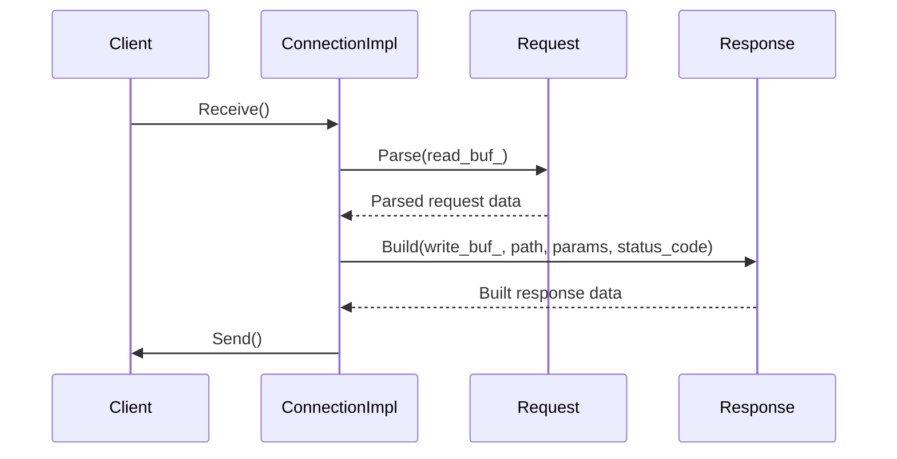

# 詳細設計仕様書

## クラス図

```mermaid
classDiagram
    class ConnectionImpl {
        +static void SetRootDirectory(std::filesystem::path dir) noexcept
        +static std::filesystem::path GetRootDirectory() noexcept
        +void Close() noexcept
        +bool Valid() const noexcept
        +FileDescriptor Socket() const noexcept
        +std::size_t Receive()
        +std::size_t Send()
        +bool KeepAlive() const noexcept
        +bool Process() noexcept
        -static constexpr std::string_view true_tag {"true"}
        -static constexpr std::string_view false_tag {"false"}
        -explicit ConnectionImpl(FileDescriptor socket) noexcept
        -virtual ~ConnectionImpl() noexcept
        -static std::filesystem::path root_dir_
        -FileDescriptor socket_ {invalid_file_descriptor}
        -bool keep_alive_ {false}
        -IOBuffer read_buf_
        -IOBuffer write_buf_
        -MappedReadOnlyFile file_
    }

    class Connection~IPAddr~ {
        +std::string IPAddress() const noexcept
        +std::uint16_t Port() const noexcept
        -explicit Connection(const FileDescriptor socket, IPAddr addr) noexcept
        -IPAddr addr_
    }
    
    class Request {
        +Request() noexcept
        +explicit Request(Buffer& buf)
        +~Request() noexcept
        +void Parse(Buffer& buf)
        +std::optional<std::string_view> Header(std::string_view key) const noexcept
        +std::optional<std::string_view> Post(std::string_view key) const noexcept
        +std::size_t PostSize() const noexcept
        +http::Method Method() const noexcept
        +std::string_view Path() const noexcept
        +std::string_view Version() const noexcept
        +bool KeepAlive() const noexcept
        -void SetState(std::unique_ptr<State> state) noexcept
        -void Clear() noexcept
        -std::unique_ptr<State> state_
        -http::Method method_ {Method::Get}
        -std::string version_
        -std::string path_
        -Parameters headers_
        -Parameters post_
    }

    class Response {
        +explicit Response(std::filesystem::path root_dir) noexcept
        +~Response() noexcept
        +Response(const Response&) = delete
        +Response(Response&&) = delete
        +Response& operator=(const Response&) = delete
        +Response& operator=(Response&&) = delete
        +Response& SetKeepAlive(bool set) noexcept
        +std::optional<MappedReadOnlyFile> Build(Buffer& buf, std::filesystem::path file, StatusCode& code) noexcept
        +void Build(Buffer& buf, std::filesystem::path html, const Parameters& params, StatusCode& code) noexcept
        +void Build(Buffer& buf, StatusCode code, std::string msg = "") noexcept
        -void Clear() noexcept
        -void Build(Buffer& buf, const Parameters* params = nullptr) noexcept
        -void CheckFile()
        -void MapFile()
        -void AddStatusLine(Buffer& buf) const noexcept
        -void AddHeaders(Buffer& buf) const noexcept
        -void AddMappedContent(Buffer& buf) noexcept
        -void AddParamContent(Buffer& buf, const Parameters& params) const noexcept
        -void AddPredefinedErrorContent(Buffer& buf, std::string_view msg = "") noexcept
        -std::filesystem::path root_dir_
        -std::filesystem::path file_path_
        -MappedReadOnlyFile file_
        -bool keep_alive_ {false}
        -StatusCode status_code_ {StatusCode::OK}
    }

    ConnectionImpl <|-- Connection~IPAddr~
```

## クラス・メソッド・インターフェース詳細

### `ConnectionImpl`
| メンバ | 種類 | 定義 |
|--------|------|------|
| SetRootDirectory | static method | `void SetRootDirectory(std::filesystem::path dir) noexcept` |
| GetRootDirectory | static method | `std::filesystem::path GetRootDirectory() noexcept` |
| Close | method | `void Close() noexcept` |
| Valid | method | `bool Valid() const noexcept` |
| Socket | method | `FileDescriptor Socket() const noexcept` |
| Receive | method | `std::size_t Receive()` |
| Send | method | `std::size_t Send()` |
| KeepAlive | method | `bool KeepAlive() const noexcept` |
| Process | method | `bool Process() noexcept` |

### `Connection<IPAddr>`
| メンバ | 種類 | 定義 |
|--------|------|------|
| IPAddress | method | `std::string IPAddress() const noexcept` |
| Port | method | `std::uint16_t Port() const noexcept` |

### `Request`
| メンバ | 種類 | 定義 |
|--------|------|------|
| Request (default) | constructor | `Request() noexcept` |
| Request (Buffer&) | constructor | `explicit Request(Buffer& buf)` |
| ~Request | destructor | `~Request() noexcept` |
| Parse | method | `void Parse(Buffer& buf)` |
| Header | method | `std::optional<std::string_view> Header(std::string_view key) const noexcept` |
| Post | method | `std::optional<std::string_view> Post(std::string_view key) const noexcept` |
| PostSize | method | `std::size_t PostSize() const noexcept` |
| Method | method | `http::Method Method() const noexcept` |
| Path | method | `std::string_view Path() const noexcept` |
| Version | method | `std::string_view Version() const noexcept` |
| KeepAlive | method | `bool KeepAlive() const noexcept` |

### `Response`
| メンバ | 種類 | 定義 |
|--------|------|------|
| Response (path) | constructor | `explicit Response(std::filesystem::path root_dir) noexcept` |
| ~Response | destructor | `~Response() noexcept` |
| SetKeepAlive | method | `Response& SetKeepAlive(bool set) noexcept` |
| Build (file) | method | `std::optional<MappedReadOnlyFile> Build(Buffer& buf, std::filesystem::path file, StatusCode& code) noexcept` |
| Build (html) | method | `void Build(Buffer& buf, std::filesystem::path html, const Parameters& params, StatusCode& code) noexcept` |
| Build (status) | method | `void Build(Buffer& buf, StatusCode code, std::string msg = "") noexcept` |

## シーケンス図

### HTTPリクエストの処理シーケンス


## メソッド仕様書

### `Request::Parse(Buffer& buf)`
- **目的**: HTTPリクエストを解析する。
- **引数**:
  - `buf`: 解析対象のバッファ。
- **戻り値**: 無し
- **動作**:
  - バッファからHTTPリクエストを読み取り、ステータスライン、ヘッダー、ボディを順に解析する。
- **副作用**:
  - `state_`, `method_`, `version_`, `path_`, `headers_`, `post_`が更新される。
- **エラー処理**:
  - バッファが空の場合、`std::invalid_argument`をスローする。
  - ステータスラインやヘッダーの形式に問題がある場合、`std::invalid_argument`をスローする。

### `Response::Build(Buffer& buf, std::filesystem::path file, StatusCode& code)`
- **目的**: ファイルリクエストからHTTPレスポンスを構築する。
- **引数**:
  - `buf`: 出力バッファ。
  - `file`: ファイルパス。
  - `code`: HTTPステータスコード。
- **戻り値**: マップされた読み取り専用ファイル（存在しない場合は`std::nullopt`）。
- **動作**:
  - 指定されたファイルをマッピングし、レスポンスヘッダーとコンテンツをバッファに書き込む。
- **副作用**:
  - `file_`, `status_code_`が更新される。

## 処理フロー図

### HTTPリクエストの処理フロー
```mermaid
graph TD
    A[Receive()] --> B{read_buf_.ReadableSize() == 0?}
    B -- Yes --> C[return false]
    B -- No --> D[Request.Parse(read_buf_)]
    D --> E[Response.Build(write_buf_, path, params, status_code)]
    E --> F[Send()]
    F --> G[return true]
```

## 状態遷移・副作用

### `ConnectionImpl::Process()`
| 更新前状態 | 遷移条件 | 変更対象 | 更新後状態 |
|------------|----------|----------|------------|
| 任意       | リクエストが空     | `keep_alive_` | false |
| 任意       | リクエストが存在する | `keep_alive_`, `write_buf_`, `file_` | 更新された状態 |

## データ変換・制約

### `Request::Parse(Buffer& buf)`
| 入力データ | 変換規則 | 出力データ |
|------------|----------|------------|
| ステータスライン | 正規表現による解析 | `method_`, `path_`, `version_` |
| ヘッダー     | キーと値のペアとして解析 | `headers_` |
| ボディ     | POSTデータとして解析   | `post_` |

### `Response::Build(Buffer& buf, std::filesystem::path file, StatusCode& code)`
| 入力データ | 変換規則 | 出力データ |
|------------|----------|------------|
| ファイルパス | マッピング     | `file_`, `status_code_` |
| パラメータ   | HTMLプレースホルダー置換 | `write_buf_` |

## 追加詳細設計情報

### クラス図
- `ConnectionImpl`はHTTP接続のコア実装クラスで、リクエストの受信とレスポンスの送信を担当する。
- `Connection<IPAddr>`は特定のIPアドレスを使用したHTTP接続を表すテンプレートクラス。

### クラス・メソッド・インターフェース詳細
- 各クラスのコンストラクタ、デストラクタ、および主要なメソッドが明記されている。
- メンバ変数の初期値やアクセシビリティも確認できる。

### シーケンス図
- HTTPリクエストの受信からレスポンスの送信までの流れを示す。

### メソッド仕様書
- 各メソッドの目的、引数、戻り値、動作、副作用、エラー処理が詳細に記述されている。

### 処理フロー図
- HTTPリクエストの受信とレスポンスの送信における主な分岐と状態遷移を示す。

### 状態遷移・副作用
- `ConnectionImpl::Process()`メソッドでの状態変更とその条件が明記されている。

### データ変換・制約
- 入力データから出力データへの具体的な変換規則や制約が示されている。