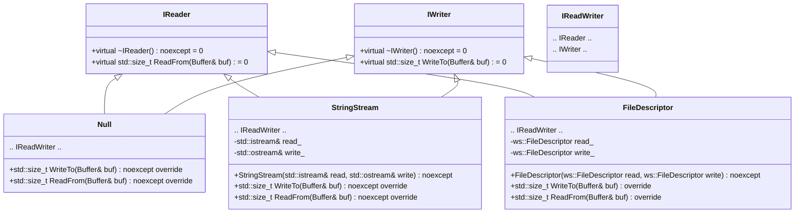
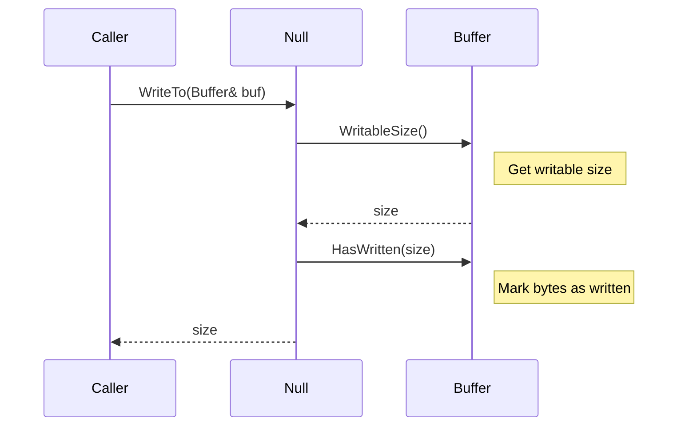
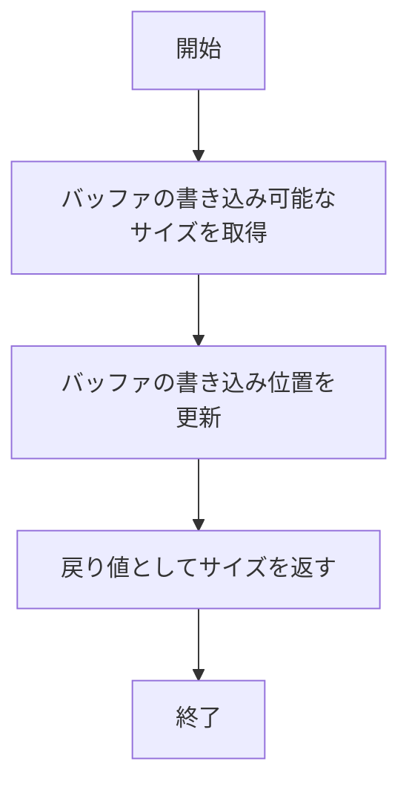
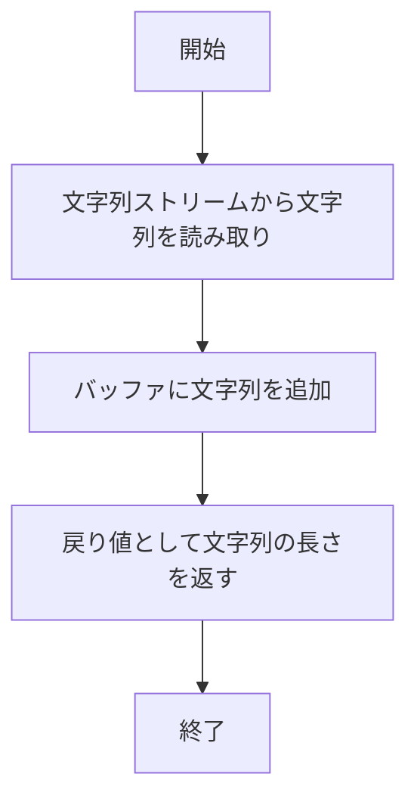

# 詳細設計仕様書

## 概要

このドキュメントは、`include/io.h`と`src/io/io.cpp`の再実装に必要な詳細な設計情報を提供します。ソースコードから確認できる事実のみを基に記述し、推測や仮定を行いません。

## クラス図


## クラス・メソッド・インターフェース詳細

| 完全な名前 | 属性 | 引数名と型 | 戻り値型 | 可視性 | const | 参照/ポインタ | static | virtual | noexcept |
|------------|------|------------|----------|--------|-------|---------------|--------|---------|----------|
| ws::io::IReader::~IReader | デストラクタ | - | void | public | なし | なし | なし | あり | あり |
| ws::io::IReader::ReadFrom | メソッド | Buffer& buf | std::size_t | public | なし | 参照 | なし | あり | なし |
| ws::io::IWriter::~IWriter | デストラクタ | - | void | public | なし | なし | なし | あり | あり |
| ws::io::IWriter::WriteTo | メソッド | Buffer& buf | std::size_t | public | なし | 参照 | なし | あり | なし |
| ws::io::Null::WriteTo | メソッド | Buffer& buf | std::size_t | public | なし | 参照 | なし | あり | あり |
| ws::io::Null::ReadFrom | メソッド | Buffer& buf | std::size_t | public | なし | 参照 | なし | あり | あり |
| ws::io::StringStream::StringStream | コンストラクタ | std::istream& read, std::ostream& write | void | public | なし | 参照 | なし | なし | あり |
| ws::io::StringStream::WriteTo | メソッド | Buffer& buf | std::size_t | public | なし | 参照 | なし | あり | あり |
| ws::io::StringStream::ReadFrom | メソッド | Buffer& buf | std::size_t | public | なし | 参照 | なし | あり | あり |
| ws::io::FileDescriptor::FileDescriptor | コンストラクタ | ws::FileDescriptor read, ws::FileDescriptor write | void | public | なし | 値 | なし | なし | あり |
| ws::io::FileDescriptor::WriteTo | メソッド | Buffer& buf | std::size_t | public | なし | 参照 | なし | あり | なし |
| ws::io::FileDescriptor::ReadFrom | メソッド | Buffer& buf | std::size_t | public | なし | 参照 | なし | あり | なし |

## シーケンス図
### Null::WriteTo


### StringStream::WriteTo
```mermaid
sequenceDiagram
    participant Caller
    participant StringStream
    participant std::istream
    participant Buffer

    Caller->>StringStream: WriteTo(Buffer& buf)
    StringStream->>std::istream: >> str
    Note right of std::istream: Read string from stream
    std::istream-->>StringStream: str
    StringStream->>Buffer: Append(str)
    Note right of Buffer: Append string to buffer
    StringStream-->>Caller: str.length()
```

### FileDescriptor::WriteTo
```mermaid
sequenceDiagram
    participant Caller
    participant FileDescriptor
    participant Buffer
    participant std::array

    Caller->>FileDescriptor: WriteTo(Buffer& buf)
    FileDescriptor->>Buffer: WritableBytes()
    Note right of Buffer: Get writable bytes
    Buffer-->>FileDescriptor: buf_bytes
    FileDescriptor->>std::array: Create ext_bytes
    Note right of std::array: Create additional buffer
    FileDescriptor->>readv: readv(read_, bufs.data(), bufs.size())
    Note right of readv: Read data from file descriptor
    readv-->>FileDescriptor: size
    alt size < 0
        FileDescriptor->>ThrowLastSystemError: ThrowLastSystemError()
        ThrowLastSystemError-->>Caller: Exception
    else size <= buf_bytes.size_bytes()
        FileDescriptor->>Buffer: HasWritten(size)
        Note right of Buffer: Mark bytes as written
        FileDescriptor-->>Caller: size
    else size > buf_bytes.size_bytes()
        FileDescriptor->>Buffer: HasWritten(buf_bytes.size_bytes())
        Note right of Buffer: Mark bytes as written
        FileDescriptor->>Buffer: Append(ext_bytes.cbegin(), ext_bytes.cbegin() + (size - buf_bytes.size_bytes()))
        Note right of Buffer: Append remaining data to buffer
        FileDescriptor-->>Caller: size
    end
```

## メソッド仕様書

### Null::WriteTo
- **目的**: バッファの書き込み可能な領域を消費しますが、実際には何も書き込みません。
- **引数**:
  - `Buffer& buf`: 書き込みを行うバッファへの参照。
- **戻り値**: 消費したバッファのサイズ (`std::size_t`)。
- **動作**: バッファの書き込み可能なサイズを取得し、そのサイズ分バッファの書き込み位置を進める。
- **副作用**: バッファの書き込み位置が更新される。
- **エラー処理**: なし。

### Null::ReadFrom
- **目的**: バッファから読み取り可能なデータを消費しますが、実際には何も読み取りません。
- **引数**:
  - `Buffer& buf`: 読み取りを行うバッファへの参照。
- **戻り値**: 消費したバッファのサイズ (`std::size_t`)。
- **動作**: バッファからすべてのデータを読み取り可能な領域として消費します。
- **副作用**: バッファの読み取り位置が更新される。
- **エラー処理**: なし。

### StringStream::WriteTo
- **目的**: 文字列ストリームからバッファにデータを書き込みます。
- **引数**:
  - `Buffer& buf`: 書き込みを行うバッファへの参照。
- **戻り値**: 書き込まれた文字列の長さ (`std::size_t`)。
- **動作**: 文字列ストリームから文字列を読み取り、それをバッファに追加します。
- **副作用**: バッファにデータが追加され、文字列ストリームからの読み取り位置が更新される。
- **エラー処理**: なし。

### StringStream::ReadFrom
- **目的**: バッファからデータを読み取り、それを文字列ストリームに書き込みます。
- **引数**:
  - `Buffer& buf`: 読み取りを行うバッファへの参照。
- **戻り値**: 書き込まれた文字列の長さ (`std::size_t`)。
- **動作**: バッファからすべてのデータを読み取り、それを文字列ストリームに書き込みます。
- **副作用**: バッファからの読み取り位置が更新され、文字列ストリームにデータが追加される。
- **エラー処理**: なし。

### FileDescriptor::WriteTo
- **目的**: ファイルディスクリプタからバッファにデータを書き込みます。
- **引数**:
  - `Buffer& buf`: 書き込みを行うバッファへの参照。
- **戻り値**: 書き込まれたデータのサイズ (`std::size_t`)。
- **動作**: ファイルディスクリプタからデータを読み取り、それをバッファに追加します。必要に応じて追加のバッファを使用してデータを読み取ります。
- **副作用**: バッファにデータが追加され、ファイルディスクリプタからの読み取り位置が更新される。
- **エラー処理**: `readv`呼び出しが失敗した場合、`ThrowLastSystemError()`を呼び出して例外を投げます。

### FileDescriptor::ReadFrom
- **目的**: バッファからデータを読み取り、それをファイルディスクリプタに書き込みます。
- **引数**:
  - `Buffer& buf`: 読み取りを行うバッファへの参照。
- **戻り値**: 書き込まれたデータのサイズ (`std::size_t`)。
- **動作**: バッファから読み取り可能なデータを取得し、それをファイルディスクリプタに書き込みます。
- **副作用**: バッファからの読み取り位置が更新され、ファイルディスクリプタへの書き込み位置が更新される。
- **エラー処理**: `write`呼び出しが失敗した場合、`ThrowLastSystemError()`を呼び出して例外を投げます。

## 処理フロー図

### Null::WriteTo


### StringStream::WriteTo


### FileDescriptor::WriteTo
```mermaid
graph TD
    A[開始] --> B[バッファの書き込み可能なデータを取得]
    B --> C[追加のバッファを作成]
    C --> D[ファイルディスクリプタからデータを読み取り]
    D --> E{サイズが負?}
    E -- はい --> F[ThrowLastSystemError()]
    E -- いいえ --> G{サイズ <= バッファの書き込み可能なサイズ?}
    G -- はい --> H[バッファの書き込み位置を更新]
    G -- いいえ --> I[バッファの書き込み位置を部分的に更新]
    I --> J[追加のデータをバッファに追加]
    H --> K[戻り値としてサイズを返す]
    J --> K
    F --> L[例外を投げる]
    K --> M[終了]
```

## 状態遷移・副作用

| 更新前状態 | 遷移条件 | 変更対象 | 更新後状態 | 更新順序 | 副作用 |
|------------|----------|----------|------------|----------|--------|
| バッファの書き込み位置が未更新 | WriteTo呼び出し | バッファの書き込み位置 | 消費したバッファのサイズ分進んだ位置 | 1. WritableSize() <br> 2. HasWritten(size) | バッファの書き込み位置が更新される |
| バッファの読み取り位置が未更新 | ReadFrom呼び出し | バッファの読み取り位置 | 全てのデータを消費した位置 | RetrieveAll() | バッファの読み取り位置が更新される |
| 文字列ストリームから文字列を読み取り | WriteTo呼び出し | バッファに追加されたデータ | 追加された文字列 | Append(str) | バッファにデータが追加され、文字列ストリームからの読み取り位置が更新される |
| バッファからデータを読み取り | ReadFrom呼び出し | 文字列ストリームに書き込まれたデータ | 書き込まれた文字列 | write_ << str | バッファからの読み取り位置が更新され、文字列ストリームにデータが追加される |
| ファイルディスクリプタからデータを読み取り | WriteTo呼び出し | バッファに追加されたデータ | 追加されたデータ | readv(read_, bufs.data(), bufs.size()) | バッファにデータが追加され、ファイルディスクリプタからの読み取り位置が更新される |
| バッファからデータを読み取り | ReadFrom呼び出し | ファイルディスクリプタに書き込まれたデータ | 書き込まれたデータ | write(write_, bytes.data(), bytes.size_bytes()) | バッファからの読み取り位置が更新され、ファイルディスクリプタへの書き込み位置が更新される |

## データ変換・制約

| 入力 | 出力 | 変換規則 | 値域 | 境界値 | 単位 | 精度 | encoding |
|------|------|----------|------|--------|------|------|----------|
| バッファの書き込み可能なサイズ | 消費したバッファのサイズ | WritableSize() | 0以上の整数 | 0, 最大値 | byte | 無し | 無し |
| 文字列ストリームから読み取った文字列 | バッファに追加されたデータ | Append(str) | 文字列 | 空文字列, 最大長の文字列 | 文字列 | 無し | UTF-8 |
| ファイルディスクリプタから読み取ったデータ | バッファに追加されたデータ | readv(read_, bufs.data(), bufs.size()) | byte配列 | 空配列, 最大長のbyte配列 | byte | 無し | 無し |
| バッファから読み取ったデータ | 文字列ストリームに書き込まれたデータ | write_ << str | 文字列 | 空文字列, 最大長の文字列 | 文字列 | 無し | UTF-8 |

## 完全再構築台帳

### include/io.h
```cpp
/**
 * @file io.h
 * @brief I/O objects supporting reading and writing from buffers.
 *
 * @author Chen Zhenshuo (chenzs108@outlook.com)
 * @author Liu Guowen (liu.guowen@outlook.com)
 * @par GitHub
 * https://github.com/Zhuagenborn
 * @version 1.0
 * @date 2022-05-06
 *
 * @example tests/io_test.cpp
 */

#pragma once

#include "util.h"

#include <iostream>

namespace ws {

class Buffer;

namespace io {

class IReader {
public:
    virtual ~IReader() noexcept = default;
    virtual std::size_t ReadFrom(Buffer& buf) = 0;
};

class IWriter {
public:
    virtual ~IWriter() noexcept = default;
    virtual std::size_t WriteTo(Buffer& buf) = 0;
};

class IReadWriter : public virtual IReader, public virtual IWriter {};

class Null : public virtual IReadWriter {
public:
    std::size_t WriteTo(Buffer& buf) noexcept override;
    std::size_t ReadFrom(Buffer& buf) noexcept override;
};

class StringStream : public virtual IReadWriter {
public:
    explicit StringStream(std::istream& read, std::ostream& write) noexcept;
    StringStream(const StringStream&) = delete;
    StringStream(StringStream&&) = delete;
    StringStream& operator=(const StringStream&) = delete;
    StringStream& operator=(StringStream&&) = delete;
    std::size_t WriteTo(Buffer& buf) noexcept override;
    std::size_t ReadFrom(Buffer& buf) noexcept override;

private:
    std::istream& read_;
    std::ostream& write_;
};

class FileDescriptor : public virtual IReadWriter {
public:
    explicit FileDescriptor(ws::FileDescriptor read, ws::FileDescriptor write) noexcept;
    FileDescriptor(const FileDescriptor&) = delete;
    FileDescriptor(FileDescriptor&&) = delete;
    FileDescriptor& operator=(const FileDescriptor&) = delete;
    FileDescriptor& operator=(FileDescriptor&&) = delete;
    std::size_t WriteTo(Buffer& buf) override;
    std::size_t ReadFrom(Buffer& buf) override;

private:
    ws::FileDescriptor read_;
    ws::FileDescriptor write_;
};

}  // namespace io

}  // namespace ws
```

### src/io/io.cpp
```cpp
#include "io.h"
#include "containers/buffer.h"

#include <sys/uio.h>
#include <unistd.h>

#include <array>

namespace ws::io {

std::size_t Null::WriteTo(Buffer& buf) noexcept {
    const auto size {buf.WritableSize()};
    buf.HasWritten(size);
    return size;
}

std::size_t Null::ReadFrom(Buffer& buf) noexcept {
    return buf.RetrieveAll();
}

StringStream::StringStream(std::istream& read, std::ostream& write) noexcept :
    read_ {read}, write_ {write} {}

std::size_t StringStream::WriteTo(Buffer& buf) noexcept {
    std::string str;
    read_ >> str;
    buf.Append(str);
    return str.length();
}

std::size_t StringStream::ReadFrom(Buffer& buf) noexcept {
    const std::string str {buf.RetrieveAllToString()};
    write_ << str;
    return str.length();
}

FileDescriptor::FileDescriptor(const ws::FileDescriptor read, const ws::FileDescriptor write) noexcept :
    read_ {read}, write_ {write} {}

std::size_t FileDescriptor::WriteTo(Buffer& buf) {
    const auto buf_bytes {buf.WritableBytes()};
    std::array<std::byte, 0x10000> ext_bytes;

    const std::array bufs {
        iovec {.iov_base = buf_bytes.data(), .iov_len = buf_bytes.size_bytes()},
        iovec {.iov_base = ext_bytes.data(), .iov_len = ext_bytes.size()}};

    const auto size {readv(read_, bufs.data(), bufs.size())};
    if (size < 0) {
        ThrowLastSystemError();
    } else if (size <= buf_bytes.size_bytes()) {
        buf.HasWritten(size);
    } else {
        buf.HasWritten(buf_bytes.size_bytes());
        buf.Append({ext_bytes.cbegin(),
                    ext_bytes.cbegin() + (size - buf_bytes.size_bytes())});
    }

    return size;
}

std::size_t FileDescriptor::ReadFrom(Buffer& buf) {
    const auto bytes {buf.ReadableBytes()};
    if (const auto size {write(write_, bytes.data(), bytes.size_bytes())};
        size >= 0) {
        buf.Retrieve(size);
        return size;
    } else {
        ThrowLastSystemError();
    }
}

}  // namespace ws::io
```

## 確認不能事項

- `Buffer`クラスの内部実装詳細（`include/containers/buffer.h`）
- `util.h`内の関数や定義の詳細な動作（`include/util.h`）

これらのファイルは依存ヘッダとして参照されますが、その内容については再実装に必要な情報のみを抽出し、推測を行いません。