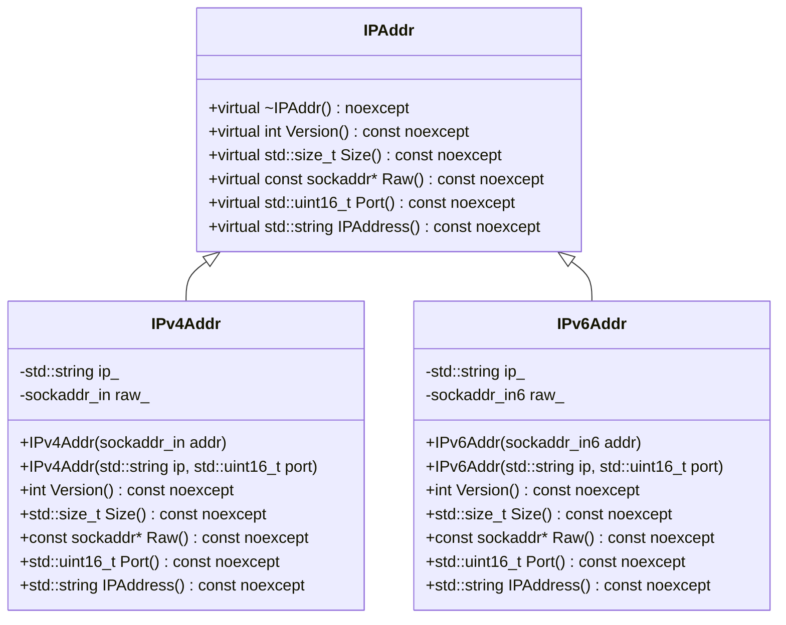
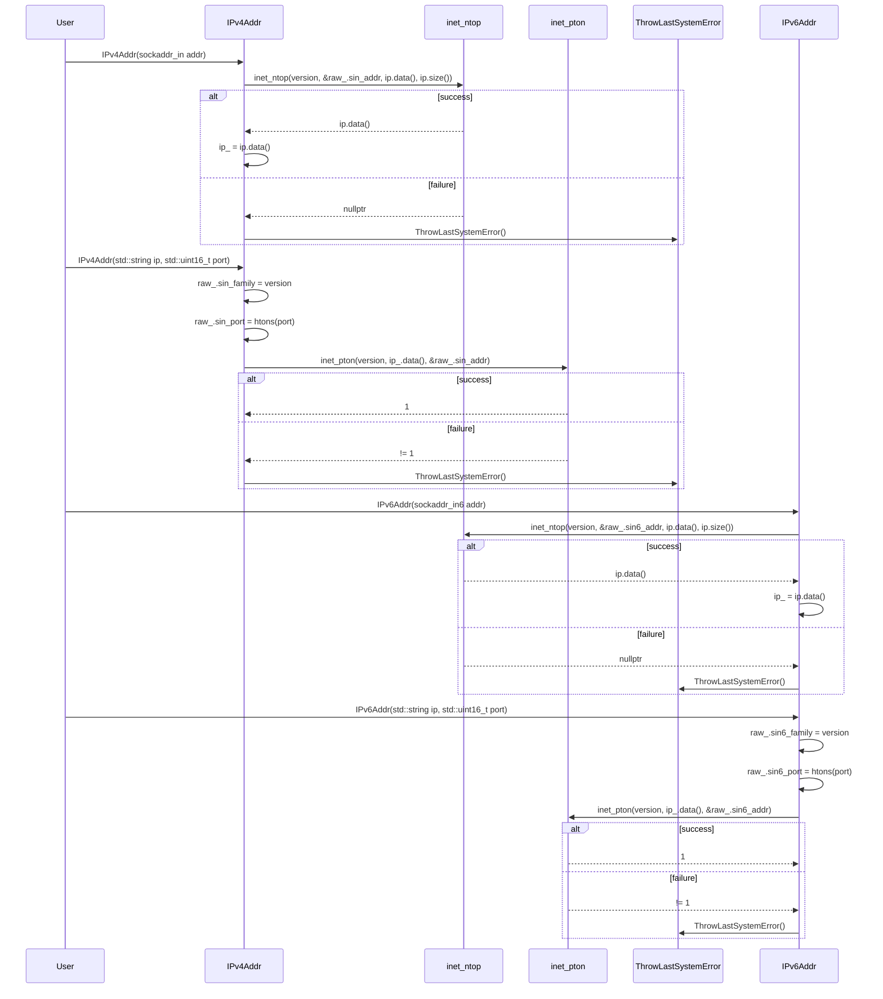

# 詳細設計仕様書

## 目的
対象コードから再実装に必要な実装上の事実を失わない詳細設計情報を生成する。

## 共通記述規則
- 元コードと与えられた文脈から確認できる事実だけを記述する。
- 確認できない情報は「確認不能」と記述する。
- ソースコード全文を複製しない。再実装に必要な事実を、表、短い式、疑似コード、図、自然言語へ変換して記述する。

## 再実装忠実度の必須観点

### 1. 正確な定義
- `using`、`typedef`、`enum`、`concept`、`requires`、macro、定数、nested/base class、構造体フィールドについて、確認できる場合は名前だけでなく実体・値・構造を記述する。

### 2. 直接依存インターフェースと利用方法
- 対象が直接利用する関数・メソッド・型について、確認できる範囲で詳細な情報を記述する。

### 3. 結果を決める式・具体値
- 条件式、比較演算子、switch case、bit位置、bit幅、mask、shift量、符号拡張、byte数、サイズ単位、長さ制約、配列index、offset、アドレス増分、loop境界、増分値、literal、sentinel、default値、error code、文字列・改行・encodingなどの変換規則を正確に保持する。

### 4. 使用データ・更新データ
- 処理が参照・更新するデータについて具体的なアクセス対象を記述する。

### 5. 状態・副作用・不変条件
- 状態更新、所有権、寿命、lock範囲、wait predicate、notify、close、error contractなど、動作の正当性に必要な制約を記述する。

## クラス図



## クラス・メソッド・インターフェース詳細

| 完全な名前 | 属性 | 引数名と型 | 戻り値型 | 可視性 | const | noexcept | static | virtual |
|------------|------|------------|----------|--------|-------|----------|--------|---------|
| ws::IPAddr::~IPAddr | デストラクタ | なし | void | public | あり | あり | なし | あり |
| ws::IPAddr::Version | メソッド | なし | int | public | あり | あり | なし | あり |
| ws::IPAddr::Size | メソッド | なし | std::size_t | public | あり | あり | なし | あり |
| ws::IPAddr::Raw | メソッド | なし | const sockaddr* | public | あり | あり | なし | あり |
| ws::IPAddr::Port | メソッド | なし | std::uint16_t | public | あり | あり | なし | あり |
| ws::IPAddr::IPAddress | メソッド | なし | std::string | public | あり | あり | なし | あり |
| ws::IPv4Addr::IPv4Addr | コンストラクタ | sockaddr_in addr | void | public | なし | なし | なし | なし |
| ws::IPv4Addr::IPv4Addr | コンストラクタ | std::string ip, std::uint16_t port | void | public | なし | なし | なし | なし |
| ws::IPv4Addr::Version | メソッド | なし | int | public | あり | あり | なし | あり |
| ws::IPv4Addr::Size | メソッド | なし | std::size_t | public | あり | あり | なし | あり |
| ws::IPv4Addr::Raw | メソッド | なし | const sockaddr* | public | あり | あり | なし | あり |
| ws::IPv4Addr::Port | メソッド | なし | std::uint16_t | public | あり | あり | なし | あり |
| ws::IPv4Addr::IPAddress | メソッド | なし | std::string | public | あり | あり | なし | あり |
| ws::IPv6Addr::IPv6Addr | コンストラクタ | sockaddr_in6 addr | void | public | なし | なし | なし | なし |
| ws::IPv6Addr::IPv6Addr | コンストラクタ | std::string ip, std::uint16_t port | void | public | なし | なし | なし | なし |
| ws::IPv6Addr::Version | メソッド | なし | int | public | あり | あり | なし | あり |
| ws::IPv6Addr::Size | メソッド | なし | std::size_t | public | あり | あり | なし | あり |
| ws::IPv6Addr::Raw | メソッド | なし | const sockaddr* | public | あり | あり | なし | あり |
| ws::IPv6Addr::Port | メソッド | なし | std::uint16_t | public | あり | あり | なし | あり |
| ws::IPv6Addr::IPAddress | メソッド | なし | std::string | public | あり | あり | なし | あり |

## シーケンス図



## メソッド仕様書

### ws::IPv4Addr::IPv4Addr(sockaddr_in addr)
- **目的**: `sockaddr_in`型のアドレスからIPv4アドレスオブジェクトを初期化する。
- **引数**:
  - `addr`: IPv4アドレスを表す`sockaddr_in`構造体。
- **戻り値**: なし
- **動作**:
  - `raw_`に`addr`の内容を移動させる。
  - `inet_ntop`を使用してIPv4アドレス文字列を取得し、`ip_`に設定する。
  - 失敗した場合は`ThrowLastSystemError`を呼び出す。

### ws::IPv4Addr::IPv4Addr(std::string ip, std::uint16_t port)
- **目的**: IPアドレスとポート番号からIPv4アドレスオブジェクトを初期化する。
- **引数**:
  - `ip`: IPv4アドレス文字列。
  - `port`: ポート番号。
- **戻り値**: なし
- **動作**:
  - `ip_`に`ip`の内容を移動させる。
  - `raw_.sin_family`に`version`を設定する。
  - `raw_.sin_port`に`port`をホストバイトオーダーからネットワークバイトオーダーへ変換して設定する。
  - `inet_pton`を使用してIPv4アドレス文字列を`sockaddr_in.sin_addr`に設定する。
  - 失敗した場合は`ThrowLastSystemError`を呼び出す。

### ws::IPv6Addr::IPv6Addr(sockaddr_in6 addr)
- **目的**: `sockaddr_in6`型のアドレスからIPv6アドレスオブジェクトを初期化する。
- **引数**:
  - `addr`: IPv6アドレスを表す`sockaddr_in6`構造体。
- **戻り値**: なし
- **動作**:
  - `raw_`に`addr`の内容を移動させる。
  - `inet_ntop`を使用してIPv6アドレス文字列を取得し、`ip_`に設定する。
  - 失敗した場合は`ThrowLastSystemError`を呼び出す。

### ws::IPv6Addr::IPv6Addr(std::string ip, std::uint16_t port)
- **目的**: IPアドレスとポート番号からIPv6アドレスオブジェクトを初期化する。
- **引数**:
  - `ip`: IPv6アドレス文字列。
  - `port`: ポート番号。
- **戻り値**: なし
- **動作**:
  - `ip_`に`ip`の内容を移動させる。
  - `raw_.sin6_family`に`version`を設定する。
  - `raw_.sin6_port`に`port`をホストバイトオーダーからネットワークバイトオーダーへ変換して設定する。
  - `inet_pton`を使用してIPv6アドレス文字列を`sockaddr_in6.sin6_addr`に設定する。
  - 失敗した場合は`ThrowLastSystemError`を呼び出す。

## 処理フロー図

### IPv4Addr::IPv4Addr(sockaddr_in addr)
```mermaid
graph TD
    A[開始] --> B[inet_ntop(version, &raw_.sin_addr, ip.data(), ip.size())]
    B -- 成功 --> C[ip_ = ip.data()]
    B -- 失敗 --> D[ThrowLastSystemError()]
    C --> E[終了]
    D --> F[終了]
```

### IPv4Addr::IPv4Addr(std::string ip, std::uint16_t port)
```mermaid
graph TD
    A[開始] --> B[ip_ = std::move(ip)]
    B --> C[raw_.sin_family = version]
    C --> D[raw_.sin_port = htons(port)]
    D --> E[inet_pton(version, ip_.data(), &raw_.sin_addr) != 1]
    E -- true --> F[ThrowLastSystemError()]
    E -- false --> G[終了]
    F --> H[終了]
```

### IPv6Addr::IPv6Addr(sockaddr_in6 addr)
```mermaid
graph TD
    A[開始] --> B[inet_ntop(version, &raw_.sin6_addr, ip.data(), ip.size())]
    B -- 成功 --> C[ip_ = ip.data()]
    B -- 失敗 --> D[ThrowLastSystemError()]
    C --> E[終了]
    D --> F[終了]
```

### IPv6Addr::IPv6Addr(std::string ip, std::uint16_t port)
```mermaid
graph TD
    A[開始] --> B[ip_ = std::move(ip)]
    B --> C[raw_.sin6_family = version]
    C --> D[raw_.sin6_port = htons(port)]
    D --> E[inet_pton(version, ip_.data(), &raw_.sin6_addr) != 1]
    E -- true --> F[ThrowLastSystemError()]
    E -- false --> G[終了]
    F --> H[終了]
```

## 状態遷移・副作用

| 更新前状態 | 遷移条件 | 変更対象 | 更新後状態 | 更新順序 | 副作用 |
|------------|----------|----------|------------|----------|--------|
| なし       | 成功     | ip_      | IPv4アドレス文字列 | 1        | なし   |
| なし       | 失敗     | なし     | なし       | 1        | ThrowLastSystemError() 呼び出し |
| なし       | 成功     | raw_.sin_family, raw_.sin_port | AF_INET, ネットワークバイトオーダーのポート番号 | 2,3      | なし   |
| なし       | 失敗     | なし     | なし       | 4        | ThrowLastSystemError() 呼び出し |
| なし       | 成功     | ip_      | IPv6アドレス文字列 | 1        | なし   |
| なし       | 失敗     | なし     | なし       | 1        | ThrowLastSystemError() 呼び出し |
| なし       | 成功     | raw_.sin6_family, raw_.sin6_port | AF_INET6, ネットワークバイトオーダーのポート番号 | 2,3      | なし   |
| なし       | 失敗     | なし     | なし       | 4        | ThrowLastSystemError() 呼び出し |

## データ変換・制約

| 入力データ | 出力データ | 変換規則 | 値域 | 境界値 | 単位 | 精度 | encoding |
|------------|------------|----------|------|--------|------|------|----------|
| sockaddr_in.addr | IPv4アドレス文字列 | inet_ntop | 文字列 | 15文字以内 | 文字列 | -    | ASCII |
| std::string ip, std::uint16_t port | sockaddr_in.sin_addr, sockaddr_in.sin_port | inet_pton, htons | ネットワークバイトオーダーのアドレス, ポート番号 | 0-65535 | バイト, バイト | -    | ASCII |
| sockaddr_in6.addr | IPv6アドレス文字列 | inet_ntop | 文字列 | 45文字以内 | 文字列 | -    | ASCII |
| std::string ip, std::uint16_t port | sockaddr_in6.sin6_addr, sockaddr_in6.sin6_port | inet_pton, htons | ネットワークバイトオーダーのアドレス, ポート番号 | 0-65535 | バイト, バイト | -    | ASCII |

## 完全再構築台帳

### include/ip.h
```cpp
#pragma once

#include <concepts>
#include <cstdint>
#include <string>
#include <string_view>

#include <netinet/in.h>

namespace ws {

class IPAddr {
public:
    virtual ~IPAddr() noexcept = default;

    virtual int Version() const noexcept = 0;

    virtual std::size_t Size() const noexcept = 0;

    virtual const sockaddr* Raw() const noexcept = 0;

    virtual std::uint16_t Port() const noexcept = 0;

    virtual std::string IPAddress() const noexcept = 0;
};

class IPv4Addr : public IPAddr {
public:
    static constexpr int version {AF_INET};

    static constexpr std::string_view loop_back {"127.0.0.1"};

    static constexpr std::string_view any {"0.0.0.0"};

    static constexpr std::size_t max_length {15};

    using RawType = sockaddr_in;

    explicit IPv4Addr(sockaddr_in addr);

    explicit IPv4Addr(std::string ip, std::uint16_t port);

    int Version() const noexcept override;

    std::size_t Size() const noexcept override;

    const sockaddr* Raw() const noexcept override;

    std::uint16_t Port() const noexcept override;

    std::string IPAddress() const noexcept override;

private:
    std::string ip_;
    sockaddr_in raw_ {};
};

class IPv6Addr : public IPAddr {
public:
    static constexpr int version {AF_INET6};

    static constexpr std::string_view loop_back {"::1"};

    static constexpr std::string_view any {"::"};

    static constexpr std::size_t max_length {45};

    using RawType = sockaddr_in6;

    explicit IPv6Addr(sockaddr_in6 addr);

    explicit IPv6Addr(std::string ip, std::uint16_t port);

    int Version() const noexcept override;

    std::size_t Size() const noexcept override;

    const sockaddr* Raw() const noexcept override;

    std::uint16_t Port() const noexcept override;

    std::string IPAddress() const noexcept override;

private:
    std::string ip_;
    sockaddr_in6 raw_ {};
};

template <typename T>
concept ValidIPAddr = std::same_as<T, IPv4Addr> || std::same_as<T, IPv6Addr>;

}  // namespace ws
```

### src/ip/ip.cpp
```cpp
#include "ip.h"
#include "util.h"

#include <arpa/inet.h>

#include <array>

namespace ws {

IPv4Addr::IPv4Addr(sockaddr_in addr) : raw_ {std::move(addr)} {
    std::array<char, max_length + 1> ip;
    if (inet_ntop(version, &raw_.sin_addr, ip.data(), ip.size())) {
        ip_ = ip.data();
    } else {
        ThrowLastSystemError();
    }
}

IPv4Addr::IPv4Addr(std::string ip, const std::uint16_t port) :
    ip_ {std::move(ip)} {
    raw_.sin_family = version;
    raw_.sin_port = htons(port);
    if (inet_pton(version, ip_.data(), &raw_.sin_addr) != 1) {
        ThrowLastSystemError();
    }
}

int IPv4Addr::Version() const noexcept {
    return version;
}

std::size_t IPv4Addr::Size() const noexcept {
    return sizeof(raw_);
}

std::uint16_t IPv4Addr::Port() const noexcept {
    return ntohs(raw_.sin_port);
}

std::string IPv4Addr::IPAddress() const noexcept {
    return ip_;
}

const sockaddr* IPv4Addr::Raw() const noexcept {
    return reinterpret_cast<const sockaddr*>(&raw_);
}

IPv6Addr::IPv6Addr(sockaddr_in6 addr) : raw_ {std::move(addr)} {
    std::array<char, max_length + 1> ip;
    if (inet_ntop(version, &raw_.sin6_addr, ip.data(), ip.size())) {
        ip_ = ip.data();
    } else {
        ThrowLastSystemError();
    }
}

IPv6Addr::IPv6Addr(std::string ip, const std::uint16_t port) :
    ip_ {std::move(ip)} {
    raw_.sin6_family = version;
    raw_.sin6_port = htons(port);
    if (inet_pton(version, ip_.data(), &raw_.sin6_addr) != 1) {
        ThrowLastSystemError();
    }
}

int IPv6Addr::Version() const noexcept {
    return version;
}

std::size_t IPv6Addr::Size() const noexcept {
    return sizeof(raw_);
}

std::uint16_t IPv6Addr::Port() const noexcept {
    return ntohs(raw_.sin6_port);
}

std::string IPv6Addr::IPAddress() const noexcept {
    return ip_;
}

const sockaddr* IPv6Addr::Raw() const noexcept {
    return reinterpret_cast<const sockaddr*>(&raw_);
}

}  // namespace ws
```

## 依存関係

- `include/ip.h`は以下のヘッダをインクルードする:
  - `<concepts>`
  - `<cstdint>`
  - `<string>`
  - `<string_view>`
  - `<netinet/in.h>`

- `src/ip/ip.cpp`は以下のヘッダをインクルードする:
  - `"ip.h"`
  - `"util.h"`
  - `<arpa/inet.h>`
  - `<array>`