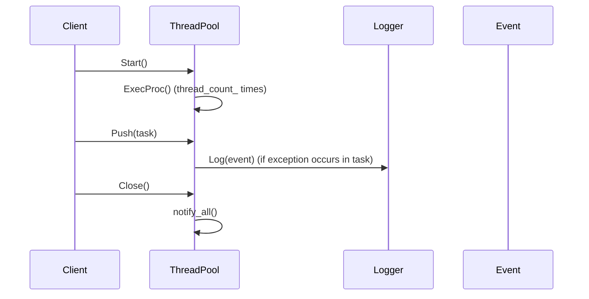

# 詳細設計仕様書

## クラス図

```mermaid
classDiagram
    class ThreadPool {
        +using Task = std::function<void()>
        +ThreadPool(std::optional<std::size_t> thread_count, log::Logger::Ptr logger) noexcept
        +~ThreadPool(const ThreadPool&) 
        +~ThreadPool(ThreadPool&&) 
        +~ThreadPool& operator=(const ThreadPool&)
        +~ThreadPool& operator=(ThreadPool&&)
        +void Start() noexcept
        +void Push(Task task) noexcept
        +void Close() noexcept
        -void ExecProc() noexcept
        -log::Logger::Ptr logger_
        -mutable std::mutex mtx_
        -std::atomic_bool closed_ {true}
        -std::size_t thread_count_
        -std::condition_variable cond_
        -std::list<Task> tasks_
        -std::list<std::thread> threads_
    }
    
    class log~Logger {
        +using Ptr = std::shared_ptr<Logger>
        +Logger(std::string_view name, log::Level level, std::optional<std::size_t> capacity) noexcept
        +void Log(Event::Ptr event) noexcept
        +void AddAppender(Appender::Ptr appender) noexcept
        +void RemoveAppender(Appender::Ptr appender) noexcept
        +void ClearAppenders() noexcept
        +log::Level GetLevel() const noexcept
        +void SetLevel(log::Level level) noexcept
        +Formatter::Ptr GetDefaultFormatter() const noexcept
        +void SetDefaultFormatter(Formatter::Ptr formatter) noexcept
        +std::string_view Name() const noexcept
        +std::size_t Capacity() const noexcept
        +std::string ToYamlString() const noexcept
    }
    
    class log~Event {
        +using Ptr = std::shared_ptr<Event>
        +static Ptr Create(log::Level level, std::experimental::source_location location, std::uint32_t thread_id, Clock::time_point time) noexcept
        +log::Level Level() const noexcept
        +std::string_view FileName() const noexcept
        +std::size_t LineNum() const noexcept
        +std::uint32_t ThreadId() const noexcept
        +Clock::time_point Time() const noexcept
        +std::string Message() const noexcept
        +std::ostringstream& MessageStream() noexcept
    }
    
    ThreadPool --> log~Logger : logger_
    ThreadPool --> std::mutex : mtx_
    ThreadPool --> std::atomic_bool : closed_
    ThreadPool --> std::size_t : thread_count_
    ThreadPool --> std::condition_variable : cond_
    ThreadPool --> std::list~Task~ : tasks_
    ThreadPool --> std::list~std::thread~ : threads_
    
    log~Logger --> log~Event
```

## クラス・メソッド・インターフェース詳細

| 完全な名前 | 属性 | 引数名と型 | 戻り値型 | 可視性 | const | リファレンス/ポインタ | static | virtual | noexcept | 型別名 | 列挙型 | 定数 | 直接依存 |
|------------|------|------------|----------|--------|-------|---------------------|--------|---------|----------|--------|--------|------|----------|
| ws::ThreadPool::Task | using | - | std::function<void()> | public | - | - | - | - | - | - | - | - | - |
| ws::ThreadPool::ThreadPool | constructor | thread_count: std::optional<std::size_t>, logger: log::Logger::Ptr | - | public | - | - | - | - | noexcept | - | - | - | log::Logger, std::optional, std::nullopt |
| ws::ThreadPool::~ThreadPool | destructor | - | - | public | - | - | - | - | noexcept | - | - | - | - |
| ws::ThreadPool::operator= | assignment operator | const ThreadPool& | ThreadPool& | public | - | - | - | - | - | - | - | - | - |
| ws::ThreadPool::operator= | assignment operator | ThreadPool&& | ThreadPool& | public | - | - | - | - | - | - | - | - | - |
| ws::ThreadPool::Start | method | - | void | public | - | - | - | - | noexcept | - | - | - | std::mutex, std::atomic_bool, std::thread |
| ws::ThreadPool::Push | method | task: Task | void | public | - | - | - | - | noexcept | - | - | - | std::mutex, std::list, std::condition_variable |
| ws::ThreadPool::Close | method | - | void | public | - | - | - | - | noexcept | - | - | - | std::mutex, std::atomic_bool, std::condition_variable, std::thread |
| ws::ThreadPool::ExecProc | method | - | void | private | - | - | - | - | noexcept | - | - | - | log::Logger, std::mutex, std::list, std::function, std::exception |

## シーケンス図



## メソッド仕様書

### ws::ThreadPool::ThreadPool
- **目的**: スレッドプールを初期化する。
- **引数**:
  - `thread_count`: スレッドの数。`std::nullopt`またはゼロの場合、ハードウェアがサポートする並列スレッドの数を使用する。
  - `logger`: ロガー。`nullptr`の場合、グローバルルートロガーを使用する。
- **戻り値**: なし
- **動作**:
  - ロガーを設定する。
  - スレッド数を設定し、ゼロの場合はハードウェアがサポートする並列スレッドの数に設定する。
- **副作用**: なし

### ws::ThreadPool::~ThreadPool
- **目的**: スレッドプールを破棄する。
- **引数**: なし
- **戻り値**: なし
- **動作**:
  - スレッドプールを閉じる。
  - 全てのスレッドが終了するまで待つ。
- **副作用**: スレッドのjoin

### ws::ThreadPool::Start
- **目的**: スレッドプールを開始する。
- **引数**: なし
- **戻り値**: なし
- **動作**:
  - スレッドプールが閉じていることを確認する。
  - 指定されたスレッド数だけワーカースレッドを作成し、`ExecProc`を実行させる。
- **副作用**: スレッドの生成

### ws::ThreadPool::Push
- **目的**: タスクをスレッドプールに追加する。
- **引数**:
  - `task`: 実行すべきタスク。
- **戻り値**: なし
- **動作**:
  - スレッドプールが閉じていないことを確認する。
  - タスクをタスクキューに追加し、条件変数を通知する。
- **副作用**: タスクの追加と条件変数の通知

### ws::ThreadPool::Close
- **目的**: スレッドプールを閉じる。
- **引数**: なし
- **戻り値**: なし
- **動作**:
  - スレッドプールが閉じていることを設定する。
  - 全てのワーカースレッドに終了通知を送信する。
- **副作用**: 条件変数の通知

### ws::ThreadPool::ExecProc
- **目的**: タスクキューからタスクを取り出して実行する。
- **引数**: なし
- **戻り値**: なし
- **動作**:
  - タスクキューが空でないか、スレッドプールが閉じているかを確認する。
  - タスクキューからタスクを取り出して実行する。
  - 実行中に例外が発生した場合はロガーに記録する。
- **副作用**: タスクの実行と例外のログ

## 処理フロー図

```mermaid
graph TD
    A[Start] --> B{closed_?}
    B -- true --> C[return]
    B -- false --> D[for i in range(thread_count_)]
    D --> E[threads_.emplace_back(ExecProc, this)]
    E --> F[Push(task)]
    G[task = tasks_.front()]
    H[tasks_.pop_front()]
    I[try { task() }]
    J[catch (std::exception& err) { logger_->Log(err.what()) }]
    K[cond_.wait(locker, not_empty_or_closed)]
    L[if (!closed_) --> G]
    M[else --> return]
    F --> N{closed_?}
    N -- true --> O[notify_all()]
    N -- false --> P[tasks_.push_back(task)]
    P --> Q[cond_.notify_one()]
```

## 状態遷移・副作用

| 更新前状態 | 遷移条件 | 変更対象 | 更新後状態 | 更新順序 | 外部リソースへの副作用 |
|------------|----------|----------|------------|----------|------------------------|
| 任意       | Start()  | closed_  | false      | -        | スレッド生成           |
| 任意       | Push(task) | tasks_   | タスク追加 | -        | 条件変数通知           |
| 任意       | Close()  | closed_  | true       | -        | 条件変数通知, スレッドjoin |

## データ変換・制約

| 入力 | 出力 | 変換規則 | 値域 | 境界値 | 単位 | 精度 | encoding |
|------|------|----------|------|--------|------|------|----------|
| thread_count: std::optional<std::size_t> | thread_count_: std::size_t | ハードウェアの並列スレッド数に設定する | 0以上の整数 | 0, 硬件の並列スレッド数 | - | - | - |
| logger: log::Logger::Ptr | logger_: log::Logger::Ptr | 直接代入 | - | - | - | - | - |
| task: Task | tasks_: std::list<Task> | タスクキューに追加する | - | - | - | - | - |

## 追加詳細設計情報

### 完全再構築台帳

#### include/containers/thread_pool.h
```cpp
#pragma once

#include "log.h"

#include <condition_variable>
#include <functional>
#include <list>
#include <mutex>
#include <optional>
#include <thread>

namespace ws {

class ThreadPool {
public:
    using Task = std::function<void()>;

    explicit ThreadPool(std::optional<std::size_t> thread_count = std::nullopt,
                        log::Logger::Ptr logger = log::RootLogger()) noexcept;

    ~ThreadPool() noexcept;

    ThreadPool(const ThreadPool&) = delete;
    ThreadPool(ThreadPool&&) = delete;
    ThreadPool& operator=(const ThreadPool&) = delete;
    ThreadPool& operator=(ThreadPool&&) = delete;

    void Start() noexcept;
    void Push(Task task) noexcept;
    void Close() noexcept;

private:
    void ExecProc() noexcept;

    log::Logger::Ptr logger_;
    mutable std::mutex mtx_;
    std::atomic_bool closed_ {true};
    std::size_t thread_count_;
    std::condition_variable cond_;

    std::list<Task> tasks_;
    std::list<std::thread> threads_;
};

}  // namespace ws
```

#### src/containers/thread_pool/thread_pool.cpp
```cpp
#include "thread_pool.h"
#include "util.h"

#include <cassert>

namespace ws {

ThreadPool::ThreadPool(const std::optional<std::size_t> thread_count,
                       log::Logger::Ptr logger) noexcept :
    logger_ {std::move(logger)} {
    if (!logger_) {
        logger_ = log::RootLogger();
    }

    thread_count_ = thread_count.value_or(0);
    if (thread_count_ == 0) {
        thread_count_ = std::thread::hardware_concurrency();
    }
}

ThreadPool::~ThreadPool() noexcept {
    Close();
    for (auto& thread : threads_) {
        assert(thread.joinable());
        thread.join();
    }
}

void ThreadPool::Start() noexcept {
    assert(closed_);
    closed_ = false;
    for (auto i {0}; i != thread_count_; ++i) {
        threads_.emplace_back(&ThreadPool::ExecProc, this);
    }
}

void ThreadPool::Push(Task task) noexcept {
    assert(!closed_);
    const std::lock_guard locker {mtx_};
    tasks_.push_back(std::move(task));
    cond_.notify_one();
}

void ThreadPool::ExecProc() noexcept {
    const auto not_empty_or_closed {[this]() noexcept {
        return !tasks_.empty() || closed_;
    }};

    while (true) {
        Task task;
        {
            std::unique_lock locker {mtx_};
            cond_.wait(locker, not_empty_or_closed);
            if (!closed_) {
                task = std::move(tasks_.front());
                tasks_.pop_front();
            } else {
                return;
            }
        }

        try {
            assert(task);
            task();
        } catch (const std::exception& err) {
            logger_->Log(
                log::Event::Create(log::Level::Error) << fmt::format(
                    "Exception raised in thread pool's task: {}", err.what()));
        }
    }
}

void ThreadPool::Close() noexcept {
    const std::lock_guard locker {mtx_};
    closed_ = true;
    cond_.notify_all();
}

}  // namespace ws
```

この設計仕様書は、与えられたソースコードを再実装するための詳細な情報を提供します。各セクションでは、クラス図、インターフェース詳細、シーケンス図、メソッド仕様書、処理フロー図、状態遷移・副作用、データ変換・制約を含めています。これにより、別のLLMがソースコードを再実装することが可能となります。