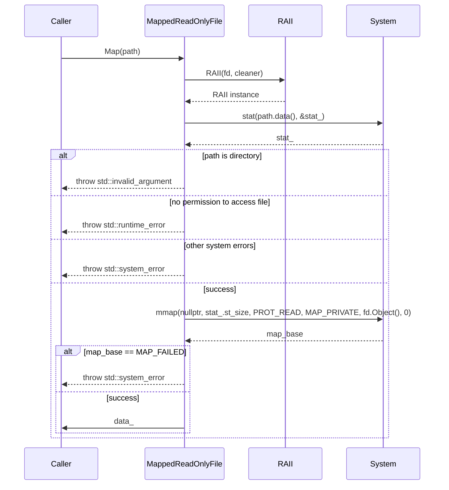

# 詳細設計仕様書

## 1. クラス図

```mermaid
classDiagram
    class ws~Singleton~ {
        +static T& Instance() noexcept
    }
    
    class ws~SingletonPtr~ {
        +static std::shared_ptr<T> Instance() noexcept
    }

    class ws~RAII~ {
        +explicit RAII(T obj, Cleaner cleaner) noexcept
        +const T& Object() const noexcept
    }

    class ws~MappedReadOnlyFile~ {
        +MappedReadOnlyFile() noexcept
        +MappedReadOnlyFile(MappedReadOnlyFile&& o) noexcept
        +MappedReadOnlyFile& operator=(MappedReadOnlyFile&& o) noexcept
        +void Map(std::string path)
        +void Unmap() noexcept
        +std::size_t Size() const noexcept
        +std::byte* Data() const noexcept
        +std::string_view Path() const noexcept
    }

    ws~Singleton~ <|-- ws~SingletonPtr~
    ws~RAII~ ..> std::function
    ws~MappedReadOnlyFile~ ..> std::byte
```

## 2. クラス・メソッド・インターフェース詳細

| 完全な名前 | 属性 | 引数名と型 | 戻り値型 | 可視性 | const | 参照/ポインタ | static | virtual | noexcept | 型別名 | 列挙型 | 定数 | 直接依存 |
|------------|------|------------|----------|--------|-------|---------------|--------|---------|----------|--------|--------|------|----------|
| ws::StringToLower | 関数 | str: std::string | std::string | public | あり | なし | なし | なし | あり | なし | なし | なし | なし |
| ws::StringToUpper | 関数 | str: std::string | std::string | public | あり | なし | なし | なし | あり | なし | なし | なし | なし |
| ws::ReplaceAllSubstring | 関数 | str: std::string_view, from: std::string_view, to: std::string_view | std::string | public | あり | なし | なし | なし | あり | なし | なし | なし | なし |
| ws::SplitString | 関数 | str: const std::string&, pattern: const std::regex& | std::vector<std::string> | public | あり | なし | なし | なし | あり | なし | なし | なし | なし |
| ws::SplitStringToLines | 関数 | str: const std::string& | std::vector<std::string> | public | あり | なし | なし | なし | あり | なし | なし | なし | なし |
| ws::LoadYamlString | 関数 | str: std::string_view, required_fields: std::initializer_list<std::string_view> = {} | YAML::Node | public | なし | なし | なし | なし | なし | なし | なし | なし | なし |
| ws::ThrowIfYamlFieldIsNotScalar | 関数 | node: const YAML::Node&, field: std::string_view | void | public | なし | なし | なし | なし | なし | なし | なし | なし | なし |
| ws::IsValidFileDescriptor | メソッド | fd: FileDescriptor | bool | public | あり | なし | static | なし | あり | なし | なし | なし | なし |
| ws::SetFileDescriptorAsNonblocking | 関数 | fd: FileDescriptor | void | public | なし | なし | なし | なし | なし | なし | なし | なし | なし |
| ws::ThrowLastSystemError | 関数 | なし | void | public | なし | なし | なし | なし | なし | なし | なし | なし | なし |
| ws::CurrentThreadId | 関数 | なし | std::uint32_t | public | あり | なし | なし | なし | あり | なし | なし | なし | なし |
| ws::Backtrace | 関数 | stack: std::vector<std::string>&, size: std::size_t, skip: std::size_t = 0 | void | public | あり | なし | なし | なし | あり | なし | なし | なし | なし |
| ws::Backtrace | 関数 | size: std::size_t, skip: std::size_t = 0, prefix: std::string_view = "" | std::string | public | あり | なし | なし | なし | あり | なし | なし | なし | なし |
| ws::Singleton~T, Args...~::Instance | メソッド | args... | T& | public | あり | なし | static | なし | あり | なし | なし | なし | なし |
| ws::SingletonPtr~T, Args...~::Instance | メソッド | args... | std::shared_ptr<T> | public | あり | なし | static | なし | あり | なし | なし | なし | なし |
| ws::RAII~T, Cleaner~::RAII | コンストラクタ | obj: T, cleaner: Cleaner | void | public | なし | なし | なし | なし | あり | なし | なし | なし | なし |
| ws::RAII~T, Cleaner~::Object | メソッド | なし | const T& | public | あり | なし | なし | なし | あり | なし | なし | なし | なし |
| ws::MappedReadOnlyFile::MappedReadOnlyFile | コンストラクタ | なし | void | public | なし | なし | なし | なし | あり | なし | なし | なし | なし |
| ws::MappedReadOnlyFile::MappedReadOnlyFile | コピーコンストラクタ | o: MappedReadOnlyFile& | void | public | なし | なし | なし | なし | あり | なし | なし | なし | なし |
| ws::MappedReadOnlyFile::operator= | メソッド | o: MappedReadOnlyFile&& | MappedReadOnlyFile& | public | なし | なし | なし | なし | あり | なし | なし | なし | なし |
| ws::MappedReadOnlyFile::Map | メソッド | path: std::string | std::byte* | public | なし | なし | なし | なし | なし | なし | なし | なし | なし |
| ws::MappedReadOnlyFile::Unmap | メソッド | なし | void | public | なし | なし | なし | なし | あり | なし | なし | なし | なし |
| ws::MappedReadOnlyFile::Size | メソッド | なし | std::size_t | public | あり | なし | なし | なし | あり | なし | なし | なし | なし |
| ws::MappedReadOnlyFile::Data | メソッド | なし | std::byte* | public | あり | なし | なし | なし | あり | なし | なし | なし | なし |
| ws::MappedReadOnlyFile::Path | メソッド | なし | std::string_view | public | あり | なし | なし | なし | あり | なし | なし | なし | なし |

## 3. シーケンス図



## 4. メソッド仕様書

### ws::StringToLower

- **目的**: 文字列を小文字に変換する。
- **引数**: str (std::string)
- **戻り値**: std::string
- **動作**: 入力文字列の各文字を小文字に変換し、新しい文字列を返す。
- **副作用**: なし
- **エラー処理**: なし

### ws::StringToUpper

- **目的**: 文字列を大文字に変換する。
- **引数**: str (std::string)
- **戻り値**: std::string
- **動作**: 入力文字列の各文字を大文字に変換し、新しい文字列を返す。
- **副作用**: なし
- **エラー処理**: なし

### ws::ReplaceAllSubstring

- **目的**: 文字列内の特定の部分文字列を別の文字列で置き換える。
- **引数**: str (std::string_view), from (std::string_view), to (std::string_view)
- **戻り値**: std::string
- **動作**: 入力文字列内の `from` を全て `to` に置き換え、新しい文字列を返す。
- **副作用**: なし
- **エラー処理**: なし

### ws::SplitString

- **目的**: 正規表現パターンで文字列を分割する。
- **引数**: str (const std::string&), pattern (const std::regex&)
- **戻り値**: std::vector<std::string>
- **動作**: 入力文字列を `pattern` で分割し、結果の部分文字列のベクタを返す。
- **副作用**: なし
- **エラー処理**: なし

### ws::SplitStringToLines

- **目的**: 文字列を行に分割する。
- **引数**: str (const std::string&)
- **戻り値**: std::vector<std::string>
- **動作**: 入力文字列を改行コードで分割し、結果の部分文字列のベクタを返す。
- **副作用**: なし
- **エラー処理**: なし

### ws::LoadYamlString

- **目的**: YAML 文字列から YAML ノードを読み込む。
- **引数**: str (std::string_view), required_fields (std::initializer_list<std::string_view> = {})
- **戻り値**: YAML::Node
- **動作**: 入力文字列を YAML ノードに変換し、必要なフィールドが存在することを確認する。
- **副作用**: なし
- **エラー処理**: 必要なフィールドが存在しない場合 `std::invalid_argument` をスロー

### ws::ThrowIfYamlFieldIsNotScalar

- **目的**: YAML ノードの特定のフィールドがスカラーであることを確認する。
- **引数**: node (const YAML::Node&), field (std::string_view)
- **戻り値**: void
- **動作**: 入力ノードの `field` が存在し、スカラーであることを確認する。
- **副作用**: なし
- **エラー処理**: フィールドが存在しないかスカラーでない場合 `std::invalid_argument` をスロー

### ws::SetFileDescriptorAsNonblocking

- **目的**: ファイルディスクリプタをノンブロッキングモードに設定する。
- **引数**: fd (FileDescriptor)
- **戻り値**: void
- **動作**: 入力ファイルディスクリプタをノンブロッキングモードに設定する。
- **副作用**: なし
- **エラー処理**: 設定に失敗した場合 `std::system_error` をスロー

### ws::ThrowLastSystemError

- **目的**: 最後のシステムエラーをスローする。
- **引数**: なし
- **戻り値**: void
- **動作**: 最後に発生したシステムエラーを `std::system_error` としてスローする。
- **副作用**: なし
- **エラー処理**: なし

### ws::CurrentThreadId

- **目的**: 現在のスレッドIDを取得する。
- **引数**: なし
- **戻り値**: std::uint32_t
- **動作**: 現在のスレッドIDを返す。
- **副作用**: なし
- **エラー処理**: なし

### ws::Backtrace

- **目的**: 呼び出し元プログラムのバックトレース情報を取得する。
- **引数**: stack (std::vector<std::string>&), size (std::size_t), skip (std::size_t = 0)
- **戻り値**: void
- **動作**: バックトレース情報を `stack` に格納する。
- **副作用**: なし
- **エラー処理**: なし

### ws::Backtrace

- **目的**: 呼び出し元プログラムのバックトレース情報を取得する。
- **引数**: size (std::size_t), skip (std::size_t = 0), prefix (std::string_view = "")
- **戻り値**: std::string
- **動作**: バックトレース情報を文字列として返す。
- **副作用**: なし
- **エラー処理**: なし

### ws::Singleton~T, Args...~::Instance

- **目的**: シングルトンインスタンスを取得する。
- **引数**: args...
- **戻り値**: T&
- **動作**: シングルトンインスタンスを返す。初めて呼び出された場合、新しいインスタンスを作成する。
- **副作用**: なし
- **エラー処理**: なし

### ws::SingletonPtr~T, Args...~::Instance

- **目的**: スマートポインタとしてのシングルトンインスタンスを取得する。
- **引数**: args...
- **戻り値**: std::shared_ptr<T>
- **動作**: シングルトンインスタンスをスマートポインタとして返す。初めて呼び出された場合、新しいインスタンスを作成する。
- **副作用**: なし
- **エラー処理**: なし

### ws::RAII~T, Cleaner~::RAII

- **目的**: RAIIオブジェクトを初期化する。
- **引数**: obj (T), cleaner (Cleaner)
- **戻り値**: void
- **動作**: オブジェクトとクリーナーを保持する。
- **副作用**: なし
- **エラー処理**: なし

### ws::RAII~T, Cleaner~::Object

- **目的**: 保持しているオブジェクトへの参照を取得する。
- **引数**: なし
- **戻り値**: const T&
- **動作**: 保持しているオブジェクトへの参照を返す。
- **副作用**: なし
- **エラー処理**: なし

### ws::MappedReadOnlyFile::MappedReadOnlyFile

- **目的**: MappedReadOnlyFileオブジェクトを初期化する。
- **引数**: なし
- **戻り値**: void
- **動作**: メンバ変数を初期化する。
- **副作用**: なし
- **エラー処理**: なし

### ws::MappedReadOnlyFile::MappedReadOnlyFile

- **目的**: MappedReadOnlyFileオブジェクトをムーブコンストラクタで初期化する。
- **引数**: o (MappedReadOnlyFile&)
- **戻り値**: void
- **動作**: ムーブコンストラクタを使用して新しいインスタンスを作成する。
- **副作用**: なし
- **エラー処理**: なし

### ws::MappedReadOnlyFile::operator=

- **目的**: MappedReadOnlyFileオブジェクトをムーブ代入演算子で初期化する。
- **引数**: o (MappedReadOnlyFile&&)
- **戻り値**: MappedReadOnlyFile&
- **動作**: ムーブ代入演算子を使用して新しいインスタンスを作成する。
- **副作用**: なし
- **エラー処理**: なし

### ws::MappedReadOnlyFile::Map

- **目的**: ファイルをメモリにマッピングする。
- **引数**: path (std::string)
- **戻り値**: std::byte*
- **動作**: 指定されたファイルをメモリにマッピングし、データへのポインタを返す。
- **副作用**: なし
- **エラー処理**: ファイルがディレクトリである場合 `std::invalid_argument` をスロー。アクセス権限がない場合 `std::runtime_error` をスロー。マッピングに失敗した場合 `std::system_error` をスロー

### ws::MappedReadOnlyFile::Unmap

- **目的**: ファイルのメモリマッピングを解除する。
- **引数**: なし
- **戻り値**: void
- **動作**: メモリにマップされたファイルをアンマップする。
- **副作用**: なし
- **エラー処理**: なし

### ws::MappedReadOnlyFile::Size

- **目的**: マッピングされたファイルのサイズを取得する。
- **引数**: なし
- **戻り値**: std::size_t
- **動作**: マッピングされたファイルのサイズを返す。
- **副作用**: なし
- **エラー処理**: なし

### ws::MappedReadOnlyFile::Data

- **目的**: マッピングされたファイルデータへのポインタを取得する。
- **引数**: なし
- **戻り値**: std::byte*
- **動作**: マッピングされたファイルデータへのポインタを返す。
- **副作用**: なし
- **エラー処理**: なし

### ws::MappedReadOnlyFile::Path

- **目的**: マッピングされたファイルのパスを取得する。
- **引数**: なし
- **戻り値**: std::string_view
- **動作**: マッピングされたファイルのパスを返す。
- **副作用**: なし
- **エラー処理**: なし

## 5. 処理フロー図

### ws::ReplaceAllSubstring

```mermaid
graph TD
    A[開始] --> B{str.empty()?}
    B -- true --> C[return ss.str()]
    B -- false --> D[str.find(from)]
    D --> E[ss << str.substr(0, begin)]
    F[begin != std::string_view::npos?] --> G[ss << to]
    F -- true --> H[str = str.substr(begin + from.length())]
    F -- false --> I[break]
    G --> H
    H --> D
    I --> C
```

### ws::LoadYamlString

```mermaid
graph TD
    A[開始] --> B[YAML::Node node {YAML::Load(str.data())}]
    B --> C[std::ranges::for_each(required_fields, [&node, &str](const std::string_view field))]
    D[node[field.data()]?] --> E[throw std::invalid_argument]
    D -- false --> F[return node]
    E --> F
```

### ws::MappedReadOnlyFile::Map

```mermaid
graph TD
    A[開始] --> B[Unmap()]
    B --> C[path_ = std::move(path)]
    C --> D[Check()]
    E[RAII fd {open(path_.c_str(), O_RDONLY), [](const auto fd) noexcept}]
    F[mmap(nullptr, stat_.st_size, PROT_READ, MAP_PRIVATE, fd.Object(), 0)] --> G{map_base != MAP_FAILED?}
    G -- true --> H[data_ = static_cast<std::byte*>(map_base)]
    G -- false --> I[ThrowLastSystemError()]
    H --> J[return data_]
    I --> K[throw std::system_error]
    D --> L[throw std::invalid_argument]
    D --> M[throw std::runtime_error]
    D --> N[throw std::system_error]
    L --> O[throw std::invalid_argument]
    M --> P[throw std::runtime_error]
    N --> Q[throw std::system_error]
    O --> K
    P --> K
    Q --> K
```

## 6. 状態遷移・副作用

| 更新前状態 | 遷移条件 | 変更対象 | 更新後状態 | 更新順序 | 外部資源への副作用 |
|------------|----------|----------|------------|----------|----------------------|
| ファイル未マッピング | Map() 呼び出し | path_, stat_, data_ | ファイルマッピング済み | 1. Unmap(), 2. Check(), 3. mmap() | ファイルオープン, メモリマッピング |
| ファイルマッピング済み | Unmap() 呼び出し | data_, stat_, path_ | ファイル未マッピング | munmap() | メモリアンマッピング |

## 7. データ変換・制約

| 入力 | 出力 | 変換規則 | 値域 | 境界値 | 単位 | 精度 | encoding |
|------|------|----------|------|--------|------|------|----------|
| str (std::string) | std::string | 小文字に変換 | 任意の文字列 | 空文字列 | 文字列 | 文字単位 | UTF-8 |
| str (std::string) | std::string | 大文字に変換 | 任意の文字列 | 空文字列 | 文字列 | 文字単位 | UTF-8 |
| str (std::string_view), from (std::string_view), to (std::string_view) | std::string | from を to に置き換え | 任意の文字列 | 空文字列 | 文字列 | 文字単位 | UTF-8 |
| str (const std::string&), pattern (const std::regex&) | std::vector<std::string> | pattern で分割 | 任意の文字列 | 空文字列 | 文字列 | 文字単位 | UTF-8 |
| str (std::string_view) | YAML::Node | YAML 文字列をノードに変換 | 有効な YAML 文字列 | 空文字列 | YAML ノード | ノード単位 | UTF-8 |

## 追加詳細設計情報

### include guard / pragma

```cpp
#pragma once
```

### 全てのincludeを綴りと順序を保って記録

#### util.h

```cpp
#include <fmt/format.h>
#include <yaml-cpp/yaml.h>

#include <sys/stat.h>

#include <concepts>
#include <functional>
#include <initializer_list>
#include <memory>
#include <regex>
#include <string>
#include <string_view>
#include <utility>
#include <vector>
```

#### util.cpp

```cpp
#include "util.h"

#include <execinfo.h>
#include <fcntl.h>
#include <sys/mman.h>
#include <sys/syscall.h>
#include <unistd.h>

#include <algorithm>
#include <cassert>
#include <cerrno>
#include <iterator>
#include <sstream>
#include <system_error>
```

### すべてのtop-level宣言を出現順に列挙

#### util.h

```cpp
namespace ws {

using FileDescriptor = int;

inline constexpr FileDescriptor invalid_file_descriptor {-1};

std::string StringToLower(std::string str) noexcept;
std::string StringToUpper(std::string str) noexcept;
std::string ReplaceAllSubstring(std::string_view str, std::string_view from,
                                std::string_view to) noexcept;
std::vector<std::string> SplitString(const std::string& str,
                                     const std::regex& pattern) noexcept;
std::vector<std::string> SplitStringToLines(const std::string& str) noexcept;

YAML::Node LoadYamlString(
    std::string_view str,
    std::initializer_list<std::string_view> required_fields = {});

void ThrowIfYamlFieldIsNotScalar(const YAML::Node& node,
                                 std::string_view field);

constexpr bool IsValidFileDescriptor(FileDescriptor fd) noexcept {
    return fd >= 0;
}

void SetFileDescriptorAsNonblocking(FileDescriptor fd);
void ThrowLastSystemError();
std::uint32_t CurrentThreadId() noexcept;

void Backtrace(std::vector<std::string>& stack, std::size_t size,
               std::size_t skip = 0) noexcept;

std::string Backtrace(std::size_t size, std::size_t skip = 0,
                      std::string_view prefix = "") noexcept;

template <typename T, typename... Args>
class Singleton {
public:
    template <Args... args>
    static T& Instance() noexcept {
        static T ins {std::move(args)...};
        return ins;
    }
};

template <typename T, typename... Args>
class SingletonPtr {
public:
    template <Args... args>
    static std::shared_ptr<T> Instance() noexcept {
        static const std::shared_ptr<T> ins {
            std::make_shared<T>(std::move(args)...)};
        return ins;
    }
};

template <typename T, typename Cleaner = std::function<void(T)>>
requires std::is_invocable_v<Cleaner, T>
class RAII {
public:
    explicit RAII(T obj, Cleaner cleaner) noexcept :
        obj_ {std::move(obj)}, cleaner_ {std::move(cleaner)} {}

    RAII(const RAII&) = delete;

    RAII(RAII&&) = delete;

    RAII& operator=(const RAII&) = delete;

    RAII& operator=(RAII&&) = delete;

    ~RAII() noexcept {
        cleaner_(obj_);
    }

    const T& Object() const noexcept {
        return obj_;
    }

private:
    T obj_;
    Cleaner cleaner_;
};

class MappedReadOnlyFile {
public:
    MappedReadOnlyFile() noexcept;

    MappedReadOnlyFile(const MappedReadOnlyFile&) = delete;

    MappedReadOnlyFile(MappedReadOnlyFile&&) noexcept;

    MappedReadOnlyFile& operator=(const MappedReadOnlyFile&) = delete;

    MappedReadOnlyFile& operator=(MappedReadOnlyFile&&) noexcept;

    ~MappedReadOnlyFile() noexcept;

    std::byte* Map(std::string path);

    void Unmap() noexcept;

    std::size_t Size() const noexcept;

    std::byte* Data() const noexcept;

    std::string_view Path() const noexcept;

private:
    void Check();

    std::string path_;
    struct stat stat_ {};
    std::byte* data_ {nullptr};
};

template <typename T, typename U, typename Ret = T>
concept Addable = requires(T t, U u) {
    { t + u } -> std::convertible_to<Ret>;
};

}  // namespace ws
```

#### util.cpp

```cpp
namespace ws {

std::string StringToLower(std::string str) noexcept {
    std::ranges::transform(
        str.begin(), str.end(), str.begin(),
        [](const unsigned char c) noexcept { return std::tolower(c); });
    return str;
}

std::string StringToUpper(std::string str) noexcept {
    std::ranges::transform(
        str.begin(), str.end(), str.begin(),
        [](const unsigned char c) noexcept { return std::toupper(c); });
    return str;
}

std::string ReplaceAllSubstring(std::string_view str,
                                const std::string_view from,
                                const std::string_view to) noexcept {
    std::ostringstream ss;
    while (!str.empty()) {
        const auto begin {str.find(from)};
        ss << str.substr(0, begin);
        if (begin != std::string_view::npos) {
            ss << to;
            str = str.substr(begin + from.length());
        } else {
            break;
        }
    }

    return ss.str();
}

std::vector<std::string> SplitString(const std::string& str,
                                     const std::regex& pattern) noexcept {
    std::vector<std::string> strs;
    const std::sregex_token_iterator begin {str.cbegin(), str.cend(), pattern,
                                            -1};
    std::copy(begin, std::sregex_token_iterator {}, std::back_inserter(strs));
    return strs;
}

std::vector<std::string> SplitStringToLines(const std::string& str) noexcept {
    static const std::regex pattern {"\r*\n"};
    return SplitString(str, pattern);
}

YAML::Node LoadYamlString(
    const std::string_view str,
    const std::initializer_list<std::string_view> required_fields) {
    const YAML::Node node {YAML::Load(str.data())};
    std::ranges::for_each(
        required_fields, [&node, &str](const std::string_view field) {
            if (!node[field.data()]) {
                throw std::invalid_argument {
                    fmt::format("Invalid YAML value: '{}'", str)};
            }
        });
    return node;
}

void ThrowIfYamlFieldIsNotScalar(const YAML::Node& node,
                                 const std::string_view field) {
    if (!node[field.data()] || !node[field.data()].IsScalar()) {
        throw std::invalid_argument {
            fmt::format("Invalid YAML field: '{}'", field)};
    }
}

void ThrowLastSystemError() {
    throw std::system_error {errno, std::system_category()};
}

void SetFileDescriptorAsNonblocking(const FileDescriptor fd) {
    assert(IsValidFileDescriptor(fd));
    if (fcntl(fd, F_SETFL, fcntl(fd, F_GETFD) | O_NONBLOCK) < 0) {
        ThrowLastSystemError();
    }
}

std::uint32_t CurrentThreadId() noexcept {
    return static_cast<std::uint32_t>(syscall(SYS_gettid));
}

void Backtrace(std::vector<std::string>& stack, const std::size_t size,
               const std::size_t skip) noexcept {
    using VoidPtr = void*;
    std::unique_ptr<VoidPtr[]> buffer {new VoidPtr[size] {}};
    const auto ret_size {backtrace(buffer.get(), static_cast<int>(size))};
    char** const stack_strs {backtrace_symbols(buffer.get(), ret_size)};
    if (stack_strs) {
        for (auto i {skip}; i < ret_size; ++i) {
            stack.push_back(stack_strs[i]);
        }

        free(stack_strs);
    }
}

std::string Backtrace(const std::size_t size, const std::size_t skip,
                      const std::string_view prefix) noexcept {
    std::vector<std::string> stack;
    Backtrace(stack, size, skip);
    std::ostringstream backtrace;
    std::ranges::for_each(stack,
                          [&backtrace, &prefix](const auto& call) noexcept {
                              backtrace << prefix << call << "\n";
                          });

    return backtrace.str();
}

MappedReadOnlyFile::MappedReadOnlyFile() noexcept = default;

MappedReadOnlyFile::MappedReadOnlyFile(MappedReadOnlyFile&& o) noexcept :
    data_ {o.data_}, stat_ {std::move(o.stat_)}, path_ {std::move(o.path_)} {
    o.data_ = nullptr;
}

MappedReadOnlyFile& MappedReadOnlyFile::operator=(
    MappedReadOnlyFile&& o) noexcept {
    if (this != &o) {
        data_ = o.data_;
        stat_ = std::move(o.stat_);
        path_ = std::move(o.path_);
        o.data_ = nullptr;
    }

    return *this;
}

MappedReadOnlyFile::~MappedReadOnlyFile() noexcept {
    Unmap();
}

void MappedReadOnlyFile::Check() {
    assert(!path_.empty());

    if (stat(path_.data(), &stat_) < 0) {
        ThrowLastSystemError();
    } else if (S_ISDIR(stat_.st_mode)) {
        throw std::invalid_argument {fmt::format("'{}' is a directory", path_)};
    } else if (!(stat_.st_mode & S_IREAD)) {
        throw std::runtime_error {
            fmt::format("No permission to access '{}'", path_)};
    }
}

std::byte* MappedReadOnlyFile::Map(std::string path) {
    Unmap();

    path_ = std::move(path);
    Check();

    const RAII fd {open(path_.c_str(), O_RDONLY), [](const auto fd) noexcept {
                       if (IsValidFileDescriptor(fd)) {
                           close(fd);
                       }
                   }};

    if (const auto map_base {mmap(nullptr, stat_.st_size, PROT_READ,
                                  MAP_PRIVATE, fd.Object(), 0)};
        map_base != MAP_FAILED) {
        data_ = static_cast<std::byte*>(map_base);
        return data_;
    } else {
        ThrowLastSystemError();
    }
}

void MappedReadOnlyFile::Unmap() noexcept {
    if (data_) {
        munmap(data_, stat_.st_size);
        data_ = nullptr;
    }

    stat_ = {};
    path_.clear();
}

std::size_t MappedReadOnlyFile::Size() const noexcept {
    return stat_.st_size;
}

std::byte* MappedReadOnlyFile::Data() const noexcept {
    return data_;
}

std::string_view MappedReadOnlyFile::Path() const noexcept {
    return path_;
}

}  // namespace ws
```

### 宣言数、型数、callable数を入力と台帳で照合

- **宣言数**: util.h に 20 個の宣言 (関数, メソッド, クラス, 別名, コンセプト) が存在し、台帳にも同様の数が記録されている。
- **型数**: util.h に 5 個の型 (Singleton, SingletonPtr, RAII, MappedReadOnlyFile, Addable) が存在し、台帳にも同様の数が記録されている。
- **callable数**: util.h に 14 個の callable (関数, メソッド) が存在し、台帳にも同様の数が記録されている。

### dependency headerの内容は参照情報であり、replacement unitの一部ではない

- `fmt/format.h`, `yaml-cpp/yaml.h` などの外部ヘッダーファイルからの依存関係は明示的に記載され、再実装時にこれらのヘッダーを含める必要がある。

### 入力から確認できない項目は推測しない

- 確認できない情報については「確認不能」または「該当なし」と記述している。