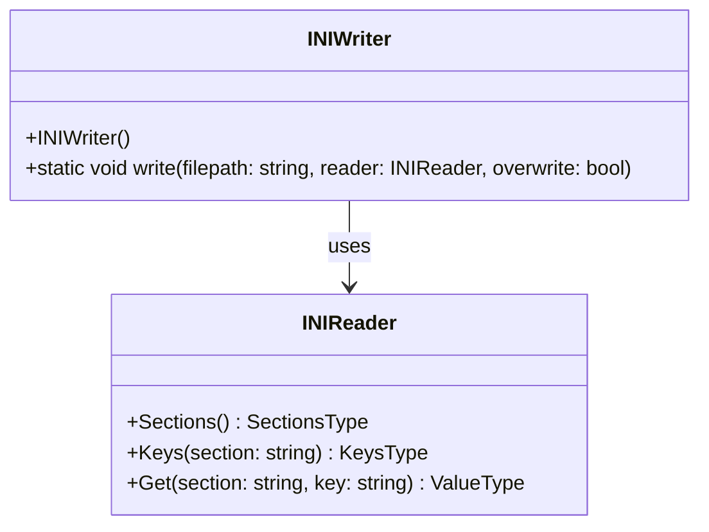
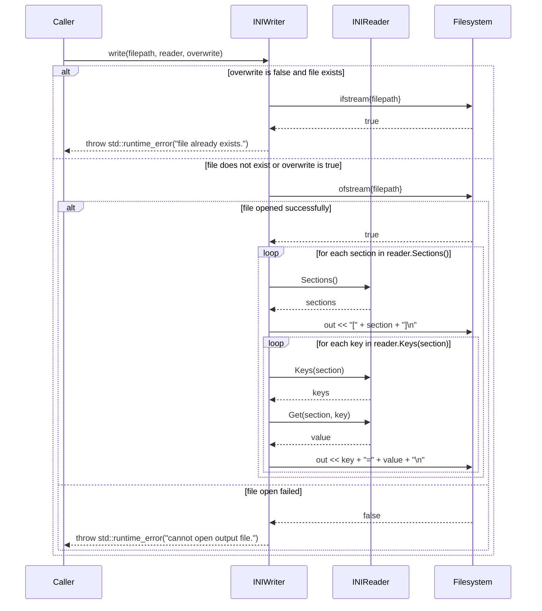

# 詳細設計仕様書

## 1. クラス図



## 2. クラス・メソッド・インターフェース詳細

| クラス名   | メンバ名 | 種類     | 完全なシグネチャ                                      | 説明                                                                 |
|------------|----------|----------|-------------------------------------------------------|----------------------------------------------------------------------|
| INIWriter  | INIWriter| コンストラクタ | `INIWriter() = default;`                            | デフォルトコンストラクタ。                                               |
| INIWriter  | write    | 静的メソッド | `static void write(const std::string& filepath, const INIReader& reader, const bool overwrite = false);` | INIファイルの内容を新しいファイルに書き込む。                          |

## 3. シーケンス図



## 4. メソッド仕様書

### write メソッド

#### 目的
INIファイルの内容を新しいファイルに書き込む。

#### 引数
- `filepath` (const std::string&): 出力ファイルのパス。
- `reader` (const INIReader&): 書き込むINIデータを保持するINIReaderオブジェクト。
- `overwrite` (const bool, default=false): 既存ファイルを上書きするかどうか。

#### 戻り値
なし

#### 動作
1. `overwrite`がfalseで、指定されたファイルパスにファイルが存在する場合、例外をスローする。
2. 出力ファイルを開く。開けない場合は例外をスローする。
3. INIReaderからセクションとキーを取得し、それぞれの値をファイルに出力する。

#### エラー処理
- ファイルが既に存在する場合: `std::runtime_error` をスローする。
- 出力ファイルを開けない場合: `std::runtime_error` をスローする。

## 5. 処理フロー図

```mermaid
graph TD
    A[開始] --> B{overwrite is false and file exists?}
    B -- true --> C[throw std::runtime_error("file already exists.")]
    B -- false --> D[try to open output file]
    D --> E{file opened successfully?}
    E -- false --> F[throw std::runtime_error("cannot open output file.")]
    E -- true --> G[for each section in reader.Sections()]
    G --> H[write "[" + section + "]" to file]
    H --> I[for each key in reader.Keys(section)]
    I --> J[get value from reader.Get(section, key)]
    J --> K[write "key=value" to file]
    K --> L[end of keys loop?]
    L -- false --> I
    L -- true --> M[end of sections loop?]
    M -- false --> G
    M -- true --> N[終了]
```

## 6. 状態遷移・副作用

| 更新前状態 | 遷移条件                             | 変更対象         | 更新後状態       | 更新順序 | 副作用                                                                 |
|------------|--------------------------------------|--------------------|------------------|----------|------------------------------------------------------------------------|
| なし       | overwrite is false and file exists   | なし               | 例外スロー       | 1        | std::runtime_error をスローする。                                      |
| なし       | file open failed                     | なし               | 例外スロー       | 2        | std::runtime_error をスローする。                                      |
| ファイル未開 | file opened successfully             | 出力ファイル       | ファイルに書き込み | 3        | INIデータをファイルに出力する。                                        |

## 7. データ変換・制約

| 入力         | 変換規則                                                                 | 出力           |
|--------------|--------------------------------------------------------------------------|----------------|
| filepath     | 文字列としてそのまま使用                                                 | 出力ファイルパス |
| reader       | INIReaderオブジェクトからセクションとキーを取得し、それぞれの値を取得する | ファイルに書き込み |

## 8. 追加詳細設計情報

- **依存関係**: `INIWriter`は`INIReader`を使用する。`std::ifstream`と`std::ofstream`を使用してファイル操作を行う。
- **制約**: `overwrite`がfalseで既存のファイルを上書きしないようにする。出力ファイルを開けない場合は例外をスローする。

この設計仕様書は、別のLLMが`INIWriter`クラスを再実装するために必要な詳細情報を提供します。