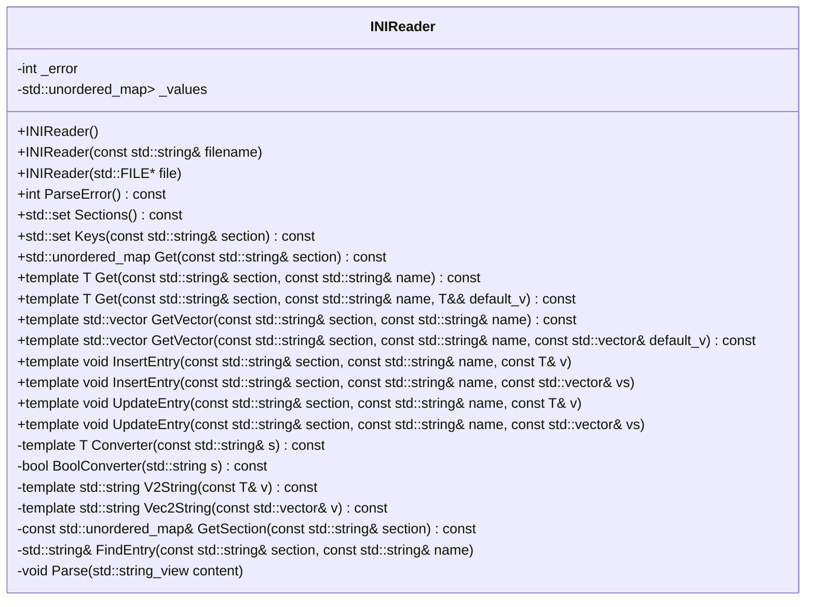
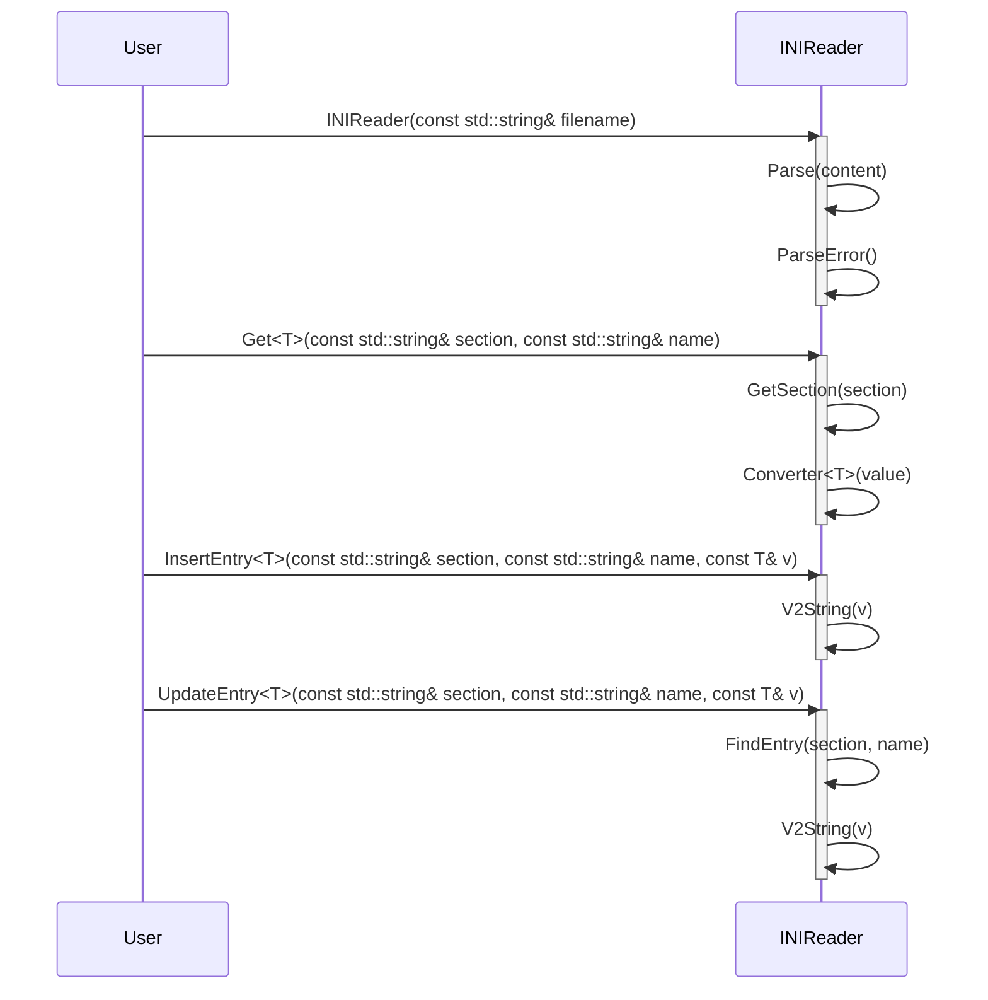

# 詳細設計仕様書: INIReader クラス

## 目的
この設計仕様書は、`INIReader`クラスの再実装に必要な詳細情報を提供します。元コードから確認できる事実のみを基に記述し、推測や一般化を行いません。

## クラス図


## クラス・メソッド・インターフェース詳細

| 完全な名前 | 属性 | 引数名と型 | 戻り値型 | 可視性 | const | 参照/ポインタ | static | virtual | noexcept |
|------------|------|------------|----------|--------|-------|---------------|--------|---------|----------|
| INIReader::INIReader() | コンストラクタ | - | void | public | false | - | false | false | false |
| INIReader::INIReader(const std::string& filename) | コンストラクタ | filename | void | public | false | 参照 | false | false | false |
| INIReader::INIReader(std::FILE* file) | コンストラクタ | file | void | public | false | ポインタ | false | false | false |
| INIReader::ParseError() const | メソッド | - | int | public | true | - | false | false | false |
| INIReader::Sections() const | メソッド | - | std::set<std::string> | public | true | - | false | false | false |
| INIReader::Keys(const std::string& section) const | メソッド | section | std::set<std::string> | public | true | 参照 | false | false | false |
| INIReader::Get(const std::string& section) const | メソッド | section | std::unordered_map<std::string, std::string> | public | true | 参照 | false | false | false |
| INIReader::Get<T>(const std::string& section, const std::string& name) const | テンプレートメソッド | section, name | T | public | true | 参照 | false | false | false |
| INIReader::Get<T>(const std::string& section, const std::string& name, T&& default_v) const | テンプレートメソッド | section, name, default_v | T | public | true | 参照, rvalue参照 | false | false | false |
| INIReader::GetVector<T>(const std::string& section, const std::string& name) const | テンプレートメソッド | section, name | std::vector<T> | public | true | 参照 | false | false | false |
| INIReader::GetVector<T>(const std::string& section, const std::string& name, const std::vector<T>& default_v) const | テンプレートメソッド | section, name, default_v | std::vector<T> | public | true | 参照 | false | false | false |
| INIReader::InsertEntry<T>(const std::string& section, const std::string& name, const T& v) | テンプレートメソッド | section, name, v | void | public | false | 参照 | false | false | false |
| INIReader::InsertEntry<T>(const std::string& section, const std::string& name, const std::vector<T>& vs) | テンプレートメソッド | section, name, vs | void | public | false | 参照 | false | false | false |
| INIReader::UpdateEntry<T>(const std::string& section, const std::string& name, const T& v) | テンプレートメソッド | section, name, v | void | public | false | 参照 | false | false | false |
| INIReader::UpdateEntry<T>(const std::string& section, const std::string& name, const std::vector<T>& vs) | テンプレートメソッド | section, name, vs | void | public | false | 参照 | false | false | false |
| INIReader::_error | メンバ変数 | - | int | private | false | - | false | false | false |
| INIReader::_values | メンバ変数 | - | std::unordered_map<std::string, std::unordered_map<std::string, std::string>> | private | false | - | false | false | false |

## シーケンス図


## メソッド仕様書

### `INIReader::ParseError() const`
- **目的**: 解析結果を返す。
- **引数**: なし
- **戻り値**: int (0 on success, -1 on file open error, otherwise the number of the first faulty line)
- **動作**: `_error`の値に応じて例外を投げる。
- **副作用**: なし
- **エラー処理**: `_error`が-1の場合、"ini file not found."というメッセージで例外を投げる。-2の場合、"memory alloc error"というメッセージで例外を投げる。それ以外の場合は、"parse error on line no: " + 行番号というメッセージで例外を投げる。

### `INIReader::Sections() const`
- **目的**: INIファイル内のセクションリストを返す。
- **引数**: なし
- **戻り値**: std::set<std::string>
- **動作**: `_values`のキーからセクション名を抽出し、std::setに格納して返す。
- **副作用**: なし

### `INIReader::Keys(const std::string& section) const`
- **目的**: 指定したセクション内のキーリストを返す。
- **引数**: section (const std::string&)
- **戻り値**: std::set<std::string>
- **動作**: `_values`から指定されたセクションのキーを抽出し、std::setに格納して返す。
- **副作用**: なし

### `INIReader::Get(const std::string& section) const`
- **目的**: 指定したセクション内の値マップを返す。
- **引数**: section (const std::string&)
- **戻り値**: std::unordered_map<std::string, std::string>
- **動作**: `_values`から指定されたセクションの値マップを返す。
- **副作用**: なし

### `INIReader::Get<T>(const std::string& section, const std::string& name) const`
- **目的**: 指定したセクションとキーに対応する値を取得し、指定された型に変換して返す。
- **引数**: section (const std::string&), name (const std::string&)
- **戻り値**: T
- **動作**: `_values`から指定されたセクションとキーに対応する値を取得し、`Converter<T>`を使用して型変換を行う。
- **副作用**: なし

### `INIReader::GetVector<T>(const std::string& section, const std::string& name) const`
- **目的**: 指定したセクションとキーに対応する値を取得し、スペース区切りの文字列から指定された型のベクトルに変換して返す。
- **引数**: section (const std::string&), name (const std::string&)
- **戻り値**: std::vector<T>
- **動作**: `_values`から指定されたセクションとキーに対応する値を取得し、スペース区切りの文字列からベクトルに変換を行う。
- **副作用**: なし

### `INIReader::InsertEntry<T>(const std::string& section, const std::string& name, const T& v)`
- **目的**: 指定したセクションとキーに対応する値を挿入する。
- **引数**: section (const std::string&), name (const std::string&), v (const T&)
- **戻り値**: void
- **動作**: `_values`に指定されたセクションとキーに対応する値を挿入する。既に同じキーが存在する場合は例外を投げる。
- **副作用**: なし

### `INIReader::UpdateEntry<T>(const std::string& section, const std::string& name, const T& v)`
- **目的**: 指定したセクションとキーに対応する値を更新する。
- **引数**: section (const std::string&), name (const std::string&), v (const T&)
- **戻り値**: void
- **動作**: `_values`に指定されたセクションとキーに対応する値を更新する。該当するキーが存在しない場合は例外を投げる。
- **副作用**: なし

## 処理フロー図
```mermaid
graph TD
    A[INIReader::Parse(content)] --> B{content.empty?}
    B -- true --> C[return]
    B -- false --> D[increment lineno]
    E[find eol] --> F[extract line]
    G[trim line] --> H{line empty or comment?}
    H -- true --> I[continue]
    H -- false --> J{line starts with '['?}
    K[find ']' in section line] --> L{']' found?}
    M[assign section] --> N[set values to nullptr]
    O[parse name and value pair] --> P[trim name and value]
    Q[check comment in value] --> R[remove comment from value]
    S[trim value] --> T{values is nullptr?}
    U[set values to _values[section]] --> V[emplace name and value]
    W[duplicate key?] --> X[throw exception]
    Y[continue parsing] --> E
```

## 状態遷移・副作用

| 更新前状態 | 遷移条件 | 変更対象 | 更新後状態 | 更新順序 | 副作用 |
|------------|----------|----------|------------|----------|--------|
| なし       | コンストラクタ呼び出し | _error, _values | 初期化   | 1        | ファイル読み込み、パース |
| パース中   | 行が空またはコメント | -          | 継続     | 2        | なし     |
| パース中   | セクション行         | section, values | 更新     | 3        | なし     |
| パース中   | 名値ペア行           | _values    | 更新     | 4        | 重複キー検出 |

## データ変換・制約

| 入力データ | 出力データ | 変換規則 | 値域 | 境界値 | 単位 | 精度 | encoding |
|------------|------------|----------|------|--------|------|------|----------|
| filename   | content    | ファイル読み込み | 文字列 | -      | 文字 | -    | UTF-8  |
| file       | content    | ファイル読み込み | 文字列 | -      | 文字 | -    | UTF-8  |
| section, name | value    | _valuesから取得 | 文字列 | -      | 文字 | -    | UTF-8  |
| T          | std::string | V2String         | 文字列 | -      | 文字 | -    | UTF-8  |
| std::vector<T> | std::string | Vec2String   | 文字列 | -      | 文字 | -    | UTF-8  |

## 追加詳細設計情報

### パースルール
- `[section]` 行はセクションを開始する。
- `name = value` や `name : value` の形式で名値ペアが記述される。
- コメントは行頭の `;` または `#`、インラインコメントは `;` で始まる。
- BOM (`\xEF\xBB\xBF`) が存在する場合はスキップされる。

### エラーハンドリング
- ファイルオープンエラー: `_error = -1`
- メモリ確保エラー: `_error = -2`
- パースエラー: `_error` にエラー行番号を設定

### 内部状態管理
- `_values`: セクションとキーに対応する値を保持する。
- `_error`: パース結果を保持する。0は成功、-1はファイルオープンエラー、-2はメモリ確保エラー、それ以外はパースエラーの行番号。

### 依存関係
- `std::ifstream`, `std::FILE*` からファイル読み込みを行う。
- `detail::trim`, `detail::find_char_or_comment`, `detail::rtrim`, `detail::parse_value` を利用する。これらの詳細は確認不能。

## 完全再構築台帳
```cpp
// ini/ini.h

class INIReader {
   public:
    // Empty Constructor
    INIReader() = default;

    /**
     * @brief Construct an INIReader object from a file name
     * @param filename The name of the INI file to parse
     * @throws std::runtime_error if there is an error parsing the INI file
     */
    INIReader(const std::string& filename) {
        std::ifstream in{filename, std::ios::in | std::ios::binary};
        if (!in) {
            _error = -1;
            ParseError();
            return;
        }
        std::string content;
        in.seekg(0, std::ios::end);
        const auto size = in.tellg();
        if (size > 0) {
            content.resize(static_cast<std::size_t>(size));
            in.seekg(0, std::ios::beg);
            in.read(&content[0], size);
        }
        Parse(content);
        ParseError();
    }

    /**
     * @brief Construct an INIReader object from a file pointer
     * @param file A pointer to the INI file to parse
     * @throws std::runtime_error if there is an error parsing the INI file
     */
    INIReader(std::FILE* file) {
        std::string content;
        char buf[1 << 15];
        std::size_t n = 0;
        while ((n = std::fread(buf, 1, sizeof(buf), file)) > 0) {
            content.append(buf, n);
        }
        Parse(content);
        ParseError();
    }

    /**
     * @brief Return the result of the parse, i.e., 0 on success
     * @throws std::runtime_error on file open or parse error
     */
    int ParseError() const {
        switch (_error) {
            case 0:
                break;
            case -1:
                throw std::runtime_error("ini file not found.");
            case -2:
                throw std::runtime_error("memory alloc error");
            default:
                throw std::runtime_error("parse error on line no: " +
                                         std::to_string(_error));
        }
        return 0;
    }

    /**
     * @brief Return the list of sections found in ini file
     * @return The list of sections found in ini file
     */
    std::set<std::string> Sections() const {
        std::set<std::string> retval;
        for (const auto& element : _values) {
            retval.insert(element.first);
        }
        return retval;
    }

    /**
     * @brief Return the list of keys in the given section
     * @param section The section name
     * @return The list of keys in the given section
     */
    std::set<std::string> Keys(const std::string& section) const {
        const auto& sec = GetSection(section);
        std::set<std::string> retval;
        for (const auto& element : sec) {
            retval.insert(element.first);
        }
        return retval;
    }

    /**
     * @brief Get the map representing the values in a section of the INI file
     * @param section The name of the section to retrieve
     * @return The map representing the values in the given section
     * @throws std::runtime_error if the section is not found
     */
    std::unordered_map<std::string, std::string> Get(
        const std::string& section) const {
        return GetSection(section);
    }

    /**
     * @brief Return the value of the given key in the given section
     * @param section The section name
     * @param name The key name
     * @return The value of the given key in the given section
     * @throws std::runtime_error if the section/key is not found or the
     * value cannot be parsed to type T
     */
    template <typename T = std::string>
    T Get(const std::string& section, const std::string& name) const {
        const auto& sec = GetSection(section);
        const auto value = sec.find(name);
        if (value == sec.end()) {
            throw std::runtime_error(
                "key '" + name + "' not found in section '" + section + "'.");
        }

        if constexpr (std::is_same_v<T, std::string>) {
            return value->second;
        } else if constexpr (std::is_same_v<T, bool>) {
            return BoolConverter(value->second);
        } else {
            return Converter<T>(value->second);
        }
    }

    /**
     * @brief Return the value of the given key in the given section, return
     * default if not found
     * @param section The section name
     * @param name The key name
     * @param default_v The default value
     * @return The value of the given key in the given section, return default
     * if not found
     */
    template <typename T>
    T Get(const std::string& section, const std::string& name,
          T&& default_v) const {
        try {
            return Get<T>(section, name);
        } catch (std::runtime_error&) {
            return std::forward<T>(default_v);
        }
    }

    /**
     * @brief Return the value array of the given key in the given section.
     * @param section The section name
     * @param name The key name
     * @return The value array of the given key in the given section.
     *
     * For example:
     * ```ini
     * [section]
     * key = 1 2 3 4
     * ```
     * ```cpp
     * const auto vs = ini.GetVector<int>("section", "key");
     * // vs = {1, 2, 3, 4}
     * ```
     */
    template <typename T = std::string>
    std::vector<T> GetVector(const std::string& section,
                             const std::string& name) const {
        const std::string value = Get(section, name);
        try {
            std::vector<T> vs;
            std::size_t i = 0;
            while (i < value.size()) {
                while (i < value.size() && detail::is_space(value[i])) ++i;
                std::size_t j = i;
                while (j < value.size() && !detail::is_space(value[j])) ++j;
                if (j > i)
                    vs.emplace_back(Converter<T>(value.substr(i, j - i)));
                i = j;
            }
            return vs;
        } catch (std::exception&) {
            throw std::runtime_error("cannot parse value " + value +
                                     " to vector<T>.");
        }
    }

    /**
     * @brief Return the value array of the given key in the given section,
     * return default if not found
     * @param section The section name
     * @param name The key name
     * @param default_v The default value
     * @return The value array of the given key in the given section, return
     * default if not found
     *
     * @see INIReader::GetVector
     */
    template <typename T>
    std::vector<T> GetVector(const std::string& section,
                             const std::string& name,
                             const std::vector<T>& default_v) const {
        try {
            return GetVector<T>(section, name);
        } catch (std::runtime_error&) {
            return default_v;
        }
    }

    /**
     * @brief Insert a key-value pair into the INI file
     * @param section The section name
     * @param name The key name
     * @param v The value to insert
     * @throws std::runtime_error if the key already exists in the section
     */
    template <typename T = std::string>
    void InsertEntry(const std::string& section, const std::string& name,
                     const T& v) {
        if (!_values[section].emplace(name, V2String(v)).second) {
            throw std::runtime_error("duplicate key '" + name +
                                     "' in section '" + section + "'.");
        }
    }

    /**
     * @brief Insert a vector of values into the INI file
     * @param section The section name
     * @param name The key name
     * @param vs The vector of values to insert
     * @throws std::runtime_error if the key already exists in the section
     */
    template <typename T = std::string>
    void InsertEntry(const std::string& section, const std::string& name,
                     const std::vector<T>& vs) {
        if (!_values[section].emplace(name, Vec2String(vs)).second) {
            throw std::runtime_error("duplicate key '" + name +
                                     "' in section '" + section + "'.");
        }
    }

    /**
     * @brief Update a key-value pair in the INI file
     * @param section The section name
     * @param name The key name
     * @param v The new value to set
     * @throws std::runtime_error if the key does not exist in the section
     */
    template <typename T = std::string>
    void UpdateEntry(const std::string& section, const std::string& name,
                     const T& v) {
        FindEntry(section, name) = V2String(v);
    }

    /**
     * @brief Update a vector of values in the INI file
     * @param section The section name
     * @param name The key name
     * @param vs The new vector of values to set
     * @throws std::runtime_error if the key does not exist in the section
     */
    template <typename T = std::string>
    void UpdateEntry(const std::string& section, const std::string& name,
                     const std::vector<T>& vs) {
        FindEntry(section, name) = Vec2String(vs);
    }

   protected:
    /// Parse result: 0 on success, -1 on file open error, otherwise the
    /// number of the first faulty line.
    int _error = 0;
    /// Parsed content, as _values[section][name] = value.
    std::unordered_map<std::string,
                       std::unordered_map<std::string, std::string>>
        _values;

    /// Parse `s` as a `T`; throws std::runtime_error on failure.
    template <typename T>
    T Converter(const std::string& s) const {
        if constexpr (std::is_same_v<T, std::string>) {
            return s;
        } else {
            T v{};
            if (!detail::parse_value(s, v)) {
                throw std::runtime_error("cannot parse value '" + s +
                                         "' to type<T>.");
            }
            return v;
        }
    }

    /// Parse a boolean token: 1/0/true/false/yes/no/on/off, case-insensitive;
    /// throws std::runtime_error on anything else.
    bool BoolConverter(std::string s) const {
        for (char& c : s) {
            if (c >= 'A' && c <= 'Z') c += 'a' - 'A';
        }
        static const std::unordered_map<std::string, bool> s2b{
            {"1", true},  {"true", true},   {"yes", true}, {"on", true},
            {"0", false}, {"false", false}, {"no", false}, {"off", false},
        };
        const auto value = s2b.find(s);
        if (value == s2b.end()) {
            throw std::runtime_error("'" + s +
                                     "' is not a valid boolean value.");
        }
        return value->second;
    }

    /// Serialize a value with operator<<.
    template <typename T>
    std::string V2String(const T& v) const {
        std::ostringstream ss;
        ss << v;
        return ss.str();
    }

    /// Serialize a vector as space-separated values.
    template <typename T>
    std::string Vec2String(const std::vector<T>& v) const {
        std::ostringstream oss;
        for (std::size_t i = 0; i < v.size(); ++i) {
            if (i > 0) oss << ' ';
            oss << v[i];
        }
        return oss.str();
    }

   private:
    const std::unordered_map<std::string, std::string>& GetSection(
        const std::string& section) const {
        const auto sec = _values.find(section);
        if (sec == _values.end()) {
            throw std::runtime_error("section '" + section + "' not found.");
        }
        return sec->second;
    }

    std::string& FindEntry(const std::string& section,
                           const std::string& name) {
        const auto sec = _values.find(section);
        if (sec != _values.end()) {
            const auto value = sec->second.find(name);
            if (value != sec->second.end()) {
                return value->second;
            }
        }
        throw std::runtime_error("key '" + name + "' not exist in section '" +
                                 section + "'.");
    }

    /* Parse the whole ini content. Grammar:
       - `[section]` lines open a section; text after ']' is ignored
       - `name = value` or `name : value` pairs, whitespace-trimmed
       - lines starting with ';' or '#' are comments
       - a ';' preceded by whitespace starts an inline comment
       Records the first faulty line in _error and stops there. Throws on
       duplicate keys. */
    void Parse(std::string_view content) {
        constexpr std::string_view bom{"\xEF\xBB\xBF", 3};
        if (content.substr(0, bom.size()) == bom) {
            content.remove_prefix(bom.size());
        }

        std::string section;
        std::unordered_map<std::string, std::string>* values = nullptr;
        int lineno = 0;
        _error = 0;

        while (!content.empty()) {
            ++lineno;
            const auto eol = content.find('\n');
            const auto line = detail::trim(content.substr(0, eol));
            content.remove_prefix(eol == std::string_view::npos ? content.size()
                                                                : eol + 1);

            if (line.empty() || line.front() == ';' || line.front() == '#') {
                /* Blank line or comment */
            } else if (line.front() == '[') {
                /* A "[section]" line */
                const auto end =
                    detail::find_char_or_comment(line.substr(1), "]");
                if (end != std::string_view::npos && line[end + 1] == ']') {
                    section.assign(line.data() + 1, end);
                    values = nullptr;
                } else {
                    /* No ']' found on section line */
                    _error = lineno;
                    break;
                }
            } else {
                /* Not a comment, must be a name[=:]value pair */
                const auto sep = detail::find_char_or_comment(line, "=:");
                if (sep == std::string_view::npos || line[sep] == ';') {
                    /* No '=' or ':' found on name[=:]value line */
                    _error = lineno;
                    break;
                }
                const auto name = detail::rtrim(line.substr(0, sep));
                auto value = line.substr(sep + 1);
                const auto comment = detail::find_char_or_comment(value, {});
                if (comment != std::string_view::npos) {
                    value = value.substr(0, comment);
                }
                value = detail::trim(value);

                if (values == nullptr) {
                    values = &_values[section];
                }
                if (!values->emplace(std::string(name), std::string(value))
                         .second) {
                    throw std::runtime_error("duplicate key '" +
                                             std::string(name) +
                                             "' in section '" + section + "'.");
                }
            }
        }
    }
};
```