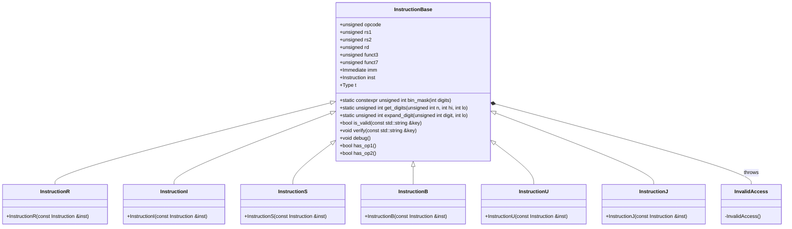

# 詳細設計仕様書

## 1. 概要

この文書は、`src/Common/Instruction.hpp` ファイルの再実装に必要な詳細な設計情報を提供します。元コードから確認できる事実のみを基に記述し、推測や創作を行いません。

## 2. クラス図



## 3. クラス・メソッド・インターフェース詳細

### InstructionBase

| 名前 | 種類 | 型 | 可視性 | const | static | noexcept |
|------|------|----|--------|-------|--------|----------|
| opcode | メンバ変数 | unsigned | public | なし | なし | なし |
| rs1 | メンバ変数 | unsigned | public | なし | なし | なし |
| rs2 | メンバ変数 | unsigned | public | なし | なし | なし |
| rd | メンバ変数 | unsigned | public | なし | なし | なし |
| funct3 | メンバ変数 | unsigned | public | なし | なし | なし |
| funct7 | メンバ変数 | unsigned | public | なし | なし | なし |
| imm | メンバ変数 | Immediate | public | なし | なし | なし |
| inst | メンバ変数 | Instruction | public | なし | なし | なし |
| t | メンバ変数 | Type | public | なし | なし | なし |
| bin_mask | 静的メソッド | unsigned int | public | あり | あり | なし |
| get_digits | 静的メソッド | unsigned int | public | あり | あり | なし |
| expand_digit | 静的メソッド | unsigned int | public | あり | あり | なし |
| is_valid | メソッド | bool | public | なし | なし | なし |
| verify | メソッド | void | public | なし | なし | なし |
| debug | メソッド | void | public | なし | なし | なし |
| has_op1 | メソッド | bool | public | なし | なし | なし |
| has_op2 | メソッド | bool | public | なし | なし | なし |

### InstructionR

| 名前 | 種類 | 型 | 可視性 | const | static | noexcept |
|------|------|----|--------|-------|--------|----------|
| InstructionR | コンストラクタ | void | public | なし | なし | なし |

### InstructionI

| 名前 | 種類 | 型 | 可視性 | const | static | noexcept |
|------|------|----|--------|-------|--------|----------|
| InstructionI | コンストラクタ | void | public | なし | なし | なし |

### InstructionS

| 名前 | 種類 | 型 | 可視性 | const | static | noexcept |
|------|------|----|--------|-------|--------|----------|
| InstructionS | コンストラクタ | void | public | なし | なし | なし |

### InstructionB

| 名前 | 種類 | 型 | 可視性 | const | static | noexcept |
|------|------|----|--------|-------|--------|----------|
| InstructionB | コンストラクタ | void | public | なし | なし | なし |

### InstructionU

| 名前 | 種類 | 型 | 可視性 | const | static | noexcept |
|------|------|----|--------|-------|--------|----------|
| InstructionU | コンストラクタ | void | public | なし | なし | なし |

### InstructionJ

| 名前 | 種類 | 型 | 可視性 | const | static | noexcept |
|------|------|----|--------|-------|--------|----------|
| InstructionJ | コンストラクタ | void | public | なし | なし | なし |

### InvalidAccess

| 名前 | 種類 | 型 | 可視性 | const | static | noexcept |
|------|------|----|--------|-------|--------|----------|
| InvalidAccess | コンストラクタ | void | private | なし | なし | なし |

## 4. シーケンス図

該当なし

## 5. メソッド仕様書

### InstructionBase::InstructionBase()

- **目的**: `InstructionBase` のデフォルトコンストラクタ
- **引数**: 無し
- **戻り値**: void
- **動作**: 各メンバ変数を初期化する。
- **副作用**: なし
- **エラー処理**: なし

### InstructionBase::InstructionBase(unsigned)

- **目的**: `InstructionBase` のコンストラクタ（特定の初期値設定）
- **引数**: 無し
- **戻り値**: void
- **動作**: 各メンバ変数を初期化し、opcode, t, inst を設定する。
- **副作用**: なし
- **エラー処理**: なし

### InstructionBase::nop()

- **目的**: NOP命令を作成する静的メソッド
- **引数**: 無し
- **戻り値**: `InstructionBase`
- **動作**: NOP命令を表す `InstructionBase` オブジェクトを返す。
- **副作用**: なし
- **エラー処理**: なし

### InstructionBase::is_nop()

- **目的**: 現在の命令がNOPかどうか判定するメソッド
- **引数**: 無し
- **戻り値**: bool
- **動作**: `inst` の値が -1 であるかを返す。
- **副作用**: なし
- **エラー処理**: なし

### InstructionBase::bin_mask(int digits)

- **目的**: 指定されたビット数のマスクを作成する静的メソッド
- **引数**: `digits` (int)
- **戻り値**: unsigned int
- **動作**: ビット幅 `digits` のマスクを返す。
- **副作用**: なし
- **エラー処理**: なし

### InstructionBase::get_digits(unsigned int n, int hi, int lo)

- **目的**: 指定された範囲のビットを取り出す静的メソッド
- **引数**: `n` (unsigned int), `hi` (int), `lo` (int)
- **戻り値**: unsigned int
- **動作**: `n` の `hi` から `lo` ビットを取り出し、マスクを適用して返す。
- **副作用**: なし
- **エラー処理**: なし

### InstructionBase::expand_digit(unsigned int digit, int lo)

- **目的**: 指定されたビット位置に符号拡張する静的メソッド
- **引数**: `digit` (unsigned int), `lo` (int)
- **戻り値**: unsigned int
- **動作**: `digit` が1の場合は `0xffffffff << lo` を、0の場合は 0 を返す。
- **副作用**: なし
- **エラー処理**: なし

### InstructionBase::is_valid(const std::string &key)

- **目的**: 指定されたキーが有効かどうか判定するメソッド
- **引数**: `key` (const std::string&)
- **戻り値**: bool
- **動作**: 命令のタイプとキーに基づいて、指定されたフィールドが有効かを返す。
- **副作用**: なし
- **エラー処理**: なし

### InstructionBase::verify(const std::string &key)

- **目的**: 指定されたキーが有効かどうか検証するメソッド
- **引数**: `key` (const std::string&)
- **戻り値**: void
- **動作**: `is_valid(key)` が false の場合、`InvalidAccess` をスローする。
- **副作用**: なし
- **エラー処理**: `InvalidAccess` スロー

### InstructionBase::debug()

- **目的**: 命令のデバッグ情報を出力するメソッド
- **引数**: 無し
- **戻り値**: void
- **動作**: 命令の opcode に基づいて、命令の種類を出力する。
- **副作用**: 標準出力への書き込み
- **エラー処理**: なし

### InstructionBase::has_op1()

- **目的**: 命令がオペランド1を持つかどうか判定するメソッド
- **引数**: 無し
- **戻り値**: bool
- **動作**: 命令のタイプが U または J でない場合、true を返す。
- **副作用**: なし
- **エラー処理**: なし

### InstructionBase::has_op2()

- **目的**: 命令がオペランド2を持つかどうか判定するメソッド
- **引数**: 無し
- **戻り値**: bool
- **動作**: 命令のタイプが R, S, B のいずれかである場合、true を返す。
- **副作用**: なし
- **エラー処理**: なし

### InstructionR::InstructionR(const Instruction &inst)

- **目的**: `InstructionR` オブジェクトを初期化するコンストラクタ
- **引数**: `inst` (const Instruction&)
- **戻り値**: void
- **動作**: 命令の opcode, rd, funct3, rs1, rs2, funct7 を設定し、タイプを R に設定する。
- **副作用**: なし
- **エラー処理**: なし

### InstructionI::InstructionI(const Instruction &inst)

- **目的**: `InstructionI` オブジェクトを初期化するコンストラクタ
- **引数**: `inst` (const Instruction&)
- **戻り値**: void
- **動作**: 命令の opcode, rd, funct3, rs1, imm を設定し、タイプを I に設定する。
- **副作用**: なし
- **エラー処理**: なし

### InstructionS::InstructionS(const Instruction &inst)

- **目的**: `InstructionS` オブジェクトを初期化するコンストラクタ
- **引数**: `inst` (const Instruction&)
- **戻り値**: void
- **動作**: 命令の opcode, funct3, rs1, rs2, imm を設定し、タイプを S に設定する。
- **副作用**: なし
- **エラー処理**: なし

### InstructionB::InstructionB(const Instruction &inst)

- **目的**: `InstructionB` オブジェクトを初期化するコンストラクタ
- **引数**: `inst` (const Instruction&)
- **戻り値**: void
- **動作**: 命令の opcode, funct3, rs1, rs2, imm を設定し、タイプを B に設定する。
- **副作用**: なし
- **エラー処理**: なし

### InstructionU::InstructionU(const Instruction &inst)

- **目的**: `InstructionU` オブジェクトを初期化するコンストラクタ
- **引数**: `inst` (const Instruction&)
- **戻り値**: void
- **動作**: 命令の opcode, rd, imm を設定し、タイプを U に設定する。
- **副作用**: なし
- **エラー処理**: なし

### InstructionJ::InstructionJ(const Instruction &inst)

- **目的**: `InstructionJ` オブジェクトを初期化するコンストラクタ
- **引数**: `inst` (const Instruction&)
- **戻り値**: void
- **動作**: 命令の opcode, rd, imm を設定し、タイプを J に設定する。
- **副作用**: なし
- **エラー処理**: なし

## 6. 処理フロー図

該当なし

## 7. 状態遷移・副作用

| 更新前状態 | 遷移条件 | 変更対象 | 更新後状態 | 更新順序 | 副作用 |
|------------|----------|----------|------------|----------|--------|
| 任意       | コンストラクタ呼び出し | 各メンバ変数 | 初期化された状態 | opcode, rs1, rs2, rd, funct3, funct7, imm, inst, t の順序 | なし |
| 任意       | verify() 呼び出し | なし | なし | なし | InvalidAccess スロー |

## 8. データ変換・制約

### ビットマスクとビット取り出し

- **bin_mask(digits)**: `digits` のビット幅のマスクを作成する。
- **get_digits(n, hi, lo)**: `n` の `hi` から `lo` ビットを取り出す。

### 符号拡張

- **expand_digit(digit, lo)**: `digit` が1の場合は `0xffffffff << lo` を、0の場合は 0 を返す。

### 命令タイプとフィールドの関係

| タイプ | 使用可能なフィールド |
|--------|----------------------|
| R      | opcode, rd, funct3, rs1, rs2, funct7 |
| I      | opcode, rd, funct3, rs1, imm           |
| S      | opcode, funct3, rs1, rs2, imm          |
| B      | opcode, funct3, rs1, rs2, imm          |
| U      | opcode, rd, imm                        |
| J      | opcode, rd, imm                        |

### NOP命令

- **inst == -1**: NOP命令を表す。

## 9. 完全再構築台帳

```cpp
//
// Created by Alex Chi on 2019-07-01.
//

#ifndef RISCV_SIMULATOR_INSTRUCTION_HPP
#define RISCV_SIMULATOR_INSTRUCTION_HPP

#include <utility>
#include "Common.h"
#include <string>
#include <iostream>

using Instruction = unsigned int;

struct InstructionBase {
    class InvalidAccess {
    };

    InstructionBase() {
        rs1 = rs2 = rd = 0;
        opcode = 0;
        imm = 0;
        funct3 = funct7 = 0;
        this->inst = 0;
    }

    InstructionBase(unsigned) {
        rs1 = rs2 = rd = 0;
        opcode = 0b0010011;
        t = I;
        imm = 0;
        funct3 = funct7 = 0;
        this->inst = -1;
    }

    static InstructionBase nop() { return InstructionBase(0); }

    bool is_nop() { return this->inst == -1; }

    unsigned opcode, rs1, rs2, rd, funct3, funct7;
    Immediate imm;
    Instruction inst;
    enum Type {
        R, I, S, B, U, J
    } t;

    static constexpr unsigned int bin_mask(int digits) {
        return (1 << digits) - 1;
    }

    static unsigned int get_digits(unsigned int n, int hi, int lo) {
        return (n >> lo) & bin_mask(hi - lo + 1);
    }

    static unsigned int expand_digit(unsigned int digit, int lo) {
        return digit ? (0xffffffff << lo) : 0;
    }

    bool is_valid(const std::string &key) {
        if (t == R) { if (key == "imm") return false; }
        if (t == I) { if (key == "rs2" || key == "funct7") return false; }
        if (t == S) { if (key == "rd" || key == "funct7") return false; }
        if (t == B) { if (key == "rd" || key == "funct7") return false; }
        if (t == U || t == J) { if (key == "rs1" || key == "rs2" || key == "funct3" || key == "funct7") return false; }
        return true;
    }

    void verify(const std::string &key) {
        if (!is_valid(key)) throw InvalidAccess();
    };

    void debug() {
        std::cout << std::hex << inst << " ";
        if (inst == 0x00000013) std::cout << "nop";
        else if (opcode == 0b0110111) std::cout << "lui ";
        else if (opcode == 0b0010111) std::cout << "auipc ";
        else if (opcode == 0b1101111) std::cout << "jal ";
        else if (opcode == 0b1100111) std::cout << "jalr ";
        else if (opcode == 0b1100011) std::cout << "branch";
        else if (opcode == 0b0000011) std::cout << "load";
        else if (opcode == 0b0100011) std::cout << "store";
        else if (opcode == 0b0010011) {
            static std::string opi[] = {
                    "addi", "slli", "slti", "sltiu", "xori", "srli / srai",
                    "ori", "andi"
            };
            std::cout << opi[funct3];
        }
        else if (opcode == 0b0110011) std::cout << "op";
        else std::cout << "unknown";
        std::cout << std::endl;
    }

    bool has_op1() {
        return t != InstructionBase::U && t != InstructionBase::J;
    }

    bool has_op2() {
        return t == InstructionBase::R || t == InstructionBase::S
               || t == InstructionBase::B;
    }
};

struct InstructionR : InstructionBase {
    InstructionR(const Instruction &inst) {
        opcode = get_digits(inst, 6, 0);
        rd = get_digits(inst, 11, 7);
        funct3 = get_digits(inst, 14, 12);
        rs1 = get_digits(inst, 19, 15);
        rs2 = get_digits(inst, 24, 20);
        funct7 = get_digits(inst, 31, 25);
        t = R;
        this->inst = inst;
    }
};

struct InstructionI : InstructionBase {
    InstructionI(const Instruction &inst) {
        opcode = get_digits(inst, 6, 0);
        rd = get_digits(inst, 11, 7);
        funct3 = get_digits(inst, 14, 12);
        rs1 = get_digits(inst, 19, 15);
        imm = get_digits(inst, 30, 20) | expand_digit(get_digits(inst, 31, 31), 11);
        t = I;
        this->inst = inst;
    }
};

struct InstructionS : InstructionBase {
    InstructionS(const Instruction &inst) {
        opcode = get_digits(inst, 6, 0);
        funct3 = get_digits(inst, 14, 12);
        rs1 = get_digits(inst, 19, 15);
        rs2 = get_digits(inst, 24, 20);
        imm = get_digits(inst, 11, 7) |
              (get_digits(inst, 30, 25) << 5) |
              expand_digit(get_digits(inst, 31, 31), 11);
        t = S;
        this->inst = inst;
    }
};

struct InstructionB : InstructionBase {
    InstructionB(const Instruction &inst) {
        opcode = get_digits(inst, 6, 0);
        funct3 = get_digits(inst, 14, 12);
        rs1 = get_digits(inst, 19, 15);
        rs2 = get_digits(inst, 24, 20);
        imm = (get_digits(inst, 11, 8) << 1) |
              (get_digits(inst, 30, 25) << 5) |
              (get_digits(inst, 7, 7) << 11) |
              expand_digit(get_digits(inst, 31, 31), 12);
        t = B;
        this->inst = inst;
    }
};

struct InstructionU : InstructionBase {
    InstructionU(const Instruction &inst) {
        opcode = get_digits(inst, 6, 0);
        rd = get_digits(inst, 11, 7);
        imm = (get_digits(inst, 19, 12) << 12) |
              (get_digits(inst, 30, 20) << 20) |
              (get_digits(inst, 31, 31) << 31);
        t = U;
        this->inst = inst;
    }
};

struct InstructionJ : InstructionBase {
    InstructionJ(const Instruction &inst) {
        opcode = get_digits(inst, 6, 0);
        rd = get_digits(inst, 11, 7);
        imm = (get_digits(inst, 30, 21) << 1) |
              (get_digits(inst, 20, 20) << 11) |
              (get_digits(inst, 19, 12) << 12) |
              expand_digit(get_digits(inst, 31, 31), 20);
        t = J;
        this->inst = inst;
    }
};

#endif //RISCV_SIMULATOR_INSTRUCTION_HPP
```

この設計仕様書は、`src/Common/Instruction.hpp` ファイルの再実装に必要な詳細な情報を提供します。各クラスとメソッドのインターフェース、動作、制約を明確に記述し、別のLLMがファイル全体を欠落なく生成できるように設計されています。