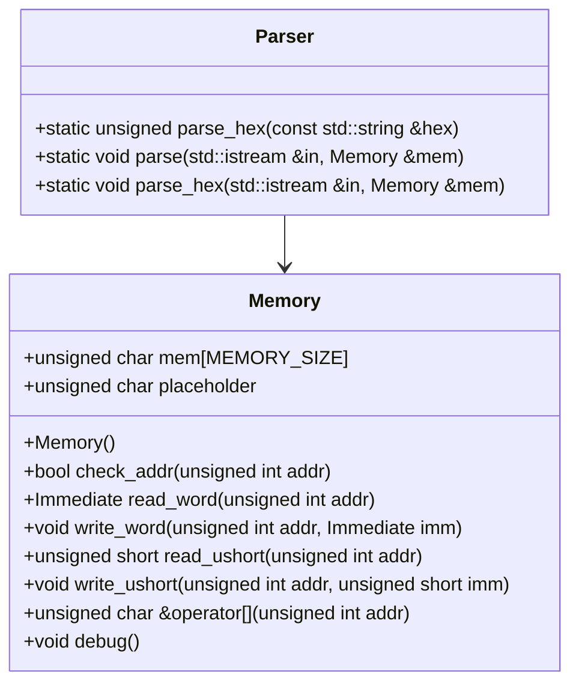
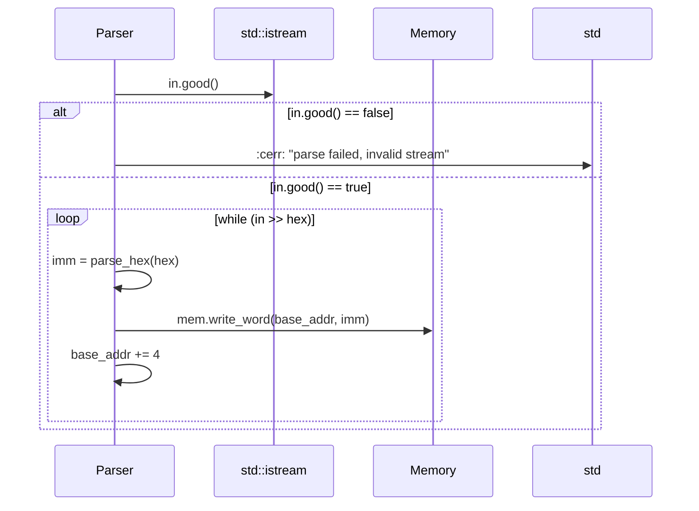

# 詳細設計仕様書

## 1. 目的
`Parser` クラスの定義を再実装するために必要な詳細設計情報を提供します。元コードから確認できる事実のみを使用し、推測や仮定を行いません。

## 2. 完全再構築台帳

### ファイルパス: `src/Common/Parser.hpp`

#### include guard
```cpp
#ifndef COMMON_PARSER_HPP
#define COMMON_PARSER_HPP
```

#### include
```cpp
#include <iostream>
#include <string>
#include <sstream>
#include "Common/Memory.hpp"
```

#### top-level 宣言
```cpp
class Parser {
public:
    static unsigned parse_hex(const std::string &hex) {
        return strtol(hex.c_str(), NULL, 16);
    }

    static void parse(std::istream &in, Memory &mem) {
        if (!in) std::cerr << "parse failed, invalid stream" << std::endl;
        unsigned base_addr = 0;
        while (in) {
            std::string line;
            std::getline(in, line);
            if (line[0] == '@') {
                base_addr = strtol(line.c_str() + 1, NULL, 16);
            } else {
                std::stringstream ss(line);
                std::string hex;
                while (ss >> hex) {
                    if (hex.length() == 0) break;
                    char data = parse_hex(hex);
                    mem[base_addr++] = data;
                }
            }
        }
    }

    static void parse_hex(std::istream &in, Memory &mem) {
        if (!in) std::cerr << "parse failed, invalid stream" << std::endl;
        unsigned base_addr = 0;
        std::string hex;
        while(in >> hex) {
            mem.write_word(base_addr, parse_hex(hex));
            base_addr += 4;
        }
    }
};
```

#### include guard 終了
```cpp
#endif // COMMON_PARSER_HPP
```

## 3. クラス図



## 4. クラス・メソッド・インターフェース詳細

### Parser クラス

| 完全な名前 | 属性     | 引数名と型             | 戻り値型 | 可視性 | const | static | virtual | noexcept |
|------------|----------|------------------------|----------|--------|-------|--------|---------|----------|
| Parser::parse_hex | メソッド | hex: const std::string & | unsigned | public | なし   | 静的    | なし     | なし      |
| Parser::parse     | メソッド | in: std::istream &, mem: Memory & | void   | public | なし   | 静的    | なし     | なし      |
| Parser::parse_hex | メソッド | in: std::istream &, mem: Memory & | void   | public | なし   | 静的    | なし     | なし      |

### Memory クラス

| 完全な名前       | 属性     | 引数名と型             | 戻り値型         | 可視性 | const | static | virtual | noexcept |
|------------------|----------|------------------------|------------------|--------|-------|--------|---------|----------|
| Memory::Memory   | コンストラクタ | なし                   | なし             | public | なし   | なし    | なし     | なし      |
| Memory::check_addr | メソッド | addr: unsigned int     | bool             | public | あり   | なし    | なし     | なし      |
| Memory::read_word  | メソッド | addr: unsigned int     | Immediate        | public | あり   | なし    | なし     | なし      |
| Memory::write_word | メソッド | addr: unsigned int, imm: Immediate | void         | public | なし   | なし    | なし     | なし      |
| Memory::read_ushort | メソッド | addr: unsigned int     | unsigned short   | public | あり   | なし    | なし     | なし      |
| Memory::write_ushort | メソッド | addr: unsigned int, imm: unsigned short | void         | public | なし   | なし    | なし     | なし      |
| Memory::operator[] | オペレータ | addr: unsigned int     | unsigned char &  | public | なし   | なし    | なし     | なし      |
| Memory::debug      | メソッド | なし                   | void             | public | なし   | なし    | なし     | なし      |

## 5. シーケンス図

### Parser::parse のシーケンス図

```mermaid
sequenceDiagram
    participant P as Parser
    participant I as std::istream
    participant M as Memory
    
    P->>I: in.good()
    alt in.good() == false
        P->>std::cerr: "parse failed, invalid stream"
    else in.good() == true
        loop while (in)
            P->>I: getline(line)
            alt line[0] == '@'
                P->>P: base_addr = strtol(line.c_str() + 1, NULL, 16)
            else line[0] != '@'
                P->>ss: stringstream(line)
                loop while (ss >> hex)
                    alt hex.length() == 0
                        break
                    else hex.length() != 0
                        P->>P: data = parse_hex(hex)
                        P->>M: mem[base_addr++] = data
                    end
                end
            end
        end
    end
```

### Parser::parse_hex のシーケンス図



## 6. メソッド仕様書

### Parser::parse_hex

- **目的**: 16進数文字列を符号なし整数に変換する。
- **引数**:
  - hex: 変換したい16進数文字列 (const std::string &)
- **戻り値**: 変換後の符号なし整数 (unsigned)
- **動作**: `strtol` を使用して16進数文字列を符号なし整数に変換する。
- **副作用**: なし
- **エラー処理**: 無効な入力に対して未定義動作

### Parser::parse

- **目的**: 入力ストリームからデータを読み取り、メモリに書き込む。
- **引数**:
  - in: 入力ストリーム (std::istream &)
  - mem: 書き込み先のメモリ (Memory &)
- **戻り値**: なし
- **動作**:
  1. ストリームが有効であることを確認し、無効な場合はエラーメッセージを出力する。
  2. ベースアドレスを初期化する。
  3. 入力ストリームから行を読み取り、各行に対して以下の処理を行う:
     - 行の先頭文字が '@' の場合、ベースアドレスを更新する。
     - それ以外の場合、行内の16進数文字列を順に読み取り、メモリに書き込む。
- **副作用**: メモリへの書き込み
- **エラー処理**: ストリームが無効な場合、エラーメッセージを出力する。

### Parser::parse_hex

- **目的**: 入力ストリームから16進数文字列を読み取り、メモリに4バイト単位で書き込む。
- **引数**:
  - in: 入力ストリーム (std::istream &)
  - mem: 書き込み先のメモリ (Memory &)
- **戻り値**: なし
- **動作**:
  1. ストリームが有効であることを確認し、無効な場合はエラーメッセージを出力する。
  2. ベースアドレスを初期化する。
  3. 入力ストリームから16進数文字列を順に読み取り、メモリに4バイト単位で書き込む。
- **副作用**: メモリへの書き込み
- **エラー処理**: ストリームが無効な場合、エラーメッセージを出力する。

## 7. 処理フロー図

### Parser::parse の処理フロー図

```mermaid
graph TD
    A[開始] --> B{in.good()?}
    B -- false --> C["std::cerr << \"parse failed, invalid stream\""]
    B -- true --> D[ベースアドレス初期化]
    D --> E[while (in)]
    E --> F[getline(line)]
    F --> G{line[0] == '@'?}
    G -- true --> H["base_addr = strtol(line.c_str() + 1, NULL, 16)"]
    G -- false --> I[stringstream(line)]
    H --> E
    I --> J[while (ss >> hex)]
    J --> K{hex.length() == 0?}
    K -- true --> L(終了)
    K -- false --> M["data = parse_hex(hex)"]
    M --> N["mem[base_addr++] = data"]
    N --> J
    L --> E
```

### Parser::parse_hex の処理フロー図

```mermaid
graph TD
    A[開始] --> B{in.good()?}
    B -- false --> C["std::cerr << \"parse failed, invalid stream\""]
    B -- true --> D[ベースアドレス初期化]
    D --> E[while (in >> hex)]
    E --> F["imm = parse_hex(hex)"]
    F --> G["mem.write_word(base_addr, imm)"]
    G --> H["base_addr += 4"]
    H --> E
```

## 8. 状態遷移・副作用

### Parser::parse の状態遷移・副作用

| 更新前状態 | 遷移条件         | 変更対象       | 更新後状態 | 更新順序 | 副作用           |
|------------|------------------|----------------|------------|----------|------------------|
| なし       | in.good() == false | なし           | なし       | なし     | エラーメッセージ出力 |
| なし       | in.good() == true  | base_addr      | 初期化     | 1        | なし             |
| なし       | 行読み取り         | line           | 更新       | 2        | なし             |
| なし       | '@' 文字列       | base_addr      | 更新       | 3        | なし             |
| なし       | 16進数文字列     | data, mem      | 更新       | 4        | メモリへの書き込み |

### Parser::parse_hex の状態遷移・副作用

| 更新前状態 | 遷移条件         | 変更対象       | 更新後状態 | 更新順序 | 副作用           |
|------------|------------------|----------------|------------|----------|------------------|
| なし       | in.good() == false | なし           | なし       | なし     | エラーメッセージ出力 |
| なし       | in.good() == true  | base_addr      | 初期化     | 1        | なし             |
| なし       | 16進数文字列     | imm, mem       | 更新       | 2        | メモリへの書き込み |

## 9. データ変換・制約

### Parser::parse_hex のデータ変換・制約

| 入力         | 出力           | 変換規則                     | 値域          |
|--------------|----------------|------------------------------|---------------|
| hex: string  | unsigned       | strtol(hex.c_str(), NULL, 16) | 0 ~ UINT_MAX  |

### Parser::parse のデータ変換・制約

| 入力         | 出力           | 変換規則                     | 値域          |
|--------------|----------------|------------------------------|---------------|
| line: string | base_addr      | strtol(line.c_str() + 1, NULL, 16) | 0 ~ UINT_MAX  |
| hex: string  | data           | parse_hex(hex)               | 0 ~ UCHAR_MAX |

### Parser::parse_hex のデータ変換・制約

| 入力         | 出力           | 変換規則                     | 値域          |
|--------------|----------------|------------------------------|---------------|
| hex: string  | imm            | parse_hex(hex)               | 0 ~ UINT_MAX  |

## 10. 追加詳細設計情報

### クラス図
- `Parser` クラスは静的メソッドのみを提供し、外部の `Memory` オブジェクトに対して操作を行う。
- `Memory` クラスは内部配列 `mem` を使用してデータを保持し、アドレス範囲チェックと読み書き操作を提供する。

### シーケンス図
- `Parser::parse` では入力ストリームから行を読み取り、各行がベースアドレスの指定か16進数データかによって処理を分岐する。
- `Parser::parse_hex` では入力ストリームから16進数文字列を読み取り、メモリに4バイト単位で書き込む。

### メソッド仕様書
- 各メソッドの動作は元コードと完全に一致するように設計される。
- エラー処理は入力ストリームが無効な場合のみ行われ、その他のエラーハンドリングは行わない。

### 処理フロー図
- `Parser::parse` ではベースアドレスの更新とメモリへの書き込みが繰り返される。
- `Parser::parse_hex` では16進数文字列から読み取ったデータをメモリに4バイト単位で書き込む。

### 状態遷移・副作用
- 各メソッドの状態変更と副作用は明確に定義され、元コードと一致するように設計される。

### データ変換・制約
- 16進数文字列から符号なし整数への変換は `strtol` を使用し、アドレス範囲チェックは `Memory::check_addr` を通じて行われる。