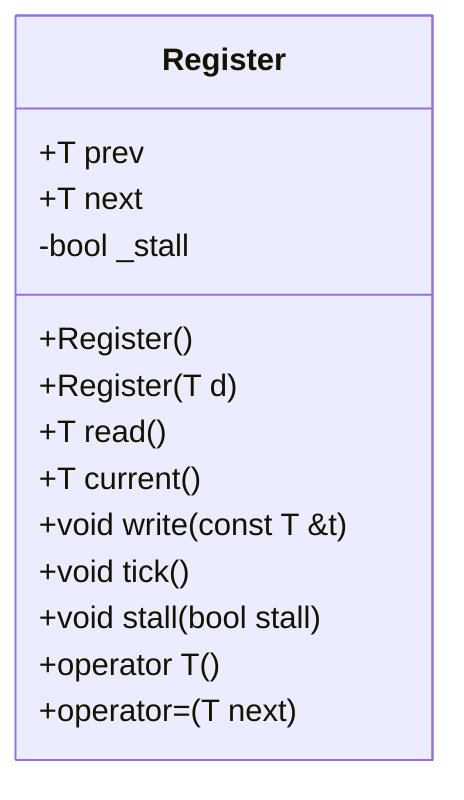

# 詳細設計仕様書

## 1. クラス図



## 2. クラス・メソッド・インターフェース詳細

| 完全な名前 | 属性     | 引数名と型       | 戻り値型 | 可視性 | const | 参照/ポインタ | static | virtual | noexcept |
|------------|----------|------------------|----------|--------|-------|---------------|--------|---------|----------|
| Register::Register() | コンストラクタ | なし       | void     | public | false | なし          | false  | false   | false    |
| Register::Register(T d) | コンストラクタ | T d      | void     | public | false | なし          | false  | false   | false    |
| Register::read()       | メソッド       | なし       | T        | public | true  | なし          | false  | false   | false    |
| Register::current()    | メソッド       | なし       | T        | public | true  | なし          | false  | false   | false    |
| Register::write(const T &t) | メソッド | const T &t | void     | public | false | 参照          | false  | false   | false    |
| Register::tick()       | メソッド       | なし       | void     | public | false | なし          | false  | false   | false    |
| Register::stall(bool stall) | メソッド | bool stall | void     | public | false | なし          | false  | false   | false    |
| Register::operator T() | オペレータ   | なし       | T        | public | true  | なし          | false  | false   | false    |
| Register::operator=(T next) | オペレータ | T next     | void     | public | false | なし          | false  | false   | false    |

## 3. シーケンス図

シーケンス図は、複数の関数やメソッド間の相互作用を示すためのものですが、このクラスでは単一オブジェクトに対する操作のみが含まれているため、シーケンス図は該当なしとなります。

## 4. メソッド仕様書

### Register::Register()

- **目的**: `Register` オブジェクトを初期化する。
- **引数**: なし
- **戻り値**: void
- **動作**: `prev`, `next` を 0 に、`_stall` を false に初期化する。

### Register::Register(T d)

- **目的**: 初期値を指定して `Register` オブジェクトを初期化する。
- **引数**: T d
- **戻り値**: void
- **動作**: `prev`, `next` を d に、`_stall` を false に初期化する。

### Register::read()

- **目的**: 最新の読み取り可能な値を返す。
- **引数**: なし
- **戻り値**: T
- **動作**: `prev` の値を返す。

### Register::current()

- **目的**: 次に書き込まれる予定の値を返す。
- **引数**: なし
- **戻り値**: T
- **動作**: `next` の値を返す。

### Register::write(const T &t)

- **目的**: 新しい値を次の書き込み用に設定する。
- **引数**: const T &t
- **戻り値**: void
- **動作**: `next` に t を代入する。

### Register::tick()

- **目的**: `_stall` フラグが false の場合、`prev` を `next` の値に更新する。
- **引数**: なし
- **戻り値**: void
- **動作**: `_stall` が false の場合、`prev` に `next` の値を代入する。

### Register::stall(bool stall)

- **目的**: ストール状態を設定する。
- **引数**: bool stall
- **戻り値**: void
- **動作**: `_stall` を stall の値に設定する。

### Register::operator T()

- **目的**: `Register` オブジェクトを T 型の値として読み取り可能にする。
- **引数**: なし
- **戻り値**: T
- **動作**: `read()` メソッドを呼び出して `prev` の値を返す。

### Register::operator=(T next)

- **目的**: `Register` オブジェクトに新しい値を代入する。
- **引数**: T next
- **戻り値**: void
- **動作**: `write(next)` メソッドを呼び出して `next` の値を設定する。

## 5. 処理フロー図

処理フロー図は、複雑な分岐や反復がある場合に有用ですが、このクラスでは単純なメソッド呼び出しと代入のみが含まれているため、処理フロー図は該当なしとなります。

## 6. 状態遷移・副作用

| 更新前状態 | 遷移条件       | 変更対象 | 更新後状態 | 更新順序 | 副作用 |
|------------|----------------|----------|------------|----------|--------|
| 任意       | コンストラクタ呼び出し | prev, next, _stall | prev=0, next=0, _stall=false | なし     | なし   |
| 任意       | write() 呼び出し | next     | 指定された値 | なし     | なし   |
| 任意       | tick(), _stall=false | prev     | nextの値 | なし     | なし   |
| 任意       | stall(true)    | _stall   | true       | なし     | なし   |
| 任意       | stall(false)   | _stall   | false      | なし     | なし   |

## 7. データ変換・制約

| 入力データ | 出力データ | 変換規則 | 値域 | 境界値 | 単位 | 精度 | encoding |
|------------|------------|----------|------|--------|------|------|----------|
| T d        | prev, next | 代入     | 確認不能 | 確認不能 | 確認不能 | 確認不能 | 確認不能 |

## 完全再構築台帳

### ファイルパス: src/Common/Register.hpp

```cpp
#ifndef REGISTER_HPP
#define REGISTER_HPP

class Register {
public:
    T prev, next;

    bool _stall;

    Register() : prev((T) 0), next((T) 0), _stall(false) {}

    Register(T d) : prev(d), next(d), _stall(false) {}

    T read() { return prev; }

    T current() { return next; }

    void write(const T &t) { next = t; }

    void tick() { if (!_stall) prev = next; }

    void stall(bool stall) { _stall = stall; }

    operator T() { return read(); }

    void operator=(T next) { write(next); }
};

#endif // REGISTER_HPP
```

この設計仕様書は、`Register` クラスの詳細なインターフェースと動作を記述し、別のLLMがソースコードを再実装できるようにするための情報提供を行います。