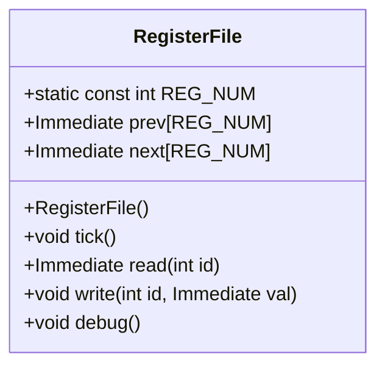
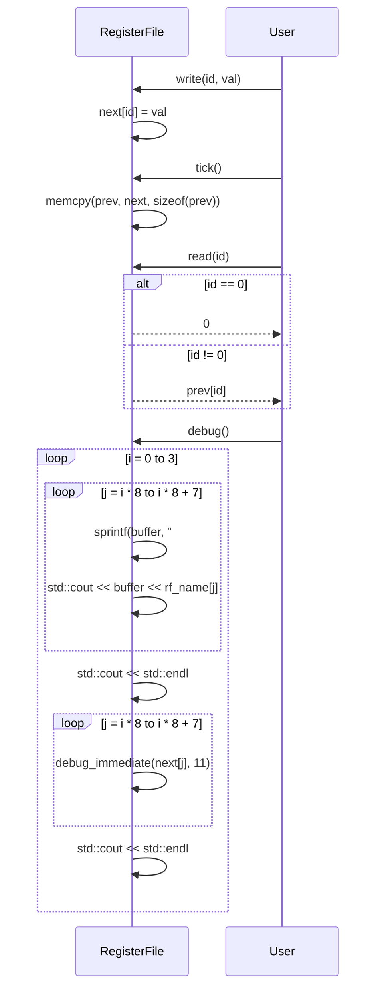

# 詳細設計仕様書

## 目的
`RegisterFile` クラスの再実装に必要な詳細な設計情報を提供する。

## 基本情報
- **ファイルパス**: `src/Common/RegisterFile.hpp`
- **クラス名**: `RegisterFile`
- **役割**: レジスタファイルを管理するクラス

## 依存関係
- **`Common.h`**: `Immediate` 型の定義
- **`utils.h`**: `debug_immediate` 関数の宣言

## クラス図


## クラス・メソッド・インターフェース詳細

| 名前         | 型              | 可視性 | const | static | 引数名と型       | 戻り値型  |
|--------------|-----------------|--------|-------|--------|------------------|-----------|
| RegisterFile | -               | public | false | true   | -                | void      |
| tick         | -               | public | false | false  | -                | void      |
| read         | -               | public | false | false  | int id           | Immediate |
| write        | -               | public | false | false  | int id, Immediate val | void    |
| debug        | -               | public | false | false  | -                | void      |

## シーケンス図


## メソッド仕様書

### RegisterFile()
- **目的**: `RegisterFile` オブジェクトを初期化する。
- **引数**: 無し
- **戻り値**: 無し
- **動作**: `prev` と `next` 配列のすべての要素を0に設定する。

### tick()
- **目的**: レジスタファイルの状態を更新する。
- **引数**: 無し
- **戻り値**: 無し
- **動作**: `prev` に `next` の内容をコピーする。

### read(int id)
- **目的**: 指定されたIDのレジスタの値を読み取る。
- **引数**: int id - レジスタのID
- **戻り値**: Immediate - レジスタの値
- **動作**: `id` が0の場合、0を返す。それ以外の場合、`prev[id]` を返す。

### write(int id, Immediate val)
- **目的**: 指定されたIDのレジスタに値を書き込む。
- **引数**: int id - レジスタのID, Immediate val - 書き込む値
- **戻り値**: 無し
- **動作**: `next[id]` に `val` を設定する。

### debug()
- **目的**: レジスタファイルの内容をデバッグ出力する。
- **引数**: 無し
- **戻り値**: 無し
- **動作**: 各レジスタの名前と値をフォーマットして `std::cout` に出力する。

## 処理フロー図

### tick()
```mermaid
graph TD
    A[開始] --> B[memcpy(prev, next, sizeof(prev))]
    B --> C[終了]
```

### read(int id)
```mermaid
graph TD
    A[開始] --> B{id == 0?}
    B --はい--> C[return 0]
    B --いいえ--> D[return prev[id]]
    C --> E[終了]
    D --> E
```

### write(int id, Immediate val)
```mermaid
graph TD
    A[開始] --> B[next[id] = val]
    B --> C[終了]
```

### debug()
```mermaid
graph TD
    A[開始] --> B[i = 0]
    B --> C{j = i * 8}
    C --> D{j < i * 8 + 8?}
    D --いいえ--> E{i++}
    D --はい--> F[sprintf(buffer, "#%d", j)]
    F --> G[std::cout << buffer << rf_name[j]]
    G --> H[j++]
    H --> D
    E --> I{i < 4?}
    I --いいえ--> J[終了]
    I --はい--> K[std::cout << std::endl]
    K --> L{j = i * 8}
    L --> M{j < i * 8 + 8?}
    M --いいえ--> N{i++}
    M --はい--> O[debug_immediate(next[j], 11)]
    O --> P[j++]
    P --> M
    N --> Q[std::cout << std::endl]
    Q --> I
```

## 状態遷移・副作用

| 更新前状態 | 遷移条件   | 変更対象 | 更新後状態 | 更新順序 |
|------------|------------|----------|------------|----------|
| prev, next | tick()     | prev     | nextのコピー | 1        |

## データ変換・制約

| 入力データ | 出力データ | 変換規則                     |
|------------|------------|--------------------------------|
| id         | Immediate  | readメソッドでの条件分岐       |
| val        | next[id]   | writeメソッドでの代入          |

## 追加詳細設計情報

- **定数**: `REG_NUM` - レジスタの数 (32)
- **配列**: `prev`, `next` - 各レジスタの現在値と次の値を保持する
- **関数呼び出し**:
  - `memset(prev, 0, sizeof(prev))`
  - `memset(next, 0, sizeof(next))`
  - `memcpy(prev, next, sizeof(prev))`
  - `sprintf(buffer, "#%d", j)`
  - `std::cout << buffer << rf_name[j]`
  - `debug_immediate(next[j], 11)`

- **依存関係**:
  - `Common.h` から `Immediate` 型を使用
  - `utils.h` から `debug_immediate` 関数を使用

## 完全再構築台帳

```cpp
#ifndef RISCV_SIMULATOR_REGISTERFILE_HPP
#define RISCV_SIMULATOR_REGISTERFILE_HPP

#include "Common.h"
#include <vector>
#include <string>
#include <iostream>
#include <iomanip>
#include "utils.h"

class RegisterFile { // : public Tickable {
    static const int REG_NUM = 32;
public:
    Immediate prev[REG_NUM];
    Immediate next[REG_NUM];

    RegisterFile() {
        memset(prev, 0, sizeof(prev));
        memset(next, 0, sizeof(next));
    }

    void tick() { memcpy(prev, next, sizeof(prev)); }

    Immediate read(int id) { return id == 0 ? 0 : prev[id]; }

    void write(int id, Immediate val) { next[id] = val; }

    void debug() {
        static std::vector<std::string> rf_name = {"0", "ra", "sp", "gp", "tp", "t0", "t1", "t2",
                                                   "s0", "s1", "a0", "a1", "a2", "a3", "a4", "a5",
                                                   "a6", "a7", "s2", "s3", "s4", "s5", "s6", "s7",
                                                   "s8", "s9", "s10", "s11", "t3", "t4", "t5", "t6"};
        for (int i = 0; i < 4; i++) {
            for (int j = i * 8; j < i * 8 + 8; j++) {
                char buffer[20];
                sprintf(buffer, "#%d", j);
                std::cout << std::setw(20) << buffer
                          << std::setw(4) << rf_name[j];
            }
            std::cout << std::endl;
            for (int j = i * 8; j < i * 8 + 8; j++) {
                debug_immediate(next[j], 11);
            }
            std::cout << std::endl;
        }
    }
};

#endif //RISCV_SIMULATOR_REGISTERFILE_HPP
```

この設計仕様書は、`RegisterFile` クラスの再実装に必要な詳細な情報を提供します。各メソッドの動作や依存関係を明確に記述し、完全再構築台帳を通じてソースコード全体を再現することが可能となります。