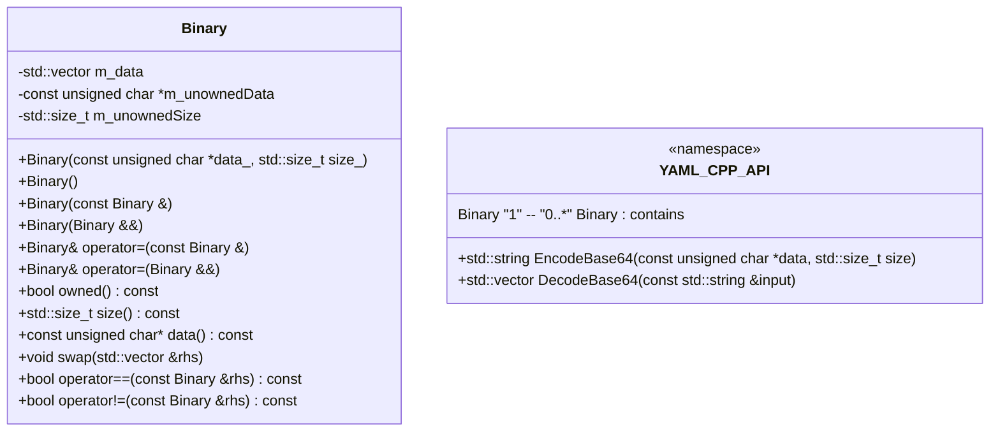

# 詳細設計仕様書

## 目的
対象コードから再実装に必要な実装上の事実を失わない詳細設計情報を生成する。

## 対象スコープ
- **置換対象**: F01/U01 (`DecodeBase64` 関数)
- **参照専用**: F02/U02, F03/U03

## クラス図


## クラス・メソッド・インターフェース詳細

### YAML_CPP_API 名前空間
| 完全な名前 | 属性 | 引数名と型 | 戻り値型 | 可視性 | const | ポインタ | static | virtual | noexcept |
|------------|------|------------|----------|--------|-------|--------|--------|---------|----------|
| YAML_CPP_API::EncodeBase64 | 関数 | data: const unsigned char*, size: std::size_t | std::string | public | なし | なし | static | なし | なし |
| YAML_CPP_API::DecodeBase64 | 関数 | input: const std::string& | std::vector<unsigned char> | public | なし | なし | static | なし | なし |

### Binary クラス
| 完全な名前 | 属性 | 引数名と型 | 戻り値型 | 可視性 | const | ポインタ | static | virtual | noexcept |
|------------|------|------------|----------|--------|-------|--------|--------|---------|----------|
| Binary::Binary(const unsigned char *data_, std::size_t size_) | コンストラクタ | data_: const unsigned char*, size_: std::size_t | なし | public | なし | なし | なし | なし | なし |
| Binary::Binary() | コンストラクタ | なし | なし | public | なし | なし | なし | なし | なし |
| Binary::Binary(const Binary &) | コピーコンストラクタ | なし | なし | public | なし | なし | なし | なし | なし |
| Binary::Binary(Binary &&) | ムーブコンストラクタ | なし | なし | public | なし | なし | なし | なし | なし |
| Binary::operator=(const Binary &) | コピー代入演算子 | なし | Binary& | public | なし | なし | なし | なし | なし |
| Binary::operator=(Binary &&) | ムーブ代入演算子 | なし | Binary& | public | なし | なし | なし | なし | なし |
| Binary::owned() const | メソッド | なし | bool | public | あり | なし | なし | なし | なし |
| Binary::size() const | メソッド | なし | std::size_t | public | あり | なし | なし | なし | なし |
| Binary::data() const | メソッド | なし | const unsigned char* | public | あり | なし | なし | なし | なし |
| Binary::swap(std::vector<unsigned char> &rhs) | メソッド | rhs: std::vector<unsigned char>& | なし | public | なし | なし | なし | なし | なし |
| Binary::operator==(const Binary &rhs) const | 比較演算子 | rhs: const Binary& | bool | public | あり | なし | なし | なし | なし |
| Binary::operator!=(const Binary &rhs) const | 比較演算子 | rhs: const Binary& | bool | public | あり | なし | なし | なし | なし |

## シーケンス図
```mermaid
sequenceDiagram
    participant Caller
    participant YAML_CPP_API
    participant Binary

    Caller->>YAML_CPP_API: DecodeBase64(input)
    YAML_CPP_API->>Caller: ret_type()
    alt input.empty() == false
        loop i < input.size()
            YAML_CPP_API->>YAML_CPP_API: std::isspace(static_cast<unsigned char>(input[i]))
            opt skip newlines
                YAML_CPP_API-->>YAML_CPP_API: continue
            end
            YAML_CPP_API->>YAML_CPP_API: decoding[static_cast<unsigned char>(input[i])]
            alt d == 255
                YAML_CPP_API->>Caller: ret_type()
            else
                YAML_CPP_API->>YAML_CPP_API: value = (value << 6) | d
                opt cnt == 3
                    YAML_CPP_API->>YAML_CPP_API: *out++ = value >> 16
                    alt i > 0 && input[i - 1] != '='
                        YAML_CPP_API->>YAML_CPP_API: *out++ = value >> 8
                    end
                    alt input[i] != '='
                        YAML_CPP_API->>YAML_CPP_API: *out++ = value
                    end
                    YAML_CPP_API->>YAML_CPP_API: cnt = 0
                else
                    YAML_CPP_API->>YAML_CPP_API: ++cnt
                end
            end
        end
        opt cnt != 0
            YAML_CPP_API->>Caller: ret_type()
        end
        YAML_CPP_API->>YAML_CPP_API: ret.resize(out - &ret[0])
        YAML_CPP_API->>Caller: ret
    end
```

## メソッド仕様書

### DecodeBase64 (F01/U01)
- **目的**: Base64エンコードされた文字列をデコードし、バイト配列に変換する。
- **引数**:
  - `input`: const std::string& / 入力のBase64エンコード文字列
- **戻り値**:
  - std::vector<unsigned char> / デコードされたバイト配列
- **動作**:
  1. 入力が空の場合、空の`std::vector<unsigned char>`を返す。
  2. 出力用のバッファ`ret`を作成し、デコード処理を行う。
  3. 各文字についてスペース（改行など）はスキップする。
  4. Base64デコーディングテーブルを使用して各文字をデコードし、ビットシフトと論理和で値を構築する。
  5. 3バイトずつ出力バッファに書き込む。等号（'='）が含まれる場合は適切にスキップする。
  6. 最終的なサイズにリサイズして返す。
- **副作用**:
  - 無し
- **エラー処理**:
  - 入力文字列が不正なBase64エンコードである場合、空の`std::vector<unsigned char>`を返す。

## 処理フロー図
```mermaid
graph TD
    A[開始] --> B{input.empty() ?}
    B -- true --> C[ret_type()]
    B -- false --> D[ret(3 * input.size() / 4 + 1)]
    E[out = &ret[0]]
    F[value = 0]
    G[cnt = 0]
    H[i = 0]
    I{i < input.size() ?}
    J[isspace(input[i]) ?]
    K[continue]
    L[d = decoding[input[i]]]
    M{d == 255 ?}
    N[ret_type()]
    O[value = (value << 6) | d]
    P{cnt == 3 ?}
    Q[*out++ = value >> 16]
    R{i > 0 && input[i - 1] != '=' ?}
    S[*out++ = value >> 8]
    T{input[i] != '=' ?}
    U[*out++ = value]
    V[cnt = 0]
    W[++]cnt
    X[cnt != 0 ?]
    Y[ret_type()]
    Z[ret.resize(out - &ret[0])]
    AA[return ret]

    B --> C
    B --> D
    D --> E
    E --> F
    F --> G
    G --> H
    H --> I
    I -- true --> J
    J -- true --> K
    K --> I
    J -- false --> L
    L --> M
    M -- true --> N
    M -- false --> O
    O --> P
    P -- true --> Q
    Q --> R
    R -- true --> S
    S --> T
    T -- true --> U
    U --> V
    V --> I
    P -- false --> W
    W --> I
    I -- false --> X
    X -- true --> Y
    X -- false --> Z
    Z --> AA
```

## 状態遷移・副作用

| 更新前状態 | 遷移条件 | 変更対象 | 更新後状態 | 更新順序 | 副作用 |
|------------|----------|----------|------------|----------|--------|
| なし       | input.empty() == true | ret        | 空のret_type() | 1        | 返却   |
| なし       | input.empty() == false | ret, out, value, cnt, i | デコード処理中 | 2-10     | なし   |
| デコード処理中 | d == 255 | ret      | 空のret_type() | 3        | 返却   |
| デコード処理中 | cnt == 3 | out, value, cnt | 出力バッファに書き込み後、cntリセット | 4-7      | なし   |
| デコード処理中 | i < input.size() == false | ret      | 最終的なサイズにリサイズして返却 | 8        | 返却   |

## データ変換・制約

| 入力データ | 出力データ | 変換規則 | 値域 | 境界値 | 単位 | 精度 | encoding |
|------------|------------|----------|------|--------|------|------|----------|
| input      | ret        | Base64デコード | バイト配列 | 0, input.size() | byte | 8bit | ASCII |

## 追加詳細設計情報

### 定義
- `using ret_type = std::vector<unsigned char>;` / 型別名 / std::vector<unsigned char>

### 直接依存インターフェースと利用方法
- **YAML_CPP_API::DecodeBase64**
  - qualified name: YAML_CPP_API::DecodeBase64
  - 引数: input: const std::string&
  - 戻り値型: std::vector<unsigned char>
  - 実際に渡す値: Base64エンコードされた文字列
  - 戻り値の消費方法: デコードされたバイト配列を使用する

- **std::isspace**
  - qualified name: std::isspace
  - 引数: c: int
  - 戻り値型: bool
  - 実際に渡す値: 文字のASCII値
  - 戻り値の消費方法: スペース文字かどうかを判定する

- **decoding**
  - qualified name: decoding
  - 型: static constexpr unsigned char[]
  - 使用方法: Base64エンコードされた文字からデコード値を取得する

### 結果を決める式・具体値
- `if (input.empty())` / 条件式 / 入力が空かどうか判定
- `if (std::isspace(static_cast<unsigned char>(input[i])))` / 条件式 / スペース文字かどうか判定
- `unsigned value = 0;` / 初期値 / デコード用のビットシフト値を初期化
- `value = (value << 6) | d;` / 式 / ビットシフトと論理和でデコード値を構築
- `if (cnt == 3)` / 条件式 / 3バイトずつ出力するかどうか判定

### 使用データ・更新データ
- **入力**: input: const std::string&
- **出力**: ret: std::vector<unsigned char>
- **内部状態**:
  - value: デコード用のビットシフト値
  - cnt: 処理した文字数カウンタ
  - out: 出力バッファへのポインタ

### 状態・副作用・不変条件
- **状態**: inputが空の場合、ret_type()を返す。
- **副作用**: 無し
- **不変条件**: デコード処理中にvalueとcntの値は適切に更新される。

## まとめ
この設計仕様書は、対象コードから再実装に必要な詳細情報を提供します。置換対象である`DecodeBase64`関数の動作や制約を明確にし、参照専用の部分については既存コードを利用することを示しています。