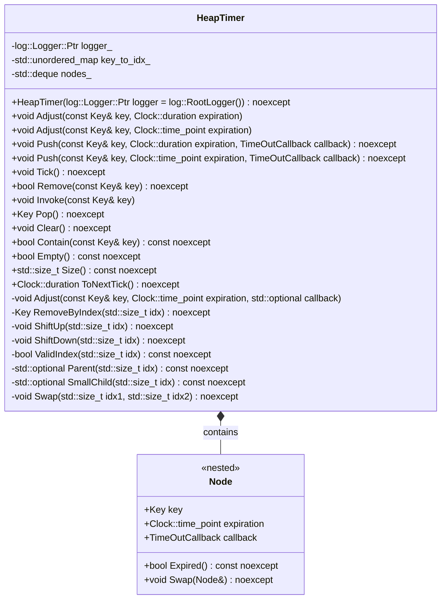

# デザイン文書: heap-timerモジュール

## 1. 概要と責務

### 責務
- `HeapTimer`クラスは、キーを用いたタイマーの管理システムを提供する。
- タイマーは最小ヒープ構造で管理され、期限切れになったときにコールバック関数が呼び出される。

## 2. 構造図



## 3. インターフェースと依存関係

### 公開インターフェース

| 完全な名前 | 引数 | 戻り値の型 | 修飾 | 使用するメンバ/型/定数 | 呼び出す関数・メソッド | 継承元/テンプレート型 |
|---|---|---|---|---|---|---|
| `HeapTimer::HeapTimer` | `log::Logger::Ptr logger = log::RootLogger()` | なし | `noexcept` | `logger_`, `key_to_idx_`, `nodes_` | なし | なし |
| `HeapTimer::Adjust` (duration) | `const Key& key, Clock::duration expiration` | なし | なし | `key_to_idx_`, `nodes_` | `Adjust(key, Clock::now() + expiration)` | なし |
| `HeapTimer::Adjust` (time_point) | `const Key& key, Clock::time_point expiration` | なし | なし | `key_to_idx_`, `nodes_` | `Adjust(key, expiration, std::nullopt)` | なし |
| `HeapTimer::Push` (duration) | `const Key& key, Clock::duration expiration, TimeOutCallback callback` | なし | `noexcept` | `key_to_idx_`, `nodes_` | `Push(key, Clock::now() + expiration, std::move(callback))` | なし |
| `HeapTimer::Push` (time_point) | `const Key& key, Clock::time_point expiration, TimeOutCallback callback` | なし | `noexcept` | `key_to_idx_`, `nodes_` | `ShiftUp(idx)` | なし |
| `HeapTimer::Tick` | なし | なし | `noexcept` | `logger_`, `key_to_idx_`, `nodes_` | `RemoveByIndex(0)`, `callback(key)` | なし |
| `HeapTimer::Remove` | `const Key& key` | `bool` | `noexcept` | `key_to_idx_`, `nodes_` | `RemoveByIndex(idx)` | なし |
| `HeapTimer::Invoke` | `const Key& key` | なし | なし | `logger_`, `key_to_idx_`, `nodes_` | `callback(key)`, `RemoveByIndex(idx)` | なし |
| `HeapTimer::Pop` | なし | `Key` | `noexcept` | `key_to_idx_`, `nodes_` | `RemoveByIndex(0)` | なし |
| `HeapTimer::Clear` | なし | なし | `noexcept` | `key_to_idx_`, `nodes_` | なし | なし |
| `HeapTimer::Contain` | `const Key& key` | `bool` | `noexcept` | `key_to_idx_` | なし | なし |
| `HeapTimer::Empty` | なし | `bool` | `noexcept` | `nodes_` | なし | なし |
| `HeapTimer::Size` | なし | `std::size_t` | `noexcept` | `nodes_` | なし | なし |
| `HeapTimer::ToNextTick` | なし | `Clock::duration` | `noexcept` | `logger_`, `key_to_idx_`, `nodes_` | `Tick()`, `RemoveByIndex(idx)` | なし |

### 実装上の処理

| 完全な名前 | 引数 | 戻り値の型 | 修飾 | 使用するメンバ/型/定数 | 呼び出す関数・メソッド | 継承元/テンプレート型 |
|---|---|---|---|---|---|---|
| `HeapTimer::Adjust` (time_point, callback) | `const Key& key, Clock::time_point expiration, std::optional<TimeOutCallback> callback` | なし | なし | `key_to_idx_`, `nodes_` | `ShiftUp(idx)` or `ShiftDown(idx)` | なし |
| `HeapTimer::RemoveByIndex` | `std::size_t idx` | `Key` | `noexcept` | `logger_`, `key_to_idx_`, `nodes_` | `ShiftUp(idx)`, `ShiftDown(0)` | なし |
| `HeapTimer::ShiftUp` | `std::size_t idx` | なし | `noexcept` | `key_to_idx_`, `nodes_` | `Parent(idx)`, `Swap(*parent, idx)` | なし |
| `HeapTimer::ShiftDown` | `std::size_t idx` | なし | `noexcept` | `key_to_idx_`, `nodes_` | `SmallChild(idx)`, `Swap(*child, idx)` | なし |
| `HeapTimer::ValidIndex` | `std::size_t idx` | `bool` | `noexcept` | `nodes_` | なし | なし |
| `HeapTimer::Parent` | `std::size_t idx` | `std::optional<std::size_t>` | `noexcept` | `nodes_` | なし | なし |
| `HeapTimer::SmallChild` | `std::size_t idx` | `std::optional<std::size_t>` | `noexcept` | `nodes_` | なし | なし |
| `HeapTimer::Swap` | `std::size_t idx1, std::size_t idx2` | なし | `noexcept` | `key_to_idx_`, `nodes_` | `Node::Swap(nodes_[idx1], nodes_[idx2])` | なし |

## 4. 処理フロー図

### Tickメソッドの処理フロー
```mermaid
flowchart TD
    A[開始] --> B{Empty()?}
    B -- true --> C[終了]
    B -- false --> D[Pop()]
    E[RemoveByIndex(0)] --> F[Expired()?]
    F -- true --> G[callback(key)]
    H[例外処理] --> I[Tick()に戻る]
    G --> J[Tick()に戻る]
    F -- false --> C
```

### Pushメソッドの処理フロー
```mermaid
flowchart TD
    A[開始] --> B{Contain(key)?}
    B -- true --> C[Adjust(key, expiration, callback)]
    B -- false --> D[key_to_idx_.emplace(key, idx)]
    E[nodes_.push_back()] --> F[ShiftUp(idx)]
    G[終了]
```

## 5. シーケンス図

該当なし
- 元コードから複数の関数、メソッド、オブジェクト間の呼び出し順序を直接確認できない。

## 6. 関数・メソッド仕様書

### HeapTimer::HeapTimer
| 項目 | 記述内容 |
|---|---|
| 完全な名前 | `ws::HeapTimer<Key>::HeapTimer` |
| 目的 | タイマーシステムの初期化 |
| 引数 | `log::Logger::Ptr logger`: ロガー。nullptrの場合、グローバルルートロガーを使用する |
| 戻り値 | なし |
| 前提条件 | なし |
| 事後条件 | `logger_`が設定される。`key_to_idx_`と`nodes_`は空になる |
| 動作の説明 | ロガーを設定し、内部データ構造を初期化する |
| 状態変更・副作用 | `logger_`, `key_to_idx_`, `nodes_`が初期化される |
| 依存関係 | `log::Logger::Ptr`, `std::unordered_map<Key, std::size_t>`, `std::deque<Node>` |
| 境界条件 | loggerがnullptrの場合、グローバルルートロガーを使用する |
| エラー処理 | なし |
| 不変条件 | なし |

### HeapTimer::Adjust (duration)
| 項目 | 記述内容 |
|---|---|
| 完全な名前 | `ws::HeapTimer<Key>::Adjust` |
| 目的 | タイマーの期限を調整する |
| 引数 | `const Key& key`: キー, `Clock::duration expiration`: 新しい有効期限からの経過時間 |
| 戻り値 | なし |
| 前提条件 | 指定されたキーが存在する |
| 事後条件 | 指定されたキーのタイマーの期限が更新される |
| 動作の説明 | `Adjust(key, Clock::now() + expiration)`を呼び出す |
| 状態変更・副作用 | `nodes_`内の指定されたノードの期限とコールバックが更新される |
| 依存関係 | `Clock::duration`, `std::optional<TimeOutCallback>` |
| 境界条件 | なし |
| エラー処理 | 指定されたキーが存在しない場合、`std::out_of_range`例外を投げる |
| 不変条件 | なし |

### HeapTimer::Adjust (time_point)
| 項目 | 記述内容 |
|---|---|
| 完全な名前 | `ws::HeapTimer<Key>::Adjust` |
| 目的 | タイマーの期限を調整する |
| 引数 | `const Key& key`: キー, `Clock::time_point expiration`: 新しい有効期限 |
| 戻り値 | なし |
| 前提条件 | 指定されたキーが存在する |
| 事後条件 | 指定されたキーのタイマーの期限が更新される |
| 動作の説明 | `Adjust(key, expiration, std::nullopt)`を呼び出す |
| 状態変更・副作用 | `nodes_`内の指定されたノードの期限とコールバックが更新される |
| 依存関係 | `Clock::time_point`, `std::optional<TimeOutCallback>` |
| 境界条件 | なし |
| エラー処理 | 指定されたキーが存在しない場合、`std::out_of_range`例外を投げる |
| 不変条件 | なし |

### HeapTimer::Push (duration)
| 項目 | 記述内容 |
|---|---|
| 完全な名前 | `ws::HeapTimer<Key>::Push` |
| 目的 | タイマーを追加する |
| 引数 | `const Key& key`: キー, `Clock::duration expiration`: 新しい有効期限からの経過時間, `TimeOutCallback callback`: 期限切れ時に呼び出されるコールバック |
| 戻り値 | なし |
| 前提条件 | なし |
| 事後条件 | タイマーが追加され、ヒープ構造が維持される |
| 動作の説明 | `Push(key, Clock::now() + expiration, std::move(callback))`を呼び出す |
| 状態変更・副作用 | `key_to_idx_`, `nodes_`に新しいノードが追加され、ヒープ構造が維持される |
| 依存関係 | `Clock::duration`, `TimeOutCallback` |
| 境界条件 | なし |
| エラー処理 | なし |
| 不変条件 | なし |

### HeapTimer::Push (time_point)
| 項目 | 記述内容 |
|---|---|
| 完全な名前 | `ws::HeapTimer<Key>::Push` |
| 目的 | タイマーを追加する |
| 引数 | `const Key& key`: キー, `Clock::time_point expiration`: 新しい有効期限, `TimeOutCallback callback`: 期限切れ時に呼び出されるコールバック |
| 戻り値 | なし |
| 前提条件 | なし |
| 事後条件 | タイマーが追加され、ヒープ構造が維持される |
| 動作の説明 | `key_to_idx_`にキーとインデックスを追加し、`nodes_`に新しいノードを追加する。その後、`ShiftUp(idx)`を呼び出す |
| 状態変更・副作用 | `key_to_idx_`, `nodes_`に新しいノードが追加され、ヒープ構造が維持される |
| 依存関係 | `Clock::time_point`, `TimeOutCallback` |
| 境界条件 | なし |
| エラー処理 | なし |
| 不変条件 | なし |

### HeapTimer::Tick
| 項目 | 記述内容 |
|---|---|
| 完全な名前 | `ws::HeapTimer<Key>::Tick` |
| 目的 | 期限切れのタイマーを処理する |
| 引数 | なし |
| 戻り値 | なし |
| 前提条件 | なし |
| 事後条件 | 期限切れのタイマーが削除され、コールバックが呼び出される |
| 動作の説明 | `nodes_`の先頭ノードが期限切れである場合、そのノードを削除し、コールバックを呼び出す。例外が発生した場合はログに記録する |
| 状態変更・副作用 | 期限切れのタイマーが削除され、コールバックが呼び出される |
| 依存関係 | `log::Logger::Ptr`, `std::optional<TimeOutCallback>` |
| 境界条件 | なし |
| エラー処理 | コールバック内で例外が発生した場合、ログに記録する |
| 不変条件 | なし |

### HeapTimer::Remove
| 項目 | 記述内容 |
|---|---|
| 完全な名前 | `ws::HeapTimer<Key>::Remove` |
| 目的 | 指定されたキーのタイマーを削除する |
| 引数 | `const Key& key`: キー |
| 戻り値 | `bool`: 削除に成功したかどうか |
| 前提条件 | なし |
| 事後条件 | 指定されたキーのタイマーが削除される |
| 動作の説明 | `key_to_idx_`からインデックスを取得し、`RemoveByIndex(idx)`を呼び出す。キーが存在しない場合はfalseを返す |
| 状態変更・副作用 | 指定されたキーのタイマーが削除される |
| 依存関係 | `std::unordered_map<Key, std::size_t>` |
| 境界条件 | なし |
| エラー処理 | なし |
| 不変条件 | なし |

### HeapTimer::Invoke
| 項目 | 記述内容 |
|---|---|
| 完全な名前 | `ws::HeapTimer<Key>::Invoke` |
| 目的 | 指定されたキーのタイマーを呼び出し、削除する |
| 引数 | `const Key& key`: キー |
| 戻り値 | なし |
| 前提条件 | 指定されたキーが存在する |
| 事後条件 | 指定されたキーのタイマーが呼び出され、削除される |
| 動作の説明 | `key_to_idx_`からインデックスを取得し、コールバックを呼び出す。その後、`RemoveByIndex(idx)`を呼び出す。例外が発生した場合はログに記録する |
| 状態変更・副作用 | 指定されたキーのタイマーが呼び出され、削除される |
| 依存関係 | `log::Logger::Ptr`, `std::optional<TimeOutCallback>` |
| 境界条件 | なし |
| エラー処理 | コールバック内で例外が発生した場合、ログに記録する |
| 不変条件 | なし |

### HeapTimer::Pop
| 項目 | 記述内容 |
|---|---|
| 完全な名前 | `ws::HeapTimer<Key>::Pop` |
| 目的 | ヒープの先頭ノードを削除し、キーを返す |
| 引数 | なし |
| 戻り値 | `Key`: 削除されたノードのキー |
| 前提条件 | ヒープが空でない |
| 事後条件 | ヒープの先頭ノードが削除され、ヒープ構造が維持される |
| 動作の説明 | `RemoveByIndex(0)`を呼び出す |
| 状態変更・副作用 | ヒープの先頭ノードが削除され、ヒープ構造が維持される |
| 依存関係 | なし |
| 境界条件 | ヒープが空の場合、未定義動作 |
| エラー処理 | なし |
| 不変条件 | なし |

### HeapTimer::Clear
| 項目 | 記述内容 |
|---|---|
| 完全な名前 | `ws::HeapTimer<Key>::Clear` |
| 目的 | ヒープをクリアする |
| 引数 | なし |
| 戻り値 | なし |
| 前提条件 | なし |
| 事後条件 | ヒープが空になる |
| 動作の説明 | `key_to_idx_`と`nodes_`をクリアする |
| 状態変更・副作用 | `key_to_idx_`, `nodes_`がクリアされる |
| 依存関係 | なし |
| 境界条件 | なし |
| エラー処理 | なし |
| 不変条件 | なし |

### HeapTimer::Contain
| 項目 | 記述内容 |
|---|---|
| 完全な名前 | `ws::HeapTimer<Key>::Contain` |
| 目的 | 指定されたキーのタイマーが存在するかどうかを確認する |
| 引数 | `const Key& key`: キー |
| 戻り値 | `bool`: 指定されたキーのタイマーが存在するかどうか |
| 前提条件 | なし |
| 事後条件 | なし |
| 動作の説明 | `key_to_idx_`からキーを検索し、存在するかどうかを返す |
| 状態変更・副作用 | なし |
| 依存関係 | `std::unordered_map<Key, std::size_t>` |
| 境界条件 | なし |
| エラー処理 | なし |
| 不変条件 | なし |

### HeapTimer::Empty
| 項目 | 記述内容 |
|---|---|
| 完全な名前 | `ws::HeapTimer<Key>::Empty` |
| 目的 | ヒープが空かどうかを確認する |
| 引数 | なし |
| 戻り値 | `bool`: ヒープが空かどうか |
| 前提条件 | なし |
| 事後条件 | なし |
| 動作の説明 | `nodes_`が空かどうかを返す |
| 状態変更・副作用 | なし |
| 依存関係 | なし |
| 境界条件 | なし |
| エラー処理 | なし |
| 不変条件 | なし |

### HeapTimer::Size
| 項目 | 記述内容 |
|---|---|
| 完全な名前 | `ws::HeapTimer<Key>::Size` |
| 目的 | ヒープ内のノード数を返す |
| 引数 | なし |
| 戻り値 | `std::size_t`: ヒープ内のノード数 |
| 前提条件 | なし |
| 事後条件 | なし |
| 動作の説明 | `nodes_`のサイズを返す |
| 状態変更・副作用 | なし |
| 依存関係 | なし |
| 境界条件 | なし |
| エラー処理 | なし |
| 不変条件 | なし |

### HeapTimer::ToNextTick
| 項目 | 記述内容 |
|---|---|
| 完全な名前 | `ws::HeapTimer<Key>::ToNextTick` |
| 目的 | 次のタイマーまでの間隔を返す |
| 引数 | なし |
| 戻り値 | `Clock::duration`: 次のタイマーまでの間隔 |
| 前提条件 | なし |
| 事後条件 | 期限切れのタイマーが処理され、次のタイマーまでの間隔が返される |
| 動作の説明 | `Tick()`を呼び出し、`nodes_`の先頭ノードの有効期限から現在時刻までの間隔を計算する。ヒープが空の場合、0を返す |
| 状態変更・副作用 | 期限切れのタイマーが処理される |
| 依存関係 | `log::Logger::Ptr`, `std::optional<TimeOutCallback>` |
| 境界条件 | ヒープが空の場合、0を返す |
| エラー処理 | コールバック内で例外が発生した場合、ログに記録する |
| 不変条件 | なし |

## 7. 状態遷移と重要な条件

### HeapTimer::Adjust
- 更新前の状態: 指定されたキーのタイマーが存在する
- 更新条件: 新しい有効期限が設定される
- 更新対象と更新値: `nodes_`内の指定されたノードの期限とコールバック
- 更新されない条件: なし
- 更新順序: 期限を更新し、必要に応じてヒープ構造を調整する
- 処理後に成立する条件: 指定されたキーのタイマーの期限が更新される

### HeapTimer::Push
- 更新前の状態: ヒープが空であるか、既存のノードが存在する
- 更新条件: 新しいタイマーが追加される
- 更新対象と更新値: `key_to_idx_`, `nodes_`に新しいノードが追加され、ヒープ構造が維持される
- 更新されない条件: 既存のキーが存在する場合、期限とコールバックのみ更新される
- 更新順序: キーとインデックスを追加し、新しいノードを追加してヒープ構造を調整する
- 処理後に成立する条件: 新しいタイマーが追加され、ヒープ構造が維持される

### HeapTimer::Tick
- 更新前の状態: ヒープが空であるか、期限切れのタイマーが存在する
- 更新条件: 期限切れのタイマーが削除され、コールバックが呼び出される
- 更新対象と更新値: `key_to_idx_`, `nodes_`から期限切れのノードが削除され、ヒープ構造が維持される
- 更新されない条件: 期限切れのタイマーがない場合
- 更新順序: 期限切れのタイマーを削除し、コールバックを呼び出す。例外が発生した場合はログに記録する
- 処理後に成立する条件: 期限切れのタイマーが削除され、コールバックが呼び出される

### HeapTimer::Remove
- 更新前の状態: 指定されたキーのタイマーが存在する
- 更新条件: タイマーが削除される
- 更新対象と更新値: `key_to_idx_`, `nodes_`から指定されたノードが削除され、ヒープ構造が維持される
- 更新されない条件: 指定されたキーのタイマーがない場合
- 更新順序: キーを検索し、インデックスを取得して`RemoveByIndex(idx)`を呼び出す
- 処理後に成立する条件: 指定されたキーのタイマーが削除される

### HeapTimer::Invoke
- 更新前の状態: 指定されたキーのタイマーが存在する
- 更新条件: タイマーが呼び出され、削除される
- 更新対象と更新値: `key_to_idx_`, `nodes_`から指定されたノードが削除され、ヒープ構造が維持される
- 更新されない条件: 指定されたキーのタイマーがない場合
- 更新順序: キーを検索し、インデックスを取得してコールバックを呼び出す。その後、`RemoveByIndex(idx)`を呼び出す。例外が発生した場合はログに記録する
- 処理後に成立する条件: 指定されたキーのタイマーが呼び出され、削除される

### HeapTimer::Pop
- 更新前の状態: ヒープが空でない
- 更新条件: 先頭ノードが削除される
- 更新対象と更新値: `key_to_idx_`, `nodes_`から先頭ノードが削除され、ヒープ構造が維持される
- 更新されない条件: ヒープが空の場合
- 更新順序: `RemoveByIndex(0)`を呼び出す
- 処理後に成立する条件: 先頭ノードが削除され、ヒープ構造が維持される

### HeapTimer::Clear
- 更新前の状態: 任意の状態
- 更新条件: ヒープがクリアされる
- 更新対象と更新値: `key_to_idx_`, `nodes_`がクリアされる
- 更新されない条件: なし
- 更新順序: `key_to_idx_`と`nodes_`をクリアする
- 処理後に成立する条件: ヒープが空になる

### HeapTimer::Contain
- 更新前の状態: 任意の状態
- 更新条件: なし
- 更新対象と更新値: なし
- 更新されない条件: なし
- 更新順序: `key_to_idx_`からキーを検索し、存在するかどうかを返す
- 処理後に成立する条件: なし

### HeapTimer::Empty
- 更新前の状態: 任意の状態
- 更新条件: なし
- 更新対象と更新値: なし
- 更新されない条件: なし
- 更新順序: `nodes_`が空かどうかを返す
- 処理後に成立する条件: なし

### HeapTimer::Size
- 更新前の状態: 任意の状態
- 更新条件: なし
- 更新対象と更新値: なし
- 更新されない条件: なし
- 更新順序: `nodes_`のサイズを返す
- 処理後に成立する条件: なし

### HeapTimer::ToNextTick
- 更新前の状態: 任意の状態
- 更新条件: 期限切れのタイマーが処理され、次のタイマーまでの間隔が計算される
- 更新対象と更新値: `key_to_idx_`, `nodes_`から期限切れのノードが削除され、ヒープ構造が維持される
- 更新されない条件: ヒープが空の場合
- 更新順序: `Tick()`を呼び出し、`nodes_`の先頭ノードの有効期限から現在時刻までの間隔を計算する。ヒープが空の場合、0を返す
- 処理後に成立する条件: 次のタイマーまでの間隔が返される

## 8. 確認不能事項

確認不能事項なし