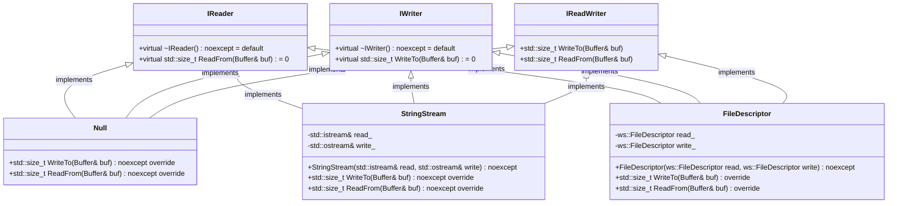
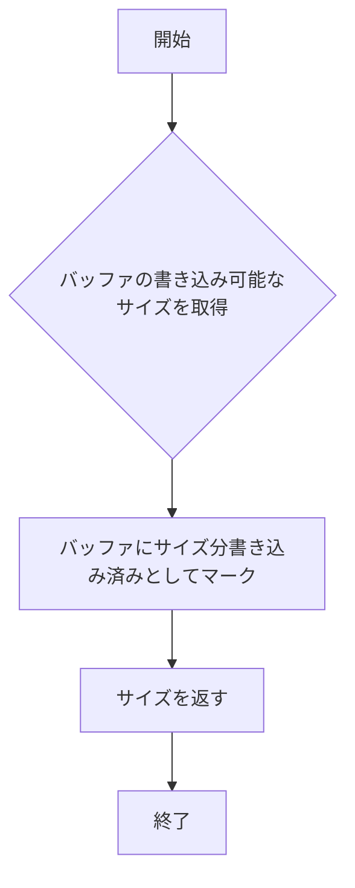
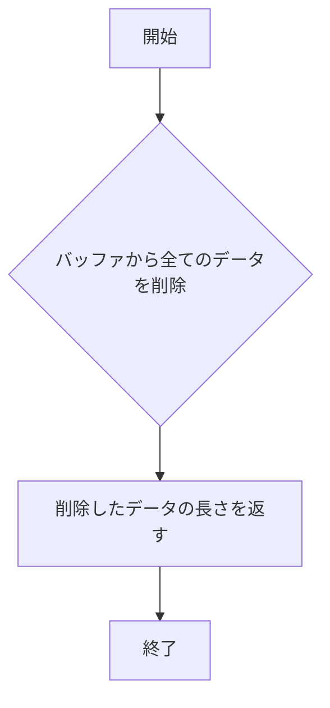
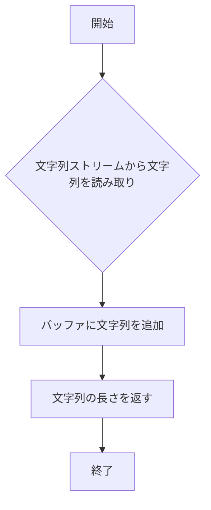
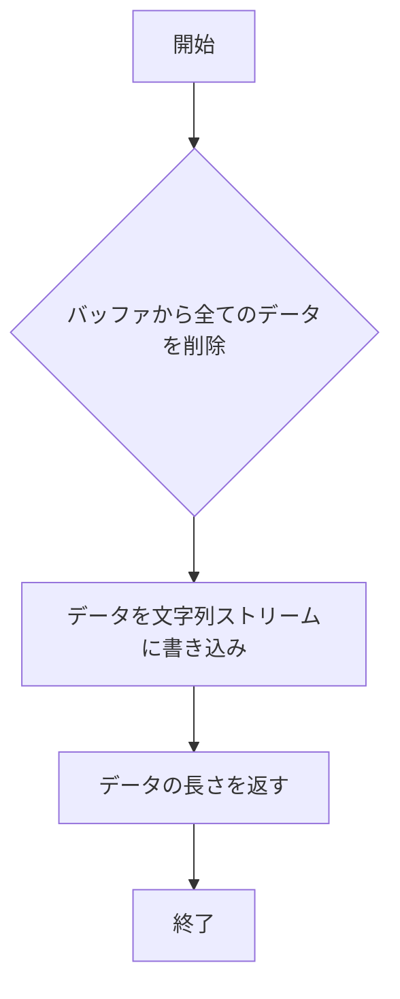
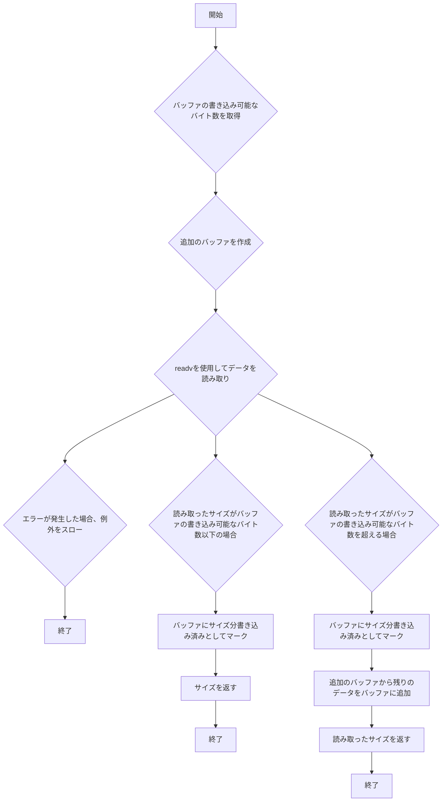
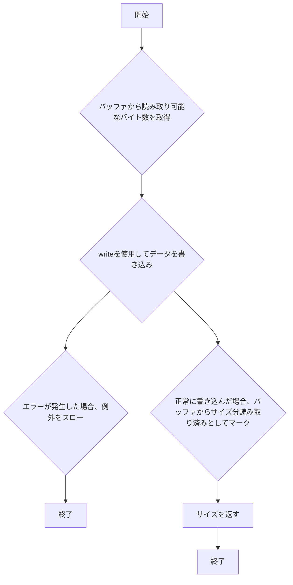

# 設計文書

## 1. 概要と責務

### モジュールの概要
このモジュールは、バッファとの読み書き操作を抽象化したインターフェースとその実装を提供します。主に`IReader`, `IWriter`, `IReadWriter`というインターフェースと、それらを継承して実装した具体的なクラス（`Null`, `StringStream`, `FileDescriptor`）が含まれています。

### モジュールの責務
- バッファからの読み込み操作を抽象化する。
- バッファへの書き込み操作を抽象化する。
- 特定の入出力ソース（標準入出力、ファイルディスクリプタ）とのバッファ間のデータ転送を行う。

## 2. 構造図

## 3. インターフェースと依存関係

### 公開インターフェース

#### `IReader`
- **完全な名前**: `ws::io::IReader`
- **公開メソッド**:
    - `virtual std::size_t ReadFrom(Buffer& buf) = 0`

#### `IWriter`
- **完全な名前**: `ws::io::IWriter`
- **公開メソッド**:
    - `virtual std::size_t WriteTo(Buffer& buf) = 0`

#### `IReadWriter`
- **完全な名前**: `ws::io::IReadWriter`
- **公開メソッド**:
    - `std::size_t WriteTo(Buffer& buf)`
    - `std::size_t ReadFrom(Buffer& buf)`

#### `Null`
- **完全な名前**: `ws::io::Null`
- **公開メソッド**:
    - `std::size_t WriteTo(Buffer& buf) noexcept override`
    - `std::size_t ReadFrom(Buffer& buf) noexcept override`

#### `StringStream`
- **完全な名前**: `ws::io::StringStream`
- **コンストラクタ**:
    - `explicit StringStream(std::istream& read, std::ostream& write) noexcept`
- **公開メソッド**:
    - `std::size_t WriteTo(Buffer& buf) noexcept override`
    - `std::size_t ReadFrom(Buffer& buf) noexcept override`

#### `FileDescriptor`
- **完全な名前**: `ws::io::FileDescriptor`
- **コンストラクタ**:
    - `explicit FileDescriptor(ws::FileDescriptor read, ws::FileDescriptor write) noexcept`
- **公開メソッド**:
    - `std::size_t WriteTo(Buffer& buf) override`
    - `std::size_t ReadFrom(Buffer& buf) override`

### 実装上の処理

#### `Null`
- **完全な名前**: `ws::io::Null`
- **公開メソッド**:
    - `std::size_t WriteTo(Buffer& buf) noexcept override`: バッファの書き込み可能なスペースを消費しますが、実際には何も書き込みません。
    - `std::size_t ReadFrom(Buffer& buf) noexcept override`: バッファから読み取り可能なデータを全て削除しますが、実際には何も読み取りません。

#### `StringStream`
- **完全な名前**: `ws::io::StringStream`
- **公開メソッド**:
    - `std::size_t WriteTo(Buffer& buf) noexcept override`: 文字列ストリームから文字列を読み取り、バッファに追加します。
    - `std::size_t ReadFrom(Buffer& buf) noexcept override`: バッファから全てのデータを削除し、それを文字列ストリームに書き込みます。

#### `FileDescriptor`
- **完全な名前**: `ws::io::FileDescriptor`
- **公開メソッド**:
    - `std::size_t WriteTo(Buffer& buf) override`: ファイルディスクリプタからデータを読み取り、バッファに追加します。必要に応じて追加のバッファを使用してデータを読み込みます。
    - `std::size_t ReadFrom(Buffer& buf) override`: バッファからデータを削除し、それをファイルディスクリプタに書き込みます。

### 依存関係
- **`IReader`, `IWriter`, `IReadWriter`**: 継承元。
- **`Buffer`**: 使用する型。
- **`std::istream`, `std::ostream`**: `StringStream`で使用する型。
- **`ws::FileDescriptor`**: `FileDescriptor`で使用する型。

## 4. 処理フロー図

### `Null::WriteTo`

### `Null::ReadFrom`

### `StringStream::WriteTo`

### `StringStream::ReadFrom`

### `FileDescriptor::WriteTo`

### `FileDescriptor::ReadFrom`

## 5. シーケンス図

該当なし
- **理由**: 元コードから複数の関数、メソッド、オブジェクト間の呼び出し順序を直接確認できない。

## 6. 関数・メソッド仕様書

### `Null::WriteTo`
| 項目 | 記述内容 |
|---|---|
| 完全な名前 | `ws::io::Null::WriteTo` |
| 目的 | バッファの書き込み可能なスペースを消費しますが、実際には何も書き込みません。 |
| 引数 | `Buffer& buf`: 書き込み対象のバッファ |
| 戻り値 | `std::size_t`: 消費したバッファのサイズ |
| 前提条件 | バッファが有効である |
| 事後条件 | バッファの書き込み可能なスペースが消費される |
| 動作の説明 | バッファの書き込み可能なサイズを取得し、それをバッファに書き込み済みとしてマークします。その後、そのサイズを返します。 |
| 状態変更・副作用 | バッファの書き込み位置が更新される |
| 依存関係 | `Buffer` |
| 境界条件 | バッファが空の場合、0を返す |
| エラー処理 | 明示的なエラー処理は確認できない |
| 不変条件 | バッファの読み取り位置は変更されない |

### `Null::ReadFrom`
| 項目 | 記述内容 |
|---|---|
| 完全な名前 | `ws::io::Null::ReadFrom` |
| 目的 | バッファから全てのデータを削除しますが、実際には何も読み取りません。 |
| 引数 | `Buffer& buf`: 読み取り対象のバッファ |
| 戻り値 | `std::size_t`: 削除したデータの長さ |
| 前提条件 | バッファが有効である |
| 事後条件 | バッファから全てのデータが削除される |
| 動作の説明 | バッファから全てのデータを削除し、その長さを返します。 |
| 状態変更・副作用 | バッファの読み取り位置と書き込み位置が更新される |
| 依存関係 | `Buffer` |
| 境界条件 | バッファが空の場合、0を返す |
| エラー処理 | 明示的なエラー処理は確認できない |
| 不変条件 | バッファの内容は変更されない |

### `StringStream::WriteTo`
| 項目 | 記述内容 |
|---|---|
| 完全な名前 | `ws::io::StringStream::WriteTo` |
| 目的 | 文字列ストリームから文字列を読み取り、バッファに追加します。 |
| 引数 | `Buffer& buf`: 書き込み対象のバッファ |
| 戻り値 | `std::size_t`: 追加したデータの長さ |
| 前提条件 | バッファと文字列ストリームが有効である |
| 事後条件 | 文字列ストリームから読み取ったデータがバッファに追加される |
| 動作の説明 | 文字列ストリームから文字列を読み取り、それをバッファに追加します。その後、その長さを返します。 |
| 状態変更・副作用 | バッファの書き込み位置が更新され、文字列ストリームの読み取り位置が更新される |
| 依存関係 | `Buffer`, `std::istream` |
| 境界条件 | 文字列ストリームが空の場合、0を返す |
| エラー処理 | 明示的なエラー処理は確認できない |
| 不変条件 | バッファの読み取り位置は変更されない |

### `StringStream::ReadFrom`
| 項目 | 記述内容 |
|---|---|
| 完全な名前 | `ws::io::StringStream::ReadFrom` |
| 目的 | バッファから全てのデータを削除し、それを文字列ストリームに書き込みます。 |
| 引数 | `Buffer& buf`: 読み取り対象のバッファ |
| 戻り値 | `std::size_t`: 削除したデータの長さ |
| 前提条件 | バッファと文字列ストリームが有効である |
| 事後条件 | バッファから全てのデータが削除され、それを文字列ストリームに書き込まれる |
| 動作の説明 | バッファから全てのデータを削除し、それを文字列ストリームに書き込みます。その後、その長さを返します。 |
| 状態変更・副作用 | バッファの読み取り位置と書き込み位置が更新され、文字列ストリームの書き込み位置が更新される |
| 依存関係 | `Buffer`, `std::ostream` |
| 境界条件 | バッファが空の場合、0を返す |
| エラー処理 | 明示的なエラー処理は確認できない |
| 不変条件 | バッファの内容は変更されない |

### `FileDescriptor::WriteTo`
| 項目 | 記述内容 |
|---|---|
| 完全な名前 | `ws::io::FileDescriptor::WriteTo` |
| 目的 | ファイルディスクリプタからデータを読み取り、バッファに追加します。必要に応じて追加のバッファを使用してデータを読み込みます。 |
| 引数 | `Buffer& buf`: 書き込み対象のバッファ |
| 戻り値 | `std::size_t`: 追加したデータの長さ |
| 前提条件 | バッファとファイルディスクリプタが有効である |
| 事後条件 | ファイルディスクリプタから読み取ったデータがバッファに追加される |
| 動作の説明 | バッファの書き込み可能なバイト数を取得し、追加のバッファを作成します。readvを使用してデータを読み取ります。エラーが発生した場合、例外をスローします。読み取ったサイズがバッファの書き込み可能なバイト数以下の場合、バッファにサイズ分書き込み済みとしてマークします。読み取ったサイズがバッファの書き込み可能なバイト数を超える場合、バッファにサイズ分書き込み済みとしてマークし、追加のバッファから残りのデータをバッファに追加します。その後、読み取ったサイズを返します。 |
| 状態変更・副作用 | バッファの書き込み位置が更新され、ファイルディスクリプタの読み取り位置が更新される |
| 依存関係 | `Buffer`, `ws::FileDescriptor` |
| 境界条件 | ファイルディスクリプタからデータを読み取ることができない場合、例外をスローする |
| エラー処理 | readvの戻り値が負の場合、例外をスローする |
| 不変条件 | バッファの読み取り位置は変更されない |

### `FileDescriptor::ReadFrom`
| 項目 | 記述内容 |
|---|---|
| 完全な名前 | `ws::io::FileDescriptor::ReadFrom` |
| 目的 | バッファからデータを削除し、それをファイルディスクリプタに書き込みます。 |
| 引数 | `Buffer& buf`: 読み取り対象のバッファ |
| 戻り値 | `std::size_t`: 削除したデータの長さ |
| 前提条件 | バッファとファイルディスクリプタが有効である |
| 事後条件 | バッファから読み取ったデータがファイルディスクリプタに書き込まれる |
| 動作の説明 | バッファから読み取り可能なバイト数を取得し、writeを使用してデータを書き込みます。エラーが発生した場合、例外をスローします。正常に書き込んだ場合、バッファからサイズ分読み取り済みとしてマークします。その後、サイズを返します。 |
| 状態変更・副作用 | バッファの読み取り位置と書き込み位置が更新され、ファイルディスクリプタの書き込み位置が更新される |
| 依存関係 | `Buffer`, `ws::FileDescriptor` |
| 境界条件 | ファイルディスクリプタにデータを書き込むことができない場合、例外をスローする |
| エラー処理 | writeの戻り値が負の場合、例外をスローする |
| 不変条件 | バッファの内容は変更されない |

## 7. 状態遷移と重要な条件

該当なし
- **理由**: このモジュールでは明確な状態遷移が定義されていない。

## 8. 確認不能事項

確認不能事項なし