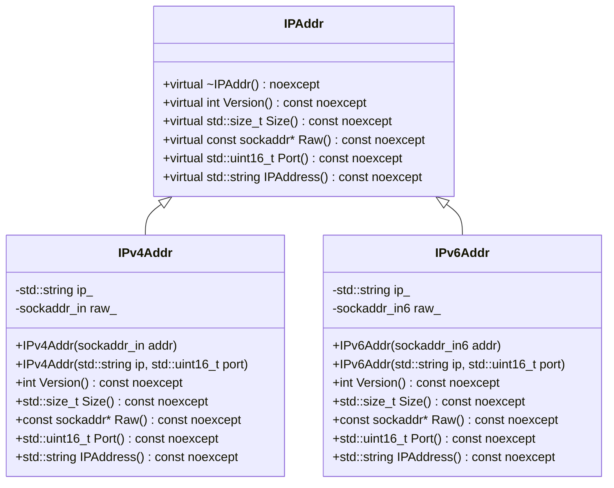

# 設計文書

## 1. 概要と責務

### 概要
このモジュールは、IPアドレスを表す抽象クラス`IPAddr`とその派生クラス`IPv4Addr`、`IPv6Addr`を提供します。これらのクラスは、IPアドレスのバージョン、ソケットアドレスのサイズ、生のソケットアドレス、ポート番号、およびIPアドレス文字列を取得するためのインターフェースを定義しています。

### 責務
- IPアドレスのバージョンを提供する。
- ソケットアドレスのサイズを提供する。
- 生のソケットアドレスを提供する。
- ポート番号を提供する。
- IPアドレス文字列を提供する。

## 2. 構造図



## 3. インターフェースと依存関係

### 公開インターフェース

#### `IPAddr`
- **完全な名前**: `ws::IPAddr`
- **メソッド**:
  - `virtual ~IPAddr() noexcept`: デストラクタ
  - `virtual int Version() const noexcept`: IPバージョンを返す。
  - `virtual std::size_t Size() const noexcept`: ソケットアドレスのサイズを返す。
  - `virtual const sockaddr* Raw() const noexcept`: 生のソケットアドレスを返す。
  - `virtual std::uint16_t Port() const noexcept`: ポート番号を返す。
  - `virtual std::string IPAddress() const noexcept`: IPアドレス文字列を返す。

#### `IPv4Addr`
- **完全な名前**: `ws::IPv4Addr`
- **コンストラクタ**:
  - `explicit IPv4Addr(sockaddr_in addr)`: `sockaddr_in`から初期化する。
  - `explicit IPv4Addr(std::string ip, std::uint16_t port)`: IPアドレス文字列とポート番号から初期化する。
- **メソッド**:
  - `int Version() const noexcept override`: IPバージョンを返す。
  - `std::size_t Size() const noexcept override`: ソケットアドレスのサイズを返す。
  - `const sockaddr* Raw() const noexcept override`: 生のソケットアドレスを返す。
  - `std::uint16_t Port() const noexcept override`: ポート番号を返す。
  - `std::string IPAddress() const noexcept override`: IPアドレス文字列を返す。

#### `IPv6Addr`
- **完全な名前**: `ws::IPv6Addr`
- **コンストラクタ**:
  - `explicit IPv6Addr(sockaddr_in6 addr)`: `sockaddr_in6`から初期化する。
  - `explicit IPv6Addr(std::string ip, std::uint16_t port)`: IPアドレス文字列とポート番号から初期化する。
- **メソッド**:
  - `int Version() const noexcept override`: IPバージョンを返す。
  - `std::size_t Size() const noexcept override`: ソケットアドレスのサイズを返す。
  - `const sockaddr* Raw() const noexcept override`: 生のソケットアドレスを返す。
  - `std::uint16_t Port() const noexcept override`: ポート番号を返す。
  - `std::string IPAddress() const noexcept override`: IPアドレス文字列を返す。

### 実装上の処理

#### `IPv4Addr`
- **コンストラクタ**:
  - `explicit IPv4Addr(sockaddr_in addr)`: 引数として与えられた`sockaddr_in`構造体からIPアドレスとポート番号を初期化する。
  - `explicit IPv4Addr(std::string ip, std::uint16_t port)`: IPアドレス文字列とポート番号から`sockaddr_in`構造体を作成し、それを使用して初期化する。
- **メソッド**:
  - `int Version() const noexcept override`: 定数`version`を返す。
  - `std::size_t Size() const noexcept override`: `sizeof(raw_)`を返す。
  - `const sockaddr* Raw() const noexcept override`: `raw_`のアドレスをキャストして返す。
  - `std::uint16_t Port() const noexcept override`: ネットワークバイトオーダーからホストバイトオーダーに変換したポート番号を返す。
  - `std::string IPAddress() const noexcept override`: IPアドレス文字列`ip_`を返す。

#### `IPv6Addr`
- **コンストラクタ**:
  - `explicit IPv6Addr(sockaddr_in6 addr)`: 引数として与えられた`sockaddr_in6`構造体からIPアドレスとポート番号を初期化する。
  - `explicit IPv6Addr(std::string ip, std::uint16_t port)`: IPアドレス文字列とポート番号から`sockaddr_in6`構造体を作成し、それを使用して初期化する。
- **メソッド**:
  - `int Version() const noexcept override`: 定数`version`を返す。
  - `std::size_t Size() const noexcept override`: `sizeof(raw_)`を返す。
  - `const sockaddr* Raw() const noexcept override`: `raw_`のアドレスをキャストして返す。
  - `std::uint16_t Port() const noexcept override`: ネットワークバイトオーダーからホストバイトオーダーに変換したポート番号を返す。
  - `std::string IPAddress() const noexcept override`: IPアドレス文字列`ip_`を返す。

### 依存関係
- **ファイル**: `include/ip.h`, `src/ip/ip.cpp`
- **ライブラリ**: `<concepts>`, `<cstdint>`, `<string>`, `<string_view>`, `<netinet/in.h>`, `<arpa/inet.h>`
- **関数**: `inet_ntop()`, `inet_pton()`, `htons()`, `ntohs()`

## 4. 処理フロー図

### IPv4Addr::IPv4Addr(std::string ip, std::uint16_t port)
```mermaid
flowchart TD
    A[開始] --> B[inet_pton(version, ip_.data(), &raw_.sin_addr) != 1]
    B -- true --> C[ThrowLastSystemError()]
    B -- false --> D[raw_.sin_family = version]
    D --> E[raw_.sin_port = htons(port)]
    E --> F[終了]
```

### IPv6Addr::IPv6Addr(std::string ip, std::uint16_t port)
```mermaid
flowchart TD
    A[開始] --> B[inet_pton(version, ip_.data(), &raw_.sin6_addr) != 1]
    B -- true --> C[ThrowLastSystemError()]
    B -- false --> D[raw_.sin6_family = version]
    D --> E[raw_.sin6_port = htons(port)]
    E --> F[終了]
```

## 5. シーケンス図
該当なし。元コードから複数の関数、メソッド、オブジェクト間の呼び出し順序を直接確認できない。

## 6. 関数・メソッド仕様書

### IPv4Addr::IPv4Addr(std::string ip, std::uint16_t port)
| 項目 | 記述内容 |
|---|---|
| 完全な名前 | `ws::IPv4Addr::IPv4Addr(std::string ip, std::uint16_t port)` |
| 目的 | IPアドレス文字列とポート番号から`IPv4Addr`オブジェクトを初期化する。 |
| 引数 | - `ip`: IPアドレス文字列 (型: `std::string`) <br> - `port`: ポート番号 (型: `std::uint16_t`) |
| 戻り値 | なし |
| 前提条件 | `ip`が有効なIPv4アドレス形式である。 |
| 事後条件 | `raw_`が適切に初期化され、`ip_`が設定される。 |
| 動作の説明 | IPアドレス文字列とポート番号から`sockaddr_in`構造体を作成し、それを使用して初期化する。<br> 失敗した場合は`ThrowLastSystemError()`を呼び出す。 |
| 状態変更・副作用 | `ip_`, `raw_.sin_family`, `raw_.sin_port`が更新される。 |
| 依存関係 | `inet_pton()`, `htons()`, `ThrowLastSystemError()` |
| 境界条件 | - `ip`が空文字列である。<br> - `port`が0または最大値を超える。 |
| エラー処理 | `inet_pton()`が失敗した場合に`ThrowLastSystemError()`を呼び出す。 |

### IPv6Addr::IPv6Addr(std::string ip, std::uint16_t port)
| 項目 | 記述内容 |
|---|---|
| 完全な名前 | `ws::IPv6Addr::IPv6Addr(std::string ip, std::uint16_t port)` |
| 目的 | IPアドレス文字列とポート番号から`IPv6Addr`オブジェクトを初期化する。 |
| 引数 | - `ip`: IPアドレス文字列 (型: `std::string`) <br> - `port`: ポート番号 (型: `std::uint16_t`) |
| 戻り値 | なし |
| 前提条件 | `ip`が有効なIPv6アドレス形式である。 |
| 事後条件 | `raw_`が適切に初期化され、`ip_`が設定される。 |
| 動作の説明 | IPアドレス文字列とポート番号から`sockaddr_in6`構造体を作成し、それを使用して初期化する。<br> 失敗した場合は`ThrowLastSystemError()`を呼び出す。 |
| 状態変更・副作用 | `ip_`, `raw_.sin6_family`, `raw_.sin6_port`が更新される。 |
| 依存関係 | `inet_pton()`, `htons()`, `ThrowLastSystemError()` |
| 境界条件 | - `ip`が空文字列である。<br> - `port`が0または最大値を超える。 |
| エラー処理 | `inet_pton()`が失敗した場合に`ThrowLastSystemError()`を呼び出す。 |

## 7. 状態遷移と重要な条件

### IPv4Addr
- **更新前の状態**: 初期化されていない。
- **更新条件**: コンストラクタが呼び出される。
- **更新対象と更新値**: `ip_`はIPアドレス文字列、`raw_.sin_family`は`version`, `raw_.sin_port`はホストバイトオーダーのポート番号。
- **更新されない条件**: コンストラクタ呼び出しが失敗する場合。
- **更新順序**: IPアドレス文字列から`sockaddr_in`構造体を作成し、それを使用して初期化する。

### IPv6Addr
- **更新前の状態**: 初期化されていない。
- **更新条件**: コンストラクタが呼び出される。
- **更新対象と更新値**: `ip_`はIPアドレス文字列、`raw_.sin6_family`は`version`, `raw_.sin6_port`はホストバイトオーダーのポート番号。
- **更新されない条件**: コンストラクタ呼び出しが失敗する場合。
- **更新順序**: IPアドレス文字列から`sockaddr_in6`構造体を作成し、それを使用して初期化する。

## 8. 確認不能事項
確認不能事項なし。