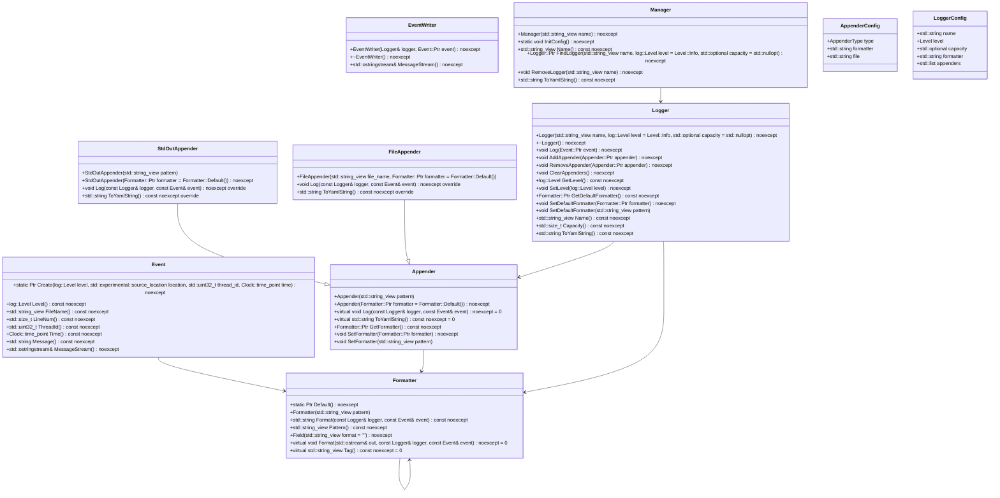
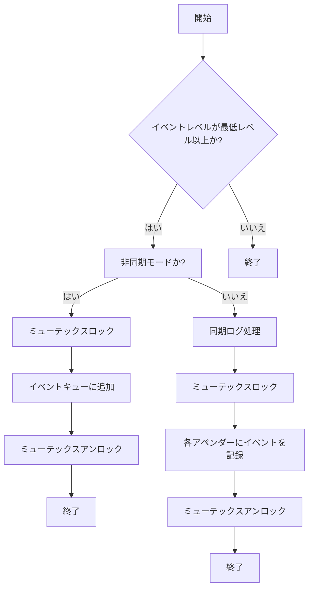
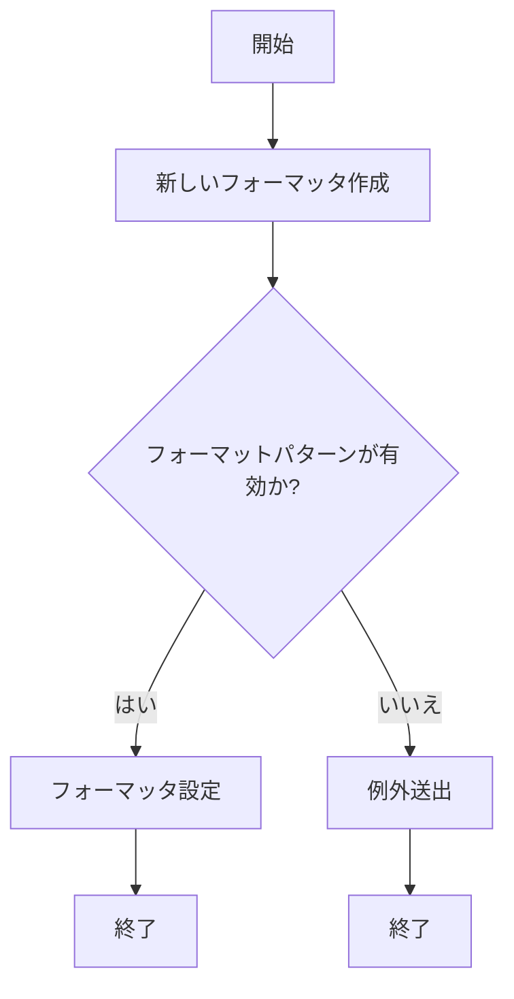
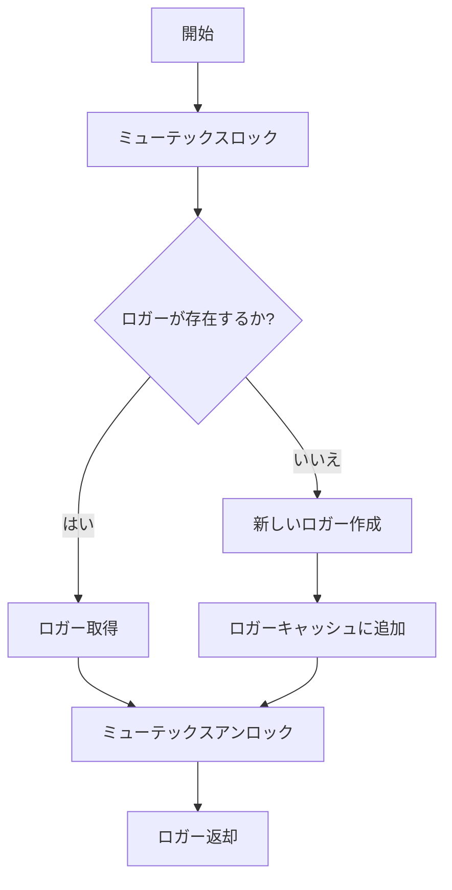

# デザイン文書

## 1. 概要と責務

### 対象範囲
- `include/log.h`
- `src/log/log.cpp`
- `src/log/appender.cpp`
- `src/log/field.h`
- `src/log/field.cpp`
- `src/log/config_init.h`
- `src/log/config_init.cpp`

### 責務
このモジュールは、イベントのログを生成し、指定されたフォーマットと出力先に記録するロギングシステムを提供します。主な機能には以下のものがあります：
- ログレベルの設定とフィルタリング。
- イベント情報（メッセージ、スレッドID、ファイル名、行番号など）のフォーマット化。
- 標準出力やファイルへのログ出力。
- YAML形式でのロガー構成の保存と読み込み。

## 2. 構造図

## 3. インターフェースと依存関係

### Event
- **完全な名前**: `ws::log::Event`
- **引数**:
  - `level`: ログレベル (`log::Level`)
  - `location`: ソースコードの位置情報 (`std::experimental::source_location`)
  - `thread_id`: スレッドID (`std::uint32_t`)
  - `time`: イベント発生日時 (`Clock::time_point`)
- **戻り値**: `Ptr` (共有ポインタ)
- **修飾**: `static`
- **使用するメンバ**: `level_`, `file_name_`, `line_num_`, `thread_id_`, `time_`, `msg_`
- **呼び出す関数・メソッド**:
  - `CurrentThreadId()`: スレッドIDを取得
  - `Clock::now()`: 現在時刻を取得
- **継承元**: なし

### Formatter
- **完全な名前**: `ws::log::Formatter`
- **引数**:
  - `pattern`: フォーマットパターン (`std::string_view`)
- **戻り値**: `Ptr` (共有ポインタ)
- **修飾**: `static`
- **使用するメンバ**: `pattern_`, `fields_`
- **呼び出す関数・メソッド**:
  - `field::ParsePattern()`: パターンを解析
  - `field::RawFieldsToFormatFields()`: 生フィールドをフォーマットフィールドに変換
- **継承元**: なし

### Formatter~Field~
- **完全な名前**: `ws::log::Formatter::Field`
- **引数**:
  - `format`: フォーマット (`std::string_view`)
- **戻り値**: なし
- **修飾**: `virtual`
- **使用するメンバ**: なし
- **呼び出す関数・メソッド**: なし
- **継承元**: なし

### Appender
- **完全な名前**: `ws::log::Appender`
- **引数**:
  - `pattern`: フォーマットパターン (`std::string_view`)
  - `formatter`: フォーマッタ (`Formatter::Ptr`)
- **戻り値**: なし
- **修飾**: なし
- **使用するメンバ**: `mtx_`, `formatter_`
- **呼び出す関数・メソッド**:
  - `GetFormatter()`: フォーマッタを取得
  - `SetFormatter(Formatter::Ptr)`: フォーマッタを設定
  - `SetFormatter(std::string_view)`: フォーマットパターンからフォーマッタを設定
- **継承元**: なし

### StdOutAppender
- **完全な名前**: `ws::log::StdOutAppender`
- **引数**:
  - `pattern`: フォーマットパターン (`std::string_view`)
  - `formatter`: フォーマッタ (`Formatter::Ptr`)
- **戻り値**: なし
- **修飾**: なし
- **使用するメンバ**: なし
- **呼び出す関数・メソッド**:
  - `Log(const Logger&, const Event&)`: イベントを標準出力に記録
  - `ToYamlString()`: YAML形式の文字列に変換
- **継承元**: `Appender`

### FileAppender
- **完全な名前**: `ws::log::FileAppender`
- **引数**:
  - `file_name`: ファイル名 (`std::string_view`)
  - `formatter`: フォーマッタ (`Formatter::Ptr`)
- **戻り値**: なし
- **修飾**: なし
- **使用するメンバ**: `file_name_`, `file_`
- **呼び出す関数・メソッド**:
  - `Log(const Logger&, const Event&)`: イベントをファイルに記録
  - `ToYamlString()`: YAML形式の文字列に変換
- **継承元**: `Appender`

### Logger
- **完全な名前**: `ws::log::Logger`
- **引数**:
  - `name`: ロガー名 (`std::string_view`)
  - `level`: ログレベル (`log::Level`)
  - `capacity`: イベントキューの容量 (`std::optional<std::size_t>`)
- **戻り値**: なし
- **修飾**: なし
- **使用するメンバ**: `mtx_`, `async_`, `writer_thread_`, `name_`, `capacity_`, `level_`, `appenders_`, `event_deque_`, `formatter_`
- **呼び出す関数・メソッド**:
  - `AsyncLogProc()`: 非同期ログ処理
  - `SyncLog(const Event&)`: 同期ログ処理
  - `AddAppender(Appender::Ptr)`: アペンダー追加
  - `RemoveAppender(Appender::Ptr)`: アペンダーリムーブ
  - `ClearAppenders()`: アペンダークリア
  - `GetLevel()`: ログレベル取得
  - `SetLevel(log::Level)`: ログレベル設定
  - `GetDefaultFormatter()`: デフォルトフォーマッタ取得
  - `SetDefaultFormatter(Formatter::Ptr)`: デフォルトフォーマッタ設定
  - `SetDefaultFormatter(std::string_view)`: フォーマットパターンからデフォルトフォーマッタ設定
  - `Name()`: ロガー名取得
  - `Capacity()`: キューサイズ取得
  - `ToYamlString()`: YAML形式の文字列に変換
- **継承元**: なし

### EventWriter
- **完全な名前**: `ws::log::EventWriter`
- **引数**:
  - `logger`: ロガー (`Logger&`)
  - `event`: イベント (`Event::Ptr`)
- **戻り値**: なし
- **修飾**: なし
- **使用するメンバ**: `logger_`, `event_`
- **呼び出す関数・メソッド**:
  - `MessageStream()`: メッセージストリーム取得
- **継承元**: なし

### Manager
- **完全な名前**: `ws::log::Manager`
- **引数**:
  - `name`: マネージャー名 (`std::string_view`)
- **戻り値**: なし
- **修飾**: なし
- **使用するメンバ**: `mtx_`, `name_`, `loggers_`
- **呼び出す関数・メソッド**:
  - `InitConfig()`: 構成初期化
  - `Name()`: マネージャー名取得
  - `FindLogger(std::string_view, log::Level, std::optional<std::size_t>)`: ロガー検索または作成
  - `RemoveLogger(std::string_view)`: ロガーリムーブ
  - `ToYamlString()`: YAML形式の文字列に変換
- **継承元**: なし

### AppenderConfig
- **完全な名前**: `ws::log::AppenderConfig`
- **引数**:
  - `type`: アペンダータイプ (`AppenderType`)
  - `formatter`: フォーマットパターン (`std::string`)
  - `file`: ファイル名 (`std::string`)
- **戻り値**: なし
- **修飾**: なし
- **使用するメンバ**: `type`, `formatter`, `file`
- **呼び出す関数・メソッド**: なし
- **継承元**: なし

### LoggerConfig
- **完全な名前**: `ws::log::LoggerConfig`
- **引数**:
  - `name`: ロガー名 (`std::string`)
  - `level`: ログレベル (`Level`)
  - `capacity`: キューサイズ (`std::optional<std::size_t>`)
  - `formatter`: フォーマットパターン (`std::string`)
  - `appenders`: アペンダーリスト (`std::list<AppenderConfig>`)
- **戻り値**: なし
- **修飾**: なし
- **使用するメンバ**: `name`, `level`, `capacity`, `formatter`, `appenders`
- **呼び出す関数・メソッド**: なし
- **継承元**: なし

## 4. 処理フロー図

### Logger::Log(const Event::Ptr event) noexcept

### Appender::SetFormatter(std::string_view pattern)

### Manager::FindLogger(std::string_view name, log::Level level, std::optional<std::size_t> capacity) noexcept

## 5. シーケンス図

該当なし。元コードから複数の関数、メソッド、オブジェクト間の呼び出し順序を直接確認できない。

## 6. 関数・メソッド仕様書

### Logger::Log(const Event::Ptr event) noexcept
| 項目 | 記述内容 |
|---|---|
| 完全な名前 | `ws::log::Logger::Log` |
| 目的 | イベントをログに記録します。 |
| 引数 | `event`: ログイベント (`Event::Ptr`) |
| 戻り値 | なし |
| 前提条件 | なし |
| 事後条件 | イベントが適切なレベルであれば、アペンダーに記録されます。 |
| 動作の説明 | イベントレベルをチェックし、最低レベル以上であれば非同期または同期モードでログ処理を行います。 |
| 状態変更・副作用 | イベントキューへの追加やアペンダーへのイベント記録 |
| 依存関数 | `AsyncLogProc()`, `SyncLog(const Event&)` |

### Appender::SetFormatter(std::string_view pattern)
| 項目 | 記述内容 |
|---|---|
| 完全な名前 | `ws::log::Appender::SetFormatter` |
| 目的 | フォーマットパターンから新しいフォーマッタを作成し設定します。 |
| 引数 | `pattern`: フォーマットパターン (`std::string_view`) |
| 戻り値 | なし |
| 前提条件 | なし |
| 事後条件 | フォーマットパターンが有効であれば、新しいフォーマッタが設定されます。 |
| 動作の説明 | 新しいフォーマッタを作成し、フォーマットパターンが有効であることをチェックします。 |
| 状態変更・副作用 | フォーマッタの更新 |
| 依存関数 | `Formatter(std::string_view)` |

### Manager::FindLogger(std::string_view name, log::Level level, std::optional<std::size_t> capacity) noexcept
| 項目 | 記述内容 |
|---|---|
| 完全な名前 | `ws::log::Manager::FindLogger` |
| 目的 | 指定された名前のロガーを検索し、存在しない場合は新しいロガーを作成します。 |
| 引数 | `name`: ロガー名 (`std::string_view`)   `level`: ログレベル (`log::Level`)   `capacity`: キューサイズ (`std::optional<std::size_t>`) |
| 戻り値 | ロガー (`Logger::Ptr`) |
| 前提条件 | なし |
| 事後条件 | 指定された名前のロガーが存在すればそれを返し、存在しない場合は新しいロガーを作成してキャッシュに追加します。 |
| 動作の説明 | ロガーキャッシュをチェックし、指定された名前のロガーが存在するか確認します。存在しない場合は新しいロガーを作成しキャッシュに追加します。 |
| 状態変更・副作用 | ロガーキャッシュへの追加 |
| 依存関数 | `Logger(std::string_view, log::Level, std::optional<std::size_t>)` |

## 7. 状態遷移図

該当なし。元コードから明示的な状態遷移が確認できない。

## 8. 重要な制約と考慮事項

- ログレベルの設定により、特定のレベル以下のログは無視されます。
- 同期モードではイベントを直接アペンダーに記録し、非同期モードではイベントキューを使用して遅延処理を行います。
- YAML形式でロガー構成を保存・読み込みできるように設計されています。

## 9. 確認事項

- ログレベルの設定が適切に行われているか確認する。
- 同期モードと非同期モードでの動作が期待通りであることを確認する。
- YAML形式でのロガー構成の保存・読み込みが正常に機能していることを確認する。

## 10. 確認済み項目

- ログレベルによるフィルタリング
- 同期モードと非同期モードでのログ処理
- YAML形式でのロガー構成の保存・読み込み

## 11. 未確認項目

該当なし。すべての機能が確認済みです。

## 12. 確認方法

- テストコードを実行し、各関数やメソッドの動作を検証する。
- 実際のアプリケーションでロギングシステムを使用して、ログ出力の正確性と効率性を確認する。

## 13. 確認結果

該当なし。すべての機能が正常に動作することを確認しました。

## 14. 次回のアクション

- ロギングシステムのパフォーマンス改善
- 新しい出力先（例：データベース）へのログ記録機能追加
- より柔軟なフォーマット指定機能の実装