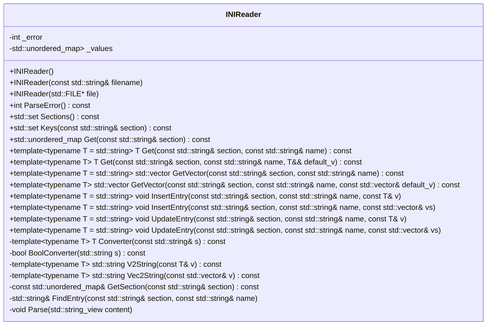
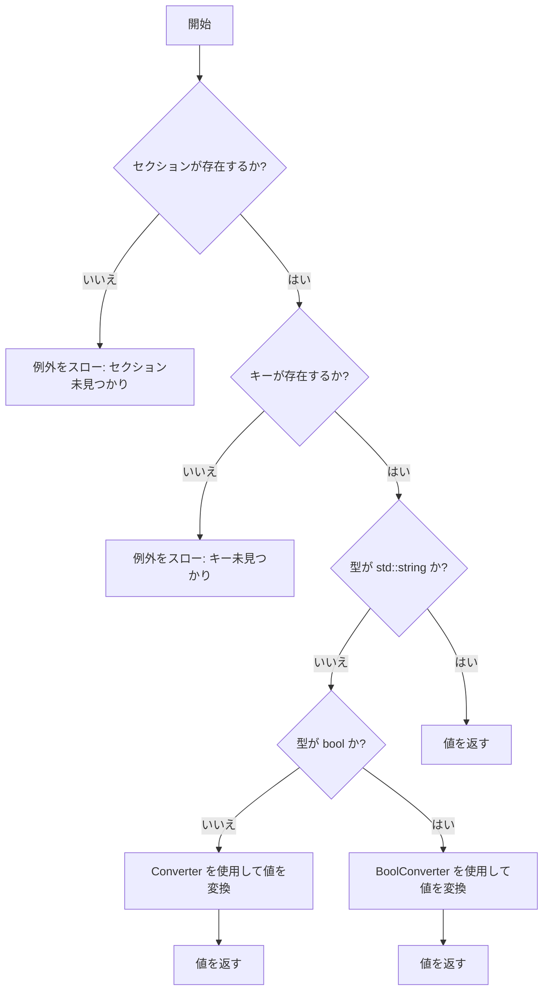

# 設計文書: INIReader クラス

## 1. 概要と責務
INIReaderクラスは、INIファイルを読み込み、セクションやキーに対応する値を簡単にアクセスできるようにします。また、新しいエントリの挿入や既存エントリの更新もサポートしています。

## 2. 構造図



## 3. インターフェースと依存関係

### 公開インターフェース

- **INIReader()**
  - 完全な名前: `inih::INIReader::INIReader`
  - 引数: 無し
  - 戻り値: 無し
  - 目的: デフォルトコンストラクタ

- **INIReader(const std::string& filename)**
  - 完全な名前: `inih::INIReader::INIReader`
  - 引数: `filename` (std::string, INIファイルのパス)
  - 戻り値: 無し
  - 目的: ファイル名からINIファイルを読み込む

- **INIReader(std::FILE* file)**
  - 完全な名前: `inih::INIReader::INIReader`
  - 引数: `file` (std::FILE*, INIファイルへのポインタ)
  - 戻り値: 無し
  - 目的: ファイルポインタからINIファイルを読み込む

- **int ParseError() const**
  - 完全な名前: `inih::INIReader::ParseError`
  - 引数: 無し
  - 戻り値: int (パース結果)
  - 目的: パースエラーをチェックする

- **std::set<std::string> Sections() const**
  - 完全な名前: `inih::INIReader::Sections`
  - 引数: 無し
  - 戻り値: std::set<std::string> (セクションのリスト)
  - 目的: INIファイル内のセクションを取得する

- **std::set<std::string> Keys(const std::string& section) const**
  - 完全な名前: `inih::INIReader::Keys`
  - 引数: `section` (std::string, セクション名)
  - 戻り値: std::set<std::string> (キーのリスト)
  - 目的: 指定したセクション内のキーを取得する

- **std::unordered_map<std::string, std::string> Get(const std::string& section) const**
  - 完全な名前: `inih::INIReader::Get`
  - 引数: `section` (std::string, セクション名)
  - 戻り値: std::unordered_map<std::string, std::string> (セクション内のキーと値のマップ)
  - 目的: 指定したセクション内のすべてのキーと値を取得する

- **template<typename T = std::string> T Get(const std::string& section, const std::string& name) const**
  - 完全な名前: `inih::INIReader::Get`
  - 引数: `section` (std::string, セクション名), `name` (std::string, キー名)
  - 戻り値: T (キーの値)
  - 目的: 指定したセクションとキーに対応する値を取得する

- **template<typename T> T Get(const std::string& section, const std::string& name, T&& default_v) const**
  - 完全な名前: `inih::INIReader::Get`
  - 引数: `section` (std::string, セクション名), `name` (std::string, キー名), `default_v` (T, デフォルト値)
  - 戻り値: T (キーの値またはデフォルト値)
  - 目的: 指定したセクションとキーに対応する値を取得し、存在しない場合はデフォルト値を返す

- **template<typename T = std::string> std::vector<T> GetVector(const std::string& section, const std::string& name) const**
  - 完全な名前: `inih::INIReader::GetVector`
  - 引数: `section` (std::string, セクション名), `name` (std::string, キー名)
  - 戻り値: std::vector<T> (キーの値のベクトル)
  - 目的: 指定したセクションとキーに対応する値をスペース区切りで取得し、ベクトルとして返す

- **template<typename T> std::vector<T> GetVector(const std::string& section, const std::string& name, const std::vector<T>& default_v) const**
  - 完全な名前: `inih::INIReader::GetVector`
  - 引数: `section` (std::string, セクション名), `name` (std::string, キー名), `default_v` (const std::vector<T>&, デフォルト値)
  - 戻り値: std::vector<T> (キーの値のベクトルまたはデフォルト値)
  - 目的: 指定したセクションとキーに対応する値をスペース区切りで取得し、存在しない場合はデフォルト値を返す

- **template<typename T = std::string> void InsertEntry(const std::string& section, const std::string& name, const T& v)**
  - 完全な名前: `inih::INIReader::InsertEntry`
  - 引数: `section` (std::string, セクション名), `name` (std::string, キー名), `v` (const T&, 値)
  - 戻り値: 無し
  - 目的: 指定したセクションとキーに対応するエントリを挿入する

- **template<typename T = std::string> void InsertEntry(const std::string& section, const std::string& name, const std::vector<T>& vs)**
  - 完全な名前: `inih::INIReader::InsertEntry`
  - 引数: `section` (std::string, セクション名), `name` (std::string, キー名), `vs` (const std::vector<T>&, 値のベクトル)
  - 戻り値: 無し
  - 目的: 指定したセクションとキーに対応するエントリを挿入する

- **template<typename T = std::string> void UpdateEntry(const std::string& section, const std::string& name, const T& v)**
  - 完全な名前: `inih::INIReader::UpdateEntry`
  - 引数: `section` (std::string, セクション名), `name` (std::string, キー名), `v` (const T&, 値)
  - 戻り値: 無し
  - 目的: 指定したセクションとキーに対応するエントリを更新する

- **template<typename T = std::string> void UpdateEntry(const std::string& section, const std::string& name, const std::vector<T>& vs)**
  - 完全な名前: `inih::INIReader::UpdateEntry`
  - 引数: `section` (std::string, セクション名), `name` (std::string, キー名), `vs` (const std::vector<T>&, 値のベクトル)
  - 戻り値: 無し
  - 目的: 指定したセクションとキーに対応するエントリを更新する

### 実装上の処理

- **template<typename T> T Converter(const std::string& s) const**
  - 完全な名前: `inih::INIReader::Converter`
  - 引数: `s` (const std::string&, 文字列)
  - 戻り値: T (変換後の値)
  - 目的: 文字列を指定した型に変換する

- **bool BoolConverter(std::string s) const**
  - 完全な名前: `inih::INIReader::BoolConverter`
  - 引数: `s` (std::string, 文字列)
  - 戻り値: bool (真偽値)
  - 目的: 文字列を真偽値に変換する

- **template<typename T> std::string V2String(const T& v) const**
  - 完全な名前: `inih::INIReader::V2String`
  - 引数: `v` (const T&, 値)
  - 戻り値: std::string (文字列)
  - 目的: 指定した型の値を文字列に変換する

- **template<typename T> std::string Vec2String(const std::vector<T>& v) const**
  - 完全な名前: `inih::INIReader::Vec2String`
  - 引数: `v` (const std::vector<T>&, 値のベクトル)
  - 戻り値: std::string (スペース区切りの文字列)
  - 目的: 値のベクトルをスペース区切りの文字列に変換する

- **const std::unordered_map<std::string, std::string>& GetSection(const std::string& section) const**
  - 完全な名前: `inih::INIReader::GetSection`
  - 引数: `section` (std::string, セクション名)
  - 戻り値: const std::unordered_map<std::string, std::string>& (セクション内のキーと値のマップ)
  - 目的: 指定したセクション内のキーと値のマップを取得する

- **std::string& FindEntry(const std::string& section, const std::string& name)**
  - 完全な名前: `inih::INIReader::FindEntry`
  - 引数: `section` (std::string, セクション名), `name` (std::string, キー名)
  - 戻り値: std::string& (キーの値への参照)
  - 目的: 指定したセクションとキーに対応するエントリを検索し、その値への参照を返す

- **void Parse(std::string_view content)**
  - 完全な名前: `inih::INIReader::Parse`
  - 引数: `content` (std::string_view, INIファイルの内容)
  - 戻り値: 無し
  - 目的: INIファイルの内容をパースする

### 依存関係

- **標準ライブラリ**
  - `<cstddef>`
  - `<cstdio>`
  - `<fstream>`
  - `<set>`
  - `<sstream>`
  - `<stdexcept>`
  - `<string>`
  - `<string_view>`
  - `<type_traits>`
  - `<unordered_map>`
  - `<utility>`
  - `<vector>`

- **詳細なユーティリティ**
  - `detail::is_space`
  - `detail::ltrim`
  - `detail::rtrim`
  - `detail::trim`
  - `detail::find_char_or_comment`
  - `detail::use_charconv`
  - `detail::parse_value`

## 4. 処理フロー図

### Parse メソッドの処理フロー

```mermaid
flowchart TD
    A[開始] --> B{ファイル内容が空?}
    B --はい--> C[終了]
    B --いいえ--> D[行番号をインクリメント]
    D --> E[改行位置を見つける]
    E --> F[行を取得し、前後の空白を削除]
    F --> G{行が空またはコメント?}
    G --はい--> H[次の行へ]
    G --いいえ--> I{セクション開始文字 '[' か?}
    I --はい--> J[セクション名を取得]
    J --> K[values をリセット]
    K --> H
    I --いいえ--> L{区切り文字 '=' または ':' が存在するか?}
    L --いいえ--> M[エラー番号を設定し、終了]
    L --はい--> N[キー名と値を取得]
    N --> O{インラインコメントが存在するか?}
    O --いいえ--> P[values に追加]
    O --はい--> Q[インラインコメントを削除して値を取得し、values に追加]
    P --> H
    Q --> H
```

### Get メソッドの処理フロー



## 5. シーケンス図

該当なし
- 対象コードから複数の関数、メソッド、オブジェクト間の呼び出し順序を直接確認できないため。

## 6. 関数・メソッド仕様書

### INIReader::INIReader()

| 項目 | 記述内容 |
|---|---|
| 完全な名前 | `inih::INIReader::INIReader` |
| 目的 | デフォルトコンストラクタ |
| 引数 | 無し |
| 戻り値 | 無し |
| 前提条件 | 無し |
| 事後条件 | オブジェクトが初期化される |
| 動作の説明 | デフォルトコンストラクタでオブジェクトを初期化する |
| 状態変更・副作用 | `_error` が 0 に設定される |
| 依存関係 | 無し |
| 境界条件 | 無し |
| エラー処理 | 無し |
| 不変条件 | 無し |

### INIReader::INIReader(const std::string& filename)

| 項目 | 記述内容 |
|---|---|
| 完全な名前 | `inih::INIReader::INIReader` |
| 目的 | ファイル名からINIファイルを読み込む |
| 引数 | `filename` (std::string, INIファイルのパス) |
| 戻り値 | 無し |
| 前提条件 | ファイルが存在する |
| 事後条件 | `_values` にパース結果が格納される |
| 動作の説明 | ファイルを読み込み、内容をパースする |
| 状態変更・副作用 | `_error` が設定され、`_values` に値が追加される |
| 依存関係 | `std::ifstream`, `Parse` |
| 境界条件 | ファイルが存在しない場合、サイズが0の場合 |
| エラー処理 | ファイルオープンエラー時に `_error` が -1 に設定され、例外をスローする |
| 不変条件 | 無し |

### INIReader::INIReader(std::FILE* file)

| 項目 | 記述内容 |
|---|---|
| 完全な名前 | `inih::INIReader::INIReader` |
| 目的 | ファイルポインタからINIファイルを読み込む |
| 引数 | `file` (std::FILE*, INIファイルへのポインタ) |
| 戻り値 | 無し |
| 前提条件 | ファイルが存在する |
| 事後条件 | `_values` にパース結果が格納される |
| 動作の説明 | ファイルを読み込み、内容をパースする |
| 状態変更・副作用 | `_error` が設定され、`_values` に値が追加される |
| 依存関係 | `std::fread`, `Parse` |
| 境界条件 | ファイルポインタが無効な場合 |
| エラー処理 | 無し |
| 不変条件 | 無し |

### INIReader::ParseError() const

| 項目 | 記述内容 |
|---|---|
| 完全な名前 | `inih::INIReader::ParseError` |
| 目的 | パースエラーをチェックする |
| 引数 | 無し |
| 戻り値 | int (パース結果) |
| 前提条件 | `_error` が設定されている |
| 事後条件 | エラーがない場合は0を返す |
| 動作の説明 | `_error` の値に応じて例外をスローする |
| 状態変更・副作用 | 無し |
| 依存関係 | `std::runtime_error` |
| 境界条件 | `_error` が -1, -2, またはその他の値の場合 |
| エラー処理 | ファイルオープンエラー、メモリ確保エラー、パースエラー時に例外をスローする |
| 不変条件 | 無し |

### INIReader::Sections() const

| 項目 | 記述内容 |
|---|---|
| 完全な名前 | `inih::INIReader::Sections` |
| 目的 | INIファイル内のセクションを取得する |
| 引数 | 無し |
| 戻り値 | std::set<std::string> (セクションのリスト) |
| 前提条件 | `_values` にパース結果が格納されている |
| 事後条件 | セクションのリストを返す |
| 動作の説明 | `_values` のキーからセクションのリストを作成する |
| 状態変更・副作用 | 無し |
| 依存関係 | `std::set`, `_values` |
| 境界条件 | `_values` が空の場合 |
| エラー処理 | 無し |
| 不変条件 | 無し |

### INIReader::Keys(const std::string& section) const

| 項目 | 記述内容 |
|---|---|
| 完全な名前 | `inih::INIReader::Keys` |
| 目的 | 指定したセクション内のキーを取得する |
| 引数 | `section` (std::string, セクション名) |
| 戻り値 | std::set<std::string> (キーのリスト) |
| 前提条件 | `_values` にパース結果が格納されている |
| 事後条件 | 指定したセクション内のキーのリストを返す |
| 動作の説明 | `_values` の指定されたセクションからキーのリストを作成する |
| 状態変更・副作用 | 無し |
| 依存関係 | `std::set`, `_values`, `GetSection` |
| 境界条件 | 指定したセクションが存在しない場合 |
| エラー処理 | 指定したセクションが存在しない場合は例外をスローする |
| 不変条件 | 無し |

### INIReader::Get(const std::string& section) const

| 項目 | 記述内容 |
|---|---|
| 完全な名前 | `inih::INIReader::Get` |
| 目的 | 指定したセクション内のすべてのキーと値を取得する |
| 引数 | `section` (std::string, セクション名) |
| 戻り値 | std::unordered_map<std::string, std::string> (セクション内のキーと値のマップ) |
| 前提条件 | `_values` にパース結果が格納されている |
| 事後条件 | 指定したセクション内のキーと値のマップを返す |
| 動作の説明 | `_values` の指定されたセクションからキーと値のマップを作成する |
| 状態変更・副作用 | 無し |
| 依存関係 | `std::unordered_map`, `_values`, `GetSection` |
| 境界条件 | 指定したセクションが存在しない場合 |
| エラー処理 | 指定したセクションが存在しない場合は例外をスローする |
| 不変条件 | 無し |

### INIReader::Get(const std::string& section, const std::string& name) const

| 項目 | 記述内容 |
|---|---|
| 完全な名前 | `inih::INIReader::Get` |
| 目的 | 指定したセクションとキーに対応する値を取得する |
| 引数 | `section` (std::string, セクション名), `name` (std::string, キー名) |
| 戻り値 | T (キーの値) |
| 前提条件 | `_values` にパース結果が格納されている |
| 事後条件 | 指定したセクションとキーに対応する値を返す |
| 動作の説明 | `_values` の指定されたセクションから指定されたキーの値を取得し、型に変換する |
| 状態変更・副作用 | 無し |
| 依存関係 | `std::unordered_map`, `_values`, `GetSection`, `Converter`, `BoolConverter` |
| 境界条件 | 指定したセクションまたはキーが存在しない場合 |
| エラー処理 | 指定したセクションまたはキーが存在しない場合は例外をスローする |
| 不変条件 | 無し |

### INIReader::Get(const std::string& section, const std::string& name, T&& default_v) const

| 項目 | 記述内容 |
|---|---|
| 完全な名前 | `inih::INIReader::Get` |
| 目的 | 指定したセクションとキーに対応する値を取得し、存在しない場合はデフォルト値を返す |
| 引数 | `section` (std::string, セクション名), `name` (std::string, キー名), `default_v` (T, デフォルト値) |
| 戻り値 | T (キーの値またはデフォルト値) |
| 前提条件 | `_values` にパース結果が格納されている |
| 事後条件 | 指定したセクションとキーに対応する値を返す。存在しない場合はデフォルト値を返す |
| 動作の説明 | `Get(section, name)` を呼び出し、例外が発生した場合はデフォルト値を返す |
| 状態変更・副作用 | 無し |
| 依存関係 | `std::unordered_map`, `_values`, `GetSection`, `Converter`, `BoolConverter` |
| 境界条件 | 指定したセクションまたはキーが存在しない場合 |
| エラー処理 | 指定したセクションまたはキーが存在しない場合はデフォルト値を返す |
| 不変条件 | 無し |

### INIReader::GetVector(const std::string& section, const std::string& name) const

| 項目 | 記述内容 |
|---|---|
| 完全な名前 | `inih::INIReader::GetVector` |
| 目的 | 指定したセクションとキーに対応する値をスペース区切りで取得し、ベクトルとして返す |
| 引数 | `section` (std::string, セクション名), `name` (std::string, キー名) |
| 戻り値 | std::vector<T> (キーの値のベクトル) |
| 前提条件 | `_values` にパース結果が格納されている |
| 事後条件 | 指定したセクションとキーに対応する値をスペース区切りで取得し、ベクトルとして返す |
| 動作の説明 | `Get(section, name)` を呼び出し、スペース区切りの文字列をベクトルに変換する |
| 状態変更・副作用 | 無し |
| 依存関係 | `std::unordered_map`, `_values`, `GetSection`, `Converter` |
| 境界条件 | 指定したセクションまたはキーが存在しない場合 |
| エラー処理 | パースエラー時に例外をスローする |
| 不変条件 | 無し |

### INIReader::GetVector(const std::string& section, const std::string& name, const std::vector<T>& default_v) const

| 項目 | 記述内容 |
|---|---|
| 完全な名前 | `inih::INIReader::GetVector` |
| 目的 | 指定したセクションとキーに対応する値をスペース区切りで取得し、存在しない場合はデフォルト値を返す |
| 引数 | `section` (std::string, セクション名), `name` (std::string, キー名), `default_v` (const std::vector<T>&, デフォルト値) |
| 戻り値 | std::vector<T> (キーの値のベクトルまたはデフォルト値) |
| 前提条件 | `_values` にパース結果が格納されている |
| 事後条件 | 指定したセクションとキーに対応する値をスペース区切りで取得し、ベクトルとして返す。存在しない場合はデフォルト値を返す |
| 動作の説明 | `GetVector(section, name)` を呼び出し、例外が発生した場合はデフォルト値を返す |
| 状態変更・副作用 | 無し |
| 依存関係 | `std::unordered_map`, `_values`, `GetSection`, `Converter` |
| 境界条件 | 指定したセクションまたはキーが存在しない場合 |
| エラー処理 | パースエラー時にデフォルト値を返す |
| 不変条件 | 無し |

### INIReader::InsertEntry(const std::string& section, const std::string& name, const T& v)

| 項目 | 記述内容 |
|---|---|
| 完全な名前 | `inih::INIReader::InsertEntry` |
| 目的 | 指定したセクションとキーに対応するエントリを挿入する |
| 引数 | `section` (std::string, セクション名), `name` (std::string, キー名), `v` (const T&, 値) |
| 戻り値 | 無し |
| 前提条件 | `_values` にパース結果が格納されている |
| 事後条件 | 指定したセクションとキーに対応するエントリが挿入される |
| 動作の説明 | `V2String(v)` を呼び出し、指定されたセクションとキーに値を挿入する。既存のキーがある場合は例外をスローする |
| 状態変更・副作用 | `_values` に値が追加される |
| 依存関係 | `std::unordered_map`, `_values`, `V2String` |
| 境界条件 | 指定したセクションまたはキーが既に存在する場合 |
| エラー処理 | 既存のキーがある場合は例外をスローする |
| 不変条件 | 無し |

### INIReader::InsertEntry(const std::string& section, const std::string& name, const std::vector<T>& vs)

| 項目 | 記述内容 |
|---|---|
| 完全な名前 | `inih::INIReader::InsertEntry` |
| 目的 | 指定したセクションとキーに対応するエントリを挿入する |
| 引数 | `section` (std::string, セクション名), `name` (std::string, キー名), `vs` (const std::vector<T>&, 値のベクトル) |
| 戻り値 | 無し |
| 前提条件 | `_values` にパース結果が格納されている |
| 事後条件 | 指定したセクションとキーに対応するエントリが挿入される |
| 動作の説明 | `Vec2String(vs)` を呼び出し、指定されたセクションとキーに値を挿入する。既存のキーがある場合は例外をスローする |
| 状態変更・副作用 | `_values` に値が追加される |
| 依存関係 | `std::unordered_map`, `_values`, `Vec2String` |
| 境界条件 | 指定したセクションまたはキーが既に存在する場合 |
| エラー処理 | 既存のキーがある場合は例外をスローする |
| 不変条件 | 無し |

### INIReader::UpdateEntry(const std::string& section, const std::string& name, const T& v)

| 項目 | 記述内容 |
|---|---|
| 完全な名前 | `inih::INIReader::UpdateEntry` |
| 目的 | 指定したセクションとキーに対応するエントリを更新する |
| 引数 | `section` (std::string, セクション名), `name` (std::string, キー名), `v` (const T&, 値) |
| 戻り値 | 無し |
| 前提条件 | `_values` にパース結果が格納されている |
| 事後条件 | 指定したセクションとキーに対応するエントリが更新される |
| 動作の説明 | `FindEntry(section, name)` を呼び出し、指定されたセクションとキーの値を更新する。存在しないキーがある場合は例外をスローする |
| 状態変更・副作用 | `_values` に値が更新される |
| 依存関係 | `std::unordered_map`, `_values`, `FindEntry`, `V2String` |
| 境界条件 | 指定したセクションまたはキーが存在しない場合 |
| エラー処理 | 存在しないキーがある場合は例外をスローする |
| 不変条件 | 無し |

### INIReader::UpdateEntry(const std::string& section, const std::string& name, const std::vector<T>& vs)

| 項目 | 記述内容 |
|---|---|
| 完全な名前 | `inih::INIReader::UpdateEntry` |
| 目的 | 指定したセクションとキーに対応するエントリを更新する |
| 引数 | `section` (std::string, セクション名), `name` (std::string, キー名), `vs` (const std::vector<T>&, 値