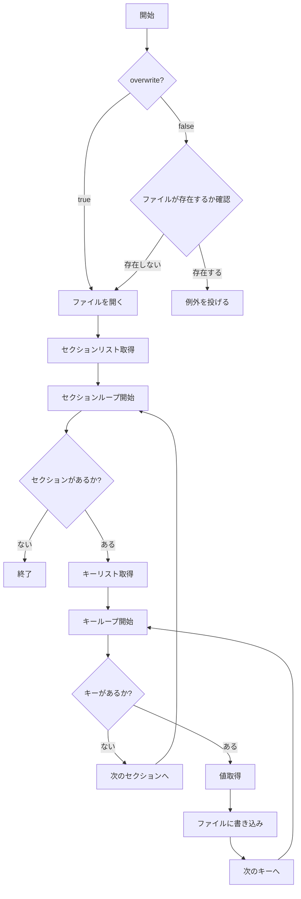

# 設計文書: `INIWriter::write`

## 1. 概要と責務
`INIWriter::write` 関数の責任は、与えられた `INIReader` オブジェクトの内容を指定されたファイルパスに INI 形式で書き出すことです。既存のファイルが存在する場合、オーバーライトフラグが設定されていないと例外を投げます。

## 2. 構造図
該当なし  
理由: `INIWriter::write` は単独関数であり、クラス構造や継承関係は関係ありません。

## 3. インターフェースと依存関係

### 公開インターフェース
- **完全な名前**: `inih::INIWriter::write`
- **引数**:
  - `filepath`: 出力ファイルのパス (`std::string`)
  - `reader`: 書き出す内容を持つ `INIReader` オブジェクト (`const INIReader&`)
  - `overwrite`: 既存ファイルを上書きするかどうか (`const bool`, デフォルト値: `false`)
- **戻り値**: 無し (`void`)
- **修飾**: `inline static`
- **使用するメンバ、型、定数、列挙型、型別名**:
  - `std::ifstream` (ファイルの存在確認)
  - `std::ofstream` (ファイルへの書き込み)
  - `INIReader::Sections()`
  - `INIReader::Keys(const std::string&)`
  - `INIReader::Get(const std::string&, const std::string&)`
- **呼び出す関数・メソッドとその目的**:
  - `std::ifstream(filepath)`: ファイルの存在確認
  - `std::ofstream(filepath)`: 出力ファイルを開く
  - `INIReader::Sections()`: セクションリストを取得する
  - `INIReader::Keys(section)`: 指定されたセクション内のキーリストを取得する
  - `INIReader::Get(section, key)`: 指定されたセクションとキーの値を取得する

### 実装上の処理
- **完全な名前**: `inih::INIWriter::write`
- **引数**:
  - `filepath`: 出力ファイルのパス (`std::string`)
  - `reader`: 書き出す内容を持つ `INIReader` オブジェクト (`const INIReader&`)
  - `overwrite`: 既存ファイルを上書きするかどうか (`const bool`, デフォルト値: `false`)
- **戻り値**: 無し (`void`)
- **修飾**: `inline static`
- **使用するメンバ、型、定数、列挙型、型別名**:
  - `std::ifstream` (ファイルの存在確認)
  - `std::ofstream` (ファイルへの書き込み)
  - `INIReader::Sections()`
  - `INIReader::Keys(const std::string&)`
  - `INIReader::Get(const std::string&, const std::string&)`

## 4. 処理フロー図

## 5. シーケンス図
該当なし  
理由: `INIWriter::write` 関数は単独関数であり、複数のオブジェクト間の相互作用を直接確認するシーケンスはありません。

## 6. 関数・メソッド仕様書

| 項目 | 記述内容 |
|---|---|
| 完全な名前 | `inih::INIWriter::write` |
| 目的 | `INIReader` オブジェクトの内容を指定されたファイルパスに INI 形式で書き出す。 |
| 引数 | - `filepath`: 出力ファイルのパス (`std::string`)   - `reader`: 書き出す内容を持つ `INIReader` オブジェクト (`const INIReader&`)   - `overwrite`: 既存ファイルを上書きするかどうか (`const bool`, デフォルト値: `false`) |
| 戻り値 | 無し (`void`) |
| 前提条件 | - `reader` は有効な `INIReader` オブジェクトである。   - `filepath` は書き込み可能なパスである。 |
| 事後条件 | 指定されたファイルに `INIReader` の内容が INI 形式で書き込まれる。 |
| 動作の説明 | 1. オーバーライトフラグが false かつファイルが既存の場合、例外を投げる。 2. ファイルを開く。 3. `INIReader` のセクションリストを取得し、各セクションに対して以下の処理を行う:    - セクション名をファイルに書き込む。    - セクション内のキーリストを取得し、各キーに対して以下の処理を行う:      - キーと値をファイルに書き込む。 |
| 状態変更・副作用 | 指定されたファイルが作成または上書きされる。 |
| 依存関係 | `std::ifstream`, `std::ofstream`, `INIReader::Sections()`, `INIReader::Keys(const std::string&)`, `INIReader::Get(const std::string&, const std::string&)` |
| 境界条件 | - `filepath` が空文字列の場合、ファイルの存在確認や開く処理に失敗する可能性がある。  - `reader` が空である場合、ファイルには何も書き込まれない。 |
| エラー処理 | - ファイルが既存でオーバーライトフラグが false の場合、例外を投げる。  - ファイルを開くことができない場合、例外を投げる。 |
| 不変条件 | `reader` の内容は書き込み操作によって変更されない。 |

## 7. 状態遷移と重要な条件
該当なし  
理由: `INIWriter::write` 関数は状態を持つクラスの一部ではなく、単独関数であり、内部で保持する状態がありません。

## 8. 確認不能事項
確認不能事項なし