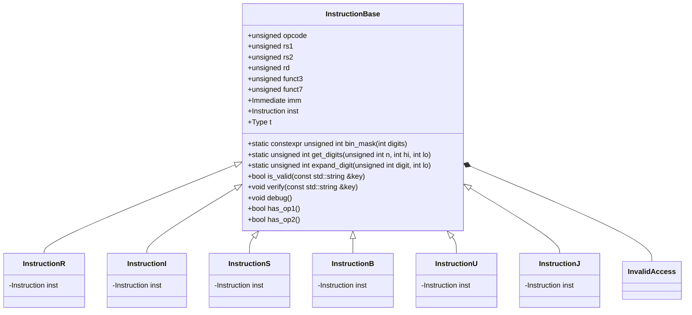

# デザイン文書: Instruction.hpp

## 1. 概要と責務
`Instruction.hpp`は、RISC-Vアーキテクチャの命令を表す構造体群を定義しています。主な役割は以下の通りです：
- 命令の種類（R型、I型、S型、B型、U型、J型）に対応する構造体を提供します。
- 各命令からフィールド（opcode, rs1, rs2, rd, funct3, funct7, imm）を抽出し保持します。
- 命令のデバッグ情報を出力します。

## 2. 構造図


## 3. インターフェースと依存関係

### InstructionBase
- **完全な名前**: `InstructionBase`
- **引数**:
  - 無し: デフォルトコンストラクタでフィールドを初期化します。
  - `unsigned`: 特定のopcode（0b0010011）と型（I型）に設定するコンストラクタです。
- **戻り値**: 無し
- **修飾**: 
  - デフォルトコンストラクタ: `InstructionBase()`
  - 特定のopcodeを持つコンストラクタ: `InstructionBase(unsigned)`
  - 静的メソッド: `static InstructionBase nop()`, `static constexpr unsigned int bin_mask(int digits)`, `static unsigned int get_digits(unsigned int n, int hi, int lo)`, `static unsigned int expand_digit(unsigned int digit, int lo)`
- **使用するメンバ**: `opcode`, `rs1`, `rs2`, `rd`, `funct3`, `funct7`, `imm`, `inst`, `t`
- **呼び出す関数・メソッド**: 無し
- **継承元**: 無し

### InstructionR, InstructionI, InstructionS, InstructionB, InstructionU, InstructionJ
- **完全な名前**: 各構造体の名前（例: `InstructionR`）
- **引数**:
  - `const Instruction &inst`: 命令を表す符号なし整数を受け取り、フィールドを初期化します。
- **戻り値**: 無し
- **修飾**: コンストラクタ
- **使用するメンバ**: `opcode`, `rs1`, `rs2`, `rd`, `funct3`, `funct7`, `imm`, `inst`, `t`
- **呼び出す関数・メソッド**: `get_digits(unsigned int n, int hi, int lo)`, `expand_digit(unsigned int digit, int lo)`
- **継承元**: `InstructionBase`

### InvalidAccess
- **完全な名前**: `InstructionBase::InvalidAccess`
- **説明**: 無効なアクセスを示す例外クラスです。

## 4. 処理フロー図

### InstructionRのコンストラクタ
```mermaid
flowchart TD
    A[開始] --> B[opcode = get_digits(inst, 6, 0)]
    B --> C[rd = get_digits(inst, 11, 7)]
    C --> D[funct3 = get_digits(inst, 14, 12)]
    D --> E[rs1 = get_digits(inst, 19, 15)]
    E --> F[rs2 = get_digits(inst, 24, 20)]
    F --> G[funct7 = get_digits(inst, 31, 25)]
    G --> H[t = R]
    H --> I[this->inst = inst]
    I --> J[終了]
```

### InstructionIのコンストラクタ
```mermaid
flowchart TD
    A[開始] --> B[opcode = get_digits(inst, 6, 0)]
    B --> C[rd = get_digits(inst, 11, 7)]
    C --> D[funct3 = get_digits(inst, 14, 12)]
    D --> E[rs1 = get_digits(inst, 19, 15)]
    E --> F[imm = get_digits(inst, 30, 20) | expand_digit(get_digits(inst, 31, 31), 11)]
    F --> G[t = I]
    G --> H[this->inst = inst]
    H --> I[終了]
```

### InstructionSのコンストラクタ
```mermaid
flowchart TD
    A[開始] --> B[opcode = get_digits(inst, 6, 0)]
    B --> C[funct3 = get_digits(inst, 14, 12)]
    C --> D[rs1 = get_digits(inst, 19, 15)]
    D --> E[rs2 = get_digits(inst, 24, 20)]
    E --> F[imm = get_digits(inst, 11, 7) | (get_digits(inst, 30, 25) << 5) | expand_digit(get_digits(inst, 31, 31), 11)]
    F --> G[t = S]
    G --> H[this->inst = inst]
    H --> I[終了]
```

### InstructionBのコンストラクタ
```mermaid
flowchart TD
    A[開始] --> B[opcode = get_digits(inst, 6, 0)]
    B --> C[funct3 = get_digits(inst, 14, 12)]
    C --> D[rs1 = get_digits(inst, 19, 15)]
    D --> E[rs2 = get_digits(inst, 24, 20)]
    E --> F[imm = (get_digits(inst, 11, 8) << 1) | (get_digits(inst, 30, 25) << 5) | (get_digits(inst, 7, 7) << 11) | expand_digit(get_digits(inst, 31, 31), 12)]
    F --> G[t = B]
    G --> H[this->inst = inst]
    H --> I[終了]
```

### InstructionUのコンストラクタ
```mermaid
flowchart TD
    A[開始] --> B[opcode = get_digits(inst, 6, 0)]
    B --> C[rd = get_digits(inst, 11, 7)]
    C --> D[imm = (get_digits(inst, 19, 12) << 12) | (get_digits(inst, 30, 20) << 20) | (get_digits(inst, 31, 31) << 31)]
    D --> E[t = U]
    E --> F[this->inst = inst]
    F --> G[終了]
```

### InstructionJのコンストラクタ
```mermaid
flowchart TD
    A[開始] --> B[opcode = get_digits(inst, 6, 0)]
    B --> C[rd = get_digits(inst, 11, 7)]
    C --> D[imm = (get_digits(inst, 30, 21) << 1) | (get_digits(inst, 20, 20) << 11) | (get_digits(inst, 19, 12) << 12) | expand_digit(get_digits(inst, 31, 31), 20)]
    D --> E[t = J]
    E --> F[this->inst = inst]
    F --> G[終了]
```

## 5. シーケンス図
該当なし。元コードから複数の関数、メソッド、オブジェクト間の呼び出し順序を直接確認できない。

## 6. 関数・メソッド仕様書

### InstructionBase::InstructionBase()
| 項目 | 記述内容 |
|---|---|
| 完全な名前 | `InstructionBase::InstructionBase()` |
| 目的 | フィールドを初期化します。 |
| 引数 | 無し |
| 戻り値 | 無し |
| 前提条件 | 無し |
| 事後条件 | 全てのフィールドが0に設定される。 |
| 動作の説明 | デフォルトコンストラクタで各フィールドを初期化します。 |
| 状態変更・副作用 | `opcode`, `rs1`, `rs2`, `rd`, `funct3`, `funct7`, `imm`, `inst`が0に設定される。 |
| 依存関係 | 無し |
| 境界条件 | 無し |
| エラー処理 | 明示的なエラー処理は確認できない |
| 不変条件 | 無し |

### InstructionBase::InstructionBase(unsigned)
| 項目 | 記述内容 |
|---|---|
| 完全な名前 | `InstructionBase::InstructionBase(unsigned)` |
| 目的 | 特定のopcodeと型に設定します。 |
| 引数 | `unsigned`: 使用されないが、特定の初期値を設定するための引数 |
| 戻り値 | 無し |
| 前提条件 | 無し |
| 事後条件 | `opcode`が0b0010011, `t`がI型に設定される。 |
| 動作の説明 | 特定のopcodeと型にフィールドを初期化します。 |
| 状態変更・副作用 | `opcode`, `rs1`, `rs2`, `rd`, `funct3`, `funct7`, `imm`, `inst`が0に設定され、`t`がI型に設定される。 |
| 依存関係 | 無し |
| 境界条件 | 無し |
| エラー処理 | 明示的なエラー処理は確認できない |
| 不変条件 | 無し |

### InstructionBase::nop()
| 項目 | 記述内容 |
|---|---|
| 完全な名前 | `InstructionBase::nop()` |
| 目的 | NOP命令を表す`InstructionBase`オブジェクトを作成します。 |
| 引数 | 無し |
| 戻り値 | `InstructionBase`: NOP命令を表すオブジェクト |
| 前提条件 | 無し |
| 事後条件 | 返されるオブジェクトの`inst`が-1に設定される。 |
| 動作の説明 | NOP命令を表す`InstructionBase`オブジェクトを作成します。 |
| 状態変更・副作用 | 無し |
| 依存関係 | `InstructionBase::InstructionBase(unsigned)` |
| 境界条件 | 無し |
| エラー処理 | 明示的なエラー処理は確認できない |
| 不変条件 | 無し |

### InstructionBase::is_nop()
| 項目 | 記述内容 |
|---|---|
| 完全な名前 | `InstructionBase::is_nop()` |
| 目的 | 命令がNOPかどうかを判定します。 |
| 引数 | 無し |
| 戻り値 | `bool`: NOP命令であれば`true`、それ以外は`false` |
| 前提条件 | 無し |
| 事後条件 | 無し |
| 動作の説明 | `inst`が-1であればNOPと判定します。 |
| 状態変更・副作用 | 無し |
| 依存関係 | 無し |
| 境界条件 | 無し |
| エラー処理 | 明示的なエラー処理は確認できない |
| 不変条件 | 無し |

### InstructionBase::bin_mask(int digits)
| 項目 | 記述内容 |
|---|---|
| 完全な名前 | `InstructionBase::bin_mask(int digits)` |
| 目的 | 指定されたビット数のマスクを作成します。 |
| 引数 | `int digits`: ビット数 |
| 戻り値 | `unsigned int`: マスク |
| 前提条件 | 無し |
| 事後条件 | 無し |
| 動作の説明 | 指定されたビット数のマスクを作成します。 |
| 状態変更・副作用 | 無し |
| 依存関係 | 無し |
| 境界条件 | `digits`が0以上の整数であること |
| エラー処理 | 明示的なエラー処理は確認できない |
| 不変条件 | 無し |

### InstructionBase::get_digits(unsigned int n, int hi, int lo)
| 項目 | 記述内容 |
|---|---|
| 完全な名前 | `InstructionBase::get_digits(unsigned int n, int hi, int lo)` |
| 目的 | 指定された範囲のビットを抽出します。 |
| 引数 | `unsigned int n`: 抽出元の整数, `int hi`: 上位ビット位置, `int lo`: 下位ビット位置 |
| 戻り値 | `unsigned int`: 抽出したビット |
| 前提条件 | 無し |
| 事後条件 | 無し |
| 動作の説明 | 指定された範囲のビットを抽出します。 |
| 状態変更・副作用 | 無し |
| 依存関係 | `bin_mask(int digits)` |
| 境界条件 | `hi`と`lo`が有効な範囲であること |
| エラー処理 | 明示的なエラー処理は確認できない |
| 不変条件 | 無し |

### InstructionBase::expand_digit(unsigned int digit, int lo)
| 項目 | 記述内容 |
|---|---|
| 完全な名前 | `InstructionBase::expand_digit(unsigned int digit, int lo)` |
| 目的 | 指定されたビットを拡張します。 |
| 引数 | `unsigned int digit`: 抽出元のビット, `int lo`: 下位ビット位置 |
| 戻り値 | `unsigned int`: 拡張したビット |
| 前提条件 | 無し |
| 事後条件 | 無し |
| 動作の説明 | 指定されたビットを拡張します。 |
| 状態変更・副作用 | 無し |
| 依存関係 | 無し |
| 境界条件 | `lo`が有効な範囲であること |
| エラー処理 | 明示的なエラー処理は確認できない |
| 不変条件 | 無し |

### InstructionBase::is_valid(const std::string &key)
| 項目 | 記述内容 |
|---|---|
| 完全な名前 | `InstructionBase::is_valid(const std::string &key)` |
| 目的 | 指定されたキーが有効かどうかを判定します。 |
| 引数 | `const std::string &key`: 判定するキー |
| 戻り値 | `bool`: 有効であれば`true`、それ以外は`false` |
| 前提条件 | 無し |
| 事後条件 | 無し |
| 動作の説明 | 指定されたキーが有効かどうかを判定します。 |
| 状態変更・副作用 | 無し |
| 依存関係 | `t` |
| 境界条件 | 無し |
| エラー処理 | 明示的なエラー処理は確認できない |
| 不変条件 | 無し |

### InstructionBase::verify(const std::string &key)
| 項目 | 記述内容 |
|---|---|
| 完全な名前 | `InstructionBase::verify(const std::string &key)` |
| 目的 | 指定されたキーが有効でない場合に例外を投げます。 |
| 引数 | `const std::string &key`: 判定するキー |
| 戻り値 | 無し |
| 前提条件 | 無し |
| 事後条件 | 指定されたキーが有効でない場合に`InvalidAccess`例外を投げる。 |
| 動作の説明 | `is_valid(key)`が`false`の場合、`InvalidAccess`例外を投げます。 |
| 状態変更・副作用 | 無し |
| 依存関係 | `is_valid(const std::string &key)`, `InvalidAccess` |
| 境界条件 | 無し |
| エラー処理 | `InvalidAccess`例外を投げる |
| 不変条件 | 無し |

### InstructionBase::debug()
| 項目 | 記述内容 |
|---|---|
| 完全な名前 | `InstructionBase::debug()` |
| 目的 | 命令のデバッグ情報を出力します。 |
| 引数 | 無し |
| 戻り値 | 無し |
| 前提条件 | 無し |
| 事後条件 | デバッグ情報が出力される。 |
| 動作の説明 | 命令のデバッグ情報を出力します。 |
| 状態変更・副作用 | 標準出力に情報が出力される。 |
| 依存関係 | `std::cout`, `inst`, `opcode`, `funct3` |
| 境界条件 | 無し |
| エラー処理 | 明示的なエラー処理は確認できない |
| 不変条件 | 無し |

### InstructionBase::has_op1()
| 項目 | 記述内容 |
|---|---|
| 完全な名前 | `InstructionBase::has_op1()` |
| 目的 | 命令がオペランド1を持つかどうかを判定します。 |
| 引数 | 無し |
| 戻り値 | `bool`: オペランド1を持つ場合`true`、それ以外は`false` |
| 前提条件 | 無し |
| 事後条件 | 無し |
| 動作の説明 | 命令がオペランド1を持つかどうかを判定します。 |
| 状態変更・副作用 | 無し |
| 依存関係 | `t` |
| 境界条件 | 無し |
| エラー処理 | 明示的なエラー処理は確認できない |
| 不変条件 | 無し |

### InstructionBase::has_op2()
| 項目 | 記述内容 |
|---|---|
| 完全な名前 | `InstructionBase::has_op2()` |
| 目的 | 命令がオペランド2を持つかどうかを判定します。 |
| 引数 | 無し |
| 戻り値 | `bool`: オペランド2を持つ場合`true`、それ以外は`false` |
| 前提条件 | 無し |
| 事後条件 | 無し |
| 動作の説明 | 命令がオペランド2を持つかどうかを判定します。 |
| 状態変更・副作用 | 無し |
| 依存関係 | `t` |
| 境界条件 | 無し |
| エラー処理 | 明示的なエラー処理は確認できない |
| 不変条件 | 無し |

## 7. 状態遷移と重要な条件
該当なし。状態を保持する対象が存在しない。

## 8. 確認不能事項
- 命令の種類（R型、I型、S型、B型、U型、J型）以外の命令が存在するかどうか。
- `Instruction`型が具体的にどのようなビット長であるか。
- `Immediate`型が具体的にどのような型であるか。