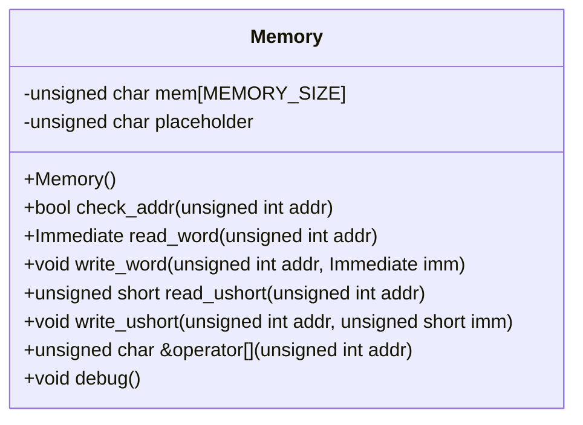

# 設計文書: Memoryクラス

## 1. 概要と責務
`Memory`クラスは、固定サイズのメモリ空間を提供し、その中のデータへの読み書き操作を行います。また、アドレス範囲チェックも行います。

## 2. 構造図


## 3. インターフェースと依存関係

### 公開インターフェース
- **Memory()**
  - 完全な名前: `Memory::Memory`
  - 引数: 無し
  - 戻り値の型: 無し
  - 目的: メモリを初期化する。
  - 使用するメンバ: `mem`, `placeholder`

- **check_addr(unsigned int addr)**
  - 完全な名前: `Memory::check_addr`
  - 引数: `addr` (unsigned int, アドレス)
  - 戻り値の型: bool (アドレスが有効かどうか)
  - 目的: 指定されたアドレスがメモリ範囲内にあるかチェックする。
  - 使用するメンバ: 無し

- **read_word(unsigned int addr)**
  - 完全な名前: `Memory::read_word`
  - 引数: `addr` (unsigned int, アドレス)
  - 戻り値の型: Immediate (指定されたアドレスから読み取ったワード)
  - 目的: 指定されたアドレスからワードを読み取る。
  - 使用するメンバ: `mem`, `check_addr`

- **write_word(unsigned int addr, Immediate imm)**
  - 完全な名前: `Memory::write_word`
  - 引数: `addr` (unsigned int, アドレス), `imm` (Immediate, 書き込むワード)
  - 戻り値の型: 無し
  - 目的: 指定されたアドレスにワードを書き込む。
  - 使用するメンバ: `mem`, `check_addr`

- **read_ushort(unsigned int addr)**
  - 完全な名前: `Memory::read_ushort`
  - 引数: `addr` (unsigned int, アドレス)
  - 戻り値の型: unsigned short (指定されたアドレスから読み取ったハーフワード)
  - 目的: 指定されたアドレスからハーフワードを読み取る。
  - 使用するメンバ: `mem`, `check_addr`

- **write_ushort(unsigned int addr, unsigned short imm)**
  - 完全な名前: `Memory::write_ushort`
  - 引数: `addr` (unsigned int, アドレス), `imm` (unsigned short, 書き込むハーフワード)
  - 戻り値の型: 無し
  - 目的: 指定されたアドレスにハーフワードを書き込む。
  - 使用するメンバ: `mem`, `check_addr`

- **operator[](unsigned int addr)**
  - 完全な名前: `Memory::operator[]`
  - 引数: `addr` (unsigned int, アドレス)
  - 戻り値の型: unsigned char& (指定されたアドレスの参照)
  - 目的: 指定されたアドレスのバイトへの参照を返す。
  - 使用するメンバ: `mem`, `check_addr`, `placeholder`

- **debug()**
  - 完全な名前: `Memory::debug`
  - 引数: 無し
  - 戻り値の型: 無し
  - 目的: デバッグ用にメモリの中身を表示する。
  - 使用するメンバ: `mem`

### 実装上の処理
- **check_addr(unsigned int addr)**
  - 呼び出す関数・メソッド: 無し

- **read_word(unsigned int addr)**
  - 呼び出す関数・メソッド: `check_addr`

- **write_word(unsigned int addr, Immediate imm)**
  - 呼び出す関数・メソッド: `check_addr`

- **read_ushort(unsigned int addr)**
  - 呼び出す関数・メソッド: `check_addr`

- **write_ushort(unsigned int addr, unsigned short imm)**
  - 呼び出す関数・メソッド: `check_addr`

- **operator[](unsigned int addr)**
  - 呼び出す関数・メソッド: `check_addr`

- **debug()**
  - 呼び出す関数・メソッド: 無し

## 4. 処理フロー図
```mermaid
flowchart TD
    A[開始] --> B{check_addr(addr)?}
    B -- true --> C[*(Immediate *)(mem + addr)]
    B -- false --> D[return 0]
    C --> E[return imm]
    D --> F[終了]
    E --> F
```

## 5. シーケンス図
該当なし。元コードから複数の関数、メソッド、オブジェクト間の呼び出し順序を直接確認できない。

## 6. 関数・メソッド仕様書

| 項目 | 記述内容 |
|---|---|
| 完全な名前 | `Memory::Memory` |
| 目的 | メモリを初期化する。 |
| 引数 | 無し |
| 戻り値 | 無し |
| 前提条件 | 無し |
| 事後条件 | `mem`が0で初期化される。 |
| 動作の説明 | `memset`を使用して`mem`を0で初期化する。 |
| 状態変更・副作用 | `mem`が初期化される。 |
| 依存関係 | `memset`, `mem` |
| 境界条件 | 無し |
| エラー処理 | 明示的なエラー処理は確認できない |
| 不変条件 | 無し |

| 項目 | 記述内容 |
|---|---|
| 完全な名前 | `Memory::check_addr` |
| 目的 | 指定されたアドレスがメモリ範囲内にあるかチェックする。 |
| 引数 | `addr` (unsigned int, アドレス) |
| 戻り値 | bool (アドレスが有効かどうか) |
| 前提条件 | 無し |
| 事後条件 | アドレスが範囲内にある場合true、それ以外の場合falseを返す。 |
| 動作の説明 | `addr`が0以上MEMORY_SIZE未満であるかチェックする。 |
| 状態変更・副作用 | 無し |
| 依存関係 | 無し |
| 境界条件 | `addr`が0またはMEMORY_SIZE-1のとき |
| エラー処理 | 明示的なエラー処理は確認できない |
| 不変条件 | 無し |

| 項目 | 記述内容 |
|---|---|
| 完全な名前 | `Memory::read_word` |
| 目的 | 指定されたアドレスからワードを読み取る。 |
| 引数 | `addr` (unsigned int, アドレス) |
| 戻り値 | Immediate (指定されたアドレスから読み取ったワード) |
| 前提条件 | 無し |
| 事後条件 | アドレスが範囲内にある場合ワードを返す、それ以外の場合0を返す。 |
| 動作の説明 | `check_addr`でアドレスチェックを行い、有効な場合は`*(Immediate *)(mem + addr)`からワードを読み取る。 |
| 状態変更・副作用 | 無し |
| 依存関係 | `check_addr`, `mem` |
| 境界条件 | アドレスが範囲外のとき |
| エラー処理 | 明示的なエラー処理は確認できない |
| 不変条件 | 無し |

| 項目 | 記述内容 |
|---|---|
| 完全な名前 | `Memory::write_word` |
| 目的 | 指定されたアドレスにワードを書き込む。 |
| 引数 | `addr` (unsigned int, アドレス), `imm` (Immediate, 書き込むワード) |
| 戻り値 | 無し |
| 前提条件 | 無し |
| 事後条件 | アドレスが範囲内にある場合ワードを書き込む。 |
| 動作の説明 | `check_addr`でアドレスチェックを行い、有効な場合は`*(Immediate *)(mem + addr)`にワードを書き込む。 |
| 状態変更・副作用 | `mem`が更新される。 |
| 依存関係 | `check_addr`, `mem` |
| 境界条件 | アドレスが範囲外のとき |
| エラー処理 | 明示的なエラー処理は確認できない |
| 不変条件 | 無し |

| 項目 | 記述内容 |
|---|---|
| 完全な名前 | `Memory::read_ushort` |
| 目的 | 指定されたアドレスからハーフワードを読み取る。 |
| 引数 | `addr` (unsigned int, アドレス) |
| 戻り値 | unsigned short (指定されたアドレスから読み取ったハーフワード) |
| 前提条件 | 無し |
| 事後条件 | アドレスが範囲内にある場合ハーフワードを返す、それ以外の場合0を返す。 |
| 動作の説明 | `check_addr`でアドレスチェックを行い、有効な場合は`*(short *)(mem + addr)`からハーフワードを読み取る。 |
| 状態変更・副作用 | 無し |
| 依存関係 | `check_addr`, `mem` |
| 境界条件 | アドレスが範囲外のとき |
| エラー処理 | 明示的なエラー処理は確認できない |
| 不変条件 | 無し |

| 項目 | 記述内容 |
|---|---|
| 完全な名前 | `Memory::write_ushort` |
| 目的 | 指定されたアドレスにハーフワードを書き込む。 |
| 引数 | `addr` (unsigned int, アドレス), `imm` (unsigned short, 書き込むハーフワード) |
| 戻り値 | 無し |
| 前提条件 | 無し |
| 事後条件 | アドレスが範囲内にある場合ハーフワードを書き込む。 |
| 動作の説明 | `check_addr`でアドレスチェックを行い、有効な場合は`*(short *)(mem + addr)`にハーフワードを書き込む。 |
| 状態変更・副作用 | `mem`が更新される。 |
| 依存関係 | `check_addr`, `mem` |
| 境界条件 | アドレスが範囲外のとき |
| エラー処理 | 明示的なエラー処理は確認できない |
| 不変条件 | 無し |

| 項目 | 記述内容 |
|---|---|
| 完全な名前 | `Memory::operator[]` |
| 目的 | 指定されたアドレスのバイトへの参照を返す。 |
| 引数 | `addr` (unsigned int, アドレス) |
| 戻り値 | unsigned char& (指定されたアドレスの参照) |
| 前提条件 | 無し |
| 事後条件 | アドレスが範囲内にある場合バイトへの参照を返す、それ以外の場合`placeholder`への参照を返す。 |
| 動作の説明 | `check_addr`でアドレスチェックを行い、有効な場合は`mem[addr]`への参照を返す。 |
| 状態変更・副作用 | 無し |
| 依存関係 | `check_addr`, `mem`, `placeholder` |
| 境界条件 | アドレスが範囲外のとき |
| エラー処理 | 明示的なエラー処理は確認できない |
| 不変条件 | 無し |

| 項目 | 記述内容 |
|---|---|
| 完全な名前 | `Memory::debug` |
| 目的 | デバッグ用にメモリの中身を表示する。 |
| 引数 | 無し |
| 戻り値 | 無し |
| 前提条件 | 無し |
| 事後条件 | 指定された範囲のメモリ内容が標準出力に表示される。 |
| 動作の説明 | メモリの指定範囲を16進数で表示する。 |
| 状態変更・副作用 | 標準出力への書き込み |
| 依存関係 | `mem`, `std::cout` |
| 境界条件 | 無し |
| エラー処理 | 明示的なエラー処理は確認できない |
| 不変条件 | 無し |

## 7. 状態遷移と重要な条件
- 更新前の状態: `mem`が初期化されている。
- 更新条件: `write_word`, `write_ushort`メソッドが呼び出され、アドレスが有効な場合。
- 更新対象と更新値: 指定されたアドレスのメモリ領域に指定された値が書き込まれる。
- 更新されない条件: アドレスが範囲外の場合。
- 更新順序: `write_word`, `write_ushort`メソッド内で`check_addr`を呼び出し、その後メモリへの書き込みを行う。
- 処理後に成立する条件: 指定されたアドレスのメモリ領域に指定された値が書き込まれている。

## 8. 確認不能事項
確認不能事項なし