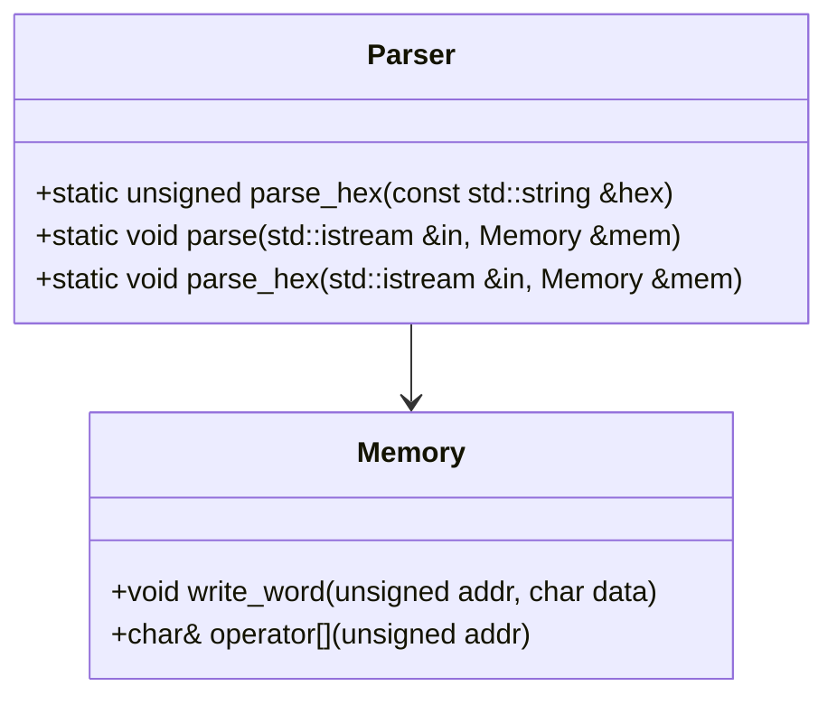
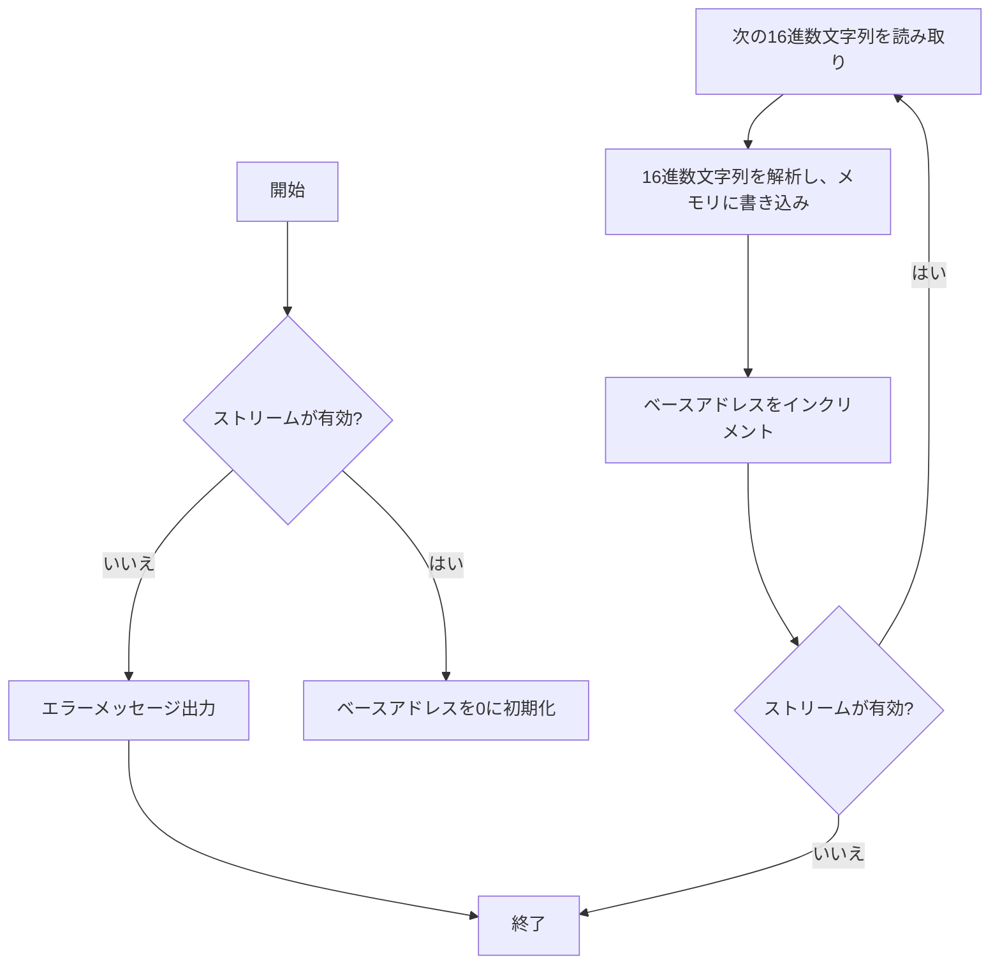

# デザイン文書: Parser クラス

## 1. 概要と責務
`Parser`クラスは、入力ストリームからデータを読み取り、それをメモリに書き込む役割を持っています。主な機能として、16進数形式の文字列を解析し、その値を指定されたメモリアドレスに格納します。

## 2. 構造図


## 3. インターフェースと依存関係

### parse_hex 関数
- **完全な名前**: `Parser::parse_hex`
- **引数**:
  - `hex`: `const std::string &` - 解析する16進数文字列。
- **戻り値**: `unsigned` - 16進数文字列を解析した結果の整数値。
- **修飾**: `static`
- **使用するメンバ・型**: `strtol`
- **呼び出す関数・メソッド**: `strtol`
- **依存**: `<cstdlib>`

### parse 関数
- **完全な名前**: `Parser::parse`
- **引数**:
  - `in`: `std::istream &` - 入力ストリーム。
  - `mem`: `Memory &` - データを書き込むメモリオブジェクト。
- **戻り値**: `void`
- **修飾**: `static`
- **使用するメンバ・型**: `std::string`, `std::getline`, `std::stringstream`, `strtol`
- **呼び出す関数・メソッド**: `std::cerr <<`, `std::getline`, `std::stringstream >>`, `parse_hex`, `Memory::operator[]`
- **依存**: `<iostream>`, `<sstream>`, `<string>`

### parse_hex 関数 (オーバーロード)
- **完全な名前**: `Parser::parse_hex`
- **引数**:
  - `in`: `std::istream &` - 入力ストリーム。
  - `mem`: `Memory &` - データを書き込むメモリオブジェクト。
- **戻り値**: `void`
- **修飾**: `static`
- **使用するメンバ・型**: `std::string`, `strtol`
- **呼び出す関数・メソッド**: `std::cerr <<`, `parse_hex`, `Memory::write_word`
- **依存**: `<iostream>`, `<sstream>`, `<string>`

## 4. 処理フロー図
### parse 関数の処理フロー
```mermaid
flowchart TD
    A[開始] --> B{ストリームが有効?}
    B -- いいえ --> C[エラーメッセージ出力]
    B -- はい --> D[ベースアドレスを0に初期化]
    E[次の行を読み込む] --> F{行の先頭文字が'@'?}
    F -- いいえ --> G[ストリームから16進数文字列を読み取り]
    H[16進数文字列を解析し、メモリに書き込み] --> I[ベースアドレスをインクリメント]
    J{ストリームが有効?} --> K[次の行を読み込む]
    F -- はい --> L[ベースアドレスを更新]
    M[ストリームが有効?] --> N[終了]
    C --> N
    I --> J
    G --> H
    K --> F
    L --> M
```

### parse_hex 関数の処理フロー (オーバーロード)


## 5. シーケンス図
該当なし  
理由: 元コードから複数の関数、メソッド、オブジェクト間の呼び出し順序を直接確認できない。

## 6. 関数・メソッド仕様書

### parse_hex 関数
| 項目 | 記述内容 |
|---|---|
| 完全な名前 | `Parser::parse_hex` |
| 目的 | 16進数文字列を整数値に変換する。 |
| 引数 | `hex`: `const std::string &` - 解析する16進数文字列。 |
| 戻り値 | `unsigned` - 変換された整数値。 |
| 前提条件 | なし |
| 事後条件 | なし |
| 動作の説明 | `strtol`関数を使用して16進数文字列を解析し、その結果を返す。 |
| 状態変更・副作用 | なし |
| 依存関係 | `<cstdlib>` |
| 境界条件 | 文字列が空や無効な16進数形式の場合の動作は確認できない。 |
| エラー処理 | 明示的なエラー処理は確認できない。 |
| 不変条件 | なし |

### parse 関数
| 項目 | 記述内容 |
|---|---|
| 完全な名前 | `Parser::parse` |
| 目的 | 入力ストリームからデータを読み取り、メモリに書き込む。 |
| 引数 | `in`: `std::istream &` - 入力ストリーム。<br>`mem`: `Memory &` - データを書き込むメモリオブジェクト。 |
| 戻り値 | `void` |
| 前提条件 | なし |
| 事後条件 | ストリームから読み取ったデータがメモリに正しく書き込まれている。 |
| 動作の説明 | 入力ストリームから行を読み取り、'@'で始まる行はベースアドレスを更新し、それ以外の行は16進数文字列を解析してメモリに書き込む。 |
| 状態変更・副作用 | メモリオブジェクト`mem`が更新される。 |
| 依存関係 | `<iostream>`, `<sstream>`, `<string>` |
| 境界条件 | ストリームが無効な場合の動作は確認できない。<br>16進数文字列が空や無効な形式の場合の動作は確認できない。 |
| エラー処理 | ストリームが無効な場合はエラーメッセージを出力する。明示的なエラー処理は確認できない。 |
| 不変条件 | なし |

### parse_hex 関数 (オーバーロード)
| 項目 | 記述内容 |
|---|---|
| 完全な名前 | `Parser::parse_hex` |
| 目的 | 入力ストリームから16進数文字列を読み取り、メモリに書き込む。 |
| 引数 | `in`: `std::istream &` - 入力ストリーム。<br>`mem`: `Memory &` - データを書き込むメモリオブジェクト。 |
| 戻り値 | `void` |
| 前提条件 | なし |
| 事後条件 | ストリームから読み取ったデータがメモリに正しく書き込まれている。 |
| 動作の説明 | 入力ストリームから16進数文字列を読み取り、それを解析してメモリに4バイト単位で書き込む。 |
| 状態変更・副作用 | メモリオブジェクト`mem`が更新される。 |
| 依存関係 | `<iostream>`, `<sstream>`, `<string>` |
| 境界条件 | ストリームが無効な場合の動作は確認できない。<br>16進数文字列が空や無効な形式の場合の動作は確認できない。 |
| エラー処理 | ストリームが無効な場合はエラーメッセージを出力する。明示的なエラー処理は確認できない。 |
| 不変条件 | なし |

## 7. 状態遷移と重要な条件
該当なし  
理由: `Parser`クラスは状態を持つものではなく、静的メソッドのみで構成されている。

## 8. 確認不能事項
- ストリームが無効な場合の動作。
- 16進数文字列が空や無効な形式の場合の動作。
- 明示的なエラー処理。