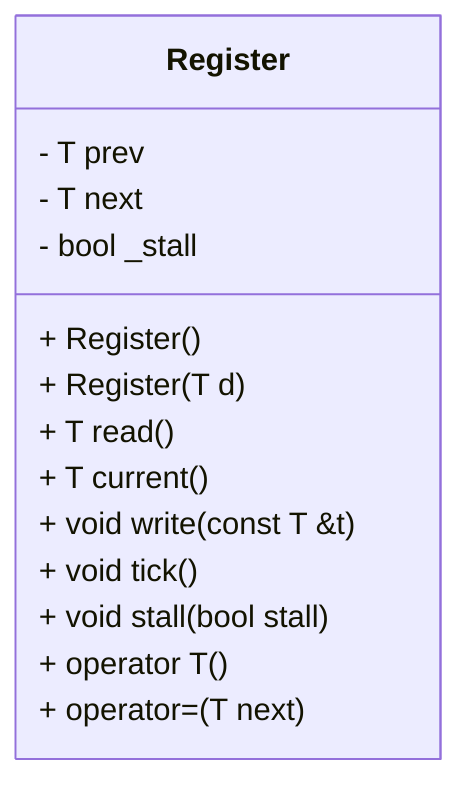

# 設計文書: Register クラス

## 1. 概要と責務
`Register`クラスは、ジェネリックな型 `T` の値を保持し、現在の値と次の値を管理します。また、ステージングされた値（next）を現在の値（prev）に移行する機能（tickメソッド）や、一時的に更新を停止させる機能（stallメソッド）も提供しています。

## 2. 構造図


## 3. インターフェースと依存関係

### 公開インターフェース
- **Register()**
  - 完全な名前: `Register<T>::Register()`
  - 引数: 無し
  - 戻り値の型: 無し
  - 目的: デフォルトコンストラクタ。`prev`と`next`を0に初期化し、`_stall`をfalseに設定する。
- **Register(T d)**
  - 完全な名前: `Register<T>::Register(T d)`
  - 引数: `d` (型: T, 意味: 初期値)
  - 戻り値の型: 無し
  - 目的: 値`d`で初期化するコンストラクタ。`prev`と`next`を`d`に設定し、`_stall`をfalseに設定する。
- **T read()**
  - 完全な名前: `Register<T>::read()`
  - 引数: 無し
  - 戻り値の型: T (意味: 前回の値)
  - 目的: `prev`の値を返す。
- **T current()**
  - 完全な名前: `Register<T>::current()`
  - 引数: 無し
  - 戻り値の型: T (意味: 次回の値)
  - 目的: `next`の値を返す。
- **void write(const T &t)**
  - 完全な名前: `Register<T>::write(const T &t)`
  - 引数: `t` (型: const T&, 意味: 書き込む値)
  - 戻り値の型: 無し
  - 目的: `next`に`t`を設定する。
- **void tick()**
  - 完全な名前: `Register<T>::tick()`
  - 引数: 無し
  - 戻り値の型: 無し
  - 目的: `_stall`がfalseの場合、`prev`を`next`に更新する。
- **void stall(bool stall)**
  - 完全な名前: `Register<T>::stall(bool stall)`
  - 引数: `stall` (型: bool, 意味: ステージングの停止状態)
  - 戻り値の型: 無し
  - 目的: `_stall`を`stall`に設定する。
- **operator T()**
  - 完全な名前: `Register<T>::operator T()`
  - 引数: 無し
  - 戻り値の型: T (意味: 前回の値)
  - 目的: `read()`メソッドを呼び出し、`prev`の値を返す。
- **operator=(T next)**
  - 完全な名前: `Register<T>::operator=(T next)`
  - 引数: `next` (型: T, 意味: 書き込む値)
  - 戻り値の型: 無し
  - 目的: `write(next)`メソッドを呼び出し、`next`に`t`を設定する。

### 実装上の処理
- **メンバ変数**
  - `prev`: 前回の値を保持する。
  - `next`: 次回の値を保持する。
  - `_stall`: 更新が一時的に停止されているかどうかを示すフラグ。

## 4. 処理フロー図
```mermaid
flowchart TD
    A[開始] --> B{tick() 呼び出し}
    B -- _stall == false --> C[prev = next]
    B -- _stall == true --> D[何もしない]
    C --> E[終了]
    D --> E
```

## 5. シーケンス図
該当なし。元コードから複数の関数、メソッド、オブジェクト間の呼び出し順序を直接確認できない。

## 6. 関数・メソッド仕様書

| 項目 | 記述内容 |
|---|---|
| 完全な名前 | `Register<T>::Register()` |
| 目的 | デフォルトコンストラクタ。`prev`と`next`を0に初期化し、`_stall`をfalseに設定する。 |
| 引数 | 無し |
| 戻り値 | 無し |
| 前提条件 | 無し |
| 事後条件 | `prev == 0`, `next == 0`, `_stall == false` |
| 動作の説明 | デフォルトコンストラクタとして動作する。 |
| 状態変更・副作用 | `prev`, `next`, `_stall`が初期化される。 |
| 依存関係 | 無し |
| 境界条件 | 無し |
| エラー処理 | 明示的なエラー処理は確認できない |
| 不変条件 | 無し |

| 項目 | 記述内容 |
|---|---|
| 完全な名前 | `Register<T>::Register(T d)` |
| 目的 | 値`d`で初期化するコンストラクタ。`prev`と`next`を`d`に設定し、`_stall`をfalseに設定する。 |
| 引数 | `d` (型: T, 意味: 初期値) |
| 戻り値 | 無し |
| 前提条件 | 無し |
| 事後条件 | `prev == d`, `next == d`, `_stall == false` |
| 動作の説明 | 引数`d`で初期化する。 |
| 状態変更・副作用 | `prev`, `next`, `_stall`が初期化される。 |
| 依存関係 | 無し |
| 境界条件 | 無し |
| エラー処理 | 明示的なエラー処理は確認できない |
| 不変条件 | 無し |

| 項目 | 記述内容 |
|---|---|
| 完全な名前 | `Register<T>::read()` |
| 目的 | `prev`の値を返す。 |
| 引数 | 無し |
| 戻り値 | T (意味: 前回の値) |
| 前提条件 | 無し |
| 事後条件 | 無し |
| 動作の説明 | `prev`の値を返す。 |
| 状態変更・副作用 | 無し |
| 依存関係 | 無し |
| 境界条件 | 無し |
| エラー処理 | 明示的なエラー処理は確認できない |
| 不変条件 | 無し |

| 項目 | 記述内容 |
|---|---|
| 完全な名前 | `Register<T>::current()` |
| 目的 | `next`の値を返す。 |
| 引数 | 無し |
| 戻り値 | T (意味: 次回の値) |
| 前提条件 | 無し |
| 事後条件 | 無し |
| 動作の説明 | `next`の値を返す。 |
| 状態変更・副作用 | 無し |
| 依存関係 | 無し |
| 境界条件 | 無し |
| エラー処理 | 明示的なエラー処理は確認できない |
| 不変条件 | 無し |

| 項目 | 記述内容 |
|---|---|
| 完全な名前 | `Register<T>::write(const T &t)` |
| 目的 | `next`に`t`を設定する。 |
| 引数 | `t` (型: const T&, 意味: 書き込む値) |
| 戻り値 | 無し |
| 前提条件 | 無し |
| 事後条件 | `next == t` |
| 動作の説明 | 引数`t`を`next`に設定する。 |
| 状態変更・副作用 | `next`が更新される。 |
| 依存関係 | 無し |
| 境界条件 | 無し |
| エラー処理 | 明示的なエラー処理は確認できない |
| 不変条件 | 無し |

| 項目 | 記述内容 |
|---|---|
| 完全な名前 | `Register<T>::tick()` |
| 目的 | `_stall`がfalseの場合、`prev`を`next`に更新する。 |
| 引数 | 無し |
| 戻り値 | 無し |
| 前提条件 | 無し |
| 事後条件 | `_stall == false`のとき`prev == next` |
| 動作の説明 | `_stall`がfalseの場合、`prev`を`next`に更新する。 |
| 状態変更・副作用 | `_stall == false`のとき`prev`が更新される。 |
| 依存関係 | 無し |
| 境界条件 | 無し |
| エラー処理 | 明示的なエラー処理は確認できない |
| 不変条件 | 無し |

| 項目 | 記述内容 |
|---|---|
| 完全な名前 | `Register<T>::stall(bool stall)` |
| 目的 | `_stall`を`stall`に設定する。 |
| 引数 | `stall` (型: bool, 意味: ステージングの停止状態) |
| 戻り値 | 無し |
| 前提条件 | 無し |
| 事後条件 | `_stall == stall` |
| 動作の説明 | 引数`stall`を`_stall`に設定する。 |
| 状態変更・副作用 | `_stall`が更新される。 |
| 依存関係 | 無し |
| 境界条件 | 無し |
| エラー処理 | 明示的なエラー処理は確認できない |
| 不変条件 | 無し |

| 項目 | 記述内容 |
|---|---|
| 完全な名前 | `Register<T>::operator T()` |
| 目的 | `read()`メソッドを呼び出し、`prev`の値を返す。 |
| 引数 | 無し |
| 戻り値 | T (意味: 前回の値) |
| 前提条件 | 無し |
| 事後条件 | 無し |
| 動作の説明 | `read()`メソッドを呼び出し、`prev`の値を返す。 |
| 状態変更・副作用 | 無し |
| 依存関係 | read() |
| 境界条件 | 無し |
| エラー処理 | 明示的なエラー処理は確認できない |
| 不変条件 | 無し |

| 項目 | 記述内容 |
|---|---|
| 完全な名前 | `Register<T>::operator=(T next)` |
| 目的 | `write(next)`メソッドを呼び出し、`next`に`t`を設定する。 |
| 引数 | `next` (型: T, 意味: 書き込む値) |
| 戻り値 | 無し |
| 前提条件 | 無し |
| 事後条件 | `next == next` |
| 動作の説明 | 引数`next`を`write(next)`メソッドに渡して呼び出す。 |
| 状態変更・副作用 | `next`が更新される。 |
| 依存関係 | write() |
| 境界条件 | 無し |
| エラー処理 | 明示的なエラー処理は確認できない |
| 不変条件 | 無し |

## 7. 状態遷移と重要な条件

- **更新前の状態**: `_stall`の値
- **更新条件**: `tick()`メソッドが呼び出され、かつ`_stall == false`
- **更新対象と更新値**: `prev = next`
- **更新されない条件**: `_stall == true`
- **更新順序**: `tick()`メソッド内で`prev = next`の順序で実行される。
- **処理後に成立する条件**: `_stall == false`のとき`prev == next`

## 8. 確認不能事項
確認不能事項なし