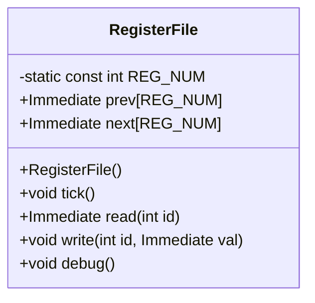

# 設計文書: RegisterFile クラス

## 1. 概要と責務
RegisterFileクラスは、RISC-Vシミュレータにおいて32個のレジスタを管理する役割を持っています。各レジスタには現在の値（next）と前のクロックサイクルでの値（prev）が保持されます。また、レジスタへの読み書き操作やデバッグ用の出力機能も提供しています。

## 2. 構造図


## 3. インターフェースと依存関係

### 公開インターフェース
- **RegisterFile()**
  - 完全な名前: RegisterFile::RegisterFile()
  - 引数: 無し
  - 戻り値の型: void
  - 目的: オブジェクトを初期化し、すべてのレジスタを0に設定する。
  - 使用するメンバ: prev, next
  - 呼び出す関数・メソッド: memset

- **void tick()**
  - 完全な名前: RegisterFile::tick()
  - 引数: 無し
  - 戻り値の型: void
  - 目的: クロックサイクルを進め、next配列の値をprev配列にコピーする。
  - 使用するメンバ: prev, next
  - 呼び出す関数・メソッド: memcpy

- **Immediate read(int id)**
  - 完全な名前: RegisterFile::read(int id)
  - 引数: int id (レジスタ番号)
  - 戻り値の型: Immediate
  - 目的: 指定されたレジスタ番号の前のクロックサイクルでの値を返す。
  - 使用するメンバ: prev

- **void write(int id, Immediate val)**
  - 完全な名前: RegisterFile::write(int id, Immediate val)
  - 引数: int id (レジスタ番号), Immediate val (書き込む値)
  - 戻り値の型: void
  - 目的: 指定されたレジスタ番号に次のクロックサイクルでの値を設定する。
  - 使用するメンバ: next

- **void debug()**
  - 完全な名前: RegisterFile::debug()
  - 引数: 無し
  - 戻り値の型: void
  - 目的: レジスタの現在の状態をデバッグ用に出力する。
  - 使用するメンバ: next

### 実装上の処理
- **RegisterFile()**
  - 前提条件: 無し
  - 事後条件: prevとnext配列が0で初期化される。

- **void tick()**
  - 前提条件: 無し
  - 事後条件: nextの値がprevにコピーされる。

- **Immediate read(int id)**
  - 前提条件: 0 <= id < REG_NUM
  - 事後条件: 指定されたレジスタ番号の前のクロックサイクルでの値が返される。
  - 動作の説明: 引数idが0の場合、常に0を返す。それ以外はprev[id]を返す。

- **void write(int id, Immediate val)**
  - 前提条件: 0 <= id < REG_NUM
  - 事後条件: 指定されたレジスタ番号に次のクロックサイクルでの値が設定される。
  - 動作の説明: next[id]に引数valを代入する。

- **void debug()**
  - 前提条件: 無し
  - 事後条件: レジスタの現在の状態が出力される。
  - 動作の説明: next配列の値をデバッグ用に出力する。レジスタ名も合わせて表示される。

## 4. 処理フロー図
```mermaid
flowchart TD
    A[RegisterFile()] --> B{初期化}
    B --> C[prevを0に設定]
    C --> D[nextを0に設定]
    D --> E[終了]

    F[tick()] --> G{nextの値をコピー}
    G --> H[prev = next]
    H --> I[終了]

    J[read(int id)] --> K{id == 0?}
    K --はい--> L[return 0]
    K --いいえ--> M[return prev[id]]
    L --> N[終了]
    M --> O[終了]

    P[write(int id, Immediate val)] --> Q[next[id] = val]
    Q --> R[終了]

    S[debug()] --> T{レジスタ名と値を出力}
    T --> U[forループで表示]
    U --> V[終了]
```

## 5. シーケンス図
該当なし。対象コードから複数の関数、メソッド、オブジェクト間の呼び出し順序を直接確認できない。

## 6. 関数・メソッド仕様書

| 項目 | 記述内容 |
|---|---|
| 完全な名前 | RegisterFile::RegisterFile() |
| 目的 | オブジェクトを初期化し、すべてのレジスタを0に設定する。 |
| 引数 | 無し |
| 戻り値 | 型: void, 意味: なし |
| 前提条件 | 無し |
| 事後条件 | prevとnext配列が0で初期化される。 |
| 動作の説明 | memsetを使用してprevとnext配列を0に設定する。 |
| 状態変更・副作用 | prev, next |
| 依存関係 | memset |
| 境界条件 | 無し |
| エラー処理 | 明示的なエラー処理は確認できない |
| 不変条件 | REG_NUM |

| 項目 | 記述内容 |
|---|---|
| 完全な名前 | RegisterFile::tick() |
| 目的 | クロックサイクルを進め、next配列の値をprev配列にコピーする。 |
| 引数 | 無し |
| 戻り値 | 型: void, 意味: なし |
| 前提条件 | 無し |
| 事後条件 | nextの値がprevにコピーされる。 |
| 動作の説明 | memcpyを使用してnext配列の値をprev配列にコピーする。 |
| 状態変更・副作用 | prev |
| 依存関係 | memcpy |
| 境界条件 | 無し |
| エラー処理 | 明示的なエラー処理は確認できない |
| 不変条件 | REG_NUM |

| 項目 | 記述内容 |
|---|---|
| 完全な名前 | RegisterFile::read(int id) |
| 目的 | 指定されたレジスタ番号の前のクロックサイクルでの値を返す。 |
| 引数 | int id (レジスタ番号) |
| 戻り値 | 型: Immediate, 意味: レジスタの値 |
| 前提条件 | 0 <= id < REG_NUM |
| 事後条件 | 指定されたレジスタ番号の前のクロックサイクルでの値が返される。 |
| 動作の説明 | 引数idが0の場合、常に0を返す。それ以外はprev[id]を返す。 |
| 状態変更・副作用 | 無し |
| 依存関係 | 無し |
| 境界条件 | id == 0, 0 <= id < REG_NUM |
| エラー処理 | 明示的なエラー処理は確認できない |
| 不変条件 | REG_NUM |

| 項目 | 記述内容 |
|---|---|
| 完全な名前 | RegisterFile::write(int id, Immediate val) |
| 目的 | 指定されたレジスタ番号に次のクロックサイクルでの値を設定する。 |
| 引数 | int id (レジスタ番号), Immediate val (書き込む値) |
| 戻り値 | 型: void, 意味: なし |
| 前提条件 | 0 <= id < REG_NUM |
| 事後条件 | 指定されたレジスタ番号に次のクロックサイクルでの値が設定される。 |
| 動作の説明 | next[id]に引数valを代入する。 |
| 状態変更・副作用 | next |
| 依存関係 | 無し |
| 境界条件 | 0 <= id < REG_NUM |
| エラー処理 | 明示的なエラー処理は確認できない |
| 不変条件 | REG_NUM |

| 項目 | 記述内容 |
|---|---|
| 完全な名前 | RegisterFile::debug() |
| 目的 | レジスタの現在の状態をデバッグ用に出力する。 |
| 引数 | 無し |
| 戻り値 | 型: void, 意味: なし |
| 前提条件 | 無し |
| 事後条件 | レジスタの現在の状態が出力される。 |
| 動作の説明 | next配列の値をデバッグ用に出力する。レジスタ名も合わせて表示される。 |
| 状態変更・副作用 | 無し |
| 依存関係 | debug_immediate, std::cout, std::setw, sprintf |
| 境界条件 | 無し |
| エラー処理 | 明示的なエラー処理は確認できない |
| 不変条件 | REG_NUM |

## 7. 状態遷移と重要な条件

- **tick()**
  - 更新前の状態: nextの値
  - 更新条件: tickメソッドが呼び出される。
  - 更新対象と更新値: prev = next
  - 更新されない条件: 無し
  - 更新順序: nextからprevへのコピー
  - 処理後に成立する条件: prevにnextの値がコピーされている。

- **write(int id, Immediate val)**
  - 更新前の状態: next[id]の値
  - 更新条件: writeメソッドが呼び出される。
  - 更新対象と更新値: next[id] = val
  - 更新されない条件: 無し
  - 更新順序: 引数valからnext[id]への代入
  - 処理後に成立する条件: next[id]に引数valが設定されている。

## 8. 確認不能事項
- tickメソッドが呼び出されるタイミングや頻度。
- readメソッドとwriteメソッドの呼び出し元や利用目的。
- debugメソッドがどのように使用されるか。
- Immediate型の定義や内部構造。