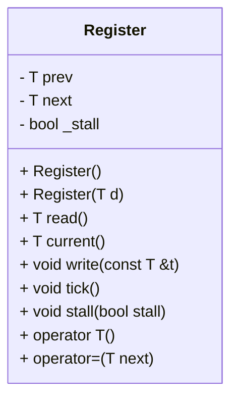

# 設計文書: Register クラス

## 1. 概要

`Register`クラスは、ジェネリックな型 `T` の値を保持し、その値の読み書きを行うための機能を提供します。内部には現在の値 (`next`)と一つ前の値 (`prev`) を保持しており、ステートマシンのクロックサイクルに合わせて値を更新するメカニズムが備わっています。

## 2. クラス図

## 3. クラス・メソッド・インターフェースの詳細

### 属性
- `prev`: 前回の値を保持する。
- `next`: 次に読み出される値を保持する。
- `_stall`: レジスタの更新を停止させるフラグ。

### コンストラクタ
| 完全な名前 | 引数名と型 | 戻り値の型 | 修飾 |
|---|---|---|---|
| Register() | - | - | - |
| Register(T d) | T d | - | - |

#### 呼び出し側が満たす前提条件
- `Register()` : 引数なしで初期化される。
- `Register(T d)` : 初期値 `d` が指定された状態で初期化される。

#### 呼び出し後に保証される事後条件
- `prev` と `next` は両方ともゼロに初期化される。(`Register()`)
- `prev` と `next` は両方とも指定された値 `d` で初期化される。(`Register(T d)`)
- `_stall` は `false` に初期化される。

### メソッド
| 完全な名前 | 引数名と型 | 戻り値の型 | 修飾 |
|---|---|---|---|
| read() | - | T | - |
| current() | - | T | - |
| write(const T &t) | const T &t | void | - |
| tick() | - | void | - |
| stall(bool stall) | bool stall | void | - |
| operator T() | - | T | - |
| operator=(T next) | T next | void | - |

#### read()
- **目的**: 前回の値 (`prev`) を読み出す。
- **引数**: なし
- **戻り値**: `T` 型の前回の値 (`prev`)
- **状態変更・副作用**: なし

#### current()
- **目的**: 次に読み出される値 (`next`) を読み出す。
- **引数**: なし
- **戻り値**: `T` 型の次の値 (`next`)
- **状態変更・副作用**: なし

#### write(const T &t)
- **目的**: 次に読み出される値 (`next`) を書き込む。
- **引数**: `const T &t` - 書き込む値
- **戻り値**: void
- **状態変更・副作用**: `next` が指定された値 `t` に更新される。

#### tick()
- **目的**: クロックサイクルの終了時に呼び出され、次の値 (`next`) を前の値 (`prev`) に反映させる。
- **引数**: なし
- **戻り値**: void
- **状態変更・副作用**: `_stall` が `false` の場合のみ、`prev` が `next` の値に更新される。

#### stall(bool stall)
- **目的**: レジスタの更新を停止させるフラグ (`_stall`) を設定する。
- **引数**: `bool stall` - 更新を停止させるかどうか
- **戻り値**: void
- **状態変更・副作用**: `_stall` が指定された値に更新される。

#### operator T()
- **目的**: オブジェクトを `T` 型の値として扱うための型変換演算子。
- **引数**: なし
- **戻り値**: `T` 型の前回の値 (`prev`)
- **状態変更・副作用**: なし

#### operator=(T next)
- **目的**: オブジェクトに代入演算子を使用して次の値 (`next`) を書き込む。
- **引数**: `T next` - 書き込む値
- **戻り値**: void
- **状態変更・副作用**: `next` が指定された値 `t` に更新される。

## 4. 処理順序

### tick()
1. 呼び出し元: 外部のクロックサイクル管理コード。
2. 対象部分: `Register::tick()`
3. 条件分岐:
   - `_stall` が `false` の場合、`prev` を `next` の値に更新する。

## 5. メソッド仕様書

### read()
| 項目 | 記述内容 |
|---|---|
| メソッド名 | Register::read() |
| 目的 | 前回の値 (`prev`) を読み出す。 |
| 引数 | なし |
| 戻り値 | `T` 型の前回の値 (`prev`) |
| 前提条件 | オブジェクトが初期化されていること |
| 動作の説明 | `prev` の値を返す。 |
| 状態変更・副作用 | なし |
| 依存関係 | なし |
| 境界条件 | なし |
| エラー処理 | なし |
| 不変条件 | `prev` の値が変化しないこと |

### current()
| 項目 | 記述内容 |
|---|---|
| メソッド名 | Register::current() |
| 目的 | 次に読み出される値 (`next`) を読み出す。 |
| 引数 | なし |
| 戻り値 | `T` 型の次の値 (`next`) |
| 前提条件 | オブジェクトが初期化されていること |
| 動作の説明 | `next` の値を返す。 |
| 状態変更・副作用 | なし |
| 依存関係 | なし |
| 境界条件 | なし |
| エラー処理 | なし |
| 不変条件 | `next` の値が変化しないこと |

### write(const T &t)
| 項目 | 記述内容 |
|---|---|
| メソッド名 | Register::write() |
| 目的 | 次に読み出される値 (`next`) を書き込む。 |
| 引数 | `const T &t` - 書き込む値 |
| 戻り値 | void |
| 前提条件 | オブジェクトが初期化されていること |
| 動作の説明 | `next` に引数 `t` の値を代入する。 |
| 状態変更・副作用 | `next` が指定された値 `t` に更新される。 |
| 依存関係 | なし |
| 境界条件 | なし |
| エラー処理 | なし |
| 不変条件 | `_stall` の値が変化しないこと |

### tick()
| 項目 | 記述内容 |
|---|---|
| メソッド名 | Register::tick() |
| 目的 | クロックサイクルの終了時に呼び出され、次の値 (`next`) を前の値 (`prev`) に反映させる。 |
| 引数 | なし |
| 戻り値 | void |
| 前提条件 | オブジェクトが初期化されていること |
| 動作の説明 | `_stall` が `false` の場合のみ、`prev` を `next` の値に更新する。 |
| 状態変更・副作用 | `_stall` が `false` の場合のみ、`prev` が `next` の値に更新される。 |
| 依存関係 | なし |
| 境界条件 | なし |
| エラー処理 | なし |
| 不変条件 | `_stall` の値が変化しないこと |

### stall(bool stall)
| 項目 | 記述内容 |
|---|---|
| メソッド名 | Register::stall() |
| 目的 | レジスタの更新を停止させるフラグ (`_stall`) を設定する。 |
| 引数 | `bool stall` - 更新を停止させるかどうか |
| 戻り値 | void |
| 前提条件 | オブジェクトが初期化されていること |
| 動作の説明 | `_stall` に引数 `stall` の値を代入する。 |
| 状態変更・副作用 | `_stall` が指定された値に更新される。 |
| 依存関係 | なし |
| 境界条件 | なし |
| エラー処理 | なし |
| 不変条件 | `prev` と `next` の値が変化しないこと |

### operator T()
| 項目 | 記述内容 |
|---|---|
| メソッド名 | Register::operator T() |
| 目的 | オブジェクトを `T` 型の値として扱うための型変換演算子。 |
| 引数 | なし |
| 戻り値 | `T` 型の前回の値 (`prev`) |
| 前提条件 | オブジェクトが初期化されていること |
| 動作の説明 | `prev` の値を返す。 |
| 状態変更・副作用 | なし |
| 依存関係 | なし |
| 境界条件 | なし |
| エラー処理 | なし |
| 不変条件 | `prev` の値が変化しないこと |

### operator=(T next)
| 項目 | 記述内容 |
|---|---|
| メソッド名 | Register::operator=() |
| 目的 | オブジェクトに代入演算子を使用して次の値 (`next`) を書き込む。 |
| 引数 | `T next` - 書き込む値 |
| 戻り値 | void |
| 前提条件 | オブジェクトが初期化されていること |
| 動作の説明 | `next` に引数 `next` の値を代入する。 |
| 状態変更・副作用 | `next` が指定された値 `t` に更新される。 |
| 依存関係 | なし |
| 境界条件 | なし |
| エラー処理 | なし |
| 不変条件 | `_stall` の値が変化しないこと |

## 6. 重要な不変条件
- `tick()` メソッド呼び出し後、`_stall` が `false` の場合のみ `prev` は `next` の値に更新される。
- `write(const T &t)` メソッド呼び出し後、`next` は指定された値 `t` に更新される。
- `stall(bool stall)` メソッド呼び出し後、`_stall` は指定された値 `stall` に更新される。