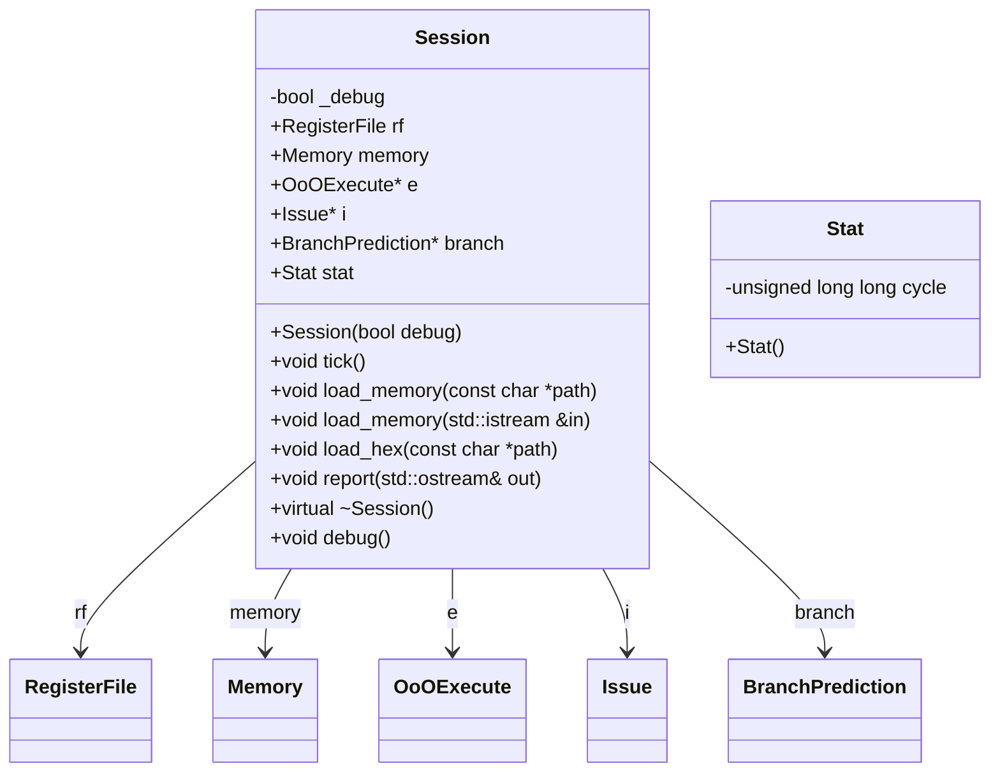

# 設計文書

## 1. 概要と責務

### 概要
`Session`クラスは、RISC-Vシミュレータのセッションを管理します。メモリ、レジスタファイル、命令発行（Issue）、アウトオforder実行（OoOExecute）、分岐予測（BranchPrediction）などのコンポーネントを持ち、シミュレーションの各サイクルでの動作を制御します。

### 責務
- シミュレータセッションの初期化と終了処理。
- メモリへのデータロード。
- 各サイクルでのシミュレーションの進行（tick）。
- デバッグ情報の出力。
- シミュレーション結果のレポート作成。

## 2. 構造図



## 3. インターフェースと依存関係

### 公開インターフェース

#### `Session::Session(bool debug)`
- **引数**: 
  - `debug`: デバッグモードを有効にするかどうか。
- **戻り値**: 無し
- **修飾**: コンストラクタ
- **使用するメンバ**: `_debug`, `rf`, `memory`, `i`, `e`, `branch`
- **呼び出す関数・メソッド**: 
  - `Issue::Issue(Session*)`
  - `OoOExecute::OoOExecute(Session*)`
  - `BranchPrediction::BranchPrediction()`

#### `Session::~Session()`
- **引数**: 無し
- **戻り値**: 無し
- **修飾**: デストラクタ
- **使用するメンバ**: `i`, `e`, `branch`
- **呼び出す関数・メソッド**: 
  - `delete`

#### `Session::tick()`
- **引数**: 無し
- **戻り値**: 無し
- **修飾**: パブリックメンバ関数
- **使用するメンバ**: `_debug`, `stat.cycle`, `i`, `e`, `rf`
- **呼び出す関数・メソッド**: 
  - `Issue::update()`
  - `OoOExecute::update()`
  - `Session::debug()`
  - `Issue::tick()`
  - `OoOExecute::tick()`
  - `RegisterFile::tick()`

#### `Session::load_memory(const char *path)`
- **引数**: 
  - `path`: メモリデータを含むファイルのパス。
- **戻り値**: 無し
- **修飾**: パブリックメンバ関数
- **使用するメンバ**: 無し
- **呼び出す関数・メソッド**: 
  - `Session::load_memory(std::istream &in)`

#### `Session::load_memory(std::istream &in)`
- **引数**: 
  - `in`: メモリデータを含む入力ストリーム。
- **戻り値**: 無し
- **修飾**: パブリックメンバ関数
- **使用するメンバ**: `memory`
- **呼び出す関数・メソッド**: 
  - `Parser::parse(std::istream &, Memory)`

#### `Session::load_hex(const char *path)`
- **引数**: 
  - `path`: メモリデータを含むファイルのパス。
- **戻り値**: 無し
- **修飾**: パブリックメンバ関数
- **使用するメンバ**: `memory`
- **呼び出す関数・メソッド**: 
  - `Parser::parse_hex(std::istream &, Memory)`

#### `Session::report(std::ostream &out)`
- **引数**: 
  - `out`: レポートを出力するストリーム。
- **戻り値**: 無し
- **修飾**: パブリックメンバ関数
- **使用するメンバ**: `stat.cycle`, `i`
- **呼び出す関数・メソッド**: 
  - `Issue::report(std::ostream &out)`
  - `OoOExecute::report(std::ostream &out)`

#### `Session::debug()`
- **引数**: 無し
- **戻り値**: 無し
- **修飾**: パブリックメンバ関数
- **使用するメンバ**: `_debug`, `stat.cycle`, `i`, `e`, `rf`
- **呼び出す関数・メソッド**: 
  - `Issue::debug()`
  - `OoOExecute::debug()`
  - `RegisterFile::debug()`

### 実装上の処理

#### `Session::tick()`
- **引数**: 無し
- **戻り値**: 無し
- **修飾**: パブリックメンバ関数
- **使用するメンバ**: `_debug`, `stat.cycle`, `i`, `e`, `rf`
- **呼び出す関数・メソッド**: 
  - `Issue::update()`
  - `OoOExecute::update()`
  - `Session::debug()`
  - `Issue::tick()`
  - `OoOExecute::tick()`
  - `RegisterFile::tick()`

#### `Session::load_memory(const char *path)`
- **引数**: 
  - `path`: メモリデータを含むファイルのパス。
- **戻り値**: 無し
- **修飾**: パブリックメンバ関数
- **使用するメンバ**: 無し
- **呼び出す関数・メソッド**: 
  - `Session::load_memory(std::istream &in)`

#### `Session::load_hex(const char *path)`
- **引数**: 
  - `path`: メモリデータを含むファイルのパス。
- **戻り値**: 無し
- **修飾**: パブリックメンバ関数
- **使用するメンバ**: `memory`
- **呼び出す関数・メソッド**: 
  - `Parser::parse_hex(std::istream &, Memory)`

#### `Session::report(std::ostream &out)`
- **引数**: 
  - `out`: レポートを出力するストリーム。
- **戻り値**: 無し
- **修飾**: パブリックメンバ関数
- **使用するメンバ**: `stat.cycle`, `i`
- **呼び出す関数・メソッド**: 
  - `Issue::report(std::ostream &out)`
  - `OoOExecute::report(std::ostream &out)`

#### `Session::debug()`
- **引数**: 無し
- **戻り値**: 無し
- **修飾**: パブリックメンバ関数
- **使用するメンバ**: `_debug`, `stat.cycle`, `i`, `e`, `rf`
- **呼び出す関数・メソッド**: 
  - `Issue::debug()`
  - `OoOExecute::debug()`
  - `RegisterFile::debug()`

## 4. 処理フロー図

### `Session::tick()`

```mermaid
flowchart TD
    A[開始] --> B[increment stat.cycle]
    B --> C[i->update()]
    C --> D[e->update()]
    D --> E{is _debug?}
    E --はい--> F[call debug()]
    E --いいえ--> G[i->tick()]
    F --> G
    G --> H[e->tick()]
    H --> I[rf.tick()]
    I --> J[終了]
```

### `Session::load_memory(const char *path)`

```mermaid
flowchart TD
    A[開始] --> B[instantiate fstream with path]
    B --> C[call load_memory(fstream)]
    C --> D[終了]
```

## 5. シーケンス図

該当なし。元コードから複数の関数、メソッド、オブジェクト間の呼び出し順序を直接確認できない。

## 6. 関数・メソッド仕様書

### `Session::tick()`

| 項目 | 記述内容 |
|---|---|
| 完全な名前 | Session::tick() |
| 目的 | シミュレーションの各サイクルでの動作を制御します。 |
| 引数 | 無し |
| 戻り値 | 無し |
| 前提条件 | なし |
| 事後条件 | 各コンポーネントが1サイクル進められ、デバッグ情報が出力される場合がある。 |
| 動作の説明 | stat.cycleをインクリメントし、IssueとOoOExecuteのupdateメソッドを呼び出し、デバッグモードの場合debugメソッドを呼び出し、IssueとOoOExecuteのtickメソッドを呼び出し、RegisterFileのtickメソッドを呼び出す。 |
| 状態変更・副作用 | stat.cycleがインクリメントされる。 |
| 依存関係 | Issue, OoOExecute, RegisterFile |
| 境界条件 | なし |
| エラー処理 | 明示的なエラー処理は確認できない |
| 不変条件 | なし |

### `Session::load_memory(const char *path)`

| 項目 | 記述内容 |
|---|---|
| 完全な名前 | Session::load_memory(const char *path) |
| 目的 | メモリデータをファイルから読み込みます。 |
| 引数 | path: メモリデータを含むファイルのパス |
| 戻り値 | 無し |
| 前提条件 | なし |
| 事後条件 | 指定されたファイルからメモリデータが読み込まれる。 |
| 動作の説明 | fstreamオブジェクトを生成し、load_memory(fstream)を呼び出す。 |
| 状態変更・副作用 | メモリにデータが書き込まれる。 |
| 依存関係 | std::fstream, Session::load_memory(std::istream &in) |
| 境界条件 | pathが存在しない場合、ファイルを開くことができない。 |
| エラー処理 | 明示的なエラー処理は確認できない |
| 不変条件 | なし |

### `Session::load_hex(const char *path)`

| 項目 | 記述内容 |
|---|---|
| 完全な名前 | Session::load_hex(const char *path) |
| 目的 | メモリデータを16進数形式のファイルから読み込みます。 |
| 引数 | path: 16進数形式のメモリデータを含むファイルのパス |
| 戻り値 | 無し |
| 前提条件 | なし |
| 事後条件 | 指定されたファイルから16進数形式のメモリデータが読み込まれる。 |
| 動作の説明 | fstreamオブジェクトを生成し、Parser::parse_hex(fstream, memory)を呼び出す。 |
| 状態変更・副作用 | メモリにデータが書き込まれる。 |
| 依存関係 | std::fstream, Parser::parse_hex(std::istream &, Memory) |
| 境界条件 | pathが存在しない場合、ファイルを開くことができない。 |
| エラー処理 | 明示的なエラー処理は確認できない |
| 不変条件 | なし |

### `Session::report(std::ostream &out)`

| 項目 | 記述内容 |
|---|---|
| 完全な名前 | Session::report(std::ostream &out) |
| 目的 | シミュレーション結果のレポートを作成します。 |
| 引数 | out: レポートを出力するストリーム |
| 戻り値 | 無し |
| 前提条件 | なし |
| 事後条件 | 指定されたストリームにシミュレーション結果のレポートが出力される。 |
| 動作の説明 | stat.cycleを出力し、IssueとOoOExecuteのreportメソッドを呼び出す。 |
| 状態変更・副作用 | なし |
| 依存関係 | Issue, OoOExecute |
| 境界条件 | なし |
| エラー処理 | 明示的なエラー処理は確認できない |
| 不変条件 | なし |

### `Session::debug()`

| 項目 | 記述内容 |
|---|---|
| 完全な名前 | Session::debug() |
| 目的 | デバッグ情報を出力します。 |
| 引数 | 無し |
| 戻り値 | 無し |
| 前提条件 | なし |
| 事後条件 | 標準出力にデバッグ情報が出力される。 |
| 動作の説明 | stat.cycleを出力し、IssueとOoOExecuteのdebugメソッドを呼び出し、RegisterFileのdebugメソッドを呼び出す。 |
| 状態変更・副作用 | なし |
| 依存関係 | Issue, OoOExecute, RegisterFile |
| 境界条件 | なし |
| エラー処理 | 明示的なエラー処理は確認できない |
| 不変条件 | なし |

## 7. 状態遷移と重要な条件

該当なし。`Session`クラスは状態を保持するが、具体的な状態遷移の定義は元コードから確認できない。

## 8. 確認不能事項

- `Issue`, `OoOExecute`, `BranchPrediction`クラスの内部動作や詳細。
- ファイル読み込み時のエラー処理。
- 各コンポーネント間の具体的なデータフローと同期メカニズム。