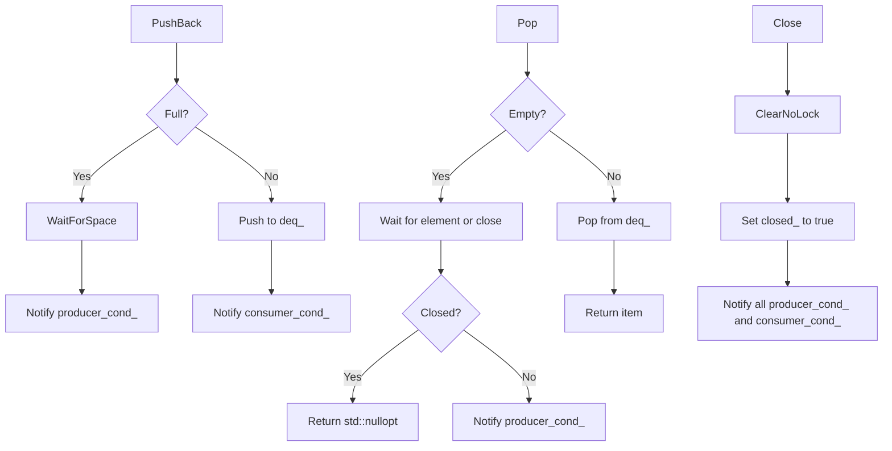

# 対象
- target: block-deque
- granularity: module_files
- source_files: ["include/containers/block_deque.h"]

# 対象範囲
元コードとして示したsource_files全体を1つのモジュールとして扱ってください。
設計文書は、各ファイルの責務、ファイル間の関係、公開インターフェース、実装上の処理を含めて作成してください。
再実装ではsource_filesにある各ファイル全体を生成するため、ファイルごとの構造と責務を区別してください。

## 責務
`block_deque.h`は、スレッドセーフなブロックデキュー（両端キュー）の実装を提供します。このデータ構造は固定容量を持ち、満杯の場合新たな要素の追加がブロッキングされ、空の場合要素の取り出しがブロッキングされます。

## 公開インターフェース
- `BlockDeque(std::size_t capacity = 1000) noexcept`: コンストラクタ。デキューの最大容量を指定します。
- `void Clear() noexcept`: デキュー内のすべての要素をクリアします。
- `bool Empty() const noexcept`: デキューが空かどうかを返します。
- `bool Full() const noexcept`: デキューが満杯かどうかを返します。
- `std::size_t Size() const noexcept`: デキュー内の要素数を返します。
- `std::size_t Capacity() const noexcept`: デキューの最大容量を返します。
- `void PushBack(T item) noexcept`: 要素をデキューの末尾に追加し、消費者スレッドに通知します。
- `void PushFront(T item) noexcept`: 要素をデキューの先頭に挿入し、消費者スレッドに通知します。
- `const T& Front() const noexcept`: デキューの最初の要素への参照を返します。デキューが空の場合未定義動作となります。
- `const T& Back() const noexcept`: デキューの最後の要素への参照を返します。デキューが空の場合未定義動作となります。
- `T& Front() noexcept`: デキューの最初の要素への非const参照を返します。デキューが空の場合未定義動作となります。
- `T& Back() noexcept`: デキューの最後の要素への非const参照を返します。デキューが空の場合未定義動作となります。
- `std::optional<T> Pop(std::optional<Clock::duration> time_out = std::nullopt) noexcept`: デキューから最初の要素を取り出し、消費者スレッドに通知します。タイムアウトまたはデキューが閉じられた場合は`std::nullopt`を返します。
- `void Flush() noexcept`: 消費者スレッドに通知します。
- `void Close() noexcept`: デキュー内のすべての要素をクリアし、デキューを閉じます。

## 入力
- コンストラクタ: デキューの最大容量（`std::size_t`）。
- `PushBack`, `PushFront`: 追加または挿入する要素（`T`）。
- `Pop`: オプションでタイムアウト時間を指定（`std::optional<Clock::duration>`）。

## 出力
- `Empty`, `Full`: ブーリアン値を返します。
- `Size`, `Capacity`: 要素数や最大容量を表す`std::size_t`型の値を返します。
- `Front`, `Back`: デキュー内の要素への参照（`const T&`）または非const参照（`T&`）を返します。
- `Pop`: 取り出した要素（`std::optional<T>`）。

## 状態
- `closed_`: デキューが閉じられたかどうかを示すブーリアン値。
- `capacity_`: デキューの最大容量。
- `deq_`: 実際のデータを保持する`std::deque<T>`。
- `mtx_`: スレッドセーフな操作のために使用されるミューテックス。
- `consumer_cond_`, `producer_cond_`: 生産者と消費者スレッド間の同期に使用される条件変数。

## 処理手順
1. コンストラクタでデキューを初期化し、最大容量を設定します。
2. `PushBack`や`PushFront`メソッドを使用して要素を追加する際に、デキューが満杯かどうかチェックし、必要に応じてブロッキングします。
3. `Pop`メソッドを使用して要素を取り出す際も同様にデキューが空かどうかチェックし、必要に応じてブロッキングします。
4. `Clear`, `Close`メソッドでデキューをクリアまたは閉じます。

## 例外・失敗条件
- デキューが満杯の場合、`PushBack`や`PushFront`はブロッキングします。タイムアウトが設定されている場合はタイムアウト後もブロックし続けます。
- デキューが空の場合、`Pop`はブロッキングします。タイムアウトが設定されている場合はタイムアウト後もブロックし続けます。
- `Front`, `Back`メソッドはデキューが空のときに未定義動作となります。

## 依存関係
- C++標準ライブラリ: `cassert`, `condition_variable`, `deque`, `mutex`, `optional`, `utility`

## 重要な不変条件
- デキューの要素数は常に最大容量以下である。
- `closed_`が`true`の場合、新たな要素の追加や取り出しは行われない。

## 追加詳細設計情報

### クラス図
```mermaid
classDiagram
    class BlockDeque {
        +BlockDeque(std::size_t capacity = 1000) noexcept
        +void Clear() noexcept
        +bool Empty() const noexcept
        +bool Full() const noexcept
        +std::size_t Size() const noexcept
        +std::size_t Capacity() const noexcept
        +void PushBack(T item) noexcept
        +void PushFront(T item) noexcept
        +const T& Front() const noexcept
        +const T& Back() const noexcept
        +T& Front() noexcept
        +T& Back() noexcept
        +std::optional~T~ Pop(std::optional~Clock::duration~ time_out = std::nullopt) noexcept
        +void Flush() noexcept
        +void Close() noexcept
        -void WaitForSpace(std::unique_lock~std::mutex~& locker) noexcept
        -void ClearNoLock() noexcept
        -mutable std::mutex mtx_
        -std::atomic_bool closed_ {false}
        -std::size_t capacity_
        -std::deque~T~ deq_
        -std::condition_variable consumer_cond_
        -std::condition_variable producer_cond_
    }
```

### クラス・メソッド・インターフェース詳細
| 完全な名前 | 属性 | 引数名と型 | 戻り値型 | 可視性 | const | リファレンス | ポインタ | static | virtual | noexcept | 型別名 | 列挙型 | 定数 | 直接依存 |
|------------|------|------------|----------|--------|-------|-----------|---------|--------|---------|----------|--------|--------|------|----------|
| BlockDeque::BlockDeque | コンストラクタ | capacity: std::size_t | void | public | false | false | false | false | false | true | - | - | - | - |
| BlockDeque::~BlockDeque | デストラクタ | - | void | public | false | false | false | false | false | true | - | - | - | - |
| BlockDeque::Clear | メソッド | - | void | public | false | false | false | false | false | true | - | - | - | - |
| BlockDeque::Empty | メソッド | - | bool | public | true | false | false | false | false | true | - | - | - | - |
| BlockDeque::Full | メソッド | - | bool | public | true | false | false | false | false | true | - | - | - | - |
| BlockDeque::Size | メソッド | - | std::size_t | public | true | false | false | false | false | true | - | - | - | - |
| BlockDeque::Capacity | メソッド | - | std::size_t | public | true | false | false | false | false | true | - | - | - | - |
| BlockDeque::PushBack | メソッド | item: T | void | public | false | false | false | false | false | true | - | - | - | - |
| BlockDeque::PushFront | メソッド | item: T | void | public | false | false | false | false | false | true | - | - | - | - |
| BlockDeque::Front | メソッド | - | const T& | public | true | false | false | false | false | true | - | - | - | - |
| BlockDeque::Back | メソッド | - | const T& | public | true | false | false | false | false | true | - | - | - | - |
| BlockDeque::Front | メソッド | - | T& | public | false | false | false | false | false | true | - | - | - | - |
| BlockDeque::Back | メソッド | - | T& | public | false | false | false | false | false | true | - | - | - | - |
| BlockDeque::Pop | メソッド | time_out: std::optional~Clock::duration~ | std::optional~T~ | public | false | false | false | false | false | true | - | - | - | - |
| BlockDeque::Flush | メソッド | - | void | public | false | false | false | false | false | true | - | - | - | - |
| BlockDeque::Close | メソッド | - | void | public | false | false | false | false | false | true | - | - | - | - |
| BlockDeque::WaitForSpace | メソッド | locker: std::unique_lock~std::mutex~& | void | private | false | false | false | false | false | true | - | - | - | - |
| BlockDeque::ClearNoLock | メソッド | - | void | private | false | false | false | false | false | true | - | - | - | - |

### シーケンス図
該当なし

### メソッド仕様書
| 完全な名前 | 目的 | 引数 | 戻り値 | 動作の説明 | 副作用 | 使用例 | エラー処理 |
|------------|------|------|--------|------------|--------|--------|------------|
| BlockDeque::PushBack | 要素をデキューの末尾に追加し、消費者スレッドに通知します。 | item: 追加する要素 | void | デキューが満杯の場合ブロッキングし、空きができるまで待機します。その後、要素を追加し消費者スレッドに通知します。 | - | `deque.PushBack(10);` | 該当なし |
| BlockDeque::PushFront | 要素をデキューの先頭に挿入し、消費者スレッドに通知します。 | item: 挿入する要素 | void | デキューが満杯の場合ブロッキングし、空きができるまで待機します。その後、要素を挿入し消費者スレッドに通知します。 | - | `deque.PushFront(10);` | 該当なし |
| BlockDeque::Pop | デキューから最初の要素を取り出し、消費者スレッドに通知します。 | time_out: オプションでタイムアウト時間を指定 | std::optional~T~ | デキューが空の場合ブロッキングし、要素が追加されるまで待機します。その後、要素を返します。タイムアウトまたはデキューが閉じられた場合は`std::nullopt`を返します。 | - | `auto item = deque.Pop();` | 該当なし |
| BlockDeque::Close | デキュー内のすべての要素をクリアし、デキューを閉じます。 | - | void | デキュー内のすべての要素を削除し、デキューを閉じます。その後、待機中のスレッドに通知します。 | - | `deque.Close();` | 該当なし |

### 処理フロー図


### 状態遷移・副作用
| 更新前状態 | 遷移条件 | 変更対象 | 更新後状態 | 更新順序 | 外部資源への副作用 |
|------------|----------|----------|------------|----------|----------------------|
| 任意       | PushBack/PushFront呼び出し | deq_     | 要素追加   | ロック取得 → 追加 → ロック解放 | consumer_cond_通知 |
| 任意       | Pop呼び出し      | deq_     | 要素削除   | ロック取得 → 削除 → ロック解放 | producer_cond_通知 |
| 任意       | Close呼び出し    | closed_, deq_ | 閉じた状態, クリア | ロック取得 → クリア → 閉じる → ロック解放 | producer_cond_とconsumer_cond_通知 |

### データ変換・制約
| 入力形式 | 出力形式 | 型変換 | 加工規則 | 値域 | 境界値 | 単位 | 精度 | エンコーディング | 検証条件 | 特殊値・欠損値の扱い |
|----------|----------|--------|----------|------|--------|------|------|----------------|------------|-----------------------|
| std::size_t | void     | -      | デキュー初期化 | 1以上の整数 | 最小: 1, 最大: 実装依存 | -    | -    | -              | capacity > 0 | 該当なし |
| T          | void     | -      | 追加または挿入 | 任意のT型 | -    | -    | -    | -              | -          | 該当なし |
| std::optional~Clock::duration~ | std::optional~T~ | -      | 取り出し | 任意のT型 | -    | -    | -    | -              | -          | タイムアウトまたはデキューが閉じられた場合std::nullopt |
| -          | bool     | -      | 空チェック   | true/false | -    | -    | -    | -              | -          | 該当なし |
| -          | bool     | -      | 満杯チェック | true/false | -    | -    | -    | -              | -          | 該当なし |
| -          | std::size_t | -      | サイズ取得   | 0以上の整数 | 最小: 0, 最大: capacity | -    | -    | -              | -          | 該当なし |
| -          | std::size_t | -      | 容量取得   | 1以上の整数 | 最小: 1, 最大: 実装依存 | -    | -    | -              | -          | 該当なし |