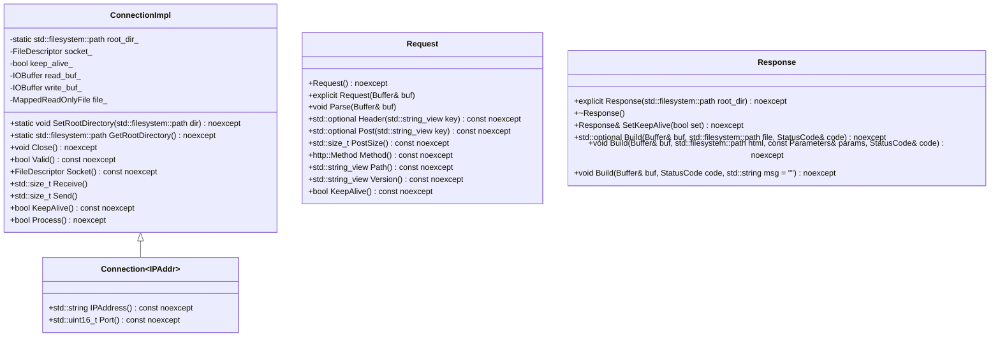
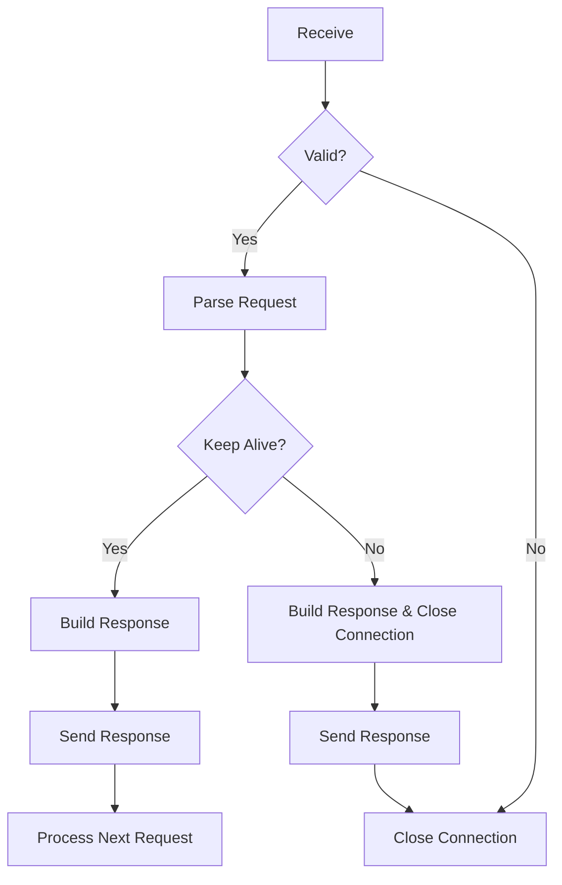

# 設計文書

## 責務
HTTP通信の受信、処理、送信を行う。具体的には、HTTPリクエストを解析し、適切なレスポンスを作成して返す。

## 公開インターフェース
- `StatusCodeToMessage(StatusCode code) noexcept`
- `StatusCodeToInteger(StatusCode code) noexcept`
- `MethodToString(Method method) noexcept`
- `to_string(Method method) noexcept`
- `StringToMethod(std::string str)`
- `ContentTypeByFileName(std::string_view name) noexcept`
- `DecodeURLEncodedCharacter(const std::string& str)`
- `DecodeURLEncodedString(const std::string& str)`
- `HTMLPlaceholder(std::string_view key) noexcept`
- `PutParamIntoHTML(std::string html, const Parameters& params)`
- `ConnectionImpl` クラスのメソッド
  - `SetRootDirectory(std::filesystem::path dir) noexcept`
  - `GetRootDirectory() noexcept`
  - `Close() noexcept`
  - `Valid() const noexcept`
  - `Socket() const noexcept`
  - `Receive()`
  - `Send()`
  - `KeepAlive() const noexcept`
  - `Process() noexcept`
- `Connection` クラスのコンストラクタとメソッド
  - `explicit Connection(const FileDescriptor socket, IPAddr addr) noexcept`
  - `std::string IPAddress() const noexcept`
  - `std::uint16_t Port() const noexcept`

## 入力
- HTTPリクエストデータ（文字列）
- ファイルパス

## 出力
- HTTPレスポンスデータ（文字列）
- ファイル内容（バッファ）

## 状態
- 接続の有効性
- ソケットディスクリプタ
- 送受信バッファ
- マップされたファイル

## 処理手順
1. HTTPリクエストを受信する。
2. 受信したデータを解析し、必要な情報を抽出する。
3. 必要に応じてファイルを読み込む。
4. レスポンスを作成する。
5. 作成したレスポンスを送信する。

## 例外・失敗条件
- 不正なHTTPリクエストを受けた場合、`std::invalid_argument` を投げる。
- URLエンコードされた文字列が不正な形式の場合、`std::invalid_argument` を投げる。
- ファイルの読み込みに失敗した場合、適切なステータスコードとエラーメッセージを設定する。

## 依存関係
- `containers/buffer.h`
- `ip.h`
- `util.h`
- `io.h`
- `request.h`
- `response.h`

## 重要な不変条件
- ソケットディスクリプタは有効である。
- レスポンスのステータスコードは初期値として`StatusCode::OK`を設定する。

## 追加詳細設計情報

### クラス図

### クラス・メソッド・インターフェース詳細

| クラス/構造体 | メンバ名 | 型 | 説明 |
|---------------|----------|----|------|
| `ConnectionImpl` | `SetRootDirectory` | `static void(std::filesystem::path dir) noexcept` | ルートディレクトリを設定する。 |
| `ConnectionImpl` | `GetRootDirectory` | `static std::filesystem::path() noexcept` | ルートディレクトリを取得する。 |
| `ConnectionImpl` | `Close` | `void() noexcept` | 接続を閉じる。 |
| `ConnectionImpl` | `Valid` | `bool() const noexcept` | 接続が有効かどうかを返す。 |
| `ConnectionImpl` | `Socket` | `FileDescriptor() const noexcept` | ソケットディスクリプタを取得する。 |
| `ConnectionImpl` | `Receive` | `std::size_t()` | HTTPリクエストデータを受け取る。 |
| `ConnectionImpl` | `Send` | `std::size_t()` | HTTPレスポンスデータを送信する。 |
| `ConnectionImpl` | `KeepAlive` | `bool() const noexcept` | 接続がキープアライブかどうかを返す。 |
| `ConnectionImpl` | `Process` | `bool() noexcept` | リクエストを処理し、レスポンスを作成する。 |
| `Connection~IPAddr~` | `IPAddress` | `std::string() const noexcept` | IPアドレスを取得する。 |
| `Connection~IPAddr~` | `Port` | `std::uint16_t() const noexcept` | ポート番号を取得する。 |
| `Request` | `Request` | `()` | コンストラクタ。 |
| `Request` | `Request` | `(Buffer& buf)` | コンストラクタでリクエストデータをパースする。 |
| `Request` | `Parse` | `(Buffer& buf)` | リクエストデータをパースする。 |
| `Request` | `Header` | `std::optional<std::string_view>(std::string_view key) const noexcept` | 指定されたキーのヘッダー値を取得する。 |
| `Request` | `Post` | `std::optional<std::string_view>(std::string_view key) const noexcept` | 指定されたキーのPOSTパラメータ値を取得する。 |
| `Request` | `PostSize` | `std::size_t() const noexcept` | POSTパラメータの数を返す。 |
| `Request` | `Method` | `http::Method() const noexcept` | HTTPメソッドを取得する。 |
| `Request` | `Path` | `std::string_view() const noexcept` | リクエストパスを取得する。 |
| `Request` | `Version` | `std::string_view() const noexcept` | HTTPバージョンを取得する。 |
| `Request` | `KeepAlive` | `bool() const noexcept` | 接続がキープアライブかどうかを返す。 |
| `Response` | `Response` | `(std::filesystem::path root_dir) noexcept` | コンストラクタでルートディレクトリを設定する。 |
| `Response` | `~Response` | `()` | デストラクタ。 |
| `Response` | `SetKeepAlive` | `Response&(bool set) noexcept` | キープアライブフラグを設定する。 |
| `Response` | `Build` | `std::optional<MappedReadOnlyFile>(Buffer& buf, std::filesystem::path file, StatusCode& code) noexcept` | ファイルリクエストからレスポンスを作成する。 |
| `Response` | `Build` | `(Buffer& buf, std::filesystem::path html, const Parameters& params, StatusCode& code) noexcept` | HTMLテンプレートとパラメータからレスポンスを作成する。 |
| `Response` | `Build` | `(Buffer& buf, StatusCode code, std::string msg = "") noexcept` | ステータスコードとメッセージからレスポンスを作成する。 |

### シーケンス図
該当なし

### メソッド仕様書

| メソッド名 | 目的 | 引数 | 戻り値 | 動作の説明 | 副作用 | 使用例 | エラー処理 |
|------------|------|------|--------|------------|--------|--------|------------|
| `StatusCodeToMessage` | ステータスコードをメッセージに変換する。 | `StatusCode code` | `std::string_view` | ステータスコードに対応するメッセージを返す。 | なし | `StatusCodeToMessage(StatusCode::OK)` | なし |
| `StatusCodeToInteger` | ステータスコードを整数値に変換する。 | `StatusCode code` | `std::uint32_t` | ステータスコードの整数値を返す。 | なし | `StatusCodeToInteger(StatusCode::OK)` | なし |
| `MethodToString` | メソッドを文字列に変換する。 | `Method method` | `std::string_view` | HTTPメソッドに対応する文字列を返す。 | なし | `MethodToString(Method::Get)` | なし |
| `to_string` | メソッドを文字列に変換する。 | `Method method` | `std::string` | HTTPメソッドに対応する文字列を返す。 | なし | `to_string(Method::Get)` | なし |
| `StringToMethod` | 文字列からHTTPメソッドに変換する。 | `std::string str` | `Method` | 文字列に対応するHTTPメソッドを返す。 | `std::invalid_argument` を投げる | `StringToMethod("GET")` | 不正な文字列の場合 |
| `ContentTypeByFileName` | ファイル名からコンテンツタイプを取得する。 | `std::string_view name` | `std::string_view` | 拡張子に対応するコンテンツタイプを返す。 | なし | `ContentTypeByFileName("index.html")` | なし |
| `DecodeURLEncodedCharacter` | URLエンコードされた文字列からキャラクタに変換する。 | `const std::string& str` | `char` | エンコードされた文字列に対応するキャラクタを返す。 | `std::invalid_argument` を投げる | `DecodeURLEncodedCharacter("%20")` | 不正なエンコードの場合 |
| `DecodeURLEncodedString` | URLエンコードされた文字列から文字列に変換する。 | `const std::string& str` | `std::string` | エンコードされた文字列に対応する文字列を返す。 | `std::invalid_argument` を投げる | `DecodeURLEncodedString("%20%3D")` | 不正なエンコードの場合 |
| `HTMLPlaceholder` | HTMLプレースホルダーを作成する。 | `std::string_view key` | `std::string` | キーに対応するプレースホルダーを返す。 | なし | `HTMLPlaceholder("user")` | なし |
| `PutParamIntoHTML` | パラメータをHTMLテンプレートに挿入する。 | `std::string html, const Parameters& params` | `std::string` | テンプレート内のプレースホルダーをパラメータで置き換えた文字列を返す。 | なし | `PutParamIntoHTML("<html><body>${user}</body></html>", {{"user", "Alice"}})` | なし |
| `ConnectionImpl::Receive` | HTTPリクエストデータを受け取る。 | なし | `std::size_t` | ソケットからデータを読み込み、バッファに格納する。 | なし | `connection.Receive()` | データ受信失敗の場合 |
| `ConnectionImpl::Send` | HTTPレスポンスデータを送信する。 | なし | `std::size_t` | バッファ内のデータをソケットに書き込む。 | なし | `connection.Send()` | データ送信失敗の場合 |
| `ConnectionImpl::Process` | リクエストを処理し、レスポンスを作成する。 | なし | `bool` | リクエストデータを解析し、適切なレスポンスを作成する。 | なし | `connection.Process()` | パース失敗の場合 |

### 処理フロー図

### 状態遷移・副作用

| 更新前状態 | 遷移条件 | 変更対象 | 更新後状態 | 更新順序 | 副作用 |
|------------|----------|----------|------------|----------|--------|
| 未接続     | ソケット作成 | `socket_` | 接続中     | 1        | ソケットが開かれる。 |
| 接続中     | データ受信 | `read_buf_` | データ受信完了 | 2        | 受信データがバッファに格納される。 |
| データ受信完了 | パース成功 | `request` | リクエスト解析完了 | 3        | リクエスト情報が抽出される。 |
| リクエスト解析完了 | キープアライブ | `keep_alive_`, `write_buf_` | レスポンス作成中 | 4        | レスポンスヘッダとボディがバッファに格納される。 |
| レスポンス作成中 | データ送信 | `write_buf_` | データ送信完了 | 5        | バッファ内のデータがソケットに書き込まれる。 |
| データ送信完了 | キープアライブ | - | 接続中     | 6        | 次のリクエストを待つ。 |
| データ送信完了 | 非キープアライブ | `socket_` | 未接続   | 7        | ソケットが閉じられる。 |

### データ変換・制約

| 入力形式 | 出力形式 | 変換規則 | 値域 | 境界値 | 単位 | 精度 | エンコーディング | 検証条件 | 特殊値・欠損値の扱い |
|----------|----------|----------|------|--------|------|------|------------------|------------|--------------------|
| ステータスコード | メッセージ | ステータスコードをメッセージにマッピングする。 | 200, 400, 403, 404 | - | 文字列 | - | UTF-8 | ステータスコードが定義されているものであること | 無効なステータスコードの場合、デフォルトメッセージを返す。 |
| メソッド | 文字列 | メソッドを文字列にマッピングする。 | GET, POST, PUT, PATCH, DELETE | - | 文字列 | - | UTF-8 | メソッドが定義されているものであること | 無効なメソッドの場合、例外を投げる。 |
| URLエンコードされた文字列 | キャラクタ | `%` から始まる3文字の文字列を16進数に変換する。 | ASCIIキャラクタ | - | 文字 | - | UTF-8 | 正しい形式であること | 不正な形式の場合、例外を投げる。 |
| URLエンコードされた文字列 | 文字列 | `%` から始まる3文字の文字列を16進数に変換し、結合する。 | ASCII文字列 | - | 文字列 | - | UTF-8 | 正しい形式であること | 不正な形式の場合、例外を投げる。 |
| ファイル名 | コンテンツタイプ | 拡張子からコンテンツタイプをマッピングする。 | text/html, image/png, など | - | 文字列 | - | UTF-8 | 拡張子が定義されているものであること | 無効な拡張子の場合、デフォルトの`application/octet-stream`を返す。 |
| パラメータとHTMLテンプレート | HTMLコンテンツ | プレースホルダーをパラメータで置き換える。 | 文字列 | - | 文字列 | - | UTF-8 | すべてのプレースホルダーが置き換えられること | 置き換えできないプレースホルダーはそのまま残る。 |