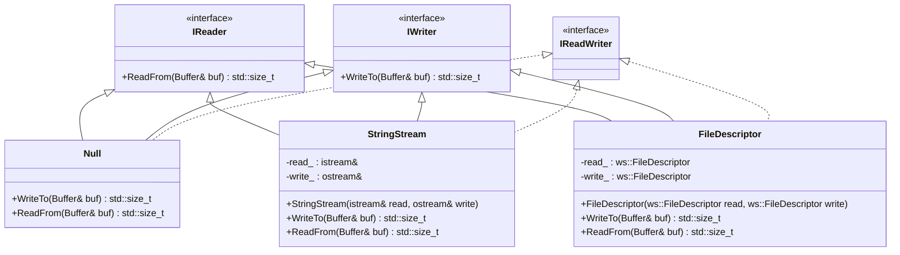

# 設計文書

## 責務
`include/io.h`と`src/io/io.cpp`は、バッファとの読み書き操作を抽象化したインターフェースとその実装を提供します。主な責務は以下の通りです：
- バッファからのデータ読み込みとバッファへのデータ書き込みのインターフェース定義。
- `Null`, `StringStream`, `FileDescriptor`クラスによる具体的なI/O操作の実装。

## 公開インターフェース
- `IReader::ReadFrom(Buffer& buf)`: バッファからデータを読み込む純粋仮想関数。
- `IWriter::WriteTo(Buffer& buf)`: バッファにデータを書き込む純粋仮想関数。
- `Null::WriteTo(Buffer& buf)`, `Null::ReadFrom(Buffer& buf)`: バッファの読み書き可能なスペースを消費する操作。
- `StringStream::StringStream(std::istream& read, std::ostream& write)`: 文字列ストリームからの読み込みと文字列ストリームへの書き込み用オブジェクトを作成するコンストラクタ。
- `StringStream::WriteTo(Buffer& buf)`, `StringStream::ReadFrom(Buffer& buf)`: バッファと文字列ストリーム間でのデータのやり取り。
- `FileDescriptor::FileDescriptor(ws::FileDescriptor read, ws::FileDescriptor write)`: ファイルディスクリプタからの読み込みとファイルディスクリプタへの書き込み用オブジェクトを作成するコンストラクタ。
- `FileDescriptor::WriteTo(Buffer& buf)`, `FileDescriptor::ReadFrom(Buffer& buf)`: バッファとファイルディスクリプタ間でのデータのやり取り。

## 入力
- `Buffer`オブジェクト: データの読み書き対象となるバッファ。
- `std::istream`オブジェクト: 文字列ストリームからの読み込み用オブジェクト。
- `std::ostream`オブジェクト: 文字列ストリームへの書き込み用オブジェクト。
- `ws::FileDescriptor`: ファイルディスクリプタからの読み込みとファイルディスクリプタへの書き込み用オブジェクト。

## 出力
- 読み込んだデータのバイト数 (`std::size_t`型)。
- 書き込んだデータのバイト数 (`std::size_t`型)。

## 状態
- `Buffer`オブジェクトの内部状態（読み込み可能なバイト数、書き込み可能なバイト数など）。
- 文字列ストリームとファイルディスクリプタの内部状態は外部に依存します。

## 処理手順
1. **Nullクラス**:
   - `WriteTo`: バッファの書き込み可能なスペースを消費し、そのサイズを返す。
   - `ReadFrom`: バッファから全てのデータを読み取り、バッファを空にして読み取ったデータのサイズを返す。

2. **StringStreamクラス**:
   - コンストラクタ: 文字列ストリームへの参照を受け取り保持する。
   - `WriteTo`: 文字列ストリームから文字列を読み取り、バッファに追加し、読み取った文字列の長さを返す。
   - `ReadFrom`: バッファから全てのデータを文字列として取り出し、文字列ストリームに書き込み、書き込んだ文字列の長さを返す。

3. **FileDescriptorクラス**:
   - コンストラクタ: ファイルディスクリプタへの参照を受け取り保持する。
   - `WriteTo`: バッファから読み込み可能なデータをファイルディスクリプタに書き込み、書き込んだバイト数を返す。必要に応じて追加のバッファを使用してデータを処理する。
   - `ReadFrom`: ファイルディスクリプタからデータを読み取り、バッファに追加し、読み取ったバイト数を返す。

## 例外・失敗条件
- `FileDescriptor::WriteTo`と`FileDescriptor::ReadFrom`でシステムエラーが発生した場合、`ThrowLastSystemError()`関数によって例外がスローされる。

## 依存関係
- `Buffer`: データの読み書き対象となるバッファクラス。
- `std::istream`, `std::ostream`: 文字列ストリーム操作に使用される標準ライブラリのクラス。
- `ws::FileDescriptor`: ファイルディスクリプタ操作に使用されるカスタムクラス。

## 重要な不変条件
- `Null`オブジェクトはデータを実際には読み書きせず、バッファの状態のみを変更する。
- `StringStream`と`FileDescriptor`オブジェクトは、コンストラクタで受け取ったストリームやファイルディスクリプタが有効であることを前提としている。

## 追加詳細設計情報

### クラス図


### クラス・メソッド・インターフェース詳細

| クラス名       | メンバ名         | 型                         | 可視性 | const | 仮想 | static | noexcept | 直接依存 |
|----------------|------------------|-------------------------------|--------|-------|------|--------|----------|----------|
| IReader        | ReadFrom         | std::size_t                 | public |       | はい   |        |          | Buffer   |
| IWriter        | WriteTo          | std::size_t                 | public |       | はい   |        |          | Buffer   |
| Null           | WriteTo          | std::size_t                 | public |       |      |        | あり     | Buffer   |
| Null           | ReadFrom         | std::size_t                 | public |       |      |        | あり     | Buffer   |
| StringStream   | StringStream     |                             | public |       |      |        | あり     | istream, ostream |
| StringStream   | WriteTo          | std::size_t                 | public |       |      |        | あり     | Buffer, istream |
| StringStream   | ReadFrom         | std::size_t                 | public |       |      |        | あり     | Buffer, ostream |
| FileDescriptor | FileDescriptor   |                             | public |       |      |        | あり     | ws::FileDescriptor |
| FileDescriptor | WriteTo          | std::size_t                 | public |       |      |        |          | Buffer, readv, ThrowLastSystemError |
| FileDescriptor | ReadFrom         | std::size_t                 | public |       |      |        |          | Buffer, write, ThrowLastSystemError |

### シーケンス図
該当なし（元コードに複数の関数やオブジェクト間の相互作用が明示的に記述されていない）。

### メソッド仕様書

| メソッド名         | 完全な関数名                           | 目的                                                                 | 引数                          | 戻り値型  | 動作の説明                                                                                                                                                                                                                         | エラー処理                                                                 |
|--------------------|----------------------------------------|----------------------------------------------------------------------|-------------------------------|-----------|--------------------------------------------------------------------------------------------------------------------------------------------------------------------------------------------------------------------------------------|------------------------------------------------------------------------------|
| WriteTo            | Null::WriteTo                          | バッファの書き込み可能なスペースを消費する。                           | Buffer& buf                   | std::size_t | バッファの書き込み可能なサイズを取得し、そのサイズ分バッファにデータが書き込まれたとマークします。                                                                                                                               | なし                                                                       |
| ReadFrom           | Null::ReadFrom                         | バッファから全てのデータを読み取り、バッファを空にする。               | Buffer& buf                   | std::size_t | バッファから全てのデータを読み取り、バッファが空になるようにします。                                                                                                                                                                   | なし                                                                       |
| StringStream       | StringStream::StringStream             | 文字列ストリームからの読み込みと文字列ストリームへの書き込み用オブジェクトを作成する。 | std::istream& read, std::ostream& write |           | コンストラクタで受け取った文字列ストリームの参照を保持します。                                                                                                                                                                       | なし                                                                       |
| WriteTo            | StringStream::WriteTo                  | 文字列ストリームからバッファにデータを書き込む。                       | Buffer& buf                   | std::size_t | 文字列ストリームから文字列を読み取り、バッファに追加し、読み取った文字列の長さを返します。                                                                                                                                         | なし                                                                       |
| ReadFrom           | StringStream::ReadFrom                 | バッファからデータを文字列ストリームに書き込む。                       | Buffer& buf                   | std::size_t | バッファから全てのデータを文字列として取り出し、文字列ストリームに書き込み、書き込んだ文字列の長さを返します。                                                                                                                     | なし                                                                       |
| FileDescriptor     | FileDescriptor::FileDescriptor         | ファイルディスクリプタからの読み込みとファイルディスクリプタへの書き込み用オブジェクトを作成する。 | ws::FileDescriptor read, ws::FileDescriptor write |           | コンストラクタで受け取ったファイルディスクリプタの参照を保持します。                                                                                                                                                                   | なし                                                                       |
| WriteTo            | FileDescriptor::WriteTo                | ファイルディスクリプタからバッファにデータを書き込む。                   | Buffer& buf                   | std::size_t | バッファから読み込み可能なデータをファイルディスクリプタに書き込み、書き込んだバイト数を返します。必要に応じて追加のバッファを使用してデータを処理します。                                                                                     | システムエラーが発生した場合、ThrowLastSystemError()関数によって例外がスローされます。                                                                                 |
| ReadFrom           | FileDescriptor::ReadFrom               | バッファからファイルディスクリプタにデータを読み込む。                   | Buffer& buf                   | std::size_t | ファイルディスクリプタからデータを読み取り、バッファに追加し、読み取ったバイト数を返します。                                                                                                                                       | システムエラーが発生した場合、ThrowLastSystemError()関数によって例外がスローされます。                                                                                 |

### 処理フロー図
```mermaid
flowchart TD
    A[Null::WriteTo] --> B{バッファの書き込み可能なサイズを取得}
    B --> C[バッファにデータが書き込まれたとマーク]
    C --> D[サイズを返す]

    E[Null::ReadFrom] --> F{バッファから全てのデータを読み取り}
    F --> G[バッファが空になるようにする]
    G --> H[サイズを返す]

    I[StringStream::WriteTo] --> J{文字列ストリームから文字列を読み取り}
    J --> K[バッファに追加]
    K --> L[読み取った文字列の長さを返す]

    M[StringStream::ReadFrom] --> N{バッファから全てのデータを文字列として取り出し}
    N --> O[文字列ストリームに書き込み]
    O --> P[書き込んだ文字列の長さを返す]

    Q[FileDescriptor::WriteTo] --> R{バッファから読み込み可能なデータを取得}
    R --> S{ファイルディスクリプタに書き込む}
    S --> T{必要に応じて追加のバッファを使用してデータを処理する}
    T --> U[書き込んだバイト数を返す]
    S -- エラー発生 --> V[ThrowLastSystemError()]

    W[FileDescriptor::ReadFrom] --> X{ファイルディスクリプタからデータを読み取り}
    X --> Y{バッファに追加}
    Y --> Z[読み取ったバイト数を返す]
    X -- エラー発生 --> V
```

### 状態遷移・副作用

| 更新前状態         | 遷移条件                             | 変更対象     | 更新後状態       | 更新順序 | 副作用                                                                 |
|--------------------|--------------------------------------|--------------|------------------|----------|------------------------------------------------------------------------|
| バッファに書き込み可能なスペースあり | WriteTo呼び出し                    | Buffer         | 書き込み可能なスペースが消費されたバッファ | 1          | なし                                                                   |
| バッファにデータあり   | ReadFrom呼び出し                     | Buffer         | 空のバッファ       | 1          | なし                                                                   |
| 文字列ストリームから読み取り可能 | WriteTo呼び出し                    | Buffer, istream | バッファに追加されたデータ、文字列ストリームからの読み取り位置が進んだ | 1,2        | なし                                                                   |
| バッファからデータあり   | ReadFrom呼び出し                     | Buffer, ostream | 文字列ストリームへの書き込み位置が進んだ、バッファが空になった | 1,2        | なし                                                                   |
| ファイルディスクリプタから読み取り可能 | WriteTo呼び出し                    | Buffer, FileDescriptor | バッファに追加されたデータ、ファイルディスクリプタからの読み取り位置が進んだ | 1,2        | エラー発生時ThrowLastSystemError()                                     |
| ファイルディスクリプタから読み取り可能 | ReadFrom呼び出し                   | Buffer, FileDescriptor | バッファに追加されたデータ、ファイルディスクリプタへの書き込み位置が進んだ | 1,2        | エラー発生時ThrowLastSystemError()                                     |

### データ変換・制約

| 入力形式           | 出力形式         | 型変換          | 加工規則                                                                 | 値域            | 境界値       | 単位  | 精度 | エンコーディング | 検証条件 | 特殊値・欠損値の扱い |
|--------------------|------------------|-----------------|--------------------------------------------------------------------------|-----------------|--------------|-------|------|------------------|------------|------------------------|
| Buffer             | std::size_t      | なし            | バッファから読み込んだデータのバイト数を返す                             | 0以上の整数     | 0, MAX_SIZE_T| バイト | -    | -                | 確認不能   | 確認不能               |
| std::istream       | Buffer           | 文字列 → バッファ | 文字列ストリームから読み取った文字列をバッファに追加する                 | 任意の文字列    | 空文字列     | -     | -    | UTF-8            | 確認不能   | 確認不能               |
| Buffer             | std::ostream     | バッファ → 文字列 | バッファから読み取ったデータを文字列ストリームに書き込む                 | 任意のバイト列  | 空バッファ     | -     | -    | UTF-8            | 確認不能   | 確認不能               |
| FileDescriptor     | Buffer           | バイト列 → バッファ | ファイルディスクリプタから読み取ったデータをバッファに追加する             | 任意のバイト列  | 空バッファ     | -     | -    | バイナリ         | 確認不能   | 確認不能               |
| Buffer             | FileDescriptor   | バッファ → バイト列 | バッファから読み取ったデータをファイルディスクリプタに書き込む           | 任意のバイト列  | 空バッファ     | -     | -    | バイナリ         | 確認不能   | 確認不能               |