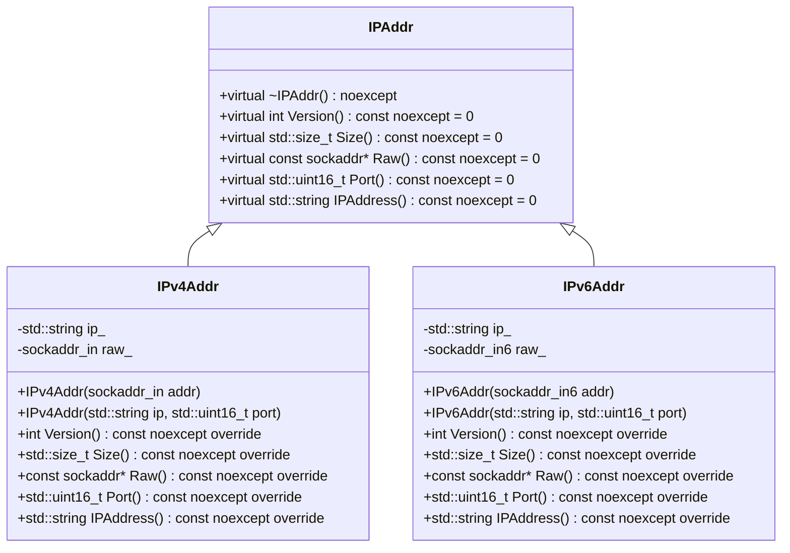

# 設計文書

## 責務
`ip.h`と`ip.cpp`は、IPv4アドレスとIPv6アドレスを表す抽象クラス`IPAddr`とその派生クラス`IPv4Addr`、`IPv6Addr`の定義と実装を提供します。これらのクラスは、IPアドレスのバージョン、ソケットアドレスのサイズ、生のソケットアドレスへのポインタ、ポート番号、および人間可読なIPアドレス文字列を取得する機能を提供します。

## 公開インターフェース
- `class IPAddr`: 抽象基底クラスで、`Version()`, `Size()`, `Raw()`, `Port()`, `IPAddress()`の純粋仮想関数を持ちます。
- `class IPv4Addr`: `IPAddr`を継承し、IPv4アドレスを扱います。コンストラクタは`sockaddr_in`またはIP文字列とポート番号を受け取ります。
- `class IPv6Addr`: `IPAddr`を継承し、IPv6アドレスを扱います。コンストラクタは`sockaddr_in6`またはIP文字列とポート番号を受け取ります。

## 入力
- `IPv4Addr(sockaddr_in addr)`, `IPv4Addr(std::string ip, std::uint16_t port)`
- `IPv6Addr(sockaddr_in6 addr)`, `IPv6Addr(std::string ip, std::uint16_t port)`

## 出力
- `Version()`: IPバージョンを返します。
- `Size()`: ソケットアドレスのサイズを返します。
- `Raw()`: 生のソケットアドレスへのポインタを返します。
- `Port()`: ポート番号を返します。
- `IPAddress()`: 人間可読なIPアドレス文字列を返します。

## 状態
- `IPv4Addr`と`IPv6Addr`は、内部でIPアドレスの文字列表現(`ip_`)と生のソケットアドレス構造体(`raw_`)を持ちます。

## 処理手順
1. コンストラクタが呼び出されると、IPアドレスとポート番号を初期化します。
2. 各メソッドは内部状態から必要な情報を取得して返します。

## 例外・失敗条件
- `inet_pton`や`inet_ntop`の呼び出しに失敗した場合、`ThrowLastSystemError()`が呼ばれます。

## 依存関係
- `<concepts>`, `<cstdint>`, `<string>`, `<string_view>`: 標準ライブラリヘッダ。
- `<netinet/in.h>`: ソケットアドレス構造体の定義。
- `"util.h"`: `ThrowLastSystemError()`の定義。

## 重要な不変条件
- `IPv4Addr`と`IPv6Addr`は、それぞれのバージョンに対応するソケットアドレス構造体(`sockaddr_in`, `sockaddr_in6`)を使用します。
- IPアドレス文字列は有効な形式である必要があります。

## 追加詳細設計情報

### クラス図

### クラス・メソッド・インターフェース詳細

| 完全な名前 | 属性 | 引数名と型 | 戻り値型 | 可視性 | const | 依存 |
|------------|------|------------|----------|--------|-------|------|
| IPAddr::~IPAddr() | デストラクタ | - | void | public | noexcept | - |
| IPAddr::Version() | 純粋仮想関数 | - | int | public | const noexcept | - |
| IPAddr::Size() | 純粋仮想関数 | - | std::size_t | public | const noexcept | - |
| IPAddr::Raw() | 純粋仮想関数 | - | const sockaddr* | public | const noexcept | - |
| IPAddr::Port() | 純粋仮想関数 | - | std::uint16_t | public | const noexcept | - |
| IPAddr::IPAddress() | 純粋仮想関数 | - | std::string | public | const noexcept | - |
| IPv4Addr::IPv4Addr(sockaddr_in addr) | コンストラクタ | addr: sockaddr_in | void | public | - | inet_ntop, ThrowLastSystemError() |
| IPv4Addr::IPv4Addr(std::string ip, std::uint16_t port) | コンストラクタ | ip: std::string, port: std::uint16_t | void | public | - | inet_pton, ThrowLastSystemError() |
| IPv4Addr::Version() | メソッド | - | int | public | const noexcept | - |
| IPv4Addr::Size() | メソッド | - | std::size_t | public | const noexcept | - |
| IPv4Addr::Raw() | メソッド | - | const sockaddr* | public | const noexcept | - |
| IPv4Addr::Port() | メソッド | - | std::uint16_t | public | const noexcept | ntohs |
| IPv4Addr::IPAddress() | メソッド | - | std::string | public | const noexcept | - |
| IPv6Addr::IPv6Addr(sockaddr_in6 addr) | コンストラクタ | addr: sockaddr_in6 | void | public | - | inet_ntop, ThrowLastSystemError() |
| IPv6Addr::IPv6Addr(std::string ip, std::uint16_t port) | コンストラクタ | ip: std::string, port: std::uint16_t | void | public | - | inet_pton, ThrowLastSystemError() |
| IPv6Addr::Version() | メソッド | - | int | public | const noexcept | - |
| IPv6Addr::Size() | メソッド | - | std::size_t | public | const noexcept | - |
| IPv6Addr::Raw() | メソッド | - | const sockaddr* | public | const noexcept | - |
| IPv6Addr::Port() | メソッド | - | std::uint16_t | public | const noexcept | ntohs |
| IPv6Addr::IPAddress() | メソッド | - | std::string | public | const noexcept | - |

### シーケンス図
該当なし

### メソッド仕様書

| 完全な名前 | 目的 | 引数 | 戻り値 | 動作の説明 | 副作用 | 使用例 | エラー処理 |
|------------|------|------|--------|------------|--------|--------|------------|
| IPv4Addr::IPv4Addr(sockaddr_in addr) | `sockaddr_in`からIPv4アドレスを初期化する | addr: sockaddr_in | void | 内部の`raw_`に引数の値をコピーし、IPアドレス文字列を作成する | IPアドレス文字列作成失敗時に例外を投げる | IPv4Addr ipv4(addr); | inet_ntop, ThrowLastSystemError() |
| IPv4Addr::IPv4Addr(std::string ip, std::uint16_t port) | IPアドレス文字列とポート番号からIPv4アドレスを初期化する | ip: std::string, port: std::uint16_t | void | 内部の`ip_`に引数のIPアドレス文字列をコピーし、`raw_`を設定する | IPアドレス文字列変換失敗時に例外を投げる | IPv4Addr ipv4("192.168.0.1", 80); | inet_pton, ThrowLastSystemError() |
| IPv4Addr::Version() | IPv4のバージョンを返す | - | int | `AF_INET`を返す | 無し | ipv4.Version(); | 無し |
| IPv4Addr::Size() | IPv4アドレスのサイズを返す | - | std::size_t | `sizeof(raw_)`を返す | 無し | ipv4.Size(); | 無し |
| IPv4Addr::Raw() | 生のIPv4アドレス構造体へのポインタを返す | - | const sockaddr* | 内部の`raw_`へのポインタをキャストして返す | 無し | ipv4.Raw(); | 無し |
| IPv4Addr::Port() | ポート番号を返す | - | std::uint16_t | `raw_.sin_port`からポート番号を取り出し、ネットワークバイトオーダーからホストバイトオーダーに変換して返す | 無し | ipv4.Port(); | 無し |
| IPv4Addr::IPAddress() | IPアドレス文字列を返す | - | std::string | 内部の`ip_`を返す | 無し | ipv4.IPAddress(); | 無し |
| IPv6Addr::IPv6Addr(sockaddr_in6 addr) | `sockaddr_in6`からIPv6アドレスを初期化する | addr: sockaddr_in6 | void | 内部の`raw_`に引数の値をコピーし、IPアドレス文字列を作成する | IPアドレス文字列作成失敗時に例外を投げる | IPv6Addr ipv6(addr); | inet_ntop, ThrowLastSystemError() |
| IPv6Addr::IPv6Addr(std::string ip, std::uint16_t port) | IPアドレス文字列とポート番号からIPv6アドレスを初期化する | ip: std::string, port: std::uint16_t | void | 内部の`ip_`に引数のIPアドレス文字列をコピーし、`raw_`を設定する | IPアドレス文字列変換失敗時に例外を投げる | IPv6Addr ipv6("::1", 443); | inet_pton, ThrowLastSystemError() |
| IPv6Addr::Version() | IPv6のバージョンを返す | - | int | `AF_INET6`を返す | 無し | ipv6.Version(); | 無し |
| IPv6Addr::Size() | IPv6アドレスのサイズを返す | - | std::size_t | `sizeof(raw_)`を返す | 無し | ipv6.Size(); | 無し |
| IPv6Addr::Raw() | 生のIPv6アドレス構造体へのポインタを返す | - | const sockaddr* | 内部の`raw_`へのポインタをキャストして返す | 無し | ipv6.Raw(); | 無し |
| IPv6Addr::Port() | ポート番号を返す | - | std::uint16_t | `raw_.sin6_port`からポート番号を取り出し、ネットワークバイトオーダーからホストバイトオーダーに変換して返す | 無し | ipv6.Port(); | 無し |
| IPv6Addr::IPAddress() | IPアドレス文字列を返す | - | std::string | 内部の`ip_`を返す | 無し | ipv6.IPAddress(); | 無し |

### 処理フロー図
該当なし

### 状態遷移・副作用

| 更新前状態 | 遷移条件 | 変更対象 | 更新後状態 | 更新順序 | 副作用 |
|------------|----------|----------|------------|----------|--------|
| IPv4Addr未初期化 | コンストラクタ呼び出し | ip_, raw_ | IPv4Addr初期化済み | 1. `ip_`にIP文字列を設定, 2. `raw_`にソケットアドレス構造体を設定 | inet_ntop, ThrowLastSystemError() |
| IPv6Addr未初期化 | コンストラクタ呼び出し | ip_, raw_ | IPv6Addr初期化済み | 1. `ip_`にIP文字列を設定, 2. `raw_`にソケットアドレス構造体を設定 | inet_pton, ThrowLastSystemError() |

### データ変換・制約

| 入力形式 | 出力形式 | 変換方法 | 値域 | 境界値 | 単位 | 精度 | エンコーディング | 検証条件 | 特殊値・欠損値の扱い |
|----------|----------|----------|------|--------|------|------|------------------|------------|-----------------------|
| std::string (IPv4) | sockaddr_in | inet_pton | 有効なIPv4アドレス文字列 | "0.0.0.0", "255.255.255.255" | - | - | ASCII | 正しいIPv4フォーマットである | 無効なIP文字列の場合、例外を投げる |
| std::string (IPv6) | sockaddr_in6 | inet_pton | 有効なIPv6アドレス文字列 | "::", "::1" | - | - | ASCII | 正しいIPv6フォーマットである | 無効なIP文字列の場合、例外を投げる |
| std::uint16_t (ポート番号) | std::uint16_t | htons | 0-65535 | 0, 65535 | - | - | ネットワークバイトオーダー | 正しいポート番号である | 無効なポート番号の場合、例外を投げる |
| sockaddr_in | std::string (IPv4) | inet_ntop | 有効なIPv4アドレス文字列 | "0.0.0.0", "255.255.255.255" | - | - | ASCII | 正しいIPv4フォーマットである | 無効なソケットアドレスの場合、例外を投げる |
| sockaddr_in6 | std::string (IPv6) | inet_ntop | 有効なIPv6アドレス文字列 | "::", "::1" | - | - | ASCII | 正しいIPv6フォーマットである | 無効なソケットアドレスの場合、例外を投げる |
| std::uint16_t (ネットワークバイトオーダー) | std::uint16_t (ホストバイトオーダー) | ntohs | 0-65535 | 0, 65535 | - | - | ホストバイトオーダー | 正しいポート番号である | 無効なポート番号の場合、例外を投げる |