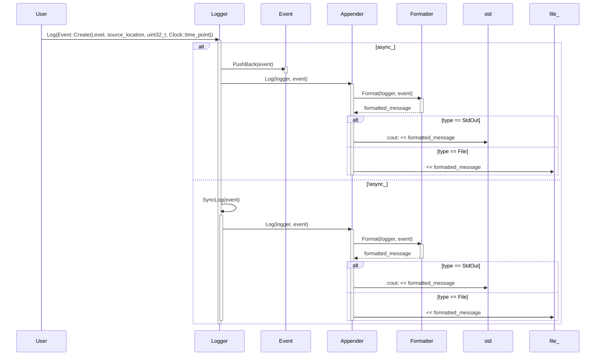
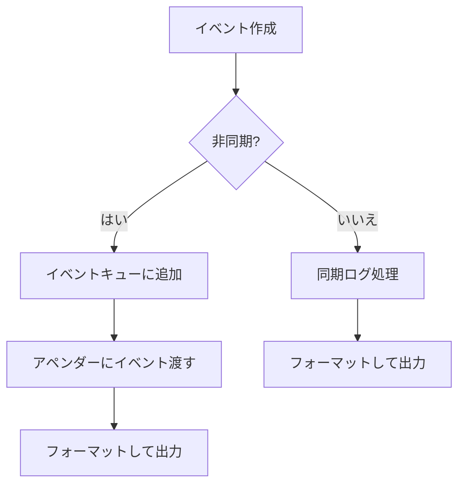

# 対象
- target: log
- granularity: module_files
- source_files: ["include/log.h", "src/log/log.cpp", "src/log/appender.cpp", "src/log/field.h", "src/log/field.cpp", "src/log/config_init.h", "src/log/config_init.cpp"]

# 対象範囲
元コードとして示したsource_files全体を1つのモジュールとして扱ってください。
設計文書は、各ファイルの責務、ファイル間の関係、公開インターフェース、実装上の処理を含めて作成してください。
再実装ではsource_filesにある各ファイル全体を生成するため、ファイルごとの構造と責務を区別してください。

## 責務
ログイベントの作成、フォーマット、出力（標準出力やファイル）を行う。また、ロガーの管理と設定初期化も担当します。

## 公開インターフェース
- `Event::Create`
- `LevelToString`, `StringToLevel`
- `AppenderTypeToString`, `StringToAppenderType`
- `Formatter::Default`, `Formatter::Format`
- `Logger::Log`, `Logger::AddAppender`, `Logger::RemoveAppender`, `Logger::ClearAppenders`, `Logger::SetLevel`, `Logger::GetLevel`, `Logger::SetDefaultFormatter`, `Logger::GetDefaultFormatter`, `Logger::Name`, `Logger::Capacity`, `Logger::ToYamlString`
- `Manager::FindLogger`, `Manager::RemoveLogger`, `Manager::InitConfig`, `Manager::ToYamlString`

## 入力
- ログレベル、イベント情報（メッセージ、ファイル名、行番号など）、フォーマットパターン、アペンダータイプ

## 出力
- フォーマットされたログメッセージ、YAML形式のロガー設定

## 状態
- ログレベル、イベントキュー、アペンダー、デフォルトフォーマッタ、非同期フラグ

## 処理手順
1. `Event::Create`でログイベントを作成。
2. `Logger::Log`でイベントを処理し、必要に応じて同期または非同期にキューに入れる。
3. キューからイベントを取り出して各アペンダーに渡す。
4. アペンダーはフォーマッタを使ってイベントをフォーマットし、標準出力やファイルに出力する。

## 例外・失敗条件
- `StringToLevel`, `StringToAppenderType`で無効な文字列が入力された場合に`std::invalid_argument`を投げる。
- `FileAppender`のコンストラクタでファイル作成に失敗した場合に`std::system_error`を投げる。

## 依存関係
- `config.h`, `containers/block_deque.h`, `util.h`
- `<chrono>`, `<experimental/source_location>`, `<fstream>`, `<iostream>`, `<list>`, `<memory>`, `<mutex>`, `<optional>`, `<sstream>`, `<string>`, `<string_view>`, `<thread>`, `<unordered_map>`
- YAMLライブラリ

## 重要な不変条件
- ロガーのレベルは設定されたもの以上のみログを処理する。
- 同じ名前のロガーは一度しか作成しない。

## 追加詳細設計情報

### クラス図
```mermaid
classDiagram
    class Event {
        +static Ptr Create(Level level, source_location location, uint32_t thread_id, Clock::time_point time)
        +Level Level() const noexcept
        +string_view FileName() const noexcept
        +size_t LineNum() const noexcept
        +uint32_t ThreadId() const noexcept
        +Clock::time_point Time() const noexcept
        +string Message() const noexcept
        +ostringstream& MessageStream() noexcept
    }
    
    class Formatter {
        +static Ptr Default() noexcept
        +Formatter(string_view pattern)
        +string Format(const Logger& logger, const Event& event) const noexcept
        +string_view Pattern() const noexcept
        -string pattern_
        -list~Field::Ptr~ fields_
    }

    class Formatter.Field {
        <<interface>>
        +virtual void Format(ostream& out, const Logger& logger, const Event& event) noexcept = 0
        +virtual string_view Tag() const noexcept = 0
    }
    
    class Appender {
        <<abstract>>
        +Appender(string_view pattern)
        +Appender(Formatter::Ptr formatter)
        +void Log(const Logger& logger, const Event& event) noexcept
        +string ToYamlString() const noexcept
        +Formatter::Ptr GetFormatter() const noexcept
        +void SetFormatter(Formatter::Ptr formatter) noexcept
        +void SetFormatter(string_view pattern)
        -mutable mutex mtx_
        -Formatter::Ptr formatter_
    }
    
    class StdOutAppender {
        +StdOutAppender(string_view pattern)
        +StdOutAppender(Formatter::Ptr formatter)
        +void Log(const Logger& logger, const Event& event) noexcept
        +string ToYamlString() const noexcept
    }

    class FileAppender {
        +FileAppender(string_view file_name, Formatter::Ptr formatter = Formatter::Default())
        +void Log(const Logger& logger, const Event& event) noexcept
        +string ToYamlString() const noexcept
        -string file_name_
        -ofstream file_
    }
    
    class Logger {
        +Logger(string_view name, Level level, optional~size_t~ capacity = nullopt) noexcept
        +void Log(Event::Ptr event) noexcept
        +void AddAppender(Appender::Ptr appender) noexcept
        +void RemoveAppender(Appender::Ptr appender) noexcept
        +void ClearAppenders() noexcept
        +Level GetLevel() const noexcept
        +void SetLevel(Level level) noexcept
        +Formatter::Ptr GetDefaultFormatter() const noexcept
        +void SetDefaultFormatter(Formatter::Ptr formatter) noexcept
        +void SetDefaultFormatter(string_view pattern)
        +string_view Name() const noexcept
        +size_t Capacity() const noexcept
        +string ToYamlString() const noexcept
        -void AsyncLogProc() noexcept
        -void SyncLog(const Event& event) noexcept
        -mutable mutex mtx_
        -bool async_
        -unique_ptr~thread~ writer_thread_
        -string name_
        -size_t capacity_
        -Level level_
        -list~Appender::Ptr~ appenders_
        -unique_ptr~BlockDeque~Event::Ptr~~ event_deque_
        -Formatter::Ptr formatter_ {Formatter::Default()}
    }
    
    class Manager {
        +Manager(string_view name) noexcept
        +string_view Name() const noexcept
        +Logger::Ptr FindLogger(string_view name, Level level = Level::Info, optional~size_t~ capacity = nullopt) noexcept
        +void RemoveLogger(string_view name) noexcept
        +string ToYamlString() const noexcept
        -mutable mutex mtx_
        -string name_
        -unordered_map~string, Logger::Ptr~ loggers_
    }
    
    class EventWriter {
        +EventWriter(Logger& logger, Event::Ptr event) noexcept
        +ostringstream& MessageStream() noexcept
        -Logger& logger_
        -Event::Ptr event_
    }

    Appender <|-- StdOutAppender
    Appender <|-- FileAppender
    Formatter.Field <|.. Message
    Formatter.Field <|.. Level
    Formatter.Field <|.. ThreadId
    Formatter.Field <|.. DateTime
    Formatter.Field <|.. FileName
    Formatter.Field <|.. LineNum
    Formatter.Field <|.. NewLine
    Formatter.Field <|.. Tab
    Formatter.Field <|.. RawString
    Formatter.Field <|.. LoggerName
```

### クラス・メソッド・インターフェース詳細

| 完全な名前 | 属性 | 引数名と型 | 戻り値型 | 可視性 | const | noexcept | static |
|------------|------|------------|----------|--------|-------|----------|--------|
| `Event::Create` | 静的メソッド | `level: Level, location: source_location, thread_id: uint32_t, time: Clock::time_point` | `Ptr` | 公開 | いいえ | はい | はい |
| `LevelToString` | 関数 | `level: Level` | `string_view` | 公開 | いいえ | はい | いいえ |
| `StringToLevel` | 関数 | `str: string` | `Level` | 公開 | いいえ | いいえ | いいえ |
| `AppenderTypeToString` | 関数 | `type: AppenderType` | `string_view` | 公開 | いいえ | はい | いいえ |
| `StringToAppenderType` | 関数 | `str: string` | `AppenderType` | 公開 | いいえ | いいえ | いいえ |
| `Formatter::Default` | 静的メソッド | - | `Ptr` | 公開 | いいえ | はい | はい |
| `Formatter::Format` | メソッド | `logger: const Logger&, event: const Event&` | `string` | 公開 | いいえ | はい | いいえ |
| `Formatter::Pattern` | メソッド | - | `string_view` | 公開 | いいえ | はい | いいえ |
| `Appender::Log` | メソッド | `logger: const Logger&, event: const Event&` | `void` | 公開 | いいえ | いいえ | いいえ |
| `Appender::ToYamlString` | メソッド | - | `string` | 公開 | いいえ | いいえ | いいえ |
| `Appender::GetFormatter` | メソッド | - | `Formatter::Ptr` | 公開 | いいえ | はい | いいえ |
| `Appender::SetFormatter` | メソッド | `formatter: Formatter::Ptr` | `void` | 公開 | いいえ | いいえ | いいえ |
| `Appender::SetFormatter` | メソッド | `pattern: string_view` | `void` | 公開 | いいえ | いいえ | いいえ |
| `StdOutAppender::Log` | メソッド | `logger: const Logger&, event: const Event&` | `void` | 公開 | いいえ | いいえ | いいえ |
| `StdOutAppender::ToYamlString` | メソッド | - | `string` | 公開 | いいえ | いいえ | いいえ |
| `FileAppender::Log` | メソッド | `logger: const Logger&, event: const Event&` | `void` | 公開 | いいえ | いいえ | いいえ |
| `FileAppender::ToYamlString` | メソッド | - | `string` | 公開 | いいえ | いいえ | いいえ |
| `Logger::Log` | メソッド | `event: Event::Ptr` | `void` | 公開 | いいえ | いいえ | いいえ |
| `Logger::AddAppender` | メソッド | `appender: Appender::Ptr` | `void` | 公開 | いいえ | いいえ | いいえ |
| `Logger::RemoveAppender` | メソッド | `appender: Appender::Ptr` | `void` | 公開 | いいえ | いいえ | いいえ |
| `Logger::ClearAppenders` | メソッド | - | `void` | 公開 | いいえ | いいえ | いいえ |
| `Logger::GetLevel` | メソッド | - | `Level` | 公開 | いいえ | いいえ | いいえ |
| `Logger::SetLevel` | メソッド | `level: Level` | `void` | 公開 | いいえ | いいえ | いいえ |
| `Logger::GetDefaultFormatter` | メソッド | - | `Formatter::Ptr` | 公開 | いいえ | いいえ | いいえ |
| `Logger::SetDefaultFormatter` | メソッド | `formatter: Formatter::Ptr` | `void` | 公開 | いいえ | いいえ | いいえ |
| `Logger::SetDefaultFormatter` | メソッド | `pattern: string_view` | `void` | 公開 | いいえ | いいえ | いいえ |
| `Logger::Name` | メソッド | - | `string_view` | 公開 | いいえ | いいえ | いいえ |
| `Logger::Capacity` | メソッド | - | `size_t` | 公開 | いいえ | いいえ | いいえ |
| `Logger::ToYamlString` | メソッド | - | `string` | 公開 | いいえ | いいえ | いいえ |
| `Manager::FindLogger` | メソッド | `name: string_view, level: Level = Level::Info, capacity: optional~size_t~ = nullopt` | `Logger::Ptr` | 公開 | いいえ | いいえ | いいえ |
| `Manager::RemoveLogger` | メソッド | `name: string_view` | `void` | 公開 | いいえ | いいえ | いいえ |
| `Manager::InitConfig` | 静的メソッド | - | `void` | 公開 | いいえ | いいえ | いいえ |
| `Manager::ToYamlString` | メソッド | - | `string` | 公開 | いいえ | いいえ | いいえ |
| `EventWriter::MessageStream` | メソッド | - | `ostringstream&` | 公開 | いいえ | いいえ | いいえ |

### シーケンス図


### メソッド仕様書

| メソッド名 | 目的 | 引数 | 戻り値 | 動作の説明 | サイドエフェクト | 使用例 | エラー処理 |
|------------|------|------|--------|--------------|----------------|--------|------------|
| `Event::Create` | ログイベントを作成する。 | `level: Level, location: source_location, thread_id: uint32_t, time: Clock::time_point` | `Ptr` | 指定されたパラメータで新しいログイベントを作成し、それを共有ポインタとして返す。 | なし | `Event::Create(Level::Info)` | なし |
| `LevelToString` | ログレベルを文字列に変換する。 | `level: Level` | `string_view` | 指定されたログレベルに対応する文字列を返す。 | なし | `LevelToString(Level::Debug)` | なし |
| `StringToLevel` | 文字列をログレベルに変換する。 | `str: string` | `Level` | 指定された文字列に対応するログレベルを返す。無効な文字列の場合は例外を投げる。 | なし | `StringToLevel("INFO")` | `std::invalid_argument` |
| `AppenderTypeToString` | アペンダータイプを文字列に変換する。 | `type: AppenderType` | `string_view` | 指定されたアペンダータイプに対応する文字列を返す。 | なし | `AppenderTypeToString(AppenderType::StdOut)` | なし |
| `StringToAppenderType` | 文字列をアペンダータイプに変換する。 | `str: string` | `AppenderType` | 指定された文字列に対応するアペンダータイプを返す。無効な文字列の場合は例外を投げる。 | なし | `StringToAppenderType("FILE")` | `std::invalid_argument` |
| `Formatter::Default` | デフォルトフォーマッタを作成する。 | - | `Ptr` | デフォルトのフォーマットパターンを使用して新しいフォーマッタを作成し、それを共有ポインタとして返す。 | なし | `Formatter::Default()` | なし |
| `Formatter::Format` | イベントを指定されたフォーマットに従って文字列に変換する。 | `logger: const Logger&, event: const Event&` | `string` | 指定されたイベントとロガー情報を使用して、フォーマットパターンに基づいて文字列を作成し返す。 | なし | `formatter.Format(logger, event)` | なし |
| `Formatter::Pattern` | フォーマットパターンを取得する。 | - | `string_view` | 使用されているフォーマットパターンを返す。 | なし | `formatter.Pattern()` | なし |
| `Appender::Log` | イベントを指定された場所に出力する。 | `logger: const Logger&, event: const Event&` | `void` | 指定されたイベントとロガー情報をフォーマッタを使って文字列に変換し、それを出力先（標準出力やファイル）に出力する。 | なし | `appender.Log(logger, event)` | なし |
| `Appender::ToYamlString` | アペンダーの設定をYAML形式の文字列に変換する。 | - | `string` | アペンダーの設定情報をYAML形式の文字列として返す。 | なし | `appender.ToYamlString()` | なし |
| `Appender::GetFormatter` | 使用されているフォーマッタを取得する。 | - | `Formatter::Ptr` | 使用されているフォーマッタを共有ポインタとして返す。 | なし | `appender.GetFormatter()` | なし |
| `Appender::SetFormatter` | フォーマッタを設定する。 | `formatter: Formatter::Ptr` | `void` | 指定されたフォーマッタを使用するように設定する。 | なし | `appender.SetFormatter(formatter)` | なし |
| `Appender::SetFormatter` | フォーマットパターンからフォーマッタを作成して設定する。 | `pattern: string_view` | `void` | 指定されたフォーマットパターンを使用して新しいフォーマッタを作成し、それを使用するように設定する。無効なパターンの場合は例外を投げる。 | なし | `appender.SetFormatter("%d{%Y-%m-%d %H:%M:%S}%T%t%T[%p]%T[%c]%T<%f:%l>%T%m%n")` | `std::invalid_argument` |
| `StdOutAppender::Log` | イベントを標準出力に出力する。 | `logger: const Logger&, event: const Event&` | `void` | 指定されたイベントとロガー情報をフォーマッタを使って文字列に変換し、それを標準出力に出力する。 | なし | `stdout_appender.Log(logger, event)` | なし |
| `StdOutAppender::ToYamlString` | アペンダーの設定をYAML形式の文字列に変換する。 | - | `string` | アペンダーの設定情報をYAML形式の文字列として返す。 | なし | `stdout_appender.ToYamlString()` | なし |
| `FileAppender::Log` | イベントをファイルに出力する。 | `logger: const Logger&, event: const Event&` | `void` | 指定されたイベントとロガー情報をフォーマッタを使って文字列に変換し、それをファイルに出力する。 | なし | `file_appender.Log(logger, event)` | なし |
| `FileAppender::ToYamlString` | アペンダーの設定をYAML形式の文字列に変換する。 | - | `string` | アペンダーの設定情報をYAML形式の文字列として返す。 | なし | `file_appender.ToYamlString()` | なし |
| `Logger::Log` | イベントを処理する。 | `event: Event::Ptr` | `void` | 指定されたイベントのレベルがロガーのレベル以上であれば、非同期または同期でイベントを処理する。 | なし | `logger.Log(event)` | なし |
| `Logger::AddAppender` | アペンダーを追加する。 | `appender: Appender::Ptr` | `void` | 指定されたアペンダーをロガーに追加する。デフォルトフォーマッタが設定されていない場合は、ロガーのデフォルトフォーマッタを使用するように設定する。 | なし | `logger.AddAppender(appender)` | なし |
| `Logger::RemoveAppender` | アペンダーを削除する。 | `appender: Appender::Ptr` | `void` | 指定されたアペンダーをロガーから削除する。 | なし | `logger.RemoveAppender(appender)` | なし |
| `Logger::ClearAppenders` | 全てのアペンダーをクリアする。 | - | `void` | ロガーに追加されている全てのアペンダーを削除する。 | なし | `logger.ClearAppenders()` | なし |
| `Logger::GetLevel` | ログレベルを取得する。 | - | `Level` | ロガーのログレベルを返す。 | なし | `logger.GetLevel()` | なし |
| `Logger::SetLevel` | ログレベルを設定する。 | `level: Level` | `void` | 指定されたログレベルにロガーのログレベルを設定する。 | なし | `logger.SetLevel(Level::Debug)` | なし |
| `Logger::GetDefaultFormatter` | デフォルトフォーマッタを取得する。 | - | `Formatter::Ptr` | ロガーのデフォルトフォーマッタを共有ポインタとして返す。 | なし | `logger.GetDefaultFormatter()` | なし |
| `Logger::SetDefaultFormatter` | デフォルトフォーマッタを設定する。 | `formatter: Formatter::Ptr` | `void` | 指定されたフォーマッタをロガーのデフォルトフォーマッタとして設定し、全てのアペンダーに適用する。 | なし | `logger.SetDefaultFormatter(formatter)` | なし |
| `Logger::SetDefaultFormatter` | フォーマットパターンからデフォルトフォーマッタを作成して設定する。 | `pattern: string_view` | `void` | 指定されたフォーマットパターンを使用して新しいフォーマッタを作成し、それをロガーのデフォルトフォーマッタとして設定し、全てのアペンダーに適用する。無効なパターンの場合は例外を投げる。 | なし | `logger.SetDefaultFormatter("%d{%Y-%m-%d %H:%M:%S}%T%t%T[%p]%T[%c]%T<%f:%l>%T%m%n")` | `std::invalid_argument` |
| `Logger::Name` | ロガーの名前を取得する。 | - | `string_view` | ロガーの名前を返す。 | なし | `logger.Name()` | なし |
| `Logger::Capacity` | イベントキューの容量を取得する。 | - | `size_t` | ロガーのイベントキューの容量を返す。 | なし | `logger.Capacity()` | なし |
| `Logger::ToYamlString` | ロガーの設定をYAML形式の文字列に変換する。 | - | `string` | ロガーの設定情報をYAML形式の文字列として返す。 | なし | `logger.ToYamlString()` | なし |
| `Manager::FindLogger` | 指定された名前のロガーを取得する。存在しない場合は新しく作成する。 | `name: string_view, level: Level = Level::Info, capacity: optional~size_t~ = nullopt` | `Logger::Ptr` | 指定された名前のロガーが存在すればそれを返す。存在しない場合は、指定されたレベルと容量で新しいロガーを作成し、それを返す。 | なし | `manager.FindLogger("root")` | なし |
| `Manager::RemoveLogger` | 指定された名前のロガーを削除する。 | `name: string_view` | `void` | 指定された名前のロガーを削除する。 | なし | `manager.RemoveLogger("system")` | なし |
| `Manager::InitConfig` | ロガーの設定初期化を行う。 | - | `void` | ローカル設定ファイルからロガーの設定を読み込み、それに基づいてロガーを初期化する。 | なし | `Manager::InitConfig()` | なし |
| `Manager::ToYamlString` | マネージャーの設定をYAML形式の文字列に変換する。 | - | `string` | マネージャーが管理している全てのロガーの設定情報をYAML形式の文字列として返す。 | なし | `manager.ToYamlString()` | なし |
| `EventWriter::MessageStream` | メッセージストリームを取得する。 | - | `ostringstream&` | イベントのメッセージストリームへの参照を返す。 | なし | `event_writer.MessageStream() << "A message";` | なし |

### 処理フロー図


### 状態遷移・副作用

| 更新前状態 | 遷移条件 | 変更対象 | 更新後状態 | 更新順序 | 副作用 |
|------------|----------|----------|------------|----------|--------|
| イベントキューが空 | イベント追加 | イベントキュー | イベントキューにイベント追加 | 1. イベントキューにイベント追加 | アペンダーにイベント渡す |
| ロガーのレベルがInfo | デバッグレベルのイベントログ | ログレベル | 変更なし | 1. ログレベルチェック | イベント処理しない |
| フォーマッタ未設定 | 新しいフォーマッタ設定 | フォーマッタ | 指定されたフォーマッタ | 1. フォーマッタ設定 | アペンダーに新しいフォーマッタ適用 |

### データ変換・制約

| 入力形式 | 出力形式 | 変換方法 | 値域 | 境界値 | 単位 | 精度 | エンコーディング | 検証条件 | 特殊値・欠損値の扱い |
|----------|----------|----------|------|--------|------|------|------------------|------------|--------------------|
| ログレベル文字列 | `Level` | 文字列を列挙型に変換 | `Debug`, `Info`, `Warn`, `Error`, `Fatal` | - | 列挙型 | - | - | 有効なログレベル文字列であること | 無効な文字列の場合は例外 |
| アペンダータイプ文字列 | `AppenderType` | 文字列を列挙型に変換 | `StdOut`, `File` | - | 列挙型 | - | - | 有効なアペンダータイプ文字列であること | 無効な文字列の場合は例外 |
| フォーマットパターン | フィールドリスト | パターンを解析してフィールドオブジェクトに変換 | - | - | - | - | - | 有効なフォーマットパターンであること | 無効なパターンの場合は例外 |
| イベント情報 | フォーマットされた文字列 | 各フィールドオブジェクトを使ってイベント情報をフォーマットする | - | - | 文字列 | - | UTF-8 | - | - |