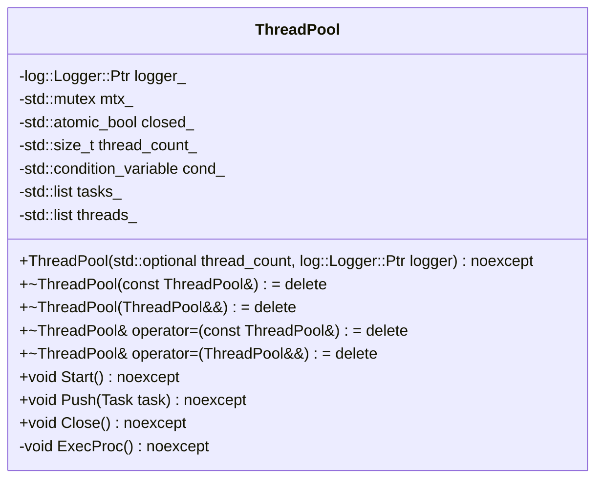
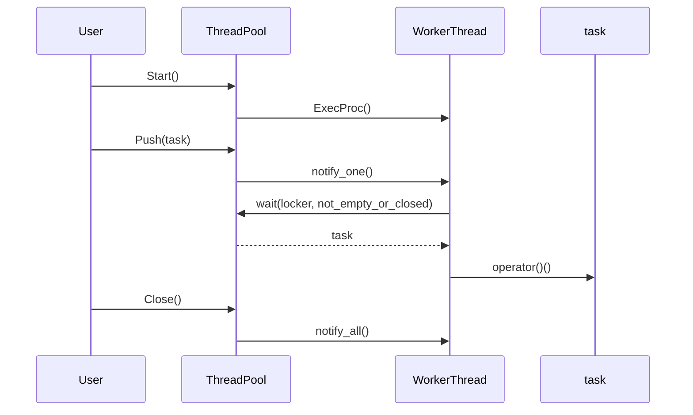

# 対象
- target: thread-pool
- granularity: module_files
- source_files: ["include/containers/thread_pool.h", "src/containers/thread_pool/thread_pool.cpp"]

# 対象範囲
元コードとして示したsource_files全体を1つのモジュールとして扱ってください。
設計文書は、各ファイルの責務、ファイル間の関係、公開インターフェース、実装上の処理を含めて作成してください。
再実装ではsource_filesにある各ファイル全体を生成するため、ファイルごとの構造と責務を区別してください。

## 責務
- `ThreadPool`クラスはタスクの並列実行を管理します。指定された数のワーカースレッドを使用してタスクキューからタスクを取り出して実行します。
- タスクの追加、スレッドプールの開始と終了を提供します。

## 公開インターフェース
- `ThreadPool(std::optional<std::size_t> thread_count = std::nullopt, log::Logger::Ptr logger = log::RootLogger()) noexcept`
- `~ThreadPool() noexcept`
- `void Start() noexcept`
- `void Push(Task task) noexcept`
- `void Close() noexcept`

## 入力
- タスク（`std::function<void()>`型）
- スレッド数（`std::optional<std::size_t>`型）
- ロガー（`log::Logger::Ptr`型）

## 出力
- なし

## 状態
- `closed_`: スレッドプールが閉じているかどうかを示すフラグ。
- `thread_count_`: 使用するスレッド数。
- `tasks_`: タスクキュー。
- `threads_`: ワーカースレッドのリスト。

## 処理手順
1. コンストラクタでスレッドプールを初期化し、指定されたスレッド数とロガーを設定します。スレッド数が未指定または0の場合、ハードウェアがサポートする並列スレッド数を使用します。
2. `Start()`メソッドでワーカースレッドを作成し開始します。
3. `Push(Task task)`メソッドでタスクキューにタスクを追加し、待機中のワーカースレッドに通知します。
4. ワーカースレッドは`ExecProc()`メソッドでタスクキューからタスクを取り出して実行します。タスクの実行中に例外が発生した場合はロガーに記録されます。
5. `Close()`メソッドでスレッドプールを閉じ、待機中のワーカースレッドに終了通知を送信します。

## 例外・失敗条件
- タスクの実行中に例外が発生した場合、その例外はキャッチされロガーに記録されます。
- スレッドプールが閉じている状態でタスクを追加しようとした場合、アサーションが発生します。

## 依存関係
- `log::Logger`クラス（ログ出力）
- `<condition_variable>`
- `<functional>`
- `<list>`
- `<mutex>`
- `<optional>`
- `<thread>`

## 重要な不変条件
- スレッドプールが閉じている場合、タスクキューにタスクを追加することはできません。
- ワーカースレッドはタスクキューからタスクを取り出して実行し、タスクキューが空でないかスレッドプールが閉じていない限り待機します。

## 追加詳細設計情報

### クラス図


### クラス・メソッド・インターフェース詳細
| 完全な名前 | 属性 | 引数名と型 | 戻り値型 | 可視性 | const | リファレンス | ポインタ | static | virtual | noexcept | 型別名 | 列挙型 | 定数 | 直接依存 |
|------------|------|------------|----------|--------|-------|-----------|---------|--------|---------|----------|--------|--------|------|----------|
| ThreadPool::ThreadPool | コンストラクタ | thread_count: std::optional<std::size_t>, logger: log::Logger::Ptr | void | public | なし | なし | なし | なし | なし | あり | なし | なし | なし | log::Logger, std::optional, std::mutex, std::atomic_bool, std::condition_variable, std::list, std::thread |
| ThreadPool::~ThreadPool | デストラクタ | なし | void | public | なし | なし | なし | なし | なし | あり | なし | なし | なし | std::list, std::thread |
| ThreadPool::Start | メソッド | なし | void | public | なし | なし | なし | なし | なし | あり | なし | なし | なし | std::mutex, std::atomic_bool, std::condition_variable, std::list, std::thread |
| ThreadPool::Push | メソッド | task: Task | void | public | なし | なし | なし | なし | なし | あり | なし | なし | なし | std::mutex, std::condition_variable, std::list |
| ThreadPool::Close | メソッド | なし | void | public | なし | なし | なし | なし | なし | あり | なし | なし | なし | std::mutex, std::atomic_bool, std::condition_variable, std::list, std::thread |
| ThreadPool::ExecProc | メソッド | なし | void | private | なし | なし | なし | なし | なし | あり | Task: std::function<void()> | なし | なし | std::mutex, std::condition_variable, std::list, log::Logger |

### シーケンス図


### メソッド仕様書
| 完全な名前 | 目的 | 引数 | 戻り値 | 動作の説明 | 副作用 | 使用例 | エラー処理 |
|------------|------|------|--------|------------|--------|--------|------------|
| ThreadPool::ThreadPool | スレッドプールを初期化する | thread_count: std::optional<std::size_t>, logger: log::Logger::Ptr | void | 指定されたスレッド数とロガーでスレッドプールを初期化します。スレッド数が未指定または0の場合、ハードウェアがサポートする並列スレッド数を使用します。 | なし | `ThreadPool pool(std::nullopt, log::RootLogger());` | なし |
| ThreadPool::~ThreadPool | スレッドプールを破棄する | なし | void | スレッドプールを閉じ、ワーカースレッドを終了させます。 | なし | `pool.~ThreadPool();` | なし |
| ThreadPool::Start | ワーカースレッドを作成し開始する | なし | void | 指定された数のワーカースレッドを作成し開始します。 | なし | `pool.Start();` | なし |
| ThreadPool::Push | タスクキューにタスクを追加する | task: Task | void | タスクキューにタスクを追加し、待機中のワーカースレッドに通知します。 | なし | `pool.Push([]() { std::cout << "Task executed"; });` | スレッドプールが閉じている場合、アサーションが発生します |
| ThreadPool::Close | スレッドプールを閉じる | なし | void | タスクキューにタスクを追加できなくなり、待機中のワーカースレッドに終了通知を送信します。 | なし | `pool.Close();` | なし |
| ThreadPool::ExecProc | タスクキューからタスクを取り出して実行する | なし | void | タスクキューからタスクを取り出して実行し、タスクキューが空でないかスレッドプールが閉じていない限り待機します。タスクの実行中に例外が発生した場合はロガーに記録されます。 | なし | `ExecProc();`（内部呼び出し） | タスクの実行中に例外が発生した場合、その例外はキャッチされロガーに記録されます |

### 処理フロー図
```mermaid
flowchart TD
    A[Start()] --> B{closed_?}
    B -- true --> C[return]
    B -- false --> D[for i in range(thread_count_)]
    D --> E[threads_.emplace_back(ExecProc, this)]
    E --> F[End]

    G[Push(task)] --> H{closed_?}
    H -- true --> I[assert(false)]
    H -- false --> J[tasks_.push_back(task)]
    J --> K[cond_.notify_one()]
    K --> L[End]

    M[ExecProc()] --> N[while(true)]
    N --> O[not_empty_or_closed()]
    O -- true --> P{closed_?}
    P -- true --> Q[return]
    P -- false --> R[tasks_.front() -> task]
    R --> S[tasks_.pop_front()]
    S --> T[try {task()} catch (std::exception& err) {logger_->Log(err.what())}]
    T --> N
```

### 状態遷移・副作用
| 更新前状態 | 遷移条件 | 変更対象 | 更新後状態 | 更新順序 | 外部資源への副作用 |
|------------|----------|----------|------------|----------|----------------------|
| closed_ = false | Push(task) | tasks_ | タスク追加 | 1. ロック取得, 2. タスク追加, 3. ロック解放, 4. 通知送信 | 待機中のワーカースレッドにタスク追加の通知が送信される |
| closed_ = false | Close() | closed_, tasks_ | closed_ = true, tasks_クリア | 1. ロック取得, 2. closed_ = true, 3. ロック解放, 4. 全ワーカースレッドに通知送信 | 待機中のワーカースレッドに終了通知が送信される |
| closed_ = false | ExecProc() | tasks_, threads_ | タスク実行, スレッド終了 | 1. ロック取得, 2. タスク取り出し, 3. ロック解放, 4. タスク実行, 5. 終了条件チェック | タスクの実行結果が外部リソースに影響を与える可能性がある |

### データ変換・制約
| 入力形式 | 出力形式 | 変換規則 | 値域 | 境界値 | 単位 | 精度 | エンコーディング | 検証条件 | 特殊値・欠損値の扱い |
|----------|----------|----------|------|--------|------|------|------------------|------------|-----------------------|
| thread_count: std::optional<std::size_t> | thread_count_: std::size_t | 値が指定されている場合はその値を使用し、未指定または0の場合はハードウェアの並列スレッド数を使用する | 1以上の整数 | 0, ハードウェアの並列スレッド数 | スレッド数 | 整数 | 確認不能 | 値が範囲内であること | 未指定または0の場合、ハードウェアの並列スレッド数を使用する |
| task: std::function<void()> | タスク実行結果 | タスクを呼び出す | 確認不能 | 確認不能 | 確認不能 | 確認不能 | 確認不能 | 呼び出し可能な関数であること | 確認不能 |