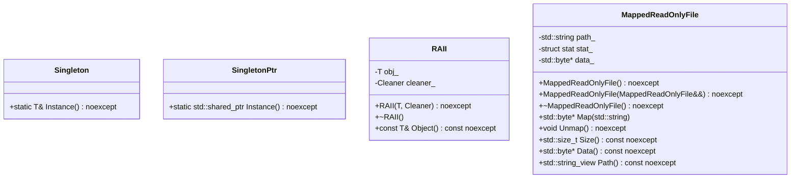

# 対象
- target: util
- granularity: module_files
- source_files: ["include/util.h", "src/util/util.cpp"]

# 責務
`util`モジュールは、文字列操作、ファイルディスクリプタの管理、YAMLの読み込み、バックトレースの取得、シングルトンパターンの実装、RAIIの利用、およびメモリマップされたファイルの読み取りを提供します。

# 公開インターフェース
- `StringToLower`, `StringToUpper`: 文字列の大文字小文字変換。
- `ReplaceAllSubstring`: 文字列内の部分文字列の置き換え。
- `SplitString`, `SplitStringToLines`: 文字列の分割。
- `LoadYamlString`, `ThrowIfYamlFieldIsNotScalar`: YAMLデータの読み込みと検証。
- `IsValidFileDescriptor`, `SetFileDescriptorAsNonblocking`: ファイルディスクリプタの管理。
- `ThrowLastSystemError`: 最後のシステムエラーを例外として投げる。
- `CurrentThreadId`: 現在のスレッドIDを取得する。
- `Backtrace`: 呼び出し元のバックトレース情報を取得する。
- `Singleton`, `SingletonPtr`: シングルトンパターンの実装。
- `RAII`: リソース管理用のRAIIクラス。
- `MappedReadOnlyFile`: 読み取り専用ファイルをメモリにマッピングする。

# 入力
- 文字列、部分文字列、置き換え文字列、正規表現パターン、YAML文字列、ファイルパス、ファイルディスクリプタ、バックトレースのサイズとスキップ数。

# 出力
- 変換された文字列、分割された文字列リスト、YAMLノード、ファイルディスクリプタの有効性、バックトレース情報、シングルトンインスタンス、RAII管理オブジェクト、メモリマッピングされたデータ。

# 状態
- ファイルディスクリプタの状態（開閉）、YAMLノードの内容、バックトレース情報、シングルトンインスタンスの存在、RAII管理対象オブジェクトの有効性、メモリマッピングされたファイルのデータとサイズ。

# 処理手順
1. 文字列変換や分割は標準ライブラリを使用して行う。
2. YAML文字列を解析し、必要なフィールドが存在することを確認する。
3. ファイルディスクリプタの有効性をチェックし、必要に応じて非ブロッキングモードに設定する。
4. システムエラー情報を取得して例外として投げる。
5. 現在のスレッドIDを取得する。
6. バックトレース情報を取得し、必要に応じてフォーマットする。
7. シングルトンインスタンスを作成または既存のものを返す。
8. RAIIオブジェクトが破棄される際に指定されたクリーナーを呼び出す。
9. ファイルをメモリにマッピングし、必要に応じてアンマップする。

# 例外・失敗条件
- YAML文字列が必須フィールドを持たない場合、`std::invalid_argument`が投げられる。
- ファイルディスクリプタの設定に失敗した場合、`std::system_error`が投げられる。
- ファイルパスがディレクトリを指す場合やアクセス権限がない場合、例外が投げられる。
- メモリマッピングに失敗した場合、`std::system_error`が投げられる。

# 依存関係
- `fmt`: 文字列フォーマット用。
- `yaml-cpp`: YAMLデータの解析用。
- `<sys/stat.h>`, `<fcntl.h>`, `<sys/mman.h>`, `<unistd.h>`: ファイル操作とメモリマッピング用。
- `<execinfo.h>`: バックトレース情報取得用。

# 重要な不変条件
- `Singleton`と`SingletonPtr`は、インスタンスが一度作成されるとそれ以降同じインスタンスを返す。
- `RAII`オブジェクトは破棄時にクリーナーが呼び出される。
- `MappedReadOnlyFile`はマッピングされたファイルデータへのアクセスとアンマップの管理を行う。

# 追加詳細設計情報

## クラス図

## クラス・メソッド・インターフェース詳細

| 完全な名前 | 属性 | 引数名と型 | 戻り値型 | 可視性 | `const` | リファレンス | ポインタ | `static` | `virtual` | `noexcept` | 型別名 | 列挙型 | 定数 | 直接依存 |
|------------|------|------------|----------|--------|---------|------------|----------|----------|-----------|------------|--------|--------|--------|----------|
| ws::StringToLower | 関数 | str: std::string | std::string | public | あり | なし | なし | なし | なし | あり | なし | なし | なし | なし |
| ws::StringToUpper | 関数 | str: std::string | std::string | public | あり | なし | なし | なし | なし | あり | なし | なし | なし | なし |
| ws::ReplaceAllSubstring | 関数 | str: std::string_view, from: std::string_view, to: std::string_view | std::string | public | あり | なし | なし | なし | なし | あり | なし | なし | なし | なし |
| ws::SplitString | 関数 | str: const std::string&, pattern: const std::regex& | std::vector<std::string> | public | あり | なし | なし | なし | なし | あり | なし | なし | なし | なし |
| ws::SplitStringToLines | 関数 | str: const std::string& | std::vector<std::string> | public | あり | なし | なし | なし | なし | あり | なし | なし | なし | なし |
| ws::LoadYamlString | 関数 | str: std::string_view, required_fields: std::initializer_list<std::string_view> | YAML::Node | public | なし | なし | なし | なし | なし | なし | なし | なし | なし | なし |
| ws::ThrowIfYamlFieldIsNotScalar | 関数 | node: const YAML::Node&, field: std::string_view | void | public | なし | なし | なし | なし | なし | なし | なし | なし | なし | なし |
| ws::IsValidFileDescriptor | メソッド | fd: FileDescriptor | bool | public | あり | なし | なし | あり | なし | あり | なし | なし | なし | なし |
| ws::SetFileDescriptorAsNonblocking | 関数 | fd: FileDescriptor | void | public | なし | なし | なし | なし | なし | なし | なし | なし | なし | なし |
| ws::ThrowLastSystemError | 関数 | なし | void | public | なし | なし | なし | なし | なし | なし | なし | なし | なし | なし |
| ws::CurrentThreadId | 関数 | なし | std::uint32_t | public | あり | なし | なし | なし | なし | あり | なし | なし | なし | なし |
| ws::Backtrace (オーバーロード1) | 関数 | stack: std::vector<std::string>&, size: std::size_t, skip: std::size_t | void | public | あり | なし | なし | なし | なし | あり | なし | なし | なし | なし |
| ws::Backtrace (オーバーロード2) | 関数 | size: std::size_t, skip: std::size_t, prefix: std::string_view | std::string | public | あり | なし | なし | なし | なし | あり | なし | なし | なし | なし |
| ws::Singleton::Instance | メソッド | args... | T& | public | あり | なし | なし | あり | なし | あり | なし | なし | なし | なし |
| ws::SingletonPtr::Instance | メソッド | args... | std::shared_ptr<T> | public | あり | なし | なし | あり | なし | あり | なし | なし | なし | なし |
| ws::RAII::RAII | コンストラクタ | obj: T, cleaner: Cleaner | void | public | なし | なし | なし | なし | なし | あり | なし | なし | なし | なし |
| ws::RAII::~RAII | デストラクタ | なし | void | public | なし | なし | なし | なし | なし | あり | なし | なし | なし | なし |
| ws::RAII::Object | メソッド | なし | const T& | public | あり | なし | なし | なし | なし | あり | なし | なし | なし | なし |
| ws::MappedReadOnlyFile::MappedReadOnlyFile (デフォルトコンストラクタ) | コンストラクタ | なし | void | public | なし | なし | なし | なし | なし | あり | なし | なし | なし | なし |
| ws::MappedReadOnlyFile::MappedReadOnlyFile (ムーブコンストラクタ) | コンストラクタ | o: MappedReadOnlyFile&& | void | public | なし | なし | なし | なし | なし | あり | なし | なし | なし | なし |
| ws::MappedReadOnlyFile::~MappedReadOnlyFile | デストラクタ | なし | void | public | なし | なし | なし | なし | なし | あり | なし | なし | なし | なし |
| ws::MappedReadOnlyFile::operator= (ムーブ代入演算子) | 演算子 | o: MappedReadOnlyFile&& | MappedReadOnlyFile& | public | なし | なし | なし | なし | なし | あり | なし | なし | なし | なし |
| ws::MappedReadOnlyFile::Map | メソッド | path: std::string | std::byte* | public | なし | なし | なし | なし | なし | なし | なし | なし | なし | なし |
| ws::MappedReadOnlyFile::Unmap | メソッド | なし | void | public | あり | なし | なし | なし | なし | あり | なし | なし | なし | なし |
| ws::MappedReadOnlyFile::Size | メソッド | なし | std::size_t | public | あり | なし | なし | なし | なし | あり | なし | なし | なし | なし |
| ws::MappedReadOnlyFile::Data | メソッド | なし | std::byte* | public | あり | なし | なし | なし | なし | あり | なし | なし | なし | なし |
| ws::MappedReadOnlyFile::Path | メソッド | なし | std::string_view | public | あり | なし | なし | なし | なし | あり | なし | なし | なし | なし |

## シーケンス図
該当なし

## メソッド仕様書

| 完全な名前 | 目的 | 引数 | 戻り値 | 動作の説明 | 副作用 | 使用例 | エラー処理 |
|------------|------|------|--------|------------|--------|--------|------------|
| ws::StringToLower | 文字列を小文字に変換する | str: std::string | std::string | 入力された文字列の各文字を小文字に変換して返す | なし | `std::string lower = StringToLower("Hello");` | なし |
| ws::StringToUpper | 文字列を大文字に変換する | str: std::string | std::string | 入力された文字列の各文字を大文字に変換して返す | なし | `std::string upper = StringToUpper("hello");` | なし |
| ws::ReplaceAllSubstring | 文字列内の部分文字列を置き換える | str: std::string_view, from: std::string_view, to: std::string_view | std::string | 入力された文字列の指定した部分文字列を別の文字列に全て置き換えて返す | なし | `std::string replaced = ReplaceAllSubstring("hello world", "world", "everyone");` | なし |
| ws::SplitString | 文字列を正規表現パターンで分割する | str: const std::string&, pattern: const std::regex& | std::vector<std::string> | 入力された文字列を指定した正規表現パターンで分割して返す | なし | `std::vector<std::string> parts = SplitString("one,two,three", std::regex(","));` | なし |
| ws::SplitStringToLines | 文字列を行ごとに分割する | str: const std::string& | std::vector<std::string> | 入力された文字列を改行コードで分割して返す | なし | `std::vector<std::string> lines = SplitStringToLines("line1\nline2");` | なし |
| ws::LoadYamlString | YAML文字列からノードを作成する | str: std::string_view, required_fields: std::initializer_list<std::string_view> | YAML::Node | 入力されたYAML文字列を解析し、必要なフィールドが存在することを確認してノードを返す | なし | `YAML::Node node = LoadYamlString("key: value");` | 必須フィールドがない場合に`std::invalid_argument`を投げる |
| ws::ThrowIfYamlFieldIsNotScalar | YAMLノードの指定したフィールドがスカラーであることを確認する | node: const YAML::Node&, field: std::string_view | void | 入力されたYAMLノードの指定したフィールドがスカラーであることを確認し、そうでない場合は例外を投げる | なし | `ThrowIfYamlFieldIsNotScalar(node, "key");` | フィールドがないかスカラーでない場合に`std::invalid_argument`を投げる |
| ws::SetFileDescriptorAsNonblocking | ファイルディスクリプタをノンブロッキングモードにする | fd: FileDescriptor | void | 入力されたファイルディスクリプタをノンブロッキングモードに設定する | なし | `SetFileDescriptorAsNonblocking(fd);` | 設定に失敗した場合に`std::system_error`を投げる |
| ws::CurrentThreadId | 現在のスレッドIDを取得する | なし | std::uint32_t | 現在のスレッドIDを返す | なし | `std::uint32_t id = CurrentThreadId();` | なし |
| ws::Backtrace (オーバーロード1) | 呼び出し元のバックトレース情報を取得する | stack: std::vector<std::string>&, size: std::size_t, skip: std::size_t | void | 呼び出し元のバックトレース情報を取得して指定されたベクタに格納する | なし | `std::vector<std::string> stack; Backtrace(stack, 10);` | なし |
| ws::Backtrace (オーバーロード2) | 呼び出し元のバックトレース情報を取得する | size: std::size_t, skip: std::size_t, prefix: std::string_view | std::string | 呼び出し元のバックトレース情報を取得してフォーマットした文字列を返す | なし | `std::string trace = Backtrace(10);` | なし |

## 処理フロー図
該当なし

## 状態遷移・副作用

| 更新前状態 | 遷移条件 | 変更対象 | 更新後状態 | 更新順序 | 外部資源への副作用 |
|------------|----------|----------|------------|----------|----------------------|
| ファイルディスクリプタが開いていない | Map()メソッド呼び出し | path_, stat_, data_ | ファイルディスクリプタが開かれ、データがマッピングされる | 1. Check() 2. open() 3. mmap() | ファイルを開く ファイルをメモリにマッピングする |
| ファイルディスクリプタが開いている | Unmap()メソッド呼び出し | data_, stat_, path_ | ファイルディスクリプタが閉じられ、データがアンマップされる | 1. munmap() 2. close() | メモリからファイルをアンマッピングする ファイルを閉じる |

## データ変換・制約

| 入力形式 | 出力形式 | 変換規則 | 値域 | 境界値 | 単位 | 精度 | エンコーディング | 検証条件 | 特殊値・欠損値の扱い |
|----------|----------|----------|------|--------|------|------|------------------|------------|-----------------------|
| std::string | std::string | 小文字に変換 | 任意の文字列 | 空文字列 | 文字 | 文字単位 | UTF-8 | なし | なし |
| std::string | std::string | 大文字に変換 | 任意の文字列 | 空文字列 | 文字 | 文字単位 | UTF-8 | なし | なし |
| std::string_view, std::string_view, std::string_view | std::string | 部分文字列を置き換え | 任意の文字列 | 空文字列 | 文字 | 文字単位 | UTF-8 | なし | なし |
| const std::string&, const std::regex& | std::vector<std::string> | 正規表現パターンで分割 | 任意の文字列 | 空文字列 | 文字 | 文字単位 | UTF-8 | なし | なし |
| const std::string& | std::vector<std::string> | 改行コードで分割 | 任意の文字列 | 空文字列 | 文字 | 文字単位 | UTF-8 | なし | なし |
| std::string_view, std::initializer_list<std::string_view> | YAML::Node | YAML文字列を解析し、必要なフィールドが存在することを確認する | 任意のYAMLノード | 空文字列 | ノード | ノード単位 | UTF-8 | 必須フィールドがあること | なし |
| const YAML::Node&, std::string_view | void | YAMLノードの指定したフィールドがスカラーであることを確認する | 任意のYAMLノード | 空文字列 | ノード | ノード単位 | UTF-8 | 指定したフィールドがあること、スカラーであること | なし |
| FileDescriptor | void | ファイルディスクリプタをノンブロッキングモードに設定する | 任意のファイルディスクリプタ | 無効なファイルディスクリプタ | ファイルディスクリプタ | ファイルディスクリプタ単位 | なし | 有効なファイルディスクリプタであること | なし |
| なし | std::uint32_t | 現在のスレッドIDを取得する | 任意のスレッドID | なし | スレッドID | スレッドID単位 | なし | なし | なし |
| std::vector<std::string>&, std::size_t, std::size_t | void | 呼び出し元のバックトレース情報を取得して指定されたベクタに格納する | 任意のバックトレース情報 | 空文字列 | 文字列 | 文字単位 | UTF-8 | なし | なし |
| std::size_t, std::size_t, std::string_view | std::string | 呼び出し元のバックトレース情報を取得してフォーマットした文字列を返す | 任意のバックトレース情報 | 空文字列 | 文字列 | 文字単位 | UTF-8 | なし | なし |