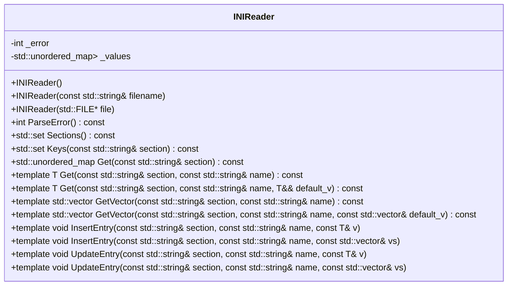

# 対象
- target: INIReader
- granularity: target_span
- target_kind: class
- target_symbol: INIReader

## 責務
INIファイルを読み込み、セクションとキーに対応する値を提供し、必要に応じて新しいエントリを挿入または既存のエントリを更新します。

## 公開インターフェース
- `INIReader()`: 空のコンストラクタ。
- `INIReader(const std::string& filename)`: ファイル名からINIファイルを読み込むコンストラクタ。
- `INIReader(std::FILE* file)`: ファイルポインタからINIファイルを読み込むコンストラクタ。
- `int ParseError() const`: 解析エラーの結果を返す。
- `std::set<std::string> Sections() const`: INIファイル内のセクションリストを返す。
- `std::set<std::string> Keys(const std::string& section) const`: 指定したセクション内のキーリストを返す。
- `std::unordered_map<std::string, std::string> Get(const std::string& section) const`: 指定したセクションの値マップを返す。
- `template <typename T = std::string> T Get(const std::string& section, const std::string& name) const`: 指定したセクションとキーに対応する値を返す。
- `template <typename T> T Get(const std::string& section, const std::string& name, T&& default_v) const`: 指定したセクションとキーに対応する値を返し、見つからない場合はデフォルト値を返す。
- `template <typename T = std::string> std::vector<T> GetVector(const std::string& section, const std::string& name) const`: 指定したセクションとキーに対応する値のベクトルを返す。
- `template <typename T> std::vector<T> GetVector(const std::string& section, const std::string& name, const std::vector<T>& default_v) const`: 指定したセクションとキーに対応する値のベクトルを返し、見つからない場合はデフォルト値を返す。
- `template <typename T = std::string> void InsertEntry(const std::string& section, const std::string& name, const T& v)`: 指定したセクションとキーに新しいエントリを挿入する。
- `template <typename T = std::string> void InsertEntry(const std::string& section, const std::string& name, const std::vector<T>& vs)`: 指定したセクションとキーに新しい値のベクトルを挿入する。
- `template <typename T = std::string> void UpdateEntry(const std::string& section, const std::string& name, const T& v)`: 指定したセクションとキーのエントリを更新する。
- `template <typename T = std::string> void UpdateEntry(const std::string& section, const std::string& name, const std::vector<T>& vs)`: 指定したセクションとキーの値のベクトルを更新する。

## 入力
- INIファイル名またはファイルポインタ。
- セクション名、キー名、取得または挿入/更新したい値。

## 出力
- 解析エラーの結果（整数）。
- セクションリスト（`std::set<std::string>`）。
- キーリスト（`std::set<std::string>`）。
- 値マップ（`std::unordered_map<std::string, std::string>`）。
- 指定したセクションとキーに対応する値（テンプレート型）。
- 指定したセクションとキーに対応する値のベクトル（テンプレート型）。

## 状態
- `_error`: 解析結果を示す整数。0は成功、-1はファイルオープンエラー、それ以外は最初の不正な行番号。
- `_values`: セクションとキーに対応する値を保持するマップ（`std::unordered_map<std::string, std::unordered_map<std::string, std::string>>`）。

## 処理手順
1. コンストラクタでINIファイルの内容を読み込み、解析します。
2. `ParseError()`メソッドで解析エラーの結果を返します。
3. `Sections()`メソッドでセクションリストを返します。
4. `Keys(const std::string& section)`メソッドで指定したセクション内のキーリストを返します。
5. `Get(const std::string& section) const`メソッドで指定したセクションの値マップを返します。
6. `Get<T>(const std::string& section, const std::string& name)`メソッドで指定したセクションとキーに対応する値を返します。
7. `GetVector<T>(const std::string& section, const std::string& name)`メソッドで指定したセクションとキーに対応する値のベクトルを返します。
8. `InsertEntry<T>(const std::string& section, const std::string& name, const T& v)`メソッドで指定したセクションとキーに新しいエントリを挿入します。
9. `UpdateEntry<T>(const std::string& section, const std::string& name, const T& v)`メソッドで指定したセクションとキーのエントリを更新します。

## 例外・失敗条件
- ファイルが開けない場合、`std::runtime_error`をスローする。
- メモリ確保に失敗した場合、`std::runtime_error`をスローする。
- 解析中に不正な行がある場合、`std::runtime_error`をスローする。
- 指定したセクションが見つからない場合、`std::runtime_error`をスローする。
- 指定したキーが見つからない場合、`std::runtime_error`をスローする。
- 値のパースに失敗した場合、`std::runtime_error`をスローする。
- 重複するキーがある場合、`std::runtime_error`をスローする。

## 依存関係
- `detail`名前空間内のヘルパー関数とテンプレート（`is_space`, `ltrim`, `rtrim`, `trim`, `find_char_or_comment`, `use_charconv`, `parse_value`）。
- 標準ライブラリのヘッダファイル（`<cstddef>`, `<cstdio>`, `<fstream>`, `<set>`, `<sstream>`, `<stdexcept>`, `<string>`, `<string_view>`, `<type_traits>`, `<unordered_map>`, `<utility>`, `<vector>`）。

## 重要な不変条件
- `_error`は解析結果を正確に反映する。
- `_values`はセクションとキーに対応する値を正しく保持する。

## 追加詳細設計情報

### クラス図


### クラス・メソッド・インターフェース詳細

| 完全な名前 | 属性 | 引数名と型 | 戻り値型 | 可視性 | const | ポインタ | static | virtual | noexcept | 型別名 | 列挙型 | 定数 | 直接依存 |
|------------|------|------------|----------|--------|-------|--------|--------|---------|----------|--------|--------|------|----------|
| INIReader::INIReader() | コンストラクタ | - | void | public | - | - | - | - | - | - | - | - | - |
| INIReader::INIReader(const std::string& filename) | コンストラクタ | filename: const std::string& | void | public | - | - | - | - | - | - | - | - | std::ifstream, Parse(), ParseError() |
| INIReader::INIReader(std::FILE* file) | コンストラクタ | file: std::FILE* | void | public | - | - | - | - | - | - | - | - | Parse(), ParseError() |
| INIReader::ParseError() const | メソッド | - | int | public | 〇 | - | - | - | - | - | - | - | - |
| INIReader::Sections() const | メソッド | - | std::set<std::string> | public | 〇 | - | - | - | - | - | - | - | _values |
| INIReader::Keys(const std::string& section) const | メソッド | section: const std::string& | std::set<std::string> | public | 〇 | - | - | - | - | - | - | - | GetSection() |
| INIReader::Get(const std::string& section) const | メソッド | section: const std::string& | std::unordered_map<std::string, std::string> | public | 〇 | - | - | - | - | - | - | - | GetSection() |
| INIReader::Get<T>(const std::string& section, const std::string& name) const | メソッド | section: const std::string&, name: const std::string& | T | public | 〇 | - | - | - | - | T | - | - | GetSection(), Converter(), BoolConverter() |
| INIReader::Get<T>(const std::string& section, const std::string& name, T&& default_v) const | メソッド | section: const std::string&, name: const std::string&, default_v: T&& | T | public | 〇 | - | - | - | - | T | - | - | Get<T>(), std::forward<T>() |
| INIReader::GetVector<T>(const std::string& section, const std::string& name) const | メソッド | section: const std::string&, name: const std::string& | std::vector<T> | public | 〇 | - | - | - | - | T | - | - | Get(), Converter() |
| INIReader::GetVector<T>(const std::string& section, const std::string& name, const std::vector<T>& default_v) const | メソッド | section: const std::string&, name: const std::string&, default_v: const std::vector<T>& | std::vector<T> | public | 〇 | - | - | - | - | T | - | - | GetVector<T>(), std::exception |
| INIReader::InsertEntry<T>(const std::string& section, const std::string& name, const T& v) | メソッド | section: const std::string&, name: const std::string&, v: const T& | void | public | - | - | - | - | - | T | - | - | _values, V2String() |
| INIReader::InsertEntry<T>(const std::string& section, const std::string& name, const std::vector<T>& vs) | メソッド | section: const std::string&, name: const std::string&, vs: const std::vector<T>& | void | public | - | - | - | - | - | T | - | - | _values, Vec2String() |
| INIReader::UpdateEntry<T>(const std::string& section, const std::string& name, const T& v) | メソッド | section: const std::string&, name: const std::string&, v: const T& | void | public | - | - | - | - | - | T | - | - | FindEntry(), V2String() |
| INIReader::UpdateEntry<T>(const std::string& section, const std::string& name, const std::vector<T>& vs) | メソッド | section: const std::string&, name: const std::string&, vs: const std::vector<T>& | void | public | - | - | - | - | - | T | - | - | FindEntry(), Vec2String() |
| INIReader::Converter(const std::string& s) const | メソッド | s: const std::string& | T | protected | 〇 | - | - | - | - | T | - | - | detail::parse_value() |
| INIReader::BoolConverter(std::string s) const | メソッド | s: std::string | bool | protected | 〇 | - | - | - | - | - | - | - | - |
| INIReader::V2String(const T& v) const | メソッド | v: const T& | std::string | protected | - | - | - | - | - | T | - | - | std::ostringstream |
| INIReader::Vec2String(const std::vector<T>& v) const | メソッド | v: const std::vector<T>& | std::string | protected | - | - | - | - | - | T | - | - | std::ostringstream |
| INIReader::GetSection(const std::string& section) const | メソッド | section: const std::string& | const std::unordered_map<std::string, std::string>& | private | 〇 | - | - | - | - | - | - | - | _values |
| INIReader::FindEntry(const std::string& section, const std::string& name) | メソッド | section: const std::string&, name: const std::string& | std::string& | private | - | - | - | - | - | - | - | - | _values |
| INIReader::Parse(std::string_view content) | メソッド | content: std::string_view | void | private | - | - | - | - | - | - | - | - | detail::trim(), detail::find_char_or_comment() |

### シーケンス図
該当なし（元コードに複数の関数、メソッド、オブジェクト間の相互作用が明示的に記載されていない）。

### メソッド仕様書

| メソッド名 | 目的 | 引数 | 戻り値 | 動作の説明 | サイドエフェクト | 使用例 | エラー処理 |
|------------|------|------|--------|--------------|------------------|--------|------------|
| INIReader::ParseError() const | 解析エラーの結果を返す | - | int | `_error`の値を返す。0は成功、-1はファイルオープンエラー、それ以外は最初の不正な行番号。 | なし | `int error = reader.ParseError();` | ファイルが開けない場合や解析中に不正な行がある場合に`std::runtime_error`をスローする |
| INIReader::Sections() const | INIファイル内のセクションリストを返す | - | std::set<std::string> | `_values`のキーからセクションリストを作成して返す。 | なし | `auto sections = reader.Sections();` | 該当なし |
| INIReader::Keys(const std::string& section) const | 指定したセクション内のキーリストを返す | section: セクション名 | std::set<std::string> | `_values`から指定したセクションのキーリストを作成して返す。 | なし | `auto keys = reader.Keys("section");` | 指定したセクションが見つからない場合に`std::runtime_error`をスローする |
| INIReader::Get(const std::string& section) const | 指定したセクションの値マップを返す | section: セクション名 | std::unordered_map<std::string, std::string> | `_values`から指定したセクションの値マップを返す。 | なし | `auto values = reader.Get("section");` | 指定したセクションが見つからない場合に`std::runtime_error`をスローする |
| INIReader::Get<T>(const std::string& section, const std::string& name) const | 指定したセクションとキーに対応する値を返す | section: セクション名, name: キー名 | T | `_values`から指定したセクションとキーに対応する値を取り出し、適切な型に変換して返す。 | なし | `int value = reader.Get<int>("section", "key");` | 指定したセクションまたはキーが見つからない場合や値のパースに失敗した場合に`std::runtime_error`をスローする |
| INIReader::Get<T>(const std::string& section, const std::string& name, T&& default_v) const | 指定したセクションとキーに対応する値を返し、見つからない場合はデフォルト値を返す | section: セクション名, name: キー名, default_v: デフォルト値 | T | `Get<T>()`を呼び出し、例外が発生した場合はデフォルト値を返す。 | なし | `int value = reader.Get<int>("section", "key", 0);` | 該当なし |
| INIReader::GetVector<T>(const std::string& section, const std::string& name) const | 指定したセクションとキーに対応する値のベクトルを返す | section: セクション名, name: キー名 | std::vector<T> | `_values`から指定したセクションとキーに対応する値を取り出し、スペース区切りで分割して適切な型に変換したベクトルを返す。 | なし | `std::vector<int> values = reader.GetVector<int>("section", "key");` | 指定したセクションまたはキーが見つからない場合や値のパースに失敗した場合に`std::runtime_error`をスローする |
| INIReader::GetVector<T>(const std::string& section, const std::string& name, const std::vector<T>& default_v) const | 指定したセクションとキーに対応する値のベクトルを返し、見つからない場合はデフォルト値を返す | section: セクション名, name: キー名, default_v: デフォルト値 | std::vector<T> | `GetVector<T>()`を呼び出し、例外が発生した場合はデフォルト値を返す。 | なし | `std::vector<int> values = reader.GetVector<int>("section", "key", {0, 1});` | 該当なし |
| INIReader::InsertEntry<T>(const std::string& section, const std::string& name, const T& v) | 指定したセクションとキーに新しいエントリを挿入する | section: セクション名, name: キー名, v: 値 | void | `_values`に指定したセクションとキーに対応する値を挿入する。既存のキーがある場合は例外をスローする。 | なし | `reader.InsertEntry<int>("section", "key", 1);` | 重複するキーがある場合に`std::runtime_error`をスローする |
| INIReader::InsertEntry<T>(const std::string& section, const std::string& name, const std::vector<T>& vs) | 指定したセクションとキーに新しい値のベクトルを挿入する | section: セクション名, name: キー名, vs: 値のベクトル | void | `_values`に指定したセクションとキーに対応するスペース区切りの文字列としての値のベクトルを挿入する。既存のキーがある場合は例外をスローする。 | なし | `reader.InsertEntry<int>("section", "key", {1, 2});` | 重複するキーがある場合に`std::runtime_error`をスローする |
| INIReader::UpdateEntry<T>(const std::string& section, const std::string& name, const T& v) | 指定したセクションとキーのエントリを更新する | section: セクション名, name: キー名, v: 値 | void | `_values`に指定したセクションとキーに対応する値を更新する。存在しないキーがある場合は例外をスローする。 | なし | `reader.UpdateEntry<int>("section", "key", 2);` | 指定したキーが見つからない場合に`std::runtime_error`をスローする |
| INIReader::UpdateEntry<T>(const std::string& section, const std::string& name, const std::vector<T>& vs) | 指定したセクションとキーの値のベクトルを更新する | section: セクション名, name: キー名, vs: 値のベクトル | void | `_values`に指定したセクションとキーに対応するスペース区切りの文字列としての値のベクトルを更新する。存在しないキーがある場合は例外をスローする。 | なし | `reader.UpdateEntry<int>("section", "key", {2, 3});` | 指定したキーが見つからない場合に`std::runtime_error`をスローする |

### 処理フロー図
```mermaid
flowchart TD
    A[INIReaderのコンストラクタ] --> B{ファイル名またはFILE*}
    B -- ファイル名 --> C[ifstreamでファイルを開く]
    B -- FILE* --> D[freadでファイルを読み込む]
    C --> E[ファイルが開けない場合]
    D --> E
    E --> F[ParseError()を呼び出し、例外スロー]
    C --> G[ファイル内容を取得]
    D --> G
    G --> H[Parse(content)を呼び出す]
    H --> I[ParseError()を呼び出す]
```

### 状態遷移・副作用

| 更新前状態 | 遷移条件 | 変更対象 | 更新後状態 | 更新順序 | 外部リソースへの副作用 |
|------------|----------|----------|------------|----------|------------------------|
| `_error = 0` | コンストラクタ呼び出し、ファイルが開けない場合 | `_error` | `-1` | コンストラクタ内で設定 | `std::runtime_error`スロー |
| `_error = 0` | コンストラクタ呼び出し、メモリ確保に失敗した場合 | `_error` | `-2` | コンストラクタ内で設定 | `std::runtime_error`スロー |
| `_error = 0` | コンストラクタ呼び出し、解析中に不正な行がある場合 | `_error` | 最初の不正な行番号 | コンストラクタ内で設定 | `std::runtime_error`スロー |
| `_values`が空 | InsertEntry()呼び出し | `_values` | 指定したセクションとキーに対応する値を挿入 | InsertEntry()内で設定 | 該当なし |
| `_values`に既存のキーがある | InsertEntry()呼び出し | - | - | - | `std::runtime_error`スロー |
| `_values`に指定したセクションとキーに対応する値がある | UpdateEntry()呼び出し | 指定したセクションとキーに対応する値 | 新しい値 | UpdateEntry()内で設定 | 該当なし |
| `_values`に指定したセクションとキーに対応する値がない | UpdateEntry()呼び出し | - | - | - | `std::runtime_error`スロー |

### データ変換・制約

| 入力形式 | 出力形式 | 変換方法 | 値域 | 境界値 | 単位 | 精度 | エンコーディング | 検証条件 | 特殊値・欠損値の扱い |
|----------|----------|----------|------|--------|------|------|------------------|------------|-----------------------|
| std::string (ファイル内容) | std::unordered_map<std::string, std::unordered_map<std::string, std::string>> (_values) | Parse()メソッドでパース | - | - | - | - | UTF-8 | コメント行や空白行は無視、セクションとキーの区切り文字は`[`, `]`, `=`, `:` | BOMが存在する場合はスキップ |
| std::string (キー名) | std::unordered_map<std::string, std::string> (セクション内の値マップ) | GetSection()メソッドで取得 | - | - | - | - | UTF-8 | セクションが存在しない場合、例外スロー | 該当なし |
| std::string (キー名) | T (指定した型の値) | Converter()メソッドで変換 | 型Tに応じる | 型Tに応じる | 型Tに応じる | 型Tに応じる | UTF-8 | 変換できない場合、例外スロー | 該当なし |
| std::string (キー名) | std::vector<T> (指定した型の値のベクトル) | GetVector()メソッドで取得 | 型Tに応じる | 型Tに応じる | 型Tに応じる | 型Tに応じる | UTF-8 | 変換できない場合、例外スロー | 該当なし |
| T (指定した型の値) | std::string (_values内の値) | V2String()メソッドで変換 | - | - | - | - | UTF-8 | 該当なし | 該当なし |
| std::vector<T> (指定した型の値のベクトル) | std::string (_values内の値) | Vec2String()メソッドで変換 | - | - | - | - | UTF-8 | 該当なし | 該当なし |