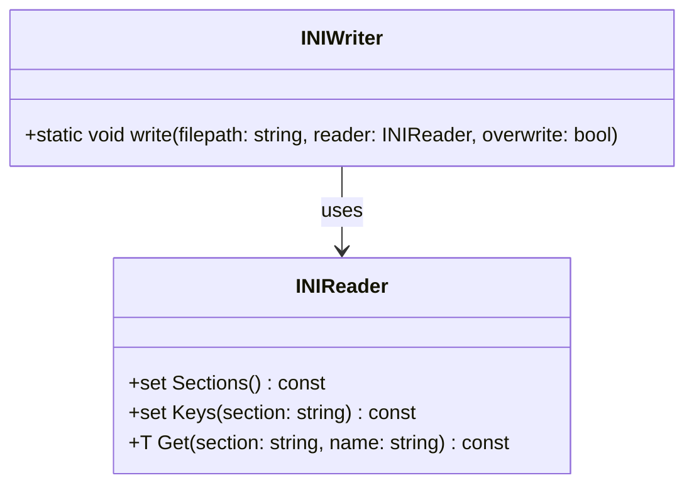

# 対象
- target: INIWriter::write
- granularity: target_span
- target_kind: function
- target_symbol: INIWriter::write

# 対象範囲
元コード全体は対象部分を理解するための文脈として参照してください。
設計文書はtarget_symbolで指定した対象部分だけについて作成してください。
対象外の関数やクラスは、対象部分との関係を説明する場合に限って記載してください。

# 基本設計項目の出力構成（全条件共通・固定）

## 責務
INIファイルにINIReaderオブジェクトの内容を書き込む。

## 公開インターフェース
- `static void write(const std::string& filepath, const INIReader& reader, const bool overwrite = false)`

## 入力
- `filepath`: 出力するINIファイルのパス (std::string)
- `reader`: 書き込む内容を保持しているINIReaderオブジェクト (const INIReader&)
- `overwrite`: 既存ファイルを上書きするかどうか (bool, デフォルトはfalse)

## 出力
なし

## 状態
- `filepath`に指定されたファイルが存在し、`overwrite`がfalseの場合: std::runtime_error例外を投げる。
- `filepath`に指定されたファイルを開くことができない場合: std::runtime_error例外を投げる。

## 処理手順
1. `overwrite`がfalseで、`filepath`に指定されたファイルが既存である場合はstd::runtime_error例外を投げる。
2. `filepath`に指定されたファイルを開く。開けない場合はstd::runtime_error例外を投げる。
3. INIReaderオブジェクトのセクションリストを取得し、各セクションに対して以下の処理を行う:
   1. セクション名をファイルに出力する。
   2. セクション内のキーリストを取得し、各キーに対して以下の処理を行う:
      1. キーと値を`key=value`の形式でファイルに出力する。

## 例外・失敗条件
- `overwrite`がfalseで、指定されたファイルが既存である場合。
- 指定されたファイルを開くことができない場合。

## 依存関係
- INIReaderクラス (readerパラメータからセクションとキーを取得し、値を取得する)
- std::ifstream (ファイルの存在確認に使用)
- std::ofstream (ファイルへの書き込みに使用)

## 重要な不変条件
- 出力されるINIファイルの形式は`[section]\nkey=value\n`である。
- `overwrite`がfalseの場合、既存ファイルを上書きしない。

# RAGによる追加詳細設計成果物

## 追加詳細設計情報

### クラス図


### クラス・メソッド・インターフェース詳細

| クラス名 | メソッド名 | 完全な関数名 | 引数名と型 | 戻り値型 | 可視性 | const | static |
|----------|------------|--------------|------------|----------|--------|-------|--------|
| INIWriter | write      | INIWriter::write | filepath: std::string, reader: const INIReader&, overwrite: bool | void     | public |       | true   |

### シーケンス図
```mermaid
sequenceDiagram
    participant Caller
    participant INIWriter
    participant INIReader
    participant ifstream
    participant ofstream

    Caller->>INIWriter: write(filepath, reader, overwrite)
    alt overwrite is false and file exists
        INIWriter->>ifstream: ifstream(filepath)
        ifstream-->>INIWriter: true
        INIWriter-->>Caller: throw std::runtime_error
    else file does not exist or overwrite is true
        INIWriter->>ofstream: ofstream(filepath)
        ofstream-->>INIWriter: true
        INIWriter->>INIReader: Sections()
        INIReader-->>INIWriter: sections
        loop for each section in sections
            INIWriter->>ofstream: << "[" + section + "]\n"
            INIWriter->>INIReader: Keys(section)
            INIReader-->>INIWriter: keys
            loop for each key in keys
                INIWriter->>INIReader: Get(section, key)
                INIReader-->>INIWriter: value
                INIWriter->>ofstream: << key + "=" + value + "\n"
        end
    else ofstream cannot be opened
        INIWriter-->>Caller: throw std::runtime_error
    end
```

### メソッド仕様書

| 項目         | 詳細                                                                                                                                                                                                 |
|--------------|------------------------------------------------------------------------------------------------------------------------------------------------------------------------------------------------------|
| メソッド名   | `INIWriter::write`                                                                                                                                                                                   |
| 完全な関数名 | `static void INIWriter::write(const std::string& filepath, const INIReader& reader, const bool overwrite = false)`                                                                                    |
| 目的         | INIファイルにINIReaderオブジェクトの内容を書き込む。                                                                                                                                                 |
| 引数         | - `filepath`: 出力するINIファイルのパス (std::string)<br>- `reader`: 書き込む内容を保持しているINIReaderオブジェクト (const INIReader&)<br>- `overwrite`: 既存ファイルを上書きするかどうか (bool, デフォルトはfalse) |
| 戻り値       | void                                                                                                                                                                                                 |
| 動作の説明   | 1. `overwrite`がfalseで、指定されたファイルが既存である場合はstd::runtime_error例外を投げる。<br>2. 指定されたファイルを開く。開けない場合はstd::runtime_error例外を投げる。<br>3. INIReaderオブジェクトのセクションリストを取得し、各セクションに対して以下の処理を行う:<br>&nbsp;&nbsp;1. セクション名をファイルに出力する。<br>&nbsp;&nbsp;2. セクション内のキーリストを取得し、各キーに対して以下の処理を行う:<br>&nbsp;&nbsp;&nbsp;&nbsp;1. キーと値を`key=value`の形式でファイルに出力する。 |
| 副作用       | 指定されたファイルにINIReaderオブジェクトの内容が書き込まれる。                                                                                                                                       |
| 使用例       | ```cpp<br>INIReader reader("input.ini");<br>INIWriter::write("output.ini", reader);<br>```                                                                                                            |
| エラー処理   | - `overwrite`がfalseで、指定されたファイルが既存である場合。<br>- 指定されたファイルを開くことができない場合。                                                                                           |

### 処理フロー図
```mermaid
flowchart TD
    A[開始] --> B{overwrite is false and file exists?}
    B -- true --> C[throw std::runtime_error]
    B -- false --> D[ifstream(filepath)]
    D --> E{ifstream opened successfully?}
    E -- false --> F[throw std::runtime_error]
    E -- true --> G[ofstream(filepath)]
    G --> H{ofstream opened successfully?}
    H -- false --> I[throw std::runtime_error]
    H -- true --> J[reader.Sections()]
    J --> K[foreach section in sections]
    K --> L[ofstream << "[" + section + "]\n"]
    L --> M[reader.Keys(section)]
    M --> N[foreach key in keys]
    N --> O[reader.Get(section, key)]
    O --> P[ofstream << key + "=" + value + "\n"]
    P --> Q[end foreach key]
    Q --> R[end foreach section]
    R --> S[終了]
```

### 状態遷移・副作用

| 更新前状態 | 遷移条件                             | 変更対象 | 更新後状態 | 更新順序 | 外部資源への副作用                                                                 |
|------------|--------------------------------------|----------|------------|----------|------------------------------------------------------------------------------------|
| ファイルが存在しないまたはoverwrite=true | 処理開始                         | ofstream   | 開かれたファイル       | 1        | 指定されたファイルに書き込み可能になる                                           |
| ファイルが存在し、overwrite=false      | 処理開始                         | -        | -          | 1        | std::runtime_error例外を投げる                                                   |
| ofstreamが開けない                   | 処理開始                         | -        | -          | 2        | std::runtime_error例外を投げる                                                   |

### データ変換・制約

| 入力形式     | 出力形式       | 型変換 | 加工規則                                                                                           | 値域         | 境界値   | 単位 | 精度 | エンコーディング | 検証条件 | 特殊値・欠損値の扱い |
|--------------|----------------|--------|----------------------------------------------------------------------------------------------------|--------------|----------|------|------|------------------|------------|--------------------|
| std::string  | -              | -      | ファイルパスとして使用                                                                             | 文字列       | 空文字列 | -    | -    | UTF-8            | 必須       | 空文字列はエラー     |
| INIReader&   | -              | -      | INIReaderオブジェクトからセクションとキーを取得し、値を取得する                                      | -            | -        | -    | -    | -                | 必須       | -                  |
| bool         | -              | -      | 上書きフラグとして使用                                                                             | true/false   | -        | -    | -    | -                | 任意       | -                  |
| -            | std::string    | -      | セクション名を`[section]\n`の形式で出力する                                                        | 文字列       | 空文字列 | -    | -    | UTF-8            | 必須       | 空文字列はエラー     |
| -            | std::string    | -      | キーと値を`key=value\n`の形式で出力する                                                            | 文字列       | 空文字列 | -    | -    | UTF-8            | 必須       | 空文字列はエラー     |