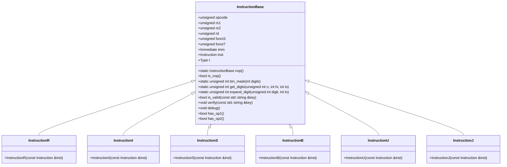

# 対象
- target: Instruction
- granularity: module_files
- source_files: ["src/Common/Instruction.hpp"]

# 責務
`Instruction.hpp`は、RISC-Vアーキテクチャの命令を表す構造体とその派生クラスを定義します。主な責務は以下の通りです：
- 命令の種類（R型、I型、S型、B型、U型、J型）に対応する構造体を提供する。
- 各命令からフィールド（opcode, rs1, rs2, rd, funct3, funct7, imm）を抽出し保持する。
- 命令のデバッグ情報を出力する機能を提供する。

# 公開インターフェース
- `InstructionBase`構造体とその派生クラス（`InstructionR`, `InstructionI`, `InstructionS`, `InstructionB`, `InstructionU`, `InstructionJ`）。
- 各命令型のコンストラクタ。
- メンバ変数：`opcode`, `rs1`, `rs2`, `rd`, `funct3`, `funct7`, `imm`, `inst`, `t`（Type列挙型）。
- メソッド：`bin_mask`, `get_digits`, `expand_digit`, `is_valid`, `verify`, `debug`, `has_op1`, `has_op2`。

# 入力
- 命令コード（`unsigned int`型）を各命令型のコンストラクタに渡す。
- メソッド`is_valid`と`verify`にフィールド名（`std::string`型）を渡す。

# 出力
- 各命令型のインスタンスが保持するメンバ変数を通じて、命令の詳細情報を提供する。
- `debug`メソッドによって標準出力にデバッグ情報が出力される。

# 状態
- 命令の種類（Type列挙型）を表す`t`メンバ変数。
- 各フィールド（opcode, rs1, rs2, rd, funct3, funct7, imm）が保持する値。

# 処理手順
1. 各命令型のコンストラクタは、受け取った命令コードから必要なフィールドを抽出しメンバ変数に設定する。
2. `is_valid`メソッドは、指定されたキーに対応するフィールドが現在の命令型で有効かどうかをチェックする。
3. `verify`メソッドは、`is_valid`メソッドを使用してキーの有効性を確認し、無効な場合は例外を投げる。
4. `debug`メソッドは、命令コードとその種類に基づいてデバッグ情報を標準出力に出力する。

# 例外・失敗条件
- `verify`メソッドで指定されたキーが現在の命令型で無効な場合、`InvalidAccess`例外を投げる。

# 依存関係
- `Common.h`ヘッダファイル（詳細不明）。
- `<utility>`, `<string>`, `<iostream>`標準ライブラリヘッダファイル。

# 重要な不変条件
- 各命令型のインスタンスは、コンストラクタによって初期化され、そのフィールド値はその後変更されない（ただし`debug`メソッドによる出力のみ）。
- `inst`メンバ変数が保持する命令コードは、各命令型のコンストラクタによって設定され、その後変更されない。

## 追加詳細設計情報

### クラス図

### クラス・メソッド・インターフェース詳細

| 完全な名前 | 属性 | 引数名と型 | 戻り値型 | 可視性 | const | リファレンス | ポインタ | static | virtual | noexcept | 型別名 | 列挙型 | 定数 | 直接依存 |
|------------|------|------------|----------|--------|-------|------------|----------|--------|---------|----------|--------|--------|------|----------|
| InstructionBase::InstructionBase() | コンストラクタ | - | void | public | - | - | - | - | - | - | - | - | - | - |
| InstructionBase::InstructionBase(unsigned) | コンストラクタ | - | void | public | - | - | - | - | - | - | - | - | - | - |
| InstructionBase::nop() | 静的メソッド | - | InstructionBase | public | - | - | - | static | - | - | - | - | - | - |
| InstructionBase::is_nop() | メソッド | - | bool | public | - | - | - | - | - | - | - | - | - | - |
| InstructionBase::bin_mask(int digits) | 静的メソッド | digits: int | unsigned int | public | - | - | - | static | - | - | - | - | - | - |
| InstructionBase::get_digits(unsigned int n, int hi, int lo) | 静的メソッド | n: unsigned int, hi: int, lo: int | unsigned int | public | - | - | - | static | - | - | - | - | - | - |
| InstructionBase::expand_digit(unsigned int digit, int lo) | 静的メソッド | digit: unsigned int, lo: int | unsigned int | public | - | - | - | static | - | - | - | - | - | - |
| InstructionBase::is_valid(const std::string &key) | メソッド | key: const std::string & | bool | public | - | - | - | - | - | - | - | - | - | - |
| InstructionBase::verify(const std::string &key) | メソッド | key: const std::string & | void | public | - | - | - | - | - | - | - | - | - | - |
| InstructionBase::debug() | メソッド | - | void | public | - | - | - | - | - | - | - | - | - | - |
| InstructionBase::has_op1() | メソッド | - | bool | public | - | - | - | - | - | - | - | - | - | - |
| InstructionBase::has_op2() | メソッド | - | bool | public | - | - | - | - | - | - | - | - | - | - |
| InstructionR::InstructionR(const Instruction &inst) | コンストラクタ | inst: const Instruction & | void | public | - | - | - | - | - | - | - | - | - | - |
| InstructionI::InstructionI(const Instruction &inst) | コンストラクタ | inst: const Instruction & | void | public | - | - | - | - | - | - | - | - | - | - |
| InstructionS::InstructionS(const Instruction &inst) | コンストラクタ | inst: const Instruction & | void | public | - | - | - | - | - | - | - | - | - | - |
| InstructionB::InstructionB(const Instruction &inst) | コンストラクタ | inst: const Instruction & | void | public | - | - | - | - | - | - | - | - | - | - |
| InstructionU::InstructionU(const Instruction &inst) | コンストラクタ | inst: const Instruction & | void | public | - | - | - | - | - | - | - | - | - | - |
| InstructionJ::InstructionJ(const Instruction &inst) | コンストラクタ | inst: const Instruction & | void | public | - | - | - | - | - | - | - | - | - | - |

### シーケンス図
該当なし（元コードから確認できない）

### メソッド仕様書

| 完全な名前 | 目的 | 引数 | 戻り値 | 動作の説明 | 副作用 | 使用例 | エラー処理 |
|------------|------|------|--------|------------|--------|--------|------------|
| InstructionBase::InstructionBase() | デフォルトコンストラクタ | - | void | すべてのフィールドを初期化する。 | - | `InstructionBase ib;` | 無し |
| InstructionBase::InstructionBase(unsigned) | 特定の命令型（I型）で初期化するコンストラクタ | - | void | opcode, funct3, tを設定し、他のフィールドは初期化する。 | - | `InstructionBase ib(0);` | 無し |
| InstructionBase::nop() | NOP命令を作成する静的メソッド | - | InstructionBase | NOP命令のインスタンスを返す。 | - | `auto nopInst = InstructionBase::nop();` | 無し |
| InstructionBase::is_nop() | NOP命令かどうか判定するメソッド | - | bool | instがNOP命令であるかを返す。 | - | `bool isNop = ib.is_nop();` | 無し |
| InstructionBase::bin_mask(int digits) | ビットマスクを作成する静的メソッド | digits: int | unsigned int | 指定されたビット数のビットマスクを返す。 | - | `unsigned mask = InstructionBase::bin_mask(5);` | 無し |
| InstructionBase::get_digits(unsigned int n, int hi, int lo) | ビットフィールドから値を取り出す静的メソッド | n: unsigned int, hi: int, lo: int | unsigned int | 指定された範囲のビットを抽出して返す。 | - | `unsigned value = InstructionBase::get_digits(0x12345678, 15, 10);` | 無し |
| InstructionBase::expand_digit(unsigned int digit, int lo) | ビットフィールドを拡張する静的メソッド | digit: unsigned int, lo: int | unsigned int | 指定されたビット位置から上位ビットを拡張して返す。 | - | `unsigned expanded = InstructionBase::expand_digit(1, 20);` | 無し |
| InstructionBase::is_valid(const std::string &key) | フィールドが有効かどうか判定するメソッド | key: const std::string & | bool | 指定されたキーに対応するフィールドが現在の命令型で有効かどうかを返す。 | - | `bool isValid = ib.is_valid("rs1");` | 無し |
| InstructionBase::verify(const std::string &key) | フィールドが有効かどうか検証するメソッド | key: const std::string & | void | 指定されたキーに対応するフィールドが現在の命令型で無効な場合は例外を投げる。 | 例外を投げることがある。 | `ib.verify("rs1");` | InvalidAccess例外 |
| InstructionBase::debug() | デバッグ情報を出力するメソッド | - | void | 命令コードとその種類に基づいてデバッグ情報を標準出力に出力する。 | 標準出力に情報が出力される。 | `ib.debug();` | 無し |
| InstructionBase::has_op1() | 1つ目のオペランドが存在するかどうか判定するメソッド | - | bool | 命令型によって1つ目のオペランドが存在するかを返す。 | - | `bool hasOp1 = ib.has_op1();` | 無し |
| InstructionBase::has_op2() | 2つ目のオペランドが存在するかどうか判定するメソッド | - | bool | 命令型によって2つ目のオペランドが存在するかを返す。 | - | `bool hasOp2 = ib.has_op2();` | 無し |
| InstructionR::InstructionR(const Instruction &inst) | R型命令のコンストラクタ | inst: const Instruction & | void | 命令コードからフィールド値を抽出して設定する。 | - | `InstructionR ir(0x12345678);` | 無し |
| InstructionI::InstructionI(const Instruction &inst) | I型命令のコンストラクタ | inst: const Instruction & | void | 命令コードからフィールド値を抽出して設定する。 | - | `InstructionI ii(0x12345678);` | 無し |
| InstructionS::InstructionS(const Instruction &inst) | S型命令のコンストラクタ | inst: const Instruction & | void | 命令コードからフィールド値を抽出して設定する。 | - | `InstructionS is(0x12345678);` | 無し |
| InstructionB::InstructionB(const Instruction &inst) | B型命令のコンストラクタ | inst: const Instruction & | void | 命令コードからフィールド値を抽出して設定する。 | - | `InstructionB ib(0x12345678);` | 無し |
| InstructionU::InstructionU(const Instruction &inst) | U型命令のコンストラクタ | inst: const Instruction & | void | 命令コードからフィールド値を抽出して設定する。 | - | `InstructionU iu(0x12345678);` | 無し |
| InstructionJ::InstructionJ(const Instruction &inst) | J型命令のコンストラクタ | inst: const Instruction & | void | 命令コードからフィールド値を抽出して設定する。 | - | `InstructionJ ij(0x12345678);` | 無し |

### 処理フロー図
該当なし（元コードから確認できない）

### 状態遷移・副作用

| 更新前状態 | 遷移条件 | 変更対象 | 更新後状態 | 更新順序 | 外部資源への副作用 |
|------------|----------|----------|------------|----------|----------------------|
| 任意の状態 | コンストラクタ呼び出し | opcode, rs1, rs2, rd, funct3, funct7, imm, inst, t | 各フィールドが設定された状態 | - | 無し |
| 任意の状態 | verifyメソッド呼び出し | - | - | - | InvalidAccess例外を投げる可能性がある |

### データ変換・制約

| 入力形式 | 出力形式 | 変換方法 | 値域 | 境界値 | 単位 | 精度 | エンコーディング | 検証条件 | 特殊値・欠損値の扱い |
|----------|----------|----------|------|--------|------|------|------------------|------------|-----------------------|
| 命令コード（unsigned int） | 各フィールド値 | ビットフィールド抽出 | 0-2^32-1 | 0, 2^32-1 | - | 32ビット | バイナリ | 確認不能 | 確認不能 |
| キー（std::string） | bool | is_validメソッドによるチェック | - | - | - | - | 文字列 | 確認不能 | 確認不能 |