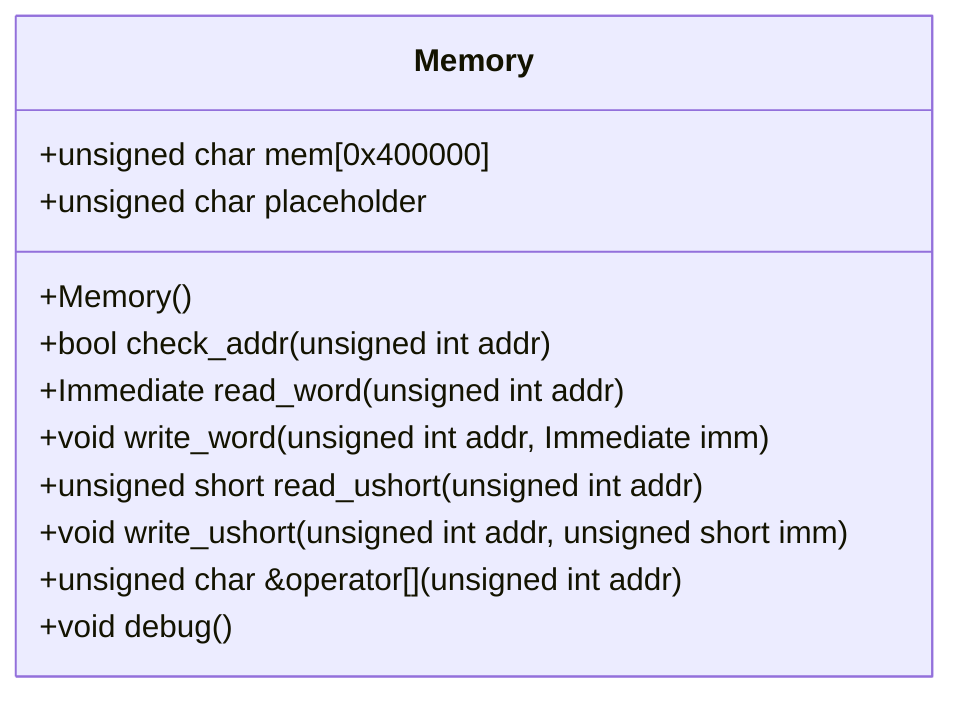
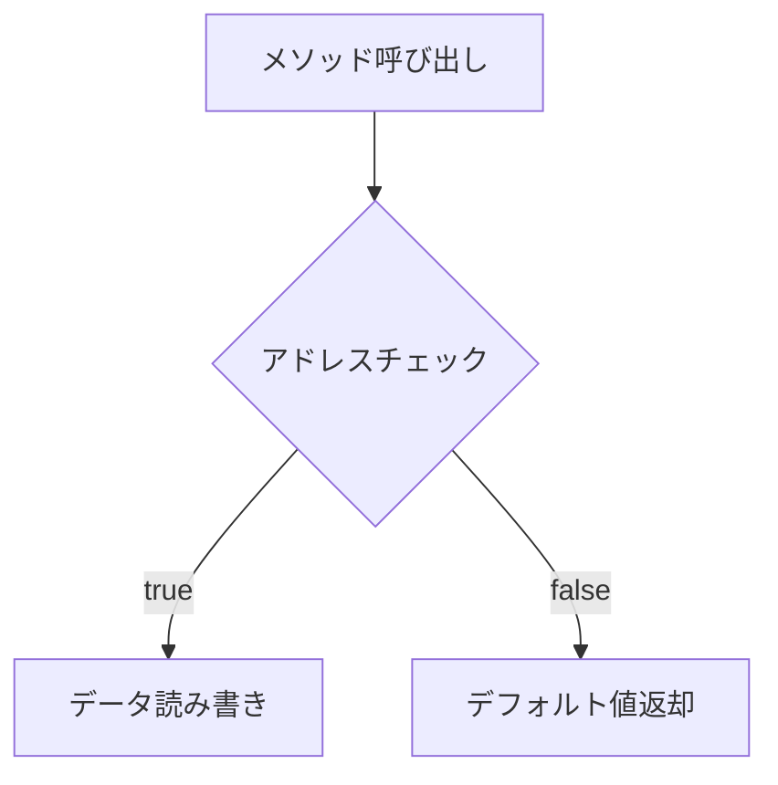

# 対象
- target: Memory
- granularity: target_span
- target_kind: class
- target_symbol: Memory

# 責務
`Memory`クラスは、指定されたメモリサイズを持つメモリ空間を提供し、その中にデータの読み書きを行う。また、アドレス範囲のチェックとデバッグ用の出力機能も備えている。

# 公開インターフェース
- `bool check_addr(unsigned int addr)`: アドレスが有効かどうかをチェックする。
- `Immediate read_word(unsigned int addr)`: 指定されたアドレスからワード（4バイト）を読み取る。
- `void write_word(unsigned int addr, Immediate imm)`: 指定されたアドレスにワード（4バイト）を書き込む。
- `unsigned short read_ushort(unsigned int addr)`: 指定されたアドレスからハーフワード（2バイト）を読み取る。
- `void write_ushort(unsigned int addr, unsigned short imm)`: 指定されたアドレスにハーフワード（2バイト）を書き込む。
- `unsigned char &operator`: 指定されたアドレスのバイトへの参照を返す。
- `void debug()`: メモリの特定範囲をデバッグ出力する。

# 入力
- アドレス (`unsigned int`)
- 書き込むデータ (`Immediate` または `unsigned short`)

# 出力
- 読み取ったデータ (`Immediate` または `unsigned short`)
- デバッグ情報 (標準出力)

# 状態
- `mem`: メモリ空間（4MB）
- `placeholder`: アドレスチェックに失敗した場合のダミーバイト

# 処理手順
1. `Memory` オブジェクトが生成されると、`mem` はゼロクリアされる。
2. 各読み書きメソッドはまず `check_addr` を呼び出してアドレスの有効性を確認する。
3. アドレスが有効であれば、指定されたデータ型で読み書きを行う。
4. オペレータ `[]` はアドレスチェックを行い、有効な場合は該当位置への参照を返す。無効な場合は `placeholder` を返す。

# 例外・失敗条件
- アドレスが範囲外の場合、読み書きメソッドはデフォルト値（0）を返し、オペレータ `[]` は `placeholder` を返す。
- 現在の実装ではアドレスチェックに失敗した場合の例外処理はコメントアウトされている。

# 依存関係
- `Common.h`: 定義が含まれている可能性があるヘッダファイル。
- `<cstring>`: `memset` 関数を使用している。
- `<iostream>`: デバッグ出力用に使用している。
- `<cassert>`: アドレスチェックのデバッグ用アサート文がコメントアウトされている。

# 重要な不変条件
- `mem` のサイズは常に `MEMORY_SIZE` (0x400000) である。
- `placeholder` は常に初期化され、アドレス範囲外アクセス時のダミーバイトとして使用される。

## 追加詳細設計情報

### クラス図

### クラス・メソッド・インターフェース詳細
| 完全な名前 | 属性 | 引数名と型 | 戻り値型 | 可視性 | const | リファレンス/ポインタ | static | virtual | noexcept |
|------------|------|------------|----------|--------|-------|---------------------|--------|---------|----------|
| Memory::Memory() | コンストラクタ | - | void | public | - | - | - | - | - |
| Memory::check_addr(unsigned int addr) | メソッド | addr: unsigned int | bool | public | - | - | - | - | - |
| Memory::read_word(unsigned int addr) | メソッド | addr: unsigned int | Immediate | public | - | - | - | - | - |
| Memory::write_word(unsigned int addr, Immediate imm) | メソッド | addr: unsigned int, imm: Immediate | void | public | - | - | - | - | - |
| Memory::read_ushort(unsigned int addr) | メソッド | addr: unsigned int | unsigned short | public | - | - | - | - | - |
| Memory::write_ushort(unsigned int addr, unsigned short imm) | メソッド | addr: unsigned int, imm: unsigned short | void | public | - | - | - | - | - |
| Memory::operator | オペレータ | addr: unsigned int | unsigned char & | public | - | 参照 | - | - | - |
| Memory::debug() | メソッド | - | void | public | - | - | - | - | - |

### シーケンス図
該当なし（元コードに複数の関数間の相互作用が明示的に記述されていない）

### メソッド仕様書

| メソッド名 | 目的 | 引数 | 戻り値 | 動作の説明 | 副作用 | 使用例 | エラー処理 |
|------------|------|------|--------|------------|--------|--------|------------|
| check_addr(unsigned int addr) | アドレスが有効かどうかをチェックする | addr: unsigned int | bool | アドレスが範囲内であれば true を返す。それ以外は false を返す。 | なし | `bool valid = mem.check_addr(0x100);` | 無し |
| read_word(unsigned int addr) | 指定されたアドレスからワード（4バイト）を読み取る | addr: unsigned int | Immediate | アドレスが範囲内であれば、その位置のワードを返す。それ以外は 0 を返す。 | なし | `Immediate word = mem.read_word(0x100);` | 無し |
| write_word(unsigned int addr, Immediate imm) | 指定されたアドレスにワード（4バイト）を書き込む | addr: unsigned int, imm: Immediate | void | アドレスが範囲内であれば、その位置にワードを書き込む。それ以外は何もしない。 | メモリの変更 | `mem.write_word(0x100, 0xdeadbeef);` | 無し |
| read_ushort(unsigned int addr) | 指定されたアドレスからハーフワード（2バイト）を読み取る | addr: unsigned int | unsigned short | アドレスが範囲内であれば、その位置のハーフワードを返す。それ以外は 0 を返す。 | なし | `unsigned short halfword = mem.read_ushort(0x100);` | 無し |
| write_ushort(unsigned int addr, unsigned short imm) | 指定されたアドレスにハーフワード（2バイト）を書き込む | addr: unsigned int, imm: unsigned short | void | アドレスが範囲内であれば、その位置にハーフワードを書き込む。それ以外は何もしない。 | メモリの変更 | `mem.write_ushort(0x100, 0xbeef);` | 無し |
| operator | 指定されたアドレスのバイトへの参照を返す | addr: unsigned int | unsigned char & | アドレスが範囲内であれば、その位置のバイトへの参照を返す。それ以外は `placeholder` を返す。 | なし | `unsigned char byte = mem[0x100];` | 無し |
| debug() | メモリの特定範囲をデバッグ出力する | - | void | メモリの指定範囲（0x20000-0x2010）を16進数で標準出力する。 | 標準出力への書き込み | `mem.debug();` | 無し |

### 処理フロー図

### 状態遷移・副作用

| 更新前状態 | 遷移条件 | 変更対象 | 更新後状態 | 更新順序 | 外部資源への副作用 |
|------------|----------|----------|------------|----------|----------------------|
| メモリ初期化済み | アドレス有効 | mem[addr] | 書き込みデータ | - | メモリの変更 |
| 任意状態 | アドレス無効 | なし | デフォルト値 | - | 無し |

### データ変換・制約

| 入力形式 | 出力形式 | 変換規則 | 値域 | 境界値 | 単位 | 精度 | エンコーディング | 検証条件 | 特殊値・欠損値の扱い |
|----------|----------|----------|------|--------|------|------|------------------|------------|-----------------------|
| unsigned int | bool | アドレス範囲チェック | 0 <= addr < MEMORY_SIZE | 0, MEMORY_SIZE-1 | バイトアドレス | - | 無し | 0 <= addr < MEMORY_SIZE | アドレス範囲外の場合は false |
| unsigned int | Immediate | メモリからの読み取り | 任意 | - | ワード (4バイト) | - | ネイティブエンディアン | アドレス範囲内 | 無し |
| unsigned int, Immediate | void | メモリへの書き込み | 任意 | - | ワード (4バイト) | - | ネイティブエンディアン | アドレス範囲内 | 無し |
| unsigned int | unsigned short | メモリからの読み取り | 任意 | - | ハーフワード (2バイト) | - | ネイティブエンディアン | アドレス範囲内 | 無し |
| unsigned int, unsigned short | void | メモリへの書き込み | 任意 | - | ハーフワード (2バイト) | - | ネイティブエンディアン | アドレス範囲内 | 無し |
| unsigned int | unsigned char & | メモリからの参照取得 | 任意 | - | バイト (1バイト) | - | ネイティブエンコーディング | アドレス範囲内 | アドレス範囲外の場合は placeholder |