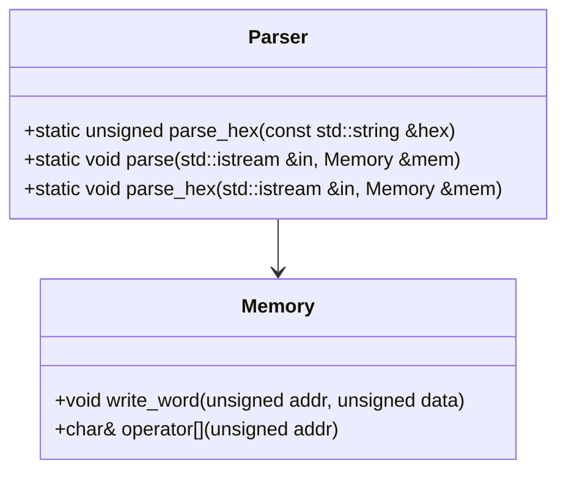
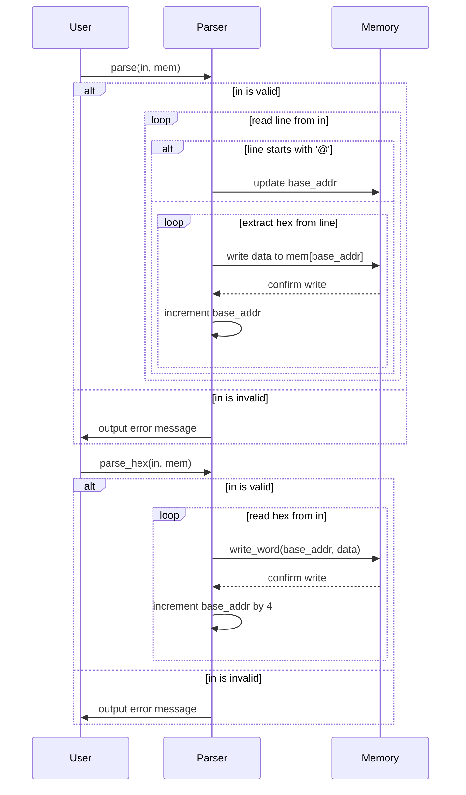

# 対象
- target: Parser
- granularity: target_span
- target_kind: class
- target_symbol: Parser

# 責務
`Parser`クラスは、入力ストリームからデータを読み取り、それをメモリオブジェクトに書き込む責任を持っています。具体的には16進数形式のデータをパースし、指定されたアドレスに格納します。

## 公開インターフェース
- `static unsigned parse_hex(const std::string &hex)`
- `static void parse(std::istream &in, Memory &mem)`
- `static void parse_hex(std::istream &in, Memory &mem)`

## 入力
- `parse_hex`: 16進数形式の文字列 (`const std::string &hex`)
- `parse`: 入力ストリームとメモリオブジェクト (`std::istream &in`, `Memory &mem`)
- `parse_hex`: 入力ストリームとメモリオブジェクト (`std::istream &in`, `Memory &mem`)

## 出力
- `parse_hex`: 16進数文字列を整数に変換した値 (`unsigned`)
- `parse`: メモリオブジェクトへのデータ書き込み (戻り値なし)
- `parse_hex`: メモリオブジェクトへのデータ書き込み (戻り値なし)

## 状態
- `base_addr`: データを書き込むメモリのベースアドレス (`unsigned`)

## 処理手順
1. **parse_hex**: 与えられた16進数文字列を整数に変換する。
2. **parse**:
   - 入力ストリームが有効であることを確認し、無効な場合はエラーメッセージを出力する。
   - 各行を読み取り、`@`で始まる行はベースアドレスとして処理し、それ以外の行は16進数データとして処理する。
   - 16進数データはメモリオブジェクトに書き込む。
3. **parse_hex**:
   - 入力ストリームが有効であることを確認し、無効な場合はエラーメッセージを出力する。
   - 各16進数文字列を読み取り、それを整数に変換してメモリオブジェクトに書き込む。

## 例外・失敗条件
- 入力ストリームが無効な場合、エラーメッセージを出力する。
- パースできないデータ（空文字列など）が含まれる場合、その行はスキップされる。

## 依存関係
- `Memory`クラス: データの書き込み先として使用される。

## 重要な不変条件
- `base_addr`は常に有効なメモリアドレスを指していること。
- 入力ストリームが無効になった場合、エラーメッセージが出力され処理が中断されること。

# 追加詳細設計情報

## クラス図


## クラス・メソッド・インターフェース詳細

| 完全な名前 | 属性 | 引数名と型 | 戻り値型 | 可視性 | const | リファレンス/ポインタ | static | virtual | noexcept |
|------------|------|------------|----------|--------|-------|---------------------|--------|---------|----------|
| Parser::parse_hex | 静的メソッド | hex: const std::string & | unsigned | public | なし | リファレンス | あり | なし | なし |
| Parser::parse | 静的メソッド | in: std::istream &, mem: Memory & | void | public | なし | リファレンス | あり | なし | なし |
| Parser::parse_hex | 静的メソッド | in: std::istream &, mem: Memory & | void | public | なし | リファレンス | あり | なし | なし |

## シーケンス図


## メソッド仕様書

| メソッド名 | 目的 | 引数 | 戻り値 | 動作の説明 | サイドエフェクト | 使用例 | エラー処理 |
|------------|------|------|--------|--------------|----------------|--------|------------|
| parse_hex  | 16進数文字列を整数に変換する | hex: const std::string & | unsigned | 文字列を16進数として解釈し、その値を返す | なし | `unsigned val = Parser::parse_hex("1A");` | 無効な入力の場合は未定義動作 |
| parse      | 入力ストリームからデータを読み取りメモリに書き込む | in: std::istream &, mem: Memory & | void | 各行を読み取り、`@`で始まる行はベースアドレスとして処理し、それ以外の行は16進数データとしてメモリに書き込む | エラーメッセージ出力 | `Parser::parse(inputStream, memory);` | 入力ストリームが無効な場合はエラーメッセージを出力 |
| parse_hex  | 入力ストリームから16進数データを読み取りメモリに書き込む | in: std::istream &, mem: Memory & | void | 各16進数文字列を読み取り、それを整数に変換してメモリに書き込む | エラーメッセージ出力 | `Parser::parse_hex(inputStream, memory);` | 入力ストリームが無効な場合はエラーメッセージを出力 |

## 処理フロー図
```mermaid
flowchart TD
    A[開始] --> B{in is valid?}
    B -- はい --> C[base_addr = 0]
    B -- いいえ --> D[output error message]
    C --> E[read line from in]
    E --> F{line starts with '@'?}
    F -- はい --> G[update base_addr]
    F -- いいえ --> H[create stringstream ss(line)]
    G --> I[loop read hex from ss]
    H --> I
    I --> J{hex is empty?}
    J -- いいえ --> K[parse_hex(hex) to data]
    J -- はい --> L[end loop]
    K --> M[mem[base_addr++] = data]
    M --> I
    L --> E
    D --> N[終了]
```

## 状態遷移・副作用

| 更新前状態 | 遷移条件 | 変更対象 | 更新後状態 | 更新順序 | 副作用 |
|------------|----------|----------|------------|----------|--------|
| なし       | in is valid | base_addr | 0          | 1        | なし   |
| なし       | line starts with '@' | base_addr | strtol(line.c_str() + 1, NULL, 16) | 2        | なし   |
| なし       | hex is not empty | mem[base_addr] | parse_hex(hex) | 3        | なし   |
| なし       | in is invalid | なし | なし       | 4        | output error message |

## データ変換・制約

| 入力形式 | 出力形式 | 変換規則 | 値域 | 境界値 | 単位 | 精度 | エンコーディング | 検証条件 | 特殊値・欠損値の扱い |
|----------|----------|----------|------|--------|------|------|------------------|------------|-----------------------|
| 16進数文字列 | unsigned整数 | strtol(hex.c_str(), NULL, 16) | 0-4294967295 | 0, 4294967295 | なし | 32bit | ASCII | 文字列が有効な16進数である | 無効な入力の場合は未定義動作 |
| 入力ストリーム | メモリ書き込み | 各行を処理し、`@`で始まる行はベースアドレスとして処理し、それ以外の行は16進数データとしてメモリに書き込む | 0-4294967295 | 0, 4294967295 | byte | 8bit | ASCII | 入力ストリームが有効である | 無効な入力の場合はエラーメッセージを出力 |
| 入力ストリーム | メモリ書き込み | 各16進数文字列を読み取り、それを整数に変換してメモリに書き込む | 0-4294967295 | 0, 4294967295 | byte | 32bit | ASCII | 入力ストリームが有効である | 無効な入力の場合はエラーメッセージを出力 |