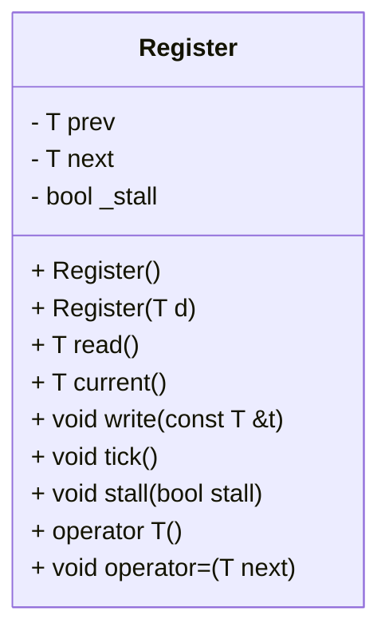
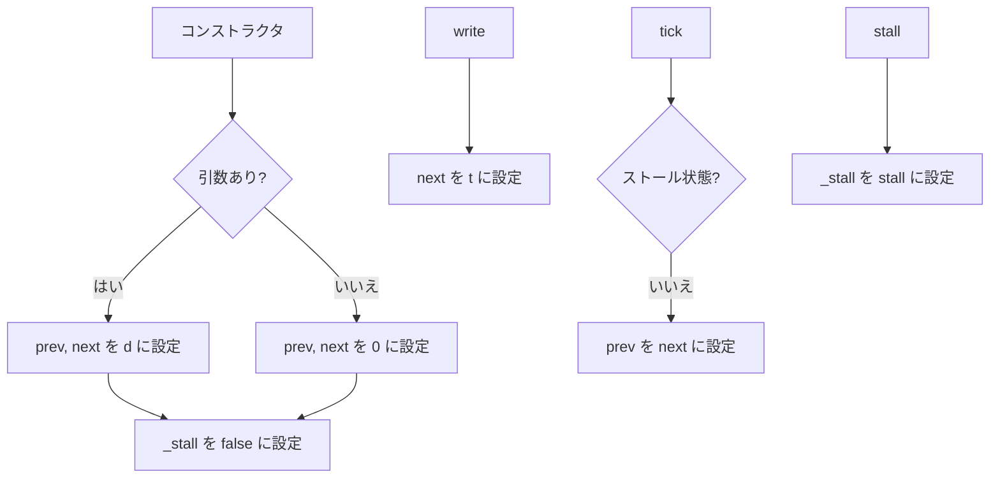

# 対象
- target: Register
- granularity: target_span
- target_kind: class
- target_symbol: Register

# 責務
`Register` クラスは、ジェネリックな型 `T` の値を保持し、現在の値と次の値を管理します。また、ストール状態を制御して、必要に応じて値を更新します。

# 公開インターフェース
- `Register()`: デフォルトコンストラクタで、`prev` と `next` をゼロ初期化し、`_stall` を false に設定します。
- `Register(T d)`: 引数 `d` で `prev` と `next` を初期化し、`_stall` を false に設定します。
- `T read()`: 前回の値 (`prev`) を返します。
- `T current()`: 次の値 (`next`) を返します。
- `void write(const T &t)`: 引数 `t` を次の値 (`next`) に設定します。
- `void tick()`: ストール状態が false の場合、`prev` を `next` の値に更新します。
- `void stall(bool stall)`: ストール状態を引数 `stall` の値に設定します。
- `operator T()`: 前回の値 (`prev`) を返す暗黙の型変換演算子です。
- `void operator=(T next)`: 引数 `next` を次の値 (`next`) に設定する代入演算子です。

# 入力
- コンストラクタ: 型 `T` の初期値 `d`
- `write(const T &t)`: 型 `T` の新しい値 `t`
- `stall(bool stall)`: ストール状態を示すブーリアン値 `stall`

# 出力
- `read()`, `current()`, `operator T()`: 型 `T` の値

# 状態
- `prev`: 前回の値 (`T`)
- `next`: 次の値 (`T`)
- `_stall`: ストール状態 (bool)

# 処理手順
1. コンストラクタで初期化: `prev` と `next` をゼロまたは指定された値に設定し、`_stall` を false に設定します。
2. `write(const T &t)` を呼び出すと、`next` が引数 `t` の値に更新されます。
3. `tick()` を呼び出すと、ストール状態が false の場合のみ `prev` が `next` の値に更新されます。
4. `stall(bool stall)` を呼び出すと、ストール状態 `_stall` が引数 `stall` の値に設定されます。

# 例外・失敗条件
- 確認不能

# 依存関係
- 型 `T`: テンプレートパラメータとして使用される型

# 重要な不変条件
- `_stall` はブーリアン値で、ストール状態を示します。
- `prev` と `next` は同じ型 `T` を保持します。

## 追加詳細設計情報

### クラス図

### クラス・メソッド・インターフェース詳細
| 完全な名前 | 属性     | 引数名と型       | 戻り値型 | 可視性 | const | リファレンス | ポインタ | static | virtual | noexcept |
|------------|----------|------------------|----------|--------|-------|------------|----------|--------|---------|----------|
| Register   | コンストラクタ | -              | void     | public | false | false      | false    | false  | false   | false    |
| Register   | コンストラクタ | d: T           | void     | public | false | false      | false    | false  | false   | false    |
| read       | メソッド   | -              | T        | public | true  | false      | false    | false  | false   | false    |
| current    | メソッド   | -              | T        | public | true  | false      | false    | false  | false   | false    |
| write      | メソッド   | t: const T &     | void     | public | false | false      | false    | false  | false   | false    |
| tick       | メソッド   | -              | void     | public | false | false      | false    | false  | false   | false    |
| stall      | メソッド   | stall: bool    | void     | public | false | false      | false    | false  | false   | false    |
| operator T | 演算子   | -              | T        | public | true  | false      | false    | false  | false   | false    |
| operator=  | 演算子   | next: T        | void     | public | false | false      | false    | false  | false   | false    |

### シーケンス図
該当なし

### メソッド仕様書
| 完全な名前 | 目的                         | 引数                     | 戻り値型 | 動作の説明                                                                 | 副作用                             | 使用例                           | エラー処理 |
|------------|------------------------------|--------------------------|----------|------------------------------------------------------------------------------|------------------------------------|----------------------------------|------------|
| Register   | デフォルトコンストラクタ       | -                        | void     | `prev` と `next` をゼロ初期化し、`_stall` を false に設定します。          | 状態の初期化                       | Register<int> reg;               | 該当なし   |
| Register   | 初期値を指定したコンストラクタ | d: T                     | void     | `prev` と `next` を引数 `d` の値に設定し、`_stall` を false に設定します。 | 状態の初期化                       | Register<int> reg(10);           | 該当なし   |
| read       | 前回の値を取得する           | -                        | T        | `prev` の値を返します。                                                    | 該当なし                           | int value = reg.read();          | 該当なし   |
| current    | 次の値を取得する             | -                        | T        | `next` の値を返します。                                                    | 該当なし                           | int nextValue = reg.current();   | 該当なし   |
| write      | 次の値を設定する             | t: const T &             | void     | 引数 `t` を `next` の値に設定します。                                      | 状態の更新                         | reg.write(20);                   | 該当なし   |
| tick       | 値を更新する                 | -                        | void     | ストール状態が false の場合のみ、`prev` を `next` の値に設定します。         | 状態の更新                         | reg.tick();                      | 該当なし   |
| stall      | ストール状態を設定する       | stall: bool              | void     | 引数 `stall` を `_stall` の値に設定します。                                | 状態の更新                         | reg.stall(true);                 | 該当なし   |
| operator T | 前回の値を取得する           | -                        | T        | `prev` の値を返します。                                                    | 該当なし                           | int value = static_cast<int>(reg); | 該当なし   |
| operator=  | 次の値を設定する             | next: T                  | void     | 引数 `next` を `next` の値に設定します。                                   | 状態の更新                         | reg = 30;                        | 該当なし   |

### 処理フロー図

### 状態遷移・副作用
| 更新前状態 | 遷移条件       | 変更対象 | 更新後状態               | 更新順序 | 副作用                             |
|------------|----------------|----------|--------------------------|----------|------------------------------------|
| 任意       | コンストラクタ   | prev     | 引数 d または 0          | 1        | 状態の初期化                       |
|            |                | next     | 引数 d または 0          | 2        |                                    |
|            |                | _stall   | false                    | 3        |                                    |
| 任意       | write          | next     | 引数 t                   | 1        | 状態の更新                         |
| 任意       | tick           | prev     | next (ストール状態がいいえの場合) | 1        | 状態の更新                         |
| 任意       | stall          | _stall   | 引数 stall               | 1        | 状態の更新                         |

### データ変換・制約
| 入力形式 | 出力形式 | 型変換 | 加工規則 | 値域 | 境界値 | 単位 | 精度 | エンコーディング | 検証条件 | 特殊値・欠損値の扱い |
|----------|----------|--------|----------|------|--------|------|------|------------------|------------|----------------------|
| T        | T        | なし   | なし     | 確認不能 | 確認不能 | 確認不能 | 確認不能 | 確認不能 | 確認不能 | 確認不能           |