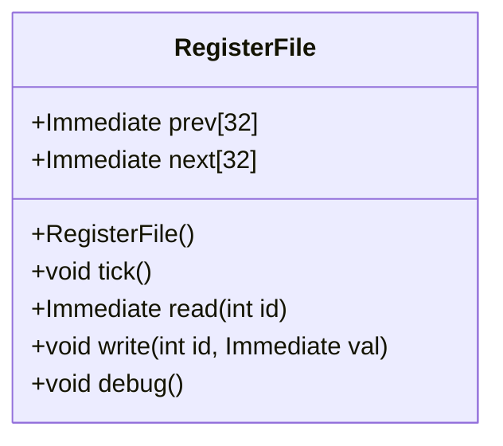

# 対象
- target: RegisterFile
- granularity: target_span
- target_kind: class
- target_symbol: RegisterFile

# 責務
RegisterFileクラスは、32個のレジスタを管理し、各レジスタへの読み書き操作を提供します。また、デバッグ情報を出力する機能も備えています。

# 公開インターフェース
- `Immediate read(int id)`
- `void write(int id, Immediate val)`
- `void tick()`
- `void debug()`

# 入力
- `read` メソッド: レジスタID (`int id`)
- `write` メソッド: レジスタID (`int id`) と書き込む値 (`Immediate val`)

# 出力
- `read` メソッド: 指定されたレジスタの値 (`Immediate`)
- `debug` メソッド: デバッグ情報を標準出力に出力

# 状態
- `prev[REG_NUM]`: 前回のクロックサイクルでのレジスタ値を保持する配列
- `next[REG_NUM]`: 次のクロックサイクルでのレジスタ値を保持する配列

# 処理手順
1. コンストラクタで `prev` と `next` 配列を初期化します。
2. `write` メソッドで指定されたレジスタに値を書き込みます。
3. `tick` メソッドで `next` の値を `prev` にコピーします。
4. `read` メソッドで指定されたレジスタの値を返します。ただし、IDが0の場合は常に0を返します。
5. `debug` メソッドでレジスタの内容をデバッグ形式で出力します。

# 例外・失敗条件
- `read` と `write` メソッドにおいて、`id` が範囲外（0から31以外）の場合の動作は未定義です。
- `debug` メソッドでは標準出力への書き込みに失敗する可能性がありますが、その処理は行われていません。

# 依存関係
- `Immediate`: RegisterFileクラスで使用されるデータ型
- `utils.h`: `debug_immediate` 関数を提供

# 重要な不変条件
- レジスタID 0の値は常に0である。
- `tick` メソッドが呼ばれた後、`prev` と `next` の内容は同期します。

## 追加詳細設計情報

### クラス図


### クラス・メソッド・インターフェース詳細
| 完全な名前 | 属性     | 引数名と型       | 戻り値型  | 可視性 | const | ポインタ | static | virtual | noexcept |
|------------|----------|------------------|-----------|--------|-------|--------|--------|---------|----------|
| RegisterFile::RegisterFile() | コンストラクタ | -                | -         | public   |       |        |        |         |          |
| RegisterFile::tick           | メソッド     | -                | void      | public   |       |        |        |         |          |
| RegisterFile::read           | メソッド     | id: int          | Immediate | public   |       |        |        |         |          |
| RegisterFile::write          | メソッド     | id: int, val: Immediate | void      | public   |       |        |        |         |          |
| RegisterFile::debug          | メソッド     | -                | void      | public   |       |        |        |         |          |

### シーケンス図
該当なし

### メソッド仕様書
| メソッド名            | 目的                             | 引数                          | 戻り値  | 動作の説明                                                                 | 副作用                                      |
|-----------------------|----------------------------------|-------------------------------|---------|------------------------------------------------------------------------------|---------------------------------------------|
| RegisterFile::read    | 指定されたレジスタの値を読み取る | id: int                       | Immediate | レジスタIDが0の場合は常に0を返し、それ以外は `prev` 配列から値を返します。   | なし                                        |
| RegisterFile::write   | 指定されたレジスタに値を書き込む | id: int, val: Immediate       | void    | `next` 配列の指定された位置に値を設定します。                                | なし                                        |
| RegisterFile::tick    | レジスタ状態を更新する           | -                             | void    | `prev` 配列を `next` 配列の内容で更新します。                              | なし                                        |
| RegisterFile::debug   | レジスタのデバッグ情報を出力する | -                             | void    | レジスタの内容をフォーマットして標準出力に出力します。                       | 標準出力への書き込み                          |

### 処理フロー図
```mermaid
flowchart TD
    A[RegisterFile::write] --> B[next[id] = val]
    C[RegisterFile::tick] --> D[memcpy(prev, next, sizeof(prev))]
    E[RegisterFile::read] --> F{id == 0?}
    F --はい--> G[return 0]
    F --いいえ--> H[return prev[id]]
```

### 状態遷移・副作用
| 更新前状態 | 遷移条件       | 変更対象 | 更新後状態               | 更新順序 | 副作用                                      |
|------------|----------------|----------|------------------------|----------|---------------------------------------------|
| 任意       | writeメソッド  | next[id] | 指定された値           | -        | なし                                        |
| 任意       | tickメソッド   | prev     | nextの内容             | -        | なし                                        |

### データ変換・制約
| 入力形式    | 出力形式      | 型変換 | 加工規則 | 値域          | 境界値 | 単位 | 精度 | エンコーディング | 検証条件 | 特殊値・欠損値の扱い |
|-------------|---------------|--------|----------|---------------|--------|------|------|------------------|------------|--------------------|
| int         | Immediate     | -      | -        | 0から31       | 0, 31  | -    | -    | 確認不能         | 確認不能   | IDが範囲外の場合は未定義 |
| Immediate   | -             | -      | -        | 確認不能      | 確認不能 | -    | -    | 確認不能         | 確認不能   | 確認不能           |