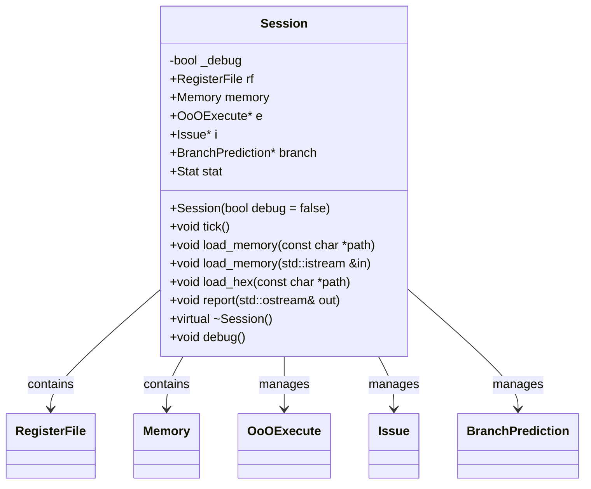

# 対象
- target: Session
- granularity: module_files
- source_files: ["src/Common/Session.h", "src/Common/Session.cpp"]

# 対象範囲
元コードとして示したsource_files全体を1つのモジュールとして扱ってください。
設計文書は、各ファイルの責務、ファイル間の関係、公開インターフェース、実装上の処理を含めて作成してください。
再実装ではsource_filesにある各ファイル全体を生成するため、ファイルごとの構造と責務を区別してください。

## 責務
`Session`クラスはRISC-Vシミュレータのセッションを管理します。メモリの読み込み、サイクルの進行情報の更新、デバッグ情報の出力、レポートの生成などの機能を持っています。

## 公開インターフェース
- `Session(bool debug = false);`
- `void tick();`
- `void load_memory(const char *path);`
- `void load_memory(std::istream &in);`
- `void load_hex(const char *path);`
- `void report(std::ostream& out);`
- `virtual ~Session();`
- `void debug();`

## 入力
- メモリファイルのパス（`const char* path`）
- 入力ストリーム（`std::istream &in`）

## 出力
- シミュレーションレポート（`std::ostream& out`）

## 状態
- `_debug`: デバッグモードフラグ（bool型）
- `rf`: レジスタファイル（RegisterFile型）
- `memory`: メモリ（Memory型）
- `e`: 出力オーダー実行エンジンへのポインタ（OoOExecute* 型）
- `i`: イシューステージへのポインタ（Issue* 型）
- `branch`: 分岐予測エンジンへのポインタ（BranchPrediction* 型）
- `stat`: サイクルカウンタを含む構造体（Stat型）

## 処理手順
1. コンストラクタでデバッグモードフラグと各サブシステムのインスタンスを作成する。
2. `tick()`メソッドでサイクルカウンタを更新し、各サブシステムの状態を更新する。
3. メモリ読み込み関数(`load_memory`, `load_hex`)で指定されたファイルからデータを読み込む。
4. `report()`メソッドでシミュレーション結果を出力する。
5. デバッグ情報が必要な場合は`debug()`メソッドでデバッグ情報を出力する。

## 例外・失敗条件
- メモリファイルの読み込みに失敗した場合、内部処理が中断される可能性がある（確認不能）。

## 依存関係
- `RegisterFile`
- `Memory`
- `OoOExecute`
- `Issue`
- `BranchPrediction`
- `Parser`

## 重要な不変条件
- `_debug`フラグは初期化時に設定され、その後変更されない。
- 各サブシステムのインスタンス(`e`, `i`, `branch`)はコンストラクタで生成され、デストラクタで破棄される。

## 追加詳細設計情報

### クラス図


### クラス・メソッド・インターフェース詳細

| 完全な名前 | 属性 | 引数名と型 | 戻り値型 | 可視性 | const | リファレンス | ポインタ | static | virtual | noexcept |
|------------|------|------------|----------|--------|-------|------------|----------|--------|---------|----------|
| Session::Session | コンストラクタ | debug: bool = false | void | public | なし | なし | なし | いいえ | いいえ | いいえ |
| Session::~Session | デストラクタ | なし | void | public | なし | なし | なし | いいえ | はい | いいえ |
| Session::tick | メソッド | なし | void | public | なし | なし | なし | いいえ | いいえ | いいえ |
| Session::load_memory(const char*) | メソッド | path: const char* | void | public | なし | なし | なし | いいえ | いいえ | いいえ |
| Session::load_memory(std::istream&) | メソッド | in: std::istream& | void | public | なし | あり | なし | いいえ | いいえ | いいえ |
| Session::load_hex(const char*) | メソッド | path: const char* | void | public | なし | なし | なし | いいえ | いいえ | いいえ |
| Session::report(std::ostream&) | メソッド | out: std::ostream& | void | public | なし | あり | なし | いいえ | いいえ | いいえ |
| Session::debug | メソッド | なし | void | public | なし | なし | なし | いいえ | いいえ | いいえ |

### シーケンス図
該当なし

### メソッド仕様書

| 完全な名前 | 目的 | 引数 | 戻り値 | 動作の説明 | 副作用 | 使用例 | エラー処理 |
|------------|------|------|--------|------------|--------|--------|------------|
| Session::Session(bool) | デバッグモードを設定し、サブシステムを初期化する | debug: bool = false | void | デバッグモードフラグを設定し、Issue, OoOExecute, BranchPredictionのインスタンスを作成する | なし | `Session session(true);` | 無効 |
| Session::~Session() | サブシステムのリソースを解放する | なし | void | Issue, OoOExecute, BranchPredictionのインスタンスを破棄する | なし | `session.~Session();` | 無効 |
| Session::tick() | シミュレーションサイクルを1つ進める | なし | void | サイクルカウンタを更新し、各サブシステムの状態を更新する | なし | `session.tick();` | 無効 |
| Session::load_memory(const char*) | ファイルからメモリを読み込む | path: const char* | void | 指定されたファイルパスからデータを読み込み、メモリに格納する | なし | `session.load_memory("memory.bin");` | 無効 |
| Session::load_memory(std::istream&) | ストリームからメモリを読み込む | in: std::istream& | void | 指定されたストリームからデータを読み込み、メモリに格納する | なし | `std::ifstream file("memory.bin"); session.load_memory(file);` | 無効 |
| Session::load_hex(const char*) | ファイルから16進数形式のメモリを読み込む | path: const char* | void | 指定されたファイルパスから16進数データを読み込み、メモリに格納する | なし | `session.load_hex("memory.hex");` | 無効 |
| Session::report(std::ostream&) | シミュレーションレポートを出力する | out: std::ostream& | void | 各サブシステムの状態とサイクルカウンタを指定されたストリームに出力する | なし | `std::ofstream report("report.txt"); session.report(report);` | 無効 |
| Session::debug() | デバッグ情報を出力する | なし | void | 各サブシステムのデバッグ情報を標準出力に出力する | なし | `session.debug();` | 無効 |

### 処理フロー図
```mermaid
flowchart TD
    A[Session::tick()] --> B[stat.cycle++]
    B --> C[i->update()]
    C --> D[e->update()]
    D --> E{is _debug?}
    E -- はい --> F[debug()]
    E -- いいえ --> G[i->tick()]
    F --> G
    G --> H[e->tick()]
    H --> I[rf.tick()]
```

### 状態遷移・副作用

| 更新前状態 | 遷移条件 | 変更対象 | 更新後状態 | 更新順序 | 副作用 |
|------------|----------|----------|------------|----------|--------|
| 任意のサイクル数 | tick()が呼ばれる | stat.cycle | サイクル数+1 | tick()内で最初に実行 | なし |
| 任意の状態 | load_memory()が呼ばれる | memory | ファイルから読み込まれたデータ | load_memory()内で実行 | なし |
| 任意の状態 | load_hex()が呼ばれる | memory | 16進数形式のファイルから読み込まれたデータ | load_hex()内で実行 | なし |

### データ変換・制約

| 入力形式 | 出力形式 | 変換規則 | 値域 | 境界値 | 単位 | 精度 | エンコーディング | 検証条件 | 特殊値・欠損値の扱い |
|----------|----------|----------|------|--------|------|------|------------------|------------|-----------------------|
| ファイルパス文字列 | メモリデータ | ファイルから読み込み | 任意 | 空文字列 | バイト | バイト単位 | バイナリ | 存在するファイルパスを指定 | 読み込めない場合、エラー |
| ストリームオブジェクト | メモリデータ | ストリームから読み込み | 任意 | 空ストリーム | バイト | バイト単位 | バイナリ | 存在するストリームを指定 | 読み込めない場合、エラー |
| 16進数形式のファイルパス文字列 | メモリデータ | 16進数から読み込み | 任意 | 空文字列 | バイト | バイト単位 | バイナリ | 存在するファイルパスを指定 | 読み込めない場合、エラー |