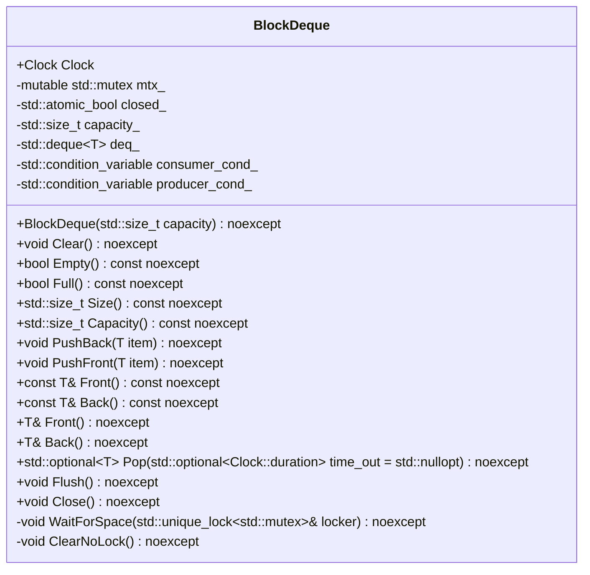
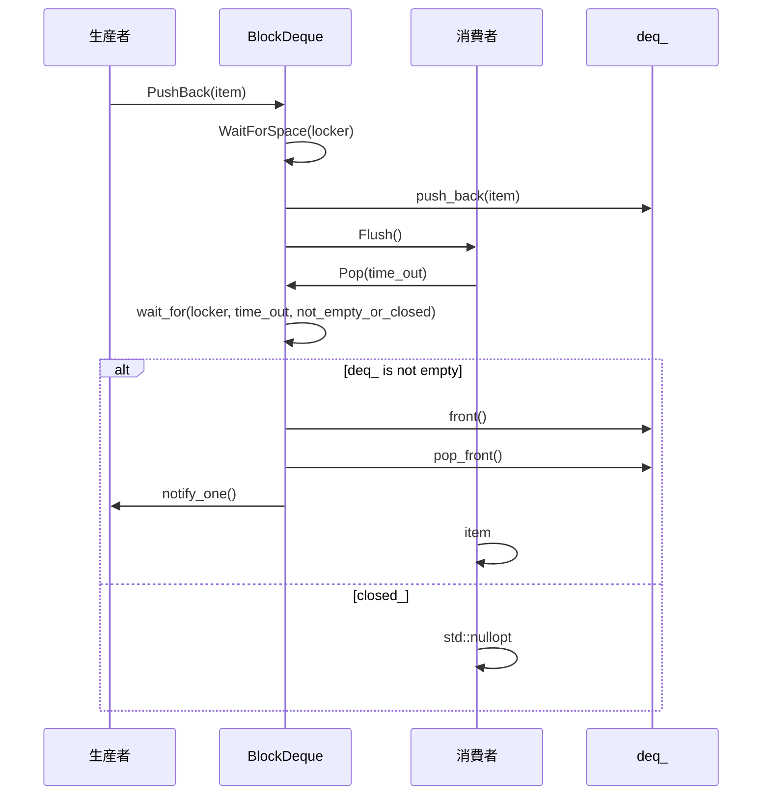

# デザイン文書: block-dequeモジュール

## 責務
`BlockDeque`クラスは、スレッドセーフなブロックデキューを提供します。最大容量を超えた場合の挿入操作は待機し、消費者が要素を取り出すまでブロックされます。

## 公開インターフェース
- `explicit BlockDeque(std::size_t capacity = 1000) noexcept;`
- `void Clear() noexcept;`
- `bool Empty() const noexcept;`
- `bool Full() const noexcept;`
- `std::size_t Size() const noexcept;`
- `std::size_t Capacity() const noexcept;`
- `void PushBack(T item) noexcept;`
- `void PushFront(T item) noexcept;`
- `const T& Front() const noexcept;`
- `const T& Back() const noexcept;`
- `T& Front() noexcept;`
- `T& Back() noexcept;`
- `std::optional<T> Pop(std::optional<Clock::duration> time_out = std::nullopt) noexcept;`
- `void Flush() noexcept;`
- `void Close() noexcept;`

## 入力
- コンストラクタ: 最大容量 (`capacity`)
- `PushBack`, `PushFront`: 追加する要素 (`item`)
- `Pop`: タイムアウト時間 (`time_out`)

## 出力
- `Empty`, `Full`: ブール値
- `Size`, `Capacity`: 要素数や容量を表すサイズ型
- `Front`, `Back`: コンテナ内の要素への参照
- `Pop`: オプションでラップされた要素

## 状態
- `mtx_`: ミューテックスオブジェクト (`std::mutex`)
- `closed_`: キューが閉じているかどうかを表す原子的なブール値 (`std::atomic_bool`)
- `capacity_`: 最大容量 (`std::size_t`)
- `deq_`: 実際のデータ格納用デキュー (`std::deque<T>`)
- `consumer_cond_`, `producer_cond_`: コンシューマとプロデューサのための条件変数 (`std::condition_variable`)

## 処理手順
1. **コンストラクタ**: 最大容量を設定し、アサートで検証。
2. **PushBack, PushFront**: ミューテックスロックを取得し、スペースが空いていることを確認。要素を追加し、フラッシュする。
3. **Pop**: ミューテックスロックを取得し、タイムアウト付きまたは無限待機で要素を取り出す。キューが閉じている場合はオプションのデフォルト値を返す。
4. **Clear, ClearNoLock**: データをクリアする。
5. **Close**: キューを閉じ、すべての消費者とプロデューサに通知する。

## 例外・失敗条件
- `PushBack`, `PushFront`: キューが閉じている場合、挿入操作は待機し続ける。
- `Pop`: タイムアウトまたはキューが閉じている場合、`std::nullopt`を返す。

## 依存関係
- `<cassert>`
- `<condition_variable>`
- `<deque>`
- `<mutex>`
- `<optional>`
- `<utility>`

## 重要な不変条件
- `capacity_ > 0`
- `deq_.size() <= capacity_`
- `closed_`がtrueの場合、新たな要素の挿入はブロックされる。

# 追加詳細設計情報

## クラス図


## クラス・メソッド・インターフェース詳細
| 完全な名前 | 属性 | 引数名と型 | 戻り値型 | 可視性 | const | 参照/ポインタ | static | virtual | noexcept |
|------------|------|------------|----------|--------|-------|---------------|--------|---------|----------|
| `BlockDeque<T>::BlockDeque` | コンストラクタ | `std::size_t capacity` | なし | public | いいえ | いいえ | いいえ | いいえ | はい |
| `BlockDeque<T>::Clear` | メソッド | なし | なし | public | いいえ | いいえ | いいえ | いいえ | はい |
| `BlockDeque<T>::Empty` | メソッド | なし | `bool` | public | はい | いいえ | いいえ | いいえ | はい |
| `BlockDeque<T>::Full` | メソッド | なし | `bool` | public | はい | いいえ | いいえ | いいえ | はい |
| `BlockDeque<T>::Size` | メソッド | なし | `std::size_t` | public | はい | いいえ | いいえ | いいえ | はい |
| `BlockDeque<T>::Capacity` | メソッド | なし | `std::size_t` | public | はい | いいえ | いいえ | いいえ | はい |
| `BlockDeque<T>::PushBack` | メソッド | `T item` | なし | public | いいえ | いいえ | いいえ | いいえ | はい |
| `BlockDeque<T>::PushFront` | メソッド | `T item` | なし | public | いいえ | いいえ | いいえ | いいえ | はい |
| `BlockDeque<T>::Front` | メソッド | なし | `const T&` | public | はい | いいえ | いいえ | いいえ | はい |
| `BlockDeque<T>::Back` | メソッド | なし | `const T&` | public | はい | いいえ | いいえ | いいえ | はい |
| `BlockDeque<T>::Front` | メソッド | なし | `T&` | public | いいえ | いいえ | いいえ | いいえ | はい |
| `BlockDeque<T>::Back` | メソッド | なし | `T&` | public | いいえ | いいえ | いいえ | いいえ | はい |
| `BlockDeque<T>::Pop` | メソッド | `std::optional<Clock::duration> time_out` | `std::optional<T>` | public | いいえ | いいえ | いいえ | いいえ | はい |
| `BlockDeque<T>::Flush` | メソッド | なし | なし | public | いいえ | いいえ | いいえ | いいえ | はい |
| `BlockDeque<T>::Close` | メソッド | なし | なし | public | いいえ | いいえ | いいえ | いいえ | はい |
| `BlockDeque<T>::WaitForSpace` | メソッド | `std::unique_lock<std::mutex>& locker` | なし | private | いいえ | いいえ | いいえ | いいえ | はい |
| `BlockDeque<T>::ClearNoLock` | メソッド | なし | なし | private | いいえ | いいえ | いいえ | いいえ | はい |

## シーケンス図


## メソッド仕様書

### `PushBack`
- **目的**: 要素をキューの末尾に追加し、消費者に通知する。
- **引数**: `T item` - 追加する要素。
- **戻り値**: なし
- **動作**: ミューテックスロックを取得し、スペースが空いていることを確認。要素を追加し、フラッシュする。
- **副作用**: キューの状態が変更され、消費者に通知される。

### `Pop`
- **目的**: キューから最初の要素を取り出す。
- **引数**: `std::optional<Clock::duration> time_out` - 最大待機時間。デフォルトは無限待機。
- **戻り値**: `std::optional<T>` - 取り出した要素またはタイムアウト/キューが閉じている場合のデフォルト値。
- **動作**: ミューテックスロックを取得し、タイムアウト付きまたは無限待機で要素を取り出す。キューが閉じている場合はオプションのデフォルト値を返す。
- **副作用**: キューの状態が変更され、プロデューサに通知される。

## 処理フロー図
```mermaid
graph TD
    A[PushBack] --> B{WaitForSpace?}
    B -- いいえ --> C[push_back(item)]
    B -- はい --> D[wait]
    D --> C
    C --> E[Flush]

    F[Pop] --> G{wait_for(time_out, not_empty_or_closed)?}
    G -- タイムアウト --> H[return std::nullopt]
    G -- キューが閉じている --> I[return std::nullopt]
    G -- いいえ --> J[front()]
    J --> K[pop_front()]
    K --> L[notify_one()]
    L --> M[return item]
```

## 状態遷移・副作用
| 更新前状態 | 遷移条件 | 変更対象 | 更新後状態 | 更新順序 | 副作用 |
|------------|----------|----------|------------|----------|--------|
| 任意       | PushBack | deq_     | 要素追加   | 1        | Flush() |
| 任意       | PushFront | deq_    | 要素追加   | 1        | Flush() |
| 任意       | Pop      | deq_     | 要素削除   | 1        | notify_one() |
| 任意       | Close    | closed_  | true       | 1        | notify_all() |

## データ変換・制約
- `PushBack`, `PushFront`: 入力要素が`T`型で、内部のデキューに追加される。
- `Pop`: キュー内の最初の要素が取り出され、`std::optional<T>`として返される。