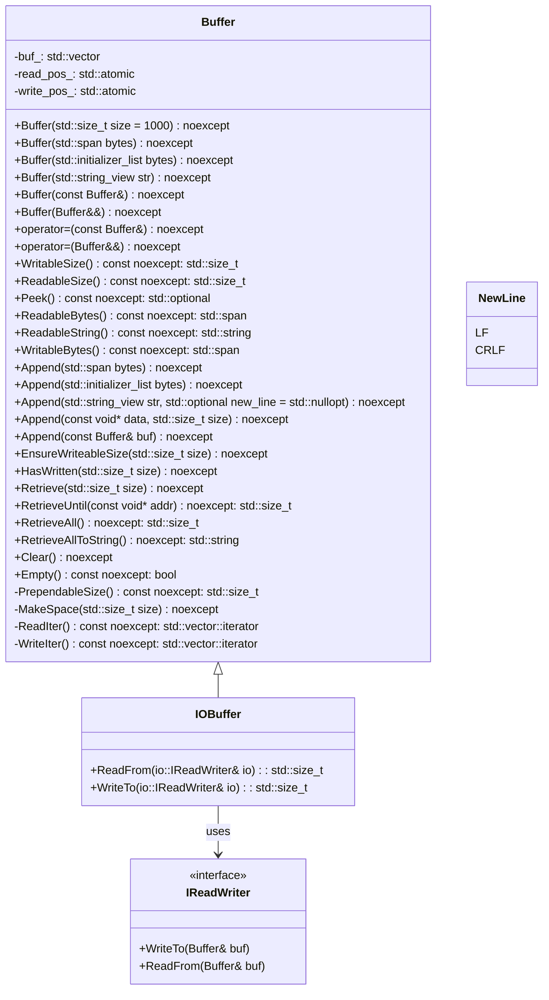
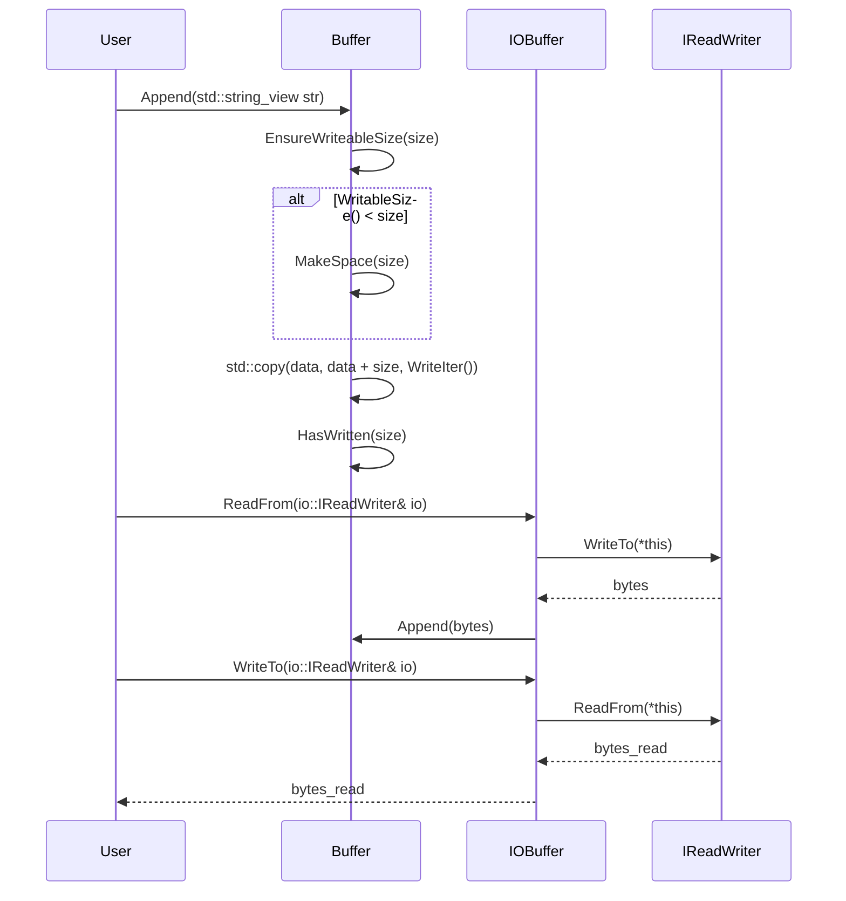

# デザイン文書

## 責務
- `Buffer`クラス: 自動拡張可能なバッファを提供し、バイトや文字列の読み書きを行う。
- `IOBuffer`クラス: `Buffer`クラスを継承して、I/Oオブジェクトとのデータ交換機能を追加する。

## 公開インターフェース
### Buffer クラス
| メソッド名 | 引数 | 戻り値型 | 説明 |
| --- | --- | --- | --- |
| `Buffer` (コンストラクタ) | `std::size_t size = 1000` | - | 初期サイズでバッファを作成する。 |
| `Buffer` (コンストラクタ) | `std::span<const std::byte> bytes` | - | バイト列からバッファを作成する。 |
| `Buffer` (コンストラクタ) | `std::initializer_list<std::byte> bytes` | - | 初期化リストからバッファを作成する。 |
| `Buffer` (コンストラクタ) | `std::string_view str` | - | 文字列からバッファを作成する。 |
| `operator=` | `const Buffer& o` | `Buffer&` | 代入演算子（コピー）。 |
| `operator=` | `Buffer&& o` | `Buffer&` | 代入演算子（ムーブ）。 |
| `WritableSize` | - | `std::size_t` | 書き込み可能なサイズを返す。 |
| `ReadableSize` | - | `std::size_t` | 読み取り可能なサイズを返す。 |
| `Peek` | - | `std::optional<std::byte>` | 最初のバイトを読み取るが、オフセットは進めない。 |
| `ReadableBytes` | - | `std::span<const std::byte>` | 読み取り可能なバイト列を返す。 |
| `ReadableString` | - | `std::string` | 読み取り可能な文字列を返す。 |
| `WritableBytes` | - | `std::span<std::byte>` | 書き込み可能なスペースを返す。 |
| `Append` | `std::span<const std::byte> bytes` | - | バッファにバイト列を追加する。 |
| `Append` | `std::initializer_list<std::byte> bytes` | - | バッファに初期化リストからバイト列を追加する。 |
| `Append` | `std::string_view str, std::optional<NewLine> new_line = std::nullopt` | - | 文字列とオプションの改行文字を追加する。 |
| `Append` | `const void* data, std::size_t size` | - | バッファにデータを追加する。 |
| `Append` | `const Buffer& buf` | - | 他のバッファからデータを追加する。 |
| `EnsureWriteableSize` | `std::size_t size` | - | 書き込み可能なスペースが十分になるまで拡張する。 |
| `HasWritten` | `std::size_t size` | - | 書き込みオフセットを進める。 |
| `Retrieve` | `std::size_t size` | - | 読み取りオフセットを進める。 |
| `RetrieveUntil` | `const void* addr` | `std::size_t` | 指定したアドレスまで読み取りオフセットを進める。 |
| `RetrieveAll` | - | `std::size_t` | 読み取りオフセットを最後まで進めて、読み取ったサイズを返す。 |
| `RetrieveAllToString` | - | `std::string` | 全てのデータを文字列として取得し、バッファをクリアする。 |
| `Clear` | - | - | バッファをクリアする。 |
| `Empty` | - | `bool` | バッファが空かどうかを返す。 |

### IOBuffer クラス
| メソッド名 | 引数 | 戻り値型 | 説明 |
| --- | --- | --- | --- |
| `ReadFrom` | `io::IReadWriter& io` | `std::size_t` | I/Oオブジェクトからデータを読み込む。 |
| `WriteTo` | `io::IReadWriter& io` | `std::size_t` | データをI/Oオブジェクトに書き込む。 |

### グローバル演算子
| 演算子名 | 引数 | 戻り値型 | 説明 |
| --- | --- | --- | --- |
| `operator<<` | `Buffer& buf, std::string_view str` | `Buffer&` | 文字列をバッファに追加する。 |
| `operator<<` | `Buffer& to, const Buffer& from` | `Buffer&` | 他のバッファからデータを追加する。 |
| `operator<<` | `Buffer& buf, std::span<const std::byte> bytes` | `Buffer&` | バイト列をバッファに追加する。 |
| `operator<<` | `Buffer& buf, std::initializer_list<std::byte> bytes` | `Buffer&` | 初期化リストからバイト列をバッファに追加する。 |

## 入力
- バイト列 (`std::span<const std::byte>` または `std::initializer_list<std::byte>`)
- 文字列 (`std::string_view`)
- I/Oオブジェクト (`io::IReadWriter&`)

## 出力
- バッファの読み取り可能なバイト列 (`std::span<const std::byte>`)
- バッファの読み取り可能な文字列 (`std::string`)
- 書き込み可能なスペース (`std::span<std::byte>`)
- 読み取りオフセットや書き込みオフセットの進んだサイズ (`std::size_t`)

## 状態
- `buf_`: バッファを保持する `std::vector<std::byte>`
- `read_pos_`: 読み取り位置を示す `std::atomic<std::size_t>`
- `write_pos_`: 書き込み位置を示す `std::atomic<std::size_t>`

## 処理手順
1. バッファの初期化: コンストラクタでバッファサイズを設定し、読み取り/書き込みオフセットを初期化する。
2. データ追加: `Append`メソッドを使用してデータをバッファに追加する。必要に応じてバッファの拡張を行う。
3. データ読み取り: `ReadableBytes`, `ReadableString`メソッドを使用してバッファからデータを読み取る。
4. オフセット操作: `HasWritten`, `Retrieve`メソッドを使用して読み取り/書き込みオフセットを進める。
5. バッファクリア: `Clear`メソッドを使用してバッファを空にする。

## 例外・失敗条件
- `Append`: 追加するデータがnullptrの場合、assertで検出される。
- `HasWritten`, `Retrieve`: 指定されたサイズが現在の読み取り/書き込み可能な範囲を超える場合、assertで検出される。

## 依存関係
- `std::atomic`
- `std::optional`
- `std::span`
- `std::string`
- `std::string_view`
- `std::vector`
- `io::IReadWriter`

## 重要な不変条件
- 読み取りオフセットは常に書き込みオフセット以下である。
- バッファのサイズは常に読み取り/書き込み可能な範囲をカバーしている。

# 追加詳細設計情報

## クラス図


## クラス・メソッド・インターフェース詳細

### Buffer クラス
| メソッド名 | 引数 | 戻り値型 | 可視性 | const | noexcept |
| --- | --- | --- | --- | --- | --- |
| `Buffer` (コンストラクタ) | `std::size_t size = 1000` | - | public | - | ✅ |
| `Buffer` (コンストラクタ) | `std::span<const std::byte> bytes` | - | public | - | ✅ |
| `Buffer` (コンストラクタ) | `std::initializer_list<std::byte> bytes` | - | public | - | ✅ |
| `Buffer` (コンストラクタ) | `std::string_view str` | - | public | - | ✅ |
| `operator=` | `const Buffer& o` | `Buffer&` | public | - | ✅ |
| `operator=` | `Buffer&& o` | `Buffer&` | public | - | ✅ |
| `WritableSize` | - | `std::size_t` | public | ✅ | ✅ |
| `ReadableSize` | - | `std::size_t` | public | ✅ | ✅ |
| `Peek` | - | `std::optional<std::byte>` | public | ✅ | ✅ |
| `ReadableBytes` | - | `std::span<const std::byte>` | public | ✅ | ✅ |
| `ReadableString` | - | `std::string` | public | ✅ | ✅ |
| `WritableBytes` | - | `std::span<std::byte>` | public | ✅ | ✅ |
| `Append` | `std::span<const std::byte> bytes` | - | public | - | ✅ |
| `Append` | `std::initializer_list<std::byte> bytes` | - | public | - | ✅ |
| `Append` | `std::string_view str, std::optional<NewLine> new_line = std::nullopt` | - | public | - | ✅ |
| `Append` | `const void* data, std::size_t size` | - | public | - | ✅ |
| `Append` | `const Buffer& buf` | - | public | - | ✅ |
| `EnsureWriteableSize` | `std::size_t size` | - | public | - | ✅ |
| `HasWritten` | `std::size_t size` | - | public | - | ✅ |
| `Retrieve` | `std::size_t size` | - | public | - | ✅ |
| `RetrieveUntil` | `const void* addr` | `std::size_t` | public | - | ✅ |
| `RetrieveAll` | - | `std::size_t` | public | - | ✅ |
| `RetrieveAllToString` | - | `std::string` | public | - | ✅ |
| `Clear` | - | - | public | - | ✅ |
| `Empty` | - | `bool` | public | ✅ | ✅ |
| `PrependableSize` | - | `std::size_t` | protected | ✅ | ✅ |
| `MakeSpace` | `std::size_t size` | - | protected | - | ✅ |
| `ReadIter` | - | `std::vector<std::byte>::iterator` | protected | ✅ | ✅ |
| `WriteIter` | - | `std::vector<std::byte>::iterator` | protected | ✅ | ✅ |

### IOBuffer クラス
| メソッド名 | 引数 | 戻り値型 | 可視性 | const | noexcept |
| --- | --- | --- | --- | --- | --- |
| `ReadFrom` | `io::IReadWriter& io` | `std::size_t` | public | - | ✅ |
| `WriteTo` | `io::IReadWriter& io` | `std::size_t` | public | - | ✅ |

### グローバル演算子
| 演算子名 | 引数 | 戻り値型 | 可視性 | const | noexcept |
| --- | --- | --- | --- | --- | --- |
| `operator<<` | `Buffer& buf, std::string_view str` | `Buffer&` | global | - | ✅ |
| `operator<<` | `Buffer& to, const Buffer& from` | `Buffer&` | global | - | ✅ |
| `operator<<` | `Buffer& buf, std::span<const std::byte> bytes` | `Buffer&` | global | - | ✅ |
| `operator<<` | `Buffer& buf, std::initializer_list<std::byte> bytes` | `Buffer&` | global | - | ✅ |

## シーケンス図


## メソッド仕様書

### Append(std::string_view str, std::optional<NewLine> new_line = std::nullopt) noexcept
- **目的**: 文字列とオプションの改行文字をバッファに追加する。
- **引数**:
  - `str`: 追加する文字列 (`std::string_view`)
  - `new_line`: 追加する改行文字 (`std::optional<NewLine>`)
- **戻り値型**: void
- **動作**:
  1. 文字列をコピーして新しい文字列を作成。
  2. オプションの改行文字が指定されている場合、それに応じて `\n` または `\r\n` を追加する。
  3. 新しい文字列をバッファに追加する。
- **副作用**: バッファのサイズが変更される可能性がある。
- **エラー処理**: 無し
- **確認不能**

### ReadFrom(io::IReadWriter& io)
- **目的**: I/Oオブジェクトからデータを読み込んでバッファに追加する。
- **引数**:
  - `io`: データを提供するI/Oオブジェクト (`io::IReadWriter&`)
- **戻り値型**: 読み込んだバイト数 (`std::size_t`)
- **動作**:
  1. I/Oオブジェクトからデータを読み込む。
  2. バッファに読み込んだデータを追加する。
- **副作用**: バッファのサイズが変更される可能性がある。
- **エラー処理**: 無し
- **確認不能**

## 処理フロー図
```mermaid
graph TD
    A[Append] --> B{WritableSize() < size?}
    B -- Yes --> C[MakeSpace(size)]
    B -- No --> D[std::copy(data, data + size, WriteIter())]
    C --> E[HasWritten(size)]
    D --> F[HasWritten(size)]
```

## 状態遷移・副作用
| 更新前状態 | 遷移条件 | 変更対象 | 更新後状態 | 更新順序 | 副作用 |
| --- | --- | --- | --- | --- | --- |
| バッファに十分なスペースがない | `WritableSize() < size` | バッファサイズ | バッファが拡張される | 1. MakeSpace(size) 2. std::copy(data, data + size, WriteIter()) 3. HasWritten(size) | バッファのメモリ確保 |
| バッファに十分なスペースがある | `WritableSize() >= size` | 書き込みオフセット | 書き込みオフセットが進む | std::copy(data, data + size, WriteIter()) 2. HasWritten(size) | 無し |

## データ変換・制約
| 変換元 | 変換先 | 値域 | 境界値 | 単位 | 精度 | encoding |
| --- | --- | --- | --- | --- | --- | --- |
| `std::string_view` | `std::string` | 文字列 | - | 文字 | - | UTF-8 |
| `std::span<const std::byte>` | バッファ内部 (`std::vector<std::byte>`) | バイト列 | - | バイト | - | 無し |
| `std::initializer_list<std::byte>` | バッファ内部 (`std::vector<std::byte>`) | バイト列 | - | バイト | - | 無し |

- **制約**: 追加するデータがnullptrの場合、assertで検出される。
- **制約**: `HasWritten`, `Retrieve`メソッドを使用してオフセットを進める際に指定されたサイズが現在の読み取り/書き込み可能な範囲を超える場合、assertで検出される。