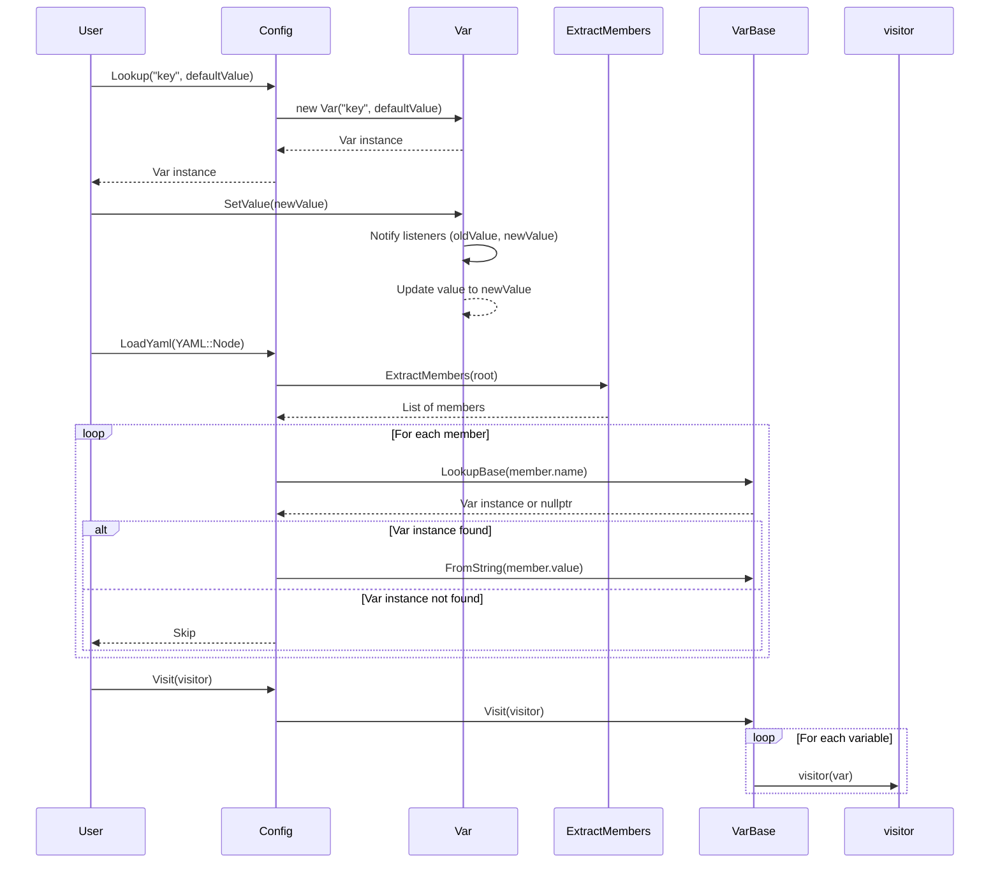

# 設計文書

## 責務
- `config.h`と`config.cpp`は、YAML形式の設定ファイルを読み取り、内部データ構造に変換し、その値を管理するためのモジュールです。
- 各種型に対する変数変換器（`VarConverter`）を提供します。
- 設定変数（`Var`）と設定全体（`Config`）のクラスを定義し、それらの操作を提供します。

## 公開インターフェース
### クラス・メソッド詳細

| クラス/構造体 | メンバ名 | 型 | 可視性 | const | 引数 | 戻り値型 | 例外 |
|---------------|----------|----|--------|-------|------|---------|------|
| VarConverter<From, To> | operator() | `To` | public | yes | `const From& val` | `To` | - |
| VarConverter<From, std::string> | operator() | `std::string` | public | yes | `const From& val` | `std::string` | - |
| VarConverter<std::string, std::string> | operator() | `std::string` | public | yes | `const std::string_view val` | `std::string` | - |
| VarConverter<std::string, To> | operator() | `To` | public | no | `const std::string_view str` | `To` | `std::invalid_argument` |
| VarConverter<std::string, std::list<T>> | operator() | `std::list<T>` | public | no | `const std::string_view str` | `std::list<T>` | `std::invalid_argument` |
| VarConverter<std::list<T>, std::string> | operator() | `std::string` | public | yes | `const std::list<T>& vals` | `std::string` | - |
| VarConverter<std::string, std::vector<T>> | operator() | `std::vector<T>` | public | no | `const std::string_view str` | `std::vector<T>` | - |
| VarConverter<std::vector<T>, std::string> | operator() | `std::string` | public | yes | `const std::vector<T>& vals` | `std::string` | - |
| VarConverter<std::string, std::set<T>> | operator() | `std::set<T>` | public | no | `const std::string_view str` | `std::set<T>` | - |
| VarConverter<std::set<T>, std::string> | operator() | `std::string` | public | yes | `const std::set<T>& vals` | `std::string` | - |
| VarConverter<std::string, std::unordered_set<T>> | operator() | `std::unordered_set<T>` | public | no | `const std::string_view str` | `std::unordered_set<T>` | - |
| VarConverter<std::unordered_set<T>, std::string> | operator() | `std::string` | public | yes | `const std::unordered_set<T>& vals` | `std::string` | - |
| VarConverter<std::string, std::map<std::string, T>> | operator() | `std::map<std::string, T>` | public | no | `const std::string_view str` | `std::map<std::string, T>` | `std::invalid_argument` |
| VarConverter<std::map<std::string, T>, std::string> | operator() | `std::string` | public | yes | `const std::map<std::string, T>& vals` | `std::string` | - |
| VarConverter<std::string, std::unordered_map<std::string, T>> | operator() | `std::unordered_map<std::string, T>` | public | no | `const std::string_view str` | `std::unordered_map<std::string, T>` | - |
| VarConverter<std::unordered_map<std::string, T>, std::string> | operator() | `std::string` | public | yes | `const std::unordered_map<std::string, T>& vals` | `std::string` | - |
| VarBase | VarBase | コンストラクタ | public | no | `std::string_view name`, `std::string_view description = ""` | - | - |
| VarBase | ~VarBase | デストラクタ | public | yes | - | - | - |
| VarBase | Name | `std::string_view` | public | yes | - | `std::string_view` | - |
| VarBase | Description | `std::string_view` | public | yes | - | `std::string_view` | - |
| VarBase | ToString | `std::string` | public | yes | - | `std::string` | - |
| VarBase | FromString | void | public | no | `std::string_view str` | - | - |
| Var<T, FromStr, ToStr> | Var | コンストラクタ | public | no | `const std::string_view name`, `const T& default_val`, `const std::string_view description = ""` | - | - |
| Var<T, FromStr, ToStr> | ToString | `std::string` | public | yes | - | `std::string` | - |
| Var<T, FromStr, ToStr> | FromString | void | public | no | `std::string_view str` | - | - |
| Var<T, FromStr, ToStr> | GetValue | `T` | public | yes | - | `T` | - |
| Var<T, FromStr, ToStr> | SetValue | void | public | no | `const T& val` | - | - |
| Var<T, FromStr, ToStr> | TypeName | `std::string_view` | public | yes | - | `std::string_view` | - |
| Var<T, FromStr, ToStr> | RemoveListener | void | public | no | `const std::uint64_t key` | - | - |
| Var<T, FromStr, ToStr> | AddListener | `std::uint64_t` | public | no | `OnChange listener` | `std::uint64_t` | - |
| Var<T, FromStr, ToStr> | ClearListeners | void | public | no | - | - | - |
| Config | Config | コンストラクタ | public | no | `std::string_view name` | - | - |
| Config | Name | `std::string_view` | public | yes | - | `std::string_view` | - |
| Config | Lookup<T> (オーバーロード1) | `typename Var<T>::Ptr` | public | no | `const std::string_view name`, `const T& default_val`, `const std::string_view description = ""` | `typename Var<T>::Ptr` | - |
| Config | Lookup<T> (オーバーロード2) | `typename Var<T>::Ptr` | public | no | `const std::string_view name` | `typename Var<T>::Ptr` | `std::invalid_argument` |
| Config | LookupBase | `VarBase::Ptr` | public | yes | `std::string_view name` | `VarBase::Ptr` | - |
| Config | LoadYaml | void | public | no | `const YAML::Node& root` | - | - |
| Config | Visit | void | public | no | `std::function<void(VarBase::Ptr)> visitor` | - | - |
| (グローバル) | RootConfig | `Config::Ptr` | public | yes | - | `Config::Ptr` | - |

## 入力
- YAML形式の設定データ（`YAML::Node`）
- 設定変数名とそのデフォルト値

## 出力
- 変換された設定値（`std::string`, `T`, `std::list<T>`, `std::vector<T>`, `std::set<T>`, `std::unordered_set<T>`, `std::map<std::string, T>`, `std::unordered_map<std::string, T>`）
- 設定変数のポインタ（`VarBase::Ptr`, `typename Var<T>::Ptr`）

## 状態
- `VarBase`: 名前、説明文
- `Var<T, FromStr, ToStr>`: 値、リスナー集合
- `Config`: 設定名、変数マップ

## 処理手順
1. **設定変数の作成と管理**:
   - `Var`オブジェクトを作成し、デフォルト値を設定する。
   - 変数名と説明文を保持する。

2. **設定変数の値変換**:
   - 文字列から型に変換する（`FromString`）。
   - 型から文字列に変換する（`ToString`）。

3. **設定変数の検索と操作**:
   - 変数名で設定変数を検索し、存在しない場合は新規作成する（`Lookup`）。
   - 既存の設定変数から値を読み取りまたは更新する。

4. **YAMLデータのロード**:
   - YAMLノードから設定値を抽出し、対応する設定変数に値をセットする（`LoadYaml`）。
   - 再帰的にメンバーを抽出して処理する（`ExtractMembers`）。

5. **設定の訪問**:
   - すべての設定変数に対して指定された関数を適用する（`Visit`）。

## 例外・失敗条件
- `VarConverter<std::string, To>`: 文字列が型に変換できない場合、`std::invalid_argument`をスロー。
- `VarConverter<std::string, std::list<T>>`: 文字列がリスト形式でない場合、`std::invalid_argument`をスロー。
- `VarConverter<std::string, std::map<std::string, T>>`: 文字列がマップ形式でない場合、`std::invalid_argument`をスロー。
- `Config::Lookup<T>`: 見つかった変数の型が要求された型と一致しない場合、`std::invalid_argument`をスロー。

## 依存関係
- YAMLパーサー（`YAML::Node`, `LoadYamlString`）
- 文字列操作（`std::string`, `std::string_view`, `std::ostringstream`, `std::istringstream`）
- コンテナ（`std::list`, `std::vector`, `std::set`, `std::unordered_set`, `std::map`, `std::unordered_map`）
- スマートポインタ（`std::shared_ptr`, `std::unique_ptr`）
- ミューテックス（`std::shared_mutex`, `std::shared_lock`, `std::unique_lock`）

## 重要な不変条件
- `VarBase`: 名前と説明文は初期化時に設定され、その後変更されない。
- `Var<T, FromStr, ToStr>`: 値の型はテンプレートパラメータで固定され、変更されない。
- `Config`: 設定名は初期化時に設定され、その後変更されない。

## 追加詳細設計情報

### クラス図
```mermaid
classDiagram
    class VarConverter~From, To~ {
        +To operator()(const From& val) const noexcept
    }
    
    class VarConverter~From, std::string~ {
        +std::string operator()(const From& val) const noexcept
    }

    class VarConverter~std::string, std::string~ {
        +std::string operator()(const std::string_view val) const noexcept
    }

    class VarConverter~std::string, To~ {
        +To operator()(const std::string_view str) const
    }
    
    class VarConverter~std::string, std::list~T~~ {
        +std::list~T~ operator()(const std::string_view str) const
    }

    class VarConverter~std::list~T~, std::string~ {
        +std::string operator()(const std::list~T~& vals) const noexcept
    }
    
    class VarConverter~std::string, std::vector~T~~ {
        +std::vector~T~ operator()(const std::string_view str) const
    }

    class VarConverter~std::vector~T~, std::string~ {
        +std::string operator()(const std::vector~T~& vals) const noexcept
    }
    
    class VarConverter~std::string, std::set~T~~ {
        +std::set~T~ operator()(const std::string_view str) const
    }

    class VarConverter~std::set~T~, std::string~ {
        +std::string operator()(const std::set~T~& vals) const noexcept
    }
    
    class VarConverter~std::string, std::unordered_set~T~~ {
        +std::unordered_set~T~ operator()(const std::string_view str) const
    }

    class VarConverter~std::unordered_set~T~, std::string~ {
        +std::string operator()(const std::unordered_set~T~& vals) const noexcept
    }
    
    class VarConverter~std::string, std::map~std::string, T~~ {
        +std::map~std::string, T~ operator()(const std::string_view str) const
    }

    class VarConverter~std::map~std::string, T~, std::string~ {
        +std::string operator()(const std::map~std::string, T~& vals) const noexcept
    }
    
    class VarConverter~std::string, std::unordered_map~std::string, T~~ {
        +std::unordered_map~std::string, T~ operator()(const std::string_view str) const
    }

    class VarConverter~std::unordered_map~std::string, T~, std::string~ {
        +std::string operator()(const std::unordered_map~std::string, T~& vals) const noexcept
    }
    
    class VarBase {
        -name_ : std::string
        -description_ : std::string
        +VarBase(std::string_view name, std::string_view description = "")
        +Name() : std::string_view
        +Description() : std::string_view
        +ToString() : std::string
        +FromString(std::string_view str)
    }
    
    class Var~T, FromStr, ToStr~ {
        -mtx_ : std::shared_mutex
        -val_ : T
        -listeners_ : std::unordered_map~std::uint64_t, OnChange~
        +Var(const std::string_view name, const T& default_val, std::string_view description = "")
        +ToString() : std::string
        +FromString(std::string_view str)
        +GetValue() : T
        +SetValue(const T& val)
        +TypeName() : std::string_view
        +RemoveListener(const std::uint64_t key)
        +AddListener(OnChange listener) : std::uint64_t
        +ClearListeners()
    }
    
    class Config {
        -mtx_ : std::shared_mutex
        -name_ : std::string
        -vars_ : VarMap
        +Config(std::string_view name)
        +Name() : std::string_view
        +Lookup~T~(const std::string_view name, const T& default_val, std::string_view description = "") : typename Var~T~::Ptr
        +Lookup~T~(const std::string_view name) const : typename Var~T~::Ptr
        +LookupBase(std::string_view name) const : VarBase::Ptr
        +LoadYaml(const YAML::Node& root)
        +Visit(std::function~void(VarBase::Ptr)~ visitor) const
    }
    
    class RootConfig {
        +RootConfig() : Config::Ptr
    }

    VarConverter~From, To~ <|-- VarConverter~From, std::string~
    VarConverter~std::string, std::string~ <|-- VarConverter~std::string, To~
    VarConverter~std::string, To~ <|-- VarConverter~std::string, std::list~T~~
    VarConverter~std::list~T~, std::string~ <|-- VarConverter~std::list~T~, std::string~
    VarConverter~std::string, To~ <|-- VarConverter~std::string, std::vector~T~~
    VarConverter~std::vector~T~, std::string~ <|-- VarConverter~std::vector~T~, std::string~
    VarConverter~std::string, To~ <|-- VarConverter~std::string, std::set~T~~
    VarConverter~std::set~T~, std::string~ <|-- VarConverter~std::set~T~, std::string~
    VarConverter~std::string, To~ <|-- VarConverter~std::string, std::unordered_set~T~~
    VarConverter~std::unordered_set~T~, std::string~ <|-- VarConverter~std::unordered_set~T~, std::string~
    VarConverter~std::string, To~ <|-- VarConverter~std::string, std::map~std::string, T~~
    VarConverter~std::map~std::string, T~, std::string~ <|-- VarConverter~std::map~std::string, T~, std::string~
    VarConverter~std::string, To~ <|-- VarConverter~std::string, std::unordered_map~std::string, T~~
    VarConverter~std::unordered_map~std::string, T~, std::string~ <|-- VarConverter~std::unordered_map~std::string, T~, std::string~
    VarBase <|-- Var~T, FromStr, ToStr~
```

### シーケンス図


### メソッド仕様書

#### `VarConverter<From, To>::operator()`
- **目的**: 値を別の型に変換する。
- **引数**: `const From& val` - 変換元の値。
- **戻り値**: `To` - 変換後の値。
- **動作**: `static_cast<To>(val)`を使用して変換を行う。

#### `VarConverter<From, std::string>::operator()`
- **目的**: 値を文字列に変換する。
- **引数**: `const From& val` - 変換元の値。
- **戻り値**: `std::string` - 変換後の文字列。
- **動作**: `std::to_string(val)`を使用して変換を行う。

#### `VarConverter<std::string, std::string>::operator()`
- **目的**: 文字列をそのまま返す。
- **引数**: `const std::string_view val` - 変換元の文字列。
- **戻り値**: `std::string` - 元の文字列。

#### `VarConverter<std::string, To>::operator()`
- **目的**: 文字列を指定された型に変換する。
- **引数**: `const std::string_view str` - 変換元の文字列。
- **戻り値**: `To` - 変換後の値。
- **動作**: `std::istringstream`を使用して変換を行う。失敗した場合は`std::invalid_argument`をスロー。

#### `VarConverter<std::string, std::list<T>>::operator()`
- **目的**: 文字列をリストに変換する。
- **引数**: `const std::string_view str` - 変換元の文字列。
- **戻り値**: `std::list<T>` - 変換後のリスト。
- **動作**: YAMLノードからリストを抽出し、各要素を変換してリストに追加する。失敗した場合は`std::invalid_argument`をスロー。

#### `VarConverter<std::list<T>, std::string>::operator()`
- **目的**: リストを文字列に変換する。
- **引数**: `const std::list<T>& vals` - 変換元のリスト。
- **戻り値**: `std::string` - 変換後の文字列。

#### `VarConverter<std::string, std::vector<T>>::operator()`
- **目的**: 文字列をベクタに変換する。
- **引数**: `const std::string_view str` - 変換元の文字列。
- **戻り値**: `std::vector<T>` - 変換後のベクタ。

#### `VarConverter<std::vector<T>, std::string>::operator()`
- **目的**: ベクタを文字列に変換する。
- **引数**: `const std::vector<T>& vals` - 変換元のベクタ。
- **戻り値**: `std::string` - 変換後の文字列。

#### `VarConverter<std::string, std::set<T>>::operator()`
- **目的**: 文字列をセットに変換する。
- **引数**: `const std::string_view str` - 変換元の文字列。
- **戻り値**: `std::set<T>` - 変換後のセット。

#### `VarConverter<std::set<T>, std::string>::operator()`
- **目的**: セットを文字列に変換する。
- **引数**: `const std::set<T>& vals` - 変換元のセット。
- **戻り値**: `std::string` - 変換後の文字列。

#### `VarConverter<std::string, std::unordered_set<T>>::operator()`
- **目的**: 文字列を非順序セットに変換する。
- **引数**: `const std::string_view str` - 変換元の文字列。
- **戻り値**: `std::unordered_set<T>` - 変換後の非順序セット。

#### `VarConverter<std::unordered_set<T>, std::string>::operator()`
- **目的**: 非順序セットを文字列に変換する。
- **引数**: `const std::unordered_set<T>& vals` - 変換元の非順序セット。
- **戻り値**: `std::string` - 変換後の文字列。

#### `VarConverter<std::string, std::map<std::string, T>>::operator()`
- **目的**: 文字列をマップに変換する。
- **引数**: `const std::string_view str` - 変換元の文字列。
- **戻り値**: `std::map<std::string, T>` - 変換後のマップ。
- **動作**: YAMLノードからマップを抽出し、各要素を変換してマップに追加する。失敗した場合は`std::invalid_argument`をスロー。

#### `VarConverter<std::map<std::string, T>, std::string>::operator()`
- **目的**: マップを文字列に変換する。
- **引数**: `const std::map<std::string, T>& vals` - 変換元のマップ。
- **戻り値**: `std::string` - 変換後の文字列。

#### `VarConverter<std::string, std::unordered_map<std::string, T>>::operator()`
- **目的**: 文字列を非順序マップに変換する。
- **引数**: `const std::string_view str` - 変換元の文字列。
- **戻り値**: `std::unordered_map<std::string, T>` - 変換後の非順序マップ。

#### `VarConverter<std::unordered_map<std::string, T>, std::string>::operator()`
- **目的**: 非順序マップを文字列に変換する。
- **引数**: `const std::unordered_map<std::string, T>& vals` - 変換元の非順序マップ。
- **戻り値**: `std::string` - 変換後の文字列。

#### `VarBase::Name`
- **目的**: 変数名を取得する。
- **引数**: なし
- **戻り値**: `std::string_view` - 変数名。

#### `VarBase::Description`
- **目的**: 変数の説明文を取得する。
- **引数**: なし
- **戻り値**: `std::string_view` - 説明文。

#### `Var<T, FromStr, ToStr>::ToString`
- **目的**: 値を文字列に変換する。
- **引数**: なし
- **戻り値**: `std::string` - 変換後の文字列。

#### `Var<T, FromStr, ToStr>::FromString`
- **目的**: 文字列から値を設定する。
- **引数**: `std::string_view str` - 変換元の文字列。

#### `Var<T, FromStr, ToStr>::GetValue`
- **目的**: 値を取得する。
- **引数**: なし
- **戻り値**: `T` - 現在の値。

#### `Var<T, FromStr, ToStr>::SetValue`
- **目的**: 値を設定する。
- **引数**: `const T& val` - 新しい値。

#### `Var<T, FromStr, ToStr>::TypeName`
- **目的**: 変数の型名を取得する。
- **引数**: なし
- **戻り値**: `std::string_view` - 型名。

#### `Var<T, FromStr, ToStr>::RemoveListener`
- **目的**: リスナーを削除する。
- **引数**: `const std::uint64_t key` - 削除するリスナーのキー。

#### `Var<T, FromStr, ToStr>::AddListener`
- **目的**: リスナーを追加する。
- **引数**: `OnChange listener` - 追加するリスナー。
- **戻り値**: `std::uint64_t` - 追加したリスナーのキー。

#### `Var<T, FromStr, ToStr>::ClearListeners`
- **目的**: すべてのリスナーを削除する。
- **引数**: なし

#### `Config::Lookup~T~(const std::string_view name, const T& default_val, const std::string_view description = "")`
- **目的**: 指定された名前の変数を探し、存在しない場合は新規作成する。
- **引数**: 
  - `const std::string_view name` - 変数名
  - `const T& default_val` - デフォルト値
  - `const std::string_view description = ""` - 説明文（オプション）
- **戻り値**: `typename Var<T>::Ptr` - 変数のポインタ。

#### `Config::Lookup~T~(const std::string_view name) const`
- **目的**: 指定された名前の変数を探す。
- **引数**: `const std::string_view name` - 変数名
- **戻り値**: `typename Var<T>::Ptr` - 変数のポインタ。見つからない場合はnullptrを返す。
- **例外**: 見つかった変数の型が要求された型と一致しない場合、`std::invalid_argument`をスロー。

#### `Config::LookupBase(std::string_view name) const`
- **目的**: 指定された名前の基本情報を持つ変数を探す。
- **引数**: `std::string_view name` - 変数名
- **戻り値**: `VarBase::Ptr` - 変数のポインタ。見つからない場合はnullptrを返す。

#### `Config::LoadYaml(const YAML::Node& root)`
- **目的**: YAMLノードから設定値を読み取り、対応する変数に値をセットする。
- **引数**: `const YAML::Node& root` - YAMLノード

#### `Config::Visit(std::function<void(VarBase::Ptr)> visitor) const`
- **目的**: すべての設定変数に対して指定された関数を適用する。
- **引数**: `std::function<void(VarBase::Ptr)> visitor` - 適用する関数

#### `RootConfig()`
- **目的**: ルート設定インスタンスを取得する。
- **引数**: なし
- **戻り値**: `Config::Ptr` - ルート設定のポインタ。

### 処理フロー図
```mermaid
graph TD
    A[開始] --> B{Lookup("key", defaultValue)}
    B --> C[Var instance作成]
    C --> D[Var instance返却]
    D --> E[SetValue(newValue)]
    E --> F{値が変更されたか?}
    F -- はい --> G[Notify listeners (oldValue, newValue)]
    F -- いいえ --> H[終了]
    G --> I[Update value to newValue]
    I --> H
    B --> J[Var instance取得]
    J --> K{Var instanceが存在するか?}
    K -- はい --> L[Var instance返却]
    K -- いいえ --> M[Var instance作成]
    M --> N[Var instance返却]
    A --> O[LoadYaml(YAML::Node)]
    O --> P[ExtractMembers(root)]
    P --> Q[Loop For each member]
    Q --> R{VarBaseが存在するか?}
    R -- はい --> S[FromString(member.value)]
    R -- いいえ --> T[Skip]
    Q --> U{終了条件に達したか?}
    U -- いいえ --> Q
    U -- はい --> V[終了]
    A --> W[Visit(visitor)]
    W --> X[Loop For each variable]
    X --> Y[visitor(var)]
    X --> Z{終了条件に達したか?}
    Z -- いいえ --> X
    Z -- はい --> AA[終了]
```

### 状態遷移・副作用

| 更新前状態 | 遷移条件 | 変更対象 | 更新後状態 | 更新順序 | 副作用 |
|------------|----------|----------|------------|----------|--------|
| なし       | 初期化   | `VarBase` | 名前と説明文が設定された状態 | -        | -      |
| なし       | 初期化   | `Var<T, FromStr, ToStr>` | 値とリスナー集合が初期化された状態 | -        | -      |
| なし       | 初期化   | `Config` | 名前と変数マップが初期化された状態 | -        | -      |
| `Var<T, FromStr, ToStr>` | 新しい値設定 | `val_`, `listeners_` | 値が更新され、リスナーに通知される | 1. リスナー通知<br>2. 値更新 | リスナーの例外処理 |
| `Config`   | YAMLノード読み込み | `vars_` | 対応する変数に値がセットされる | -        | 変換失敗時の例外処理 |
| `Config`   | 訪問関数適用 | なし     | 指定された関数がすべての変数に対して適用される | -        | 関数適用時の例外処理 |

### データ変換・制約

| 入力データ型 | 出力データ型 | 変換方法 | 値域 | 境界値 | 単位 | 精度 | encoding |
|--------------|--------------|----------|------|--------|------|------|----------|
| `From`       | `To`         | `static_cast<To>(val)` | -    | -      | -    | -    | -        |
| `From`       | `std::string`| `std::to_string(val)` | -    | -      | -    | -    | UTF-8    |
| `std::string`| `To`         | `std::istringstream`を使用して変換 | -    | 変換失敗 | -    | -    | UTF-8    |
| `std::string`| `std::list<T>` | YAMLノードからリストを抽出し、各要素を変換する | -    | リスト形式でない | -    | -    | UTF-8    |
| `std::list<T>`| `std::string` | 各要素を文字列に変換してYAMLノードを作成し、それを文字列化する | -    | -      | -    | -    | UTF-8    |
| `std::string`| `std::vector<T>` | YAMLノードからリストを抽出し、各要素を変換する | -    | リスト形式でない | -    | -    | UTF-8    |
| `std::vector<T>`| `std::string` | 各要素を文字列に変換してYAMLノードを作成し、それを文字列化する | -    | -      | -    | -    | UTF-8    |
| `std::string`| `std::set<T>` | YAMLノードからリストを抽出し、各要素を変換してセットに追加する | -    | リスト形式でない | -    | -    | UTF-8    |
| `std::set<T>`| `std::string` | 各要素を文字列に変換してYAMLノードを作成し、それを文字列化する | -    | -      | -    | -    | UTF-8    |
| `std::string`| `std::unordered_set<T>` | YAMLノードからリストを抽出し、各要素を変換して非順序セットに追加する | -    | リスト形式でない | -    | -    | UTF-8    |
| `std::unordered_set<T>`| `std::string` | 各要素を文字列に変換してYAMLノードを作成し、それを文字列化する | -    | -      | -    | -    | UTF-8    |
| `std::string`| `std::map<std::string, T>` | YAMLノードからマップを抽出し、各要素を変換してマップに追加する | -    | マップ形式でない | -    | -    | UTF-8    |
| `std::map<std::string, T>`| `std::string` | 各キーと値を文字列に変換してYAMLノードを作成し、それを文字列化する | -    | -      | -    | -    | UTF-8    |
| `std::string`| `std::unordered_map<std::string, T>` | YAMLノードからマップを抽出し、各要素を変換して非順序マップに追加する | -    | マップ形式でない | -    | -    | UTF-8    |
| `std::unordered_map<std::string, T>`| `std::string` | 各キーと値を文字列に変換してYAMLノードを作成し、それを文字列化する | -    | -      | -    | -    | UTF-8    |

### その他の詳細
- **スレッドセーフティ**: `Var<T, FromStr, ToStr>`と`Config`は内部状態を保護するためにミューテックスを使用しています。
- **リスナー管理**: `Var<T, FromStr, ToStr>`では、値が変更されたときに登録されたリスナーに通知されます。リスナーの追加や削除もサポートされています。

この設計文書は再実装に必要な詳細な情報を提供します。各クラスとメソッドの役割、入出力データ、例外処理、状態管理などを明確に記述しています。