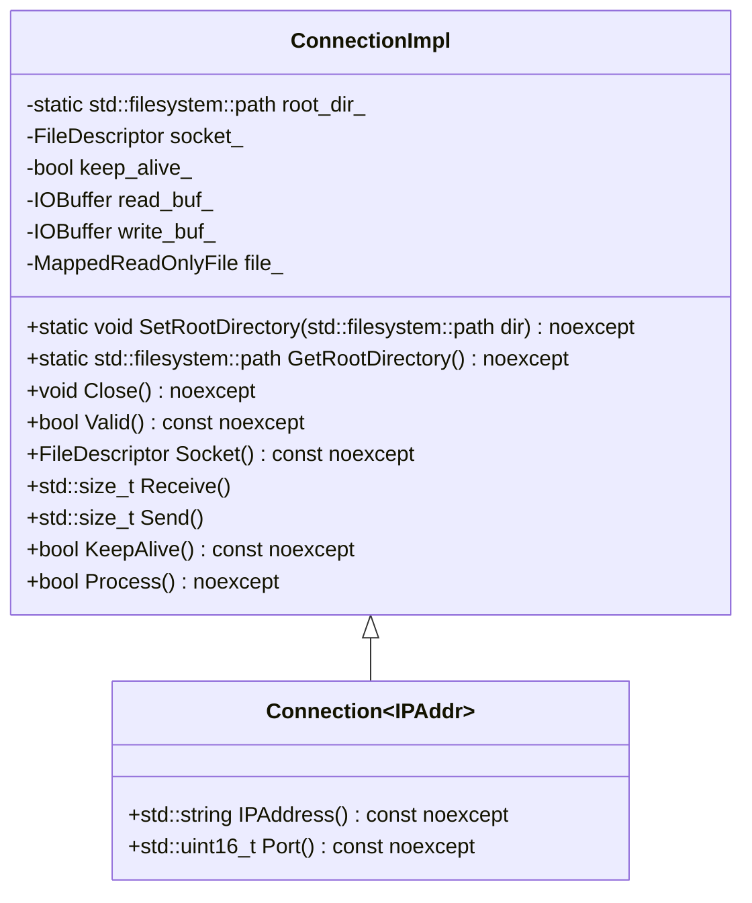
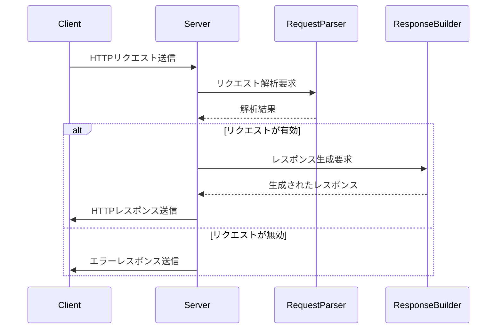

# HTTPモジュール設計文書

## 責務
HTTP通信の受信、処理、送信を行う。具体的には、HTTPリクエストを解析し、適切なレスポンスを作成して返す。

## 公開インターフェース
- `StatusCodeToMessage(StatusCode code) noexcept`
- `StatusCodeToInteger(StatusCode code) noexcept`
- `MethodToString(Method method) noexcept`
- `to_string(Method method) noexcept`
- `StringToMethod(std::string str)`
- `ContentTypeByFileName(std::string_view name) noexcept`
- `DecodeURLEncodedCharacter(const std::string& str)`
- `DecodeURLEncodedString(const std::string& str)`
- `HTMLPlaceholder(std::string_view key) noexcept`
- `PutParamIntoHTML(std::string html, const Parameters& params)`
- `ConnectionImpl` クラス
  - `SetRootDirectory(std::filesystem::path dir) noexcept`
  - `GetRootDirectory() noexcept`
  - `Close() noexcept`
  - `Valid() const noexcept`
  - `Socket() const noexcept`
  - `Receive()`
  - `Send()`
  - `KeepAlive() const noexcept`
  - `Process() noexcept`
- `Connection<IPAddr>` クラス
  - `IPAddress() const noexcept`
  - `Port() const noexcept`

## 入力
- HTTPリクエストデータ（`Receive()`メソッドを通じて）
- ファイルパスやパラメータ（`Response::Build()`メソッドを通じて）

## 出力
- HTTPレスポンスデータ（`Send()`メソッドを通じて）

## 状態
- `ConnectionImpl` クラスの内部状態：
  - `socket_`: 接続先のファイルディスクリプタ
  - `keep_alive_`: 接続が維持されるかどうかを示すフラグ
  - `read_buf_`: 受信バッファ
  - `write_buf_`: 送信バッファ
  - `file_`: リクエストされたファイルへのマップ

## 処理手順
1. **リクエストの受信**:
   - `Receive()`メソッドが呼び出され、データが`read_buf_`に読み込まれる。
2. **リクエストの処理**:
   - `Process()`メソッドが呼び出され、`Request`オブジェクトによって解析される。
3. **レスポンスの生成**:
   - 解析されたリクエストに基づいて、`Response`オブジェクトによって適切なHTTPレスポンスが生成される。
4. **レスポンスの送信**:
   - `Send()`メソッドが呼び出され、生成されたレスポンスデータが送信される。

## 例外・失敗条件
- リクエストの解析に失敗した場合（`Request::Parse()`）
- URLエンコード文字列のデコードに失敗した場合（`DecodeURLEncodedCharacter()`, `DecodeURLEncodedString()`）
- 不正なHTTPメソッドが指定された場合（`StringToMethod()`）

## 依存関係
- `containers/buffer.h`
- `ip.h`
- `util.h`
- `<filesystem>`
- `<iostream>`
- `<memory>`
- `<string>`
- `<string_view>`
- `<unordered_map>`

## 重要な不変条件
- `ConnectionImpl` オブジェクトが有効である場合、`socket_`は有効なファイルディスクリプタを保持している。
- レスポンスの生成と送信前にリクエストが適切に解析されている。

## 追加詳細設計情報

### クラス図


### クラス・メソッド・インターフェース詳細

| クラス/関数名 | メンバ名 | 型 | 可視性 | `const` | `noexcept` | `static` | `virtual` |
|---------------|----------|----|--------|---------|------------|----------|-----------|
| StatusCodeToMessage | - | std::string_view(StatusCode) | 外部 | あり | あり | あり | - |
| StatusCodeToInteger | - | std::uint32_t(StatusCode) | 外部 | あり | あり | あり | - |
| MethodToString | - | std::string_view(Method) | 外部 | あり | あり | あり | - |
| to_string | - | std::string(Method) | 外部 | あり | あり | あり | - |
| StringToMethod | - | Method(std::string) | 外部 | - | - | あり | - |
| ContentTypeByFileName | - | std::string_view(std::string_view) | 外部 | あり | あり | あり | - |
| DecodeURLEncodedCharacter | - | char(const std::string&) | 外部 | - | - | - | - |
| DecodeURLEncodedString | - | std::string(const std::string&) | 外部 | - | - | - | - |
| HTMLPlaceholder | - | std::string(std::string_view) | 外部 | あり | あり | あり | - |
| PutParamIntoHTML | - | std::string(std::string, const Parameters&) | 外部 | - | - | - | - |
| ConnectionImpl | SetRootDirectory | void(std::filesystem::path) | 公開 | - | あり | あり | - |
| ConnectionImpl | GetRootDirectory | std::filesystem::path() | 公開 | あり | あり | あり | - |
| ConnectionImpl | Close | void() | 公開 | - | あり | - | - |
| ConnectionImpl | Valid | bool() | 公開 | あり | あり | - | - |
| ConnectionImpl | Socket | FileDescriptor() | 公開 | あり | あり | - | - |
| ConnectionImpl | Receive | std::size_t() | 公開 | - | - | - | - |
| ConnectionImpl | Send | std::size_t() | 公開 | - | - | - | - |
| ConnectionImpl | KeepAlive | bool() | 公開 | あり | あり | - | - |
| ConnectionImpl | Process | bool() | 公開 | あり | - | - | - |

### シーケンス図


### メソッド仕様書

#### `StatusCodeToMessage(StatusCode code) noexcept`
- **目的**: HTTPステータスコードをメッセージに変換する。
- **引数**: `code` - 変換したいHTTPステータスコード。
- **戻り値**: 対応するメッセージ。
- **動作**: ステータスコードに対応するメッセージを返す。

#### `StatusCodeToInteger(StatusCode code) noexcept`
- **目的**: HTTPステータスコードを整数に変換する。
- **引数**: `code` - 変換したいHTTPステータスコード。
- **戻り値**: 対応する整数値。
- **動作**: ステータスコードに対応する整数値を返す。

#### `MethodToString(Method method) noexcept`
- **目的**: HTTPメソッドを文字列に変換する。
- **引数**: `method` - 変換したいHTTPメソッド。
- **戻り値**: 対応する文字列。
- **動作**: メソッドに対応する文字列を返す。

#### `to_string(Method method) noexcept`
- **目的**: HTTPメソッドを文字列に変換する。
- **引数**: `method` - 変換したいHTTPメソッド。
- **戻り値**: 対応する文字列。
- **動作**: メソッドに対応する文字列を返す。

#### `StringToMethod(std::string str)`
- **目的**: 文字列をHTTPメソッドに変換する。
- **引数**: `str` - 変換したい文字列。
- **戻り値**: 対応するHTTPメソッド。
- **動作**: 文字列に対応するHTTPメソッドを返す。無効な文字列の場合は例外を投げる。

#### `ContentTypeByFileName(std::string_view name) noexcept`
- **目的**: ファイル名からコンテンツタイプを取得する。
- **引数**: `name` - ファイル名。
- **戻り値**: コンテンツタイプ。
- **動作**: 拡張子に基づいてコンテンツタイプを返す。

#### `DecodeURLEncodedCharacter(const std::string& str)`
- **目的**: URLエンコードされた文字列からキャラクタをデコードする。
- **引数**: `str` - デコードしたいURLエンコードされた文字列。
- **戻り値**: デコードされたキャラクタ。
- **動作**: 文字列をデコードして返す。無効な文字列の場合は例外を投げる。

#### `DecodeURLEncodedString(const std::string& str)`
- **目的**: URLエンコードされた文字列から文字列をデコードする。
- **引数**: `str` - デコードしたいURLエンコードされた文字列。
- **戻り値**: デコードされた文字列。
- **動作**: 文字列をデコードして返す。無効な文字列の場合は例外を投げる。

#### `HTMLPlaceholder(std::string_view key) noexcept`
- **目的**: HTMLプレースホルダーを作成する。
- **引数**: `key` - プレースホルダーキー。
- **戻り値**: 作成されたプレースホルダー文字列。
- **動作**: キーに対応するHTMLプレースホルダーを返す。

#### `PutParamIntoHTML(std::string html, const Parameters& params)`
- **目的**: パラメータをHTMLテンプレートに挿入する。
- **引数**: `html` - HTMLテンプレート文字列。`params` - 挿入したいパラメータ。
- **戻り値**: パラメータが挿入されたHTML文字列。
- **動作**: テンプレート内のプレースホルダーをパラメータで置き換えて返す。

### 処理フロー図
```mermaid
graph TD
    A[Receive()] --> B[データ受信]
    B --> C[Process()]
    C --> D{リクエストが有効?}
    D -- はい --> E[レスポンス生成]
    D -- いいえ --> F[エラーレスポンス生成]
    E --> G[Send()]
    F --> G
```

### 状態遷移・副作用

| 状態 | 遷移条件 | 変更対象 | 更新後状態 | 更新順序 | 副作用 |
|------|----------|----------|------------|----------|--------|
| 受信待ち | データ受信 | `read_buf_` | リクエスト処理中 | 1.データ読み込み<br>2.`read_buf_`更新 | - |
| リクエスト処理中 | リクエスト有効 | `write_buf_`, `file_` | レスポンス生成中 | 1.リクエスト解析<br>2.`write_buf_`と`file_`更新 | - |
| レスポンス生成中 | レスポンス生成完了 | `write_buf_` | 送信待ち | 1.レスポンス生成<br>2.`write_buf_`更新 | - |
| 送信待ち | データ送信 | - | 受信待ち | 1.データ送信 | - |

### データ変換・制約

| 変換元 | 変換先 | 値域 | 境界値 | 単位 | 精度 | encoding |
|--------|--------|------|--------|------|------|----------|
| StatusCode | std::string_view | 200, 400, 403, 404 | - | - | - | UTF-8 |
| Method | std::string_view | GET, POST, PUT, PATCH, DELETE | - | - | - | UTF-8 |
| std::string_view | std::string | - | - | - | - | UTF-8 |
| URLエンコード文字列 | 文字列 | - | - | - | - | UTF-8 |

この設計文書は、元コードから確認できる事実に基づいて作成され、再実装に必要な詳細な情報を提供します。