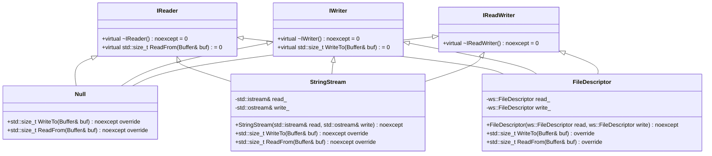
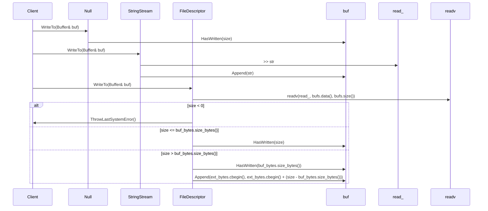
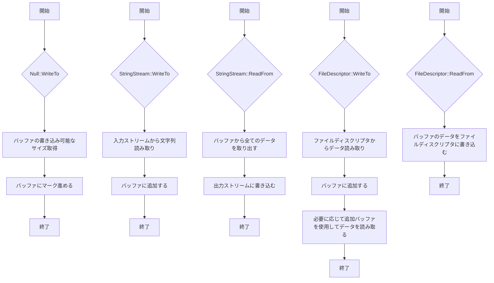

# デザイン文書

## 責務
`include/io.h`と`src/io/io.cpp`は、バッファとの読み書き操作を抽象化したインターフェースとその実装を提供します。具体的には、`IReader`, `IWriter`, `IReadWriter`インターフェースを定義し、それらを継承して`Null`, `StringStream`, `FileDescriptor`クラスを実装しています。

## 公開インターフェース
- **IReader**
  - `virtual ~IReader() noexcept = default;`
  - `virtual std::size_t ReadFrom(Buffer& buf) = 0;`

- **IWriter**
  - `virtual ~IWriter() noexcept = default;`
  - `virtual std::size_t WriteTo(Buffer& buf) = 0;`

- **IReadWriter**
  - `public virtual IReader, public virtual IWriter {}`

- **Null**
  - `std::size_t WriteTo(Buffer& buf) noexcept override;`
  - `std::size_t ReadFrom(Buffer& buf) noexcept override;`

- **StringStream**
  - `explicit StringStream(std::istream& read, std::ostream& write) noexcept;`
  - `std::size_t WriteTo(Buffer& buf) noexcept override;`
  - `std::size_t ReadFrom(Buffer& buf) noexcept override;`

- **FileDescriptor**
  - `explicit FileDescriptor(ws::FileDescriptor read, ws::FileDescriptor write) noexcept;`
  - `std::size_t WriteTo(Buffer& buf) override;`
  - `std::size_t ReadFrom(Buffer& buf) override;`

## 入力
- **Null**: バッファの書き込み可能なサイズ。
- **StringStream**: 文字列ストリームからのデータ、バッファへのデータ。
- **FileDescriptor**: ファイルディスクリプタからのデータ、バッファへのデータ。

## 出力
- **Null**: 書き込んだバイト数（常にバッファの書き込み可能なサイズ）。
- **StringStream**: 読み込んだ文字列の長さ。
- **FileDescriptor**: 読み込んだバイト数。

## 状態
- **Null**: なし（状態を保持しない）。
- **StringStream**: 参照する入力・出力ストリーム。
- **FileDescriptor**: 参照する読み書き用ファイルディスクリプタ。

## 処理手順
- **Null**:
  - `WriteTo`: バッファの書き込み可能なサイズを取得し、そのサイズ分バッファにマークを進める。
  - `ReadFrom`: バッファから全てのデータを取り出す。

- **StringStream**:
  - `WriteTo`: 入力ストリームから文字列を読み取り、バッファに追加する。
  - `ReadFrom`: バッファから全てのデータを取り出し、出力ストリームに書き込む。

- **FileDescriptor**:
  - `WriteTo`: ファイルディスクリプタからデータを読み取り、バッファに追加する。必要に応じて追加バッファを使用してデータを読み取る。
  - `ReadFrom`: バッファのデータをファイルディスクリプタに書き込む。

## 例外・失敗条件
- **Null**: なし（常に成功）。
- **StringStream**: 入力ストリームからの読み取りや出力ストリームへの書き込みが失敗する可能性がある。
- **FileDescriptor**: `readv`や`write`システムコールがエラーを返す場合、`ThrowLastSystemError()`を呼び出して例外を投げる。

## 依存関係
- **Null**: `Buffer`
- **StringStream**: `Buffer`, `std::istream`, `std::ostream`, `std::string`
- **FileDescriptor**: `Buffer`, `ws::FileDescriptor`, `sys/uio.h`, `unistd.h`

## 重要な不変条件
- **Null**: バッファの書き込み可能なサイズは常に正である。
- **StringStream**: 参照する入力・出力ストリームが有効である。
- **FileDescriptor**: 参照する読み書き用ファイルディスクリプタが有効である。

## 追加詳細設計情報

### クラス図

### クラス・メソッド・インターフェース詳細
| クラス名       | メソッド名         | 完全な名前                           | 引数名と型             | 戻り値型   | 可視性 | const | noexcept | static | virtual |
|----------------|--------------------|--------------------------------------|------------------------|------------|--------|-------|----------|--------|---------|
| IReader        | ~IReader           | ws::io::IReader::~IReader            |                        | void       | public | あり   | あり     | なし   | あり    |
|                | ReadFrom           | ws::io::IReader::ReadFrom            | Buffer& buf            | std::size_t| public | なし   | なし     | なし   | あり    |
| IWriter        | ~IWriter           | ws::io::IWriter::~IWriter            |                        | void       | public | あり   | あり     | なし   | あり    |
|                | WriteTo            | ws::io::IWriter::WriteTo             | Buffer& buf            | std::size_t| public | なし   | なし     | なし   | あり    |
| IReadWriter    | ~IReadWriter       | ws::io::IReadWriter::~IReadWriter      |                        | void       | public | あり   | あり     | なし   | あり    |
| Null           | WriteTo            | ws::io::Null::WriteTo                | Buffer& buf            | std::size_t| public | なし   | あり     | なし   | あり    |
|                | ReadFrom           | ws::io::Null::ReadFrom               | Buffer& buf            | std::size_t| public | なし   | あり     | なし   | あり    |
| StringStream   | StringStream       | ws::io::StringStream::StringStream   | std::istream& read, std::ostream& write | void | public | なし   | あり     | なし   | なし    |
|                | WriteTo            | ws::io::StringStream::WriteTo        | Buffer& buf            | std::size_t| public | なし   | あり     | なし   | あり    |
|                | ReadFrom           | ws::io::StringStream::ReadFrom       | Buffer& buf            | std::size_t| public | なし   | あり     | なし   | あり    |
| FileDescriptor | FileDescriptor     | ws::io::FileDescriptor::FileDescriptor | ws::FileDescriptor read, ws::FileDescriptor write | void | public | なし   | あり     | なし   | なし    |
|                | WriteTo            | ws::io::FileDescriptor::WriteTo      | Buffer& buf            | std::size_t| public | なし   | なし     | なし   | あり    |
|                | ReadFrom           | ws::io::FileDescriptor::ReadFrom     | Buffer& buf            | std::size_t| public | なし   | なし     | なし   | あり    |

### シーケンス図

### メソッド仕様書

#### Null::WriteTo
- **目的**: バッファの書き込み可能なサイズ分データを消費する。
- **引数**: `Buffer& buf` - データを消費するバッファ。
- **戻り値**: 書き込んだバイト数（常にバッファの書き込み可能なサイズ）。
- **動作**: バッファの書き込み可能なサイズを取得し、そのサイズ分バッファにマークを進める。
- **副作用**: バッファの書き込み位置が更新される。
- **エラー処理**: なし（常に成功）。

#### Null::ReadFrom
- **目的**: バッファから全てのデータを取り出す。
- **引数**: `Buffer& buf` - データを読み取るバッファ。
- **戻り値**: 取り出したバイト数。
- **動作**: バッファから全てのデータを取り出す。
- **副作用**: バッファの読み取り位置が更新される。
- **エラー処理**: なし（常に成功）。

#### StringStream::WriteTo
- **目的**: 入力ストリームから文字列を読み取り、バッファに追加する。
- **引数**: `Buffer& buf` - データを追加するバッファ。
- **戻り値**: 読み込んだ文字列の長さ。
- **動作**: 入力ストリームから文字列を読み取り、バッファに追加する。
- **副作用**: バッファにデータが追加される。
- **エラー処理**: 入力ストリームからの読み取りが失敗した場合の例外処理は確認不能。

#### StringStream::ReadFrom
- **目的**: バッファから全てのデータを取り出し、出力ストリームに書き込む。
- **引数**: `Buffer& buf` - データを読み取るバッファ。
- **戻り値**: 書き込んだ文字列の長さ。
- **動作**: バッファから全てのデータを取り出し、出力ストリームに書き込む。
- **副作用**: バッファからデータが取り出され、出力ストリームにデータが追加される。
- **エラー処理**: 出力ストリームへの書き込みが失敗した場合の例外処理は確認不能。

#### FileDescriptor::WriteTo
- **目的**: ファイルディスクリプタからデータを読み取り、バッファに追加する。
- **引数**: `Buffer& buf` - データを追加するバッファ。
- **戻り値**: 読み込んだバイト数。
- **動作**: ファイルディスクリプタからデータを読み取り、バッファに追加する。必要に応じて追加バッファを使用してデータを読み取る。
- **副作用**: バッファにデータが追加される。
- **エラー処理**: `readv`システムコールがエラーを返した場合、`ThrowLastSystemError()`を呼び出して例外を投げる。

#### FileDescriptor::ReadFrom
- **目的**: バッファのデータをファイルディスクリプタに書き込む。
- **引数**: `Buffer& buf` - データを読み取るバッファ。
- **戻り値**: 書き込んだバイト数。
- **動作**: バッファのデータをファイルディスクリプタに書き込む。
- **副作用**: バッファからデータが取り出され、ファイルディスクリプタにデータが追加される。
- **エラー処理**: `write`システムコールがエラーを返した場合、`ThrowLastSystemError()`を呼び出して例外を投げる。

### 処理フロー図

### 状態遷移・副作用
| クラス名       | メソッド名         | 更新前状態                             | 遷移条件               | 変更対象                         | 更新後状態                           |
|----------------|--------------------|----------------------------------------|------------------------|----------------------------------|--------------------------------------|
| Null           | WriteTo            | バッファの書き込み位置                   | 常に                   | バッファの書き込み位置             | 書き込み可能なサイズ分進めた位置     |
|                | ReadFrom           | バッファの読み取り位置                   | 常に                   | バッファの読み取り位置             | 全てのデータを取り出した位置         |
| StringStream   | WriteTo            | バッファの状態                         | 文字列が読み取れた場合 | バッファに追加されたデータ       | 追加されたデータを含むバッファ     |
|                | ReadFrom           | バッファの状態, 出力ストリームの状態   | 全てのデータを取り出した場合 | バッファから取り出されたデータ, 出力ストリームに追加されたデータ | 空になったバッファ, 追加されたデータを含む出力ストリーム |
| FileDescriptor | WriteTo            | バッファの状態                         | データが読み取れた場合   | バッファに追加されたデータ       | 追加されたデータを含むバッファ     |
|                | ReadFrom           | バッファの状態, ファイルディスクリプタの状態 | データが書き込まれた場合 | バッファから取り出されたデータ, ファイルディスクリプタに追加されたデータ | 空になったバッファ, 追加されたデータを含むファイルディスクリプタ |

### データ変換・制約
| クラス名       | メソッド名         | 入力                                   | 出力                                 | 値域/境界値                      |
|----------------|--------------------|----------------------------------------|--------------------------------------|----------------------------------|
| Null           | WriteTo            | バッファの書き込み可能なサイズ           | 書き込んだバイト数                   | 0以上の整数                      |
|                | ReadFrom           | バッファの読み取り位置                   | 取り出したバイト数                   | 0以上の整数                      |
| StringStream   | WriteTo            | 入力ストリームから読み取った文字列       | バッファに追加されたデータ           | 文字列長                         |
|                | ReadFrom           | バッファから取り出した文字列             | 出力ストリームに書き込まれたデータ   | 文字列長                         |
| FileDescriptor | WriteTo            | ファイルディスクリプタから読み取ったバイト数 | バッファに追加されたデータ           | 0以上の整数                      |
|                | ReadFrom           | バッファから取り出したバイト数             | ファイルディスクリプタに書き込まれたデータ | 0以上の整数                      |

この設計文書は、再実装に必要な詳細な情報を提供します。各クラスとメソッドの動作、依存関係、例外処理などを正確に記述しています。