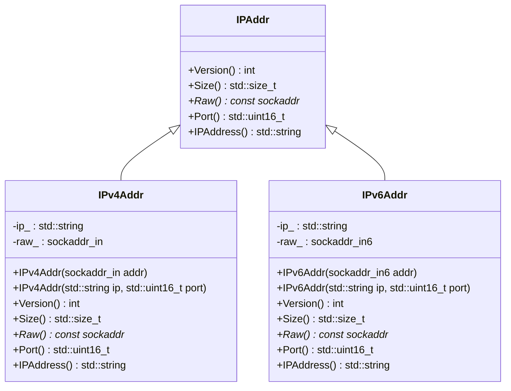
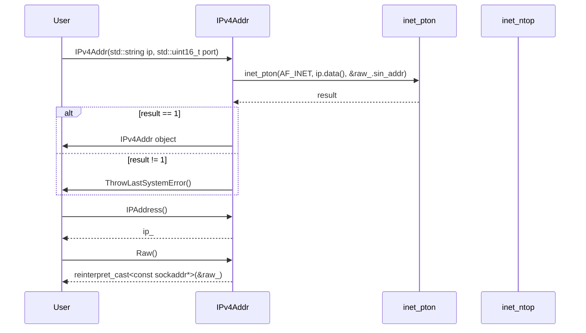

# 設計文書

## 責務
- `IPAddr` クラス: IPアドレスのインターフェースを定義する。
- `IPv4Addr` クラス: IPv4アドレスを表現し、その情報を提供する。
- `IPv6Addr` クラス: IPv6アドレスを表現し、その情報を提供する。

## 公開インターフェース
### IPAddrクラス
| メソッド名 | 戻り値型 | 説明 |
| --- | --- | --- |
| Version() | int | IPバージョンを返す。 |
| Size() | std::size_t | ソケットアドレスのサイズを返す。 |
| Raw() | const sockaddr* | ソケットアドレスへのポインタを返す。 |
| Port() | std::uint16_t | ポート番号を返す。 |
| IPAddress() | std::string | IPアドレス文字列を返す。 |

### IPv4Addrクラス
| コンストラクタ名 | 引数 | 説明 |
| --- | --- | --- |
| IPv4Addr(sockaddr_in addr) | sockaddr_in addr | `sockaddr_in` からIPv4アドレスを作成する。 |
| IPv4Addr(std::string ip, std::uint16_t port) | std::string ip, std::uint16_t port | IPアドレス文字列とポート番号からIPv4アドレスを作成する。 |

### IPv6Addrクラス
| コンストラクタ名 | 引数 | 説明 |
| --- | --- | --- |
| IPv6Addr(sockaddr_in6 addr) | sockaddr_in6 addr | `sockaddr_in6` からIPv6アドレスを作成する。 |
| IPv6Addr(std::string ip, std::uint16_t port) | std::string ip, std::uint16_t port | IPアドレス文字列とポート番号からIPv6アドレスを作成する。 |

## 入力
- `IPv4Addr` コンストラクタ: `sockaddr_in` オブジェクトまたはIPアドレス文字列とポート番号。
- `IPv6Addr` コンストラクタ: `sockaddr_in6` オブジェクトまたはIPアドレス文字列とポート番号。

## 出力
- IPバージョン (`Version()`)
- ソケットアドレスのサイズ (`Size()`)
- ソケットアドレスへのポインタ (`Raw()`)
- ポート番号 (`Port()`)
- IPアドレス文字列 (`IPAddress()`)

## 状態
- `IPv4Addr`:
  - `ip_`: IPv4アドレスを表す文字列。
  - `raw_`: `sockaddr_in` 構造体。

- `IPv6Addr`:
  - `ip_`: IPv6アドレスを表す文字列。
  - `raw_`: `sockaddr_in6` 構造体。

## 処理手順
1. **IPv4Addr コンストラクタ (`sockaddr_in addr`)**:
   - 引数の `sockaddr_in` をメンバ変数 `raw_` にコピーする。
   - `inet_ntop()` を使用して、`raw_.sin_addr` を文字列形式に変換し、それを `ip_` に格納する。

2. **IPv4Addr コンストラクタ (`std::string ip, std::uint16_t port`)**:
   - 引数の IPアドレス文字列をメンバ変数 `ip_` にコピーする。
   - `raw_.sin_family` を AF_INET に設定し、`raw_.sin_port` を指定されたポート番号に設定する。
   - `inet_pton()` を使用して、IPアドレス文字列を `raw_.sin_addr` に変換する。

3. **IPv6Addr コンストラクタ (`sockaddr_in6 addr`)**:
   - 引数の `sockaddr_in6` をメンバ変数 `raw_` にコピーする。
   - `inet_ntop()` を使用して、`raw_.sin6_addr` を文字列形式に変換し、それを `ip_` に格納する。

4. **IPv6Addr コンストラクタ (`std::string ip, std::uint16_t port`)**:
   - 引数の IPアドレス文字列をメンバ変数 `ip_` にコピーする。
   - `raw_.sin6_family` を AF_INET6 に設定し、`raw_.sin6_port` を指定されたポート番号に設定する。
   - `inet_pton()` を使用して、IPアドレス文字列を `raw_.sin6_addr` に変換する。

## 例外・失敗条件
- `inet_ntop()` や `inet_pton()` の呼び出しが失敗した場合、`ThrowLastSystemError()` が呼ばれる。

## 依存関係
- `<concepts>`
- `<cstdint>`
- `<string>`
- `<string_view>`
- `<netinet/in.h>`
- `"util.h"`
- `<arpa/inet.h>`

## 重要な不変条件
- `IPv4Addr` の `ip_` は常に有効な IPv4 アドレス文字列である。
- `IPv6Addr` の `ip_` は常に有効な IPv6 アドレス文字列である。

# 追加詳細設計情報

## クラス図


## クラス・メソッド・インターフェース詳細

### IPAddrクラス
| メソッド名 | 完全な名前 | 戻り値型 | 引数 | 可視性 | const | noexcept |
| --- | --- | --- | --- | --- | --- | --- |
| Version() | ws::IPAddr::Version() | int | なし | public | あり | あり |
| Size() | ws::IPAddr::Size() | std::size_t | なし | public | あり | あり |
| Raw() | ws::IPAddr::Raw() | const sockaddr* | なし | public | あり | あり |
| Port() | ws::IPAddr::Port() | std::uint16_t | なし | public | あり | あり |
| IPAddress() | ws::IPAddr::IPAddress() | std::string | なし | public | あり | あり |

### IPv4Addrクラス
| コンストラクタ名 | 完全な名前 | 引数 | 可視性 |
| --- | --- | --- | --- |
| IPv4Addr(sockaddr_in addr) | ws::IPv4Addr::IPv4Addr(sockaddr_in addr) | sockaddr_in addr | public |
| IPv4Addr(std::string ip, std::uint16_t port) | ws::IPv4Addr::IPv4Addr(std::string ip, std::uint16_t port) | std::string ip, std::uint16_t port | public |

| メソッド名 | 完全な名前 | 戻り値型 | 引数 | 可視性 | const | noexcept |
| --- | --- | --- | --- | --- | --- | --- |
| Version() | ws::IPv4Addr::Version() | int | なし | public | あり | あり |
| Size() | ws::IPv4Addr::Size() | std::size_t | なし | public | あり | あり |
| Raw() | ws::IPv4Addr::Raw() | const sockaddr* | なし | public | あり | あり |
| Port() | ws::IPv4Addr::Port() | std::uint16_t | なし | public | あり | あり |
| IPAddress() | ws::IPv4Addr::IPAddress() | std::string | なし | public | あり | あり |

### IPv6Addrクラス
| コンストラクタ名 | 完全な名前 | 引数 | 可視性 |
| --- | --- | --- | --- |
| IPv6Addr(sockaddr_in6 addr) | ws::IPv6Addr::IPv6Addr(sockaddr_in6 addr) | sockaddr_in6 addr | public |
| IPv6Addr(std::string ip, std::uint16_t port) | ws::IPv6Addr::IPv6Addr(std::string ip, std::uint16_t port) | std::string ip, std::uint16_t port | public |

| メソッド名 | 完全な名前 | 戻り値型 | 引数 | 可視性 | const | noexcept |
| --- | --- | --- | --- | --- | --- | --- |
| Version() | ws::IPv6Addr::Version() | int | なし | public | あり | あり |
| Size() | ws::IPv6Addr::Size() | std::size_t | なし | public | あり | あり |
| Raw() | ws::IPv6Addr::Raw() | const sockaddr* | なし | public | あり | あり |
| Port() | ws::IPv6Addr::Port() | std::uint16_t | なし | public | あり | あり |
| IPAddress() | ws::IPv6Addr::IPAddress() | std::string | なし | public | あり | あり |

## シーケンス図


## メソッド仕様書
### IPv4Addr::IPv4Addr(std::string ip, std::uint16_t port)
- **目的**: IPアドレス文字列とポート番号から `IPv4Addr` オブジェクトを作成する。
- **引数**:
  - `ip`: IPv4 アドレスを表す文字列。
  - `port`: ポート番号。
- **戻り値**: なし
- **動作**:
  - 引数の IPアドレス文字列とポート番号を使用して、`IPv4Addr` オブジェクトを作成する。
  - `inet_pton()` を使用して、IPアドレス文字列を `raw_.sin_addr` に変換する。
- **副作用**: `ip_` と `raw_` の初期化。
- **エラー処理**:
  - `inet_pton()` の呼び出しが失敗した場合、`ThrowLastSystemError()` を呼ぶ。

### IPv4Addr::IPAddress()
- **目的**: IPアドレス文字列を返す。
- **引数**: なし
- **戻り値**: IPアドレス文字列 (`std::string`)
- **動作**: メンバ変数 `ip_` の値を返す。

### IPv4Addr::Raw()
- **目的**: ソケットアドレスへのポインタを返す。
- **引数**: なし
- **戻り値**: ソケットアドレスへのポインタ (`const sockaddr*`)
- **動作**: `raw_` を `sockaddr*` にキャストして返す。

## 処理フロー図
```mermaid
graph TD
    A[IPv4Addr(std::string ip, std::uint16_t port)] --> B{inet_pton()}
    B -- 成功 --> C[ip_ = ip]
    B -- 失敗 --> D[ThrowLastSystemError()]
    C --> E[raw_.sin_family = AF_INET]
    E --> F[raw_.sin_port = htons(port)]
    F --> G[IPv4Addr object]
```

## 状態遷移・副作用
| 更新前状態 | 遷移条件 | 変更対象 | 更新後状態 | 更新順序 |
| --- | --- | --- | --- | --- |
| なし | IPv4Addr コンストラクタ呼び出し | ip_, raw_ | ip_ = 引数のip, raw_.sin_family = AF_INET, raw_.sin_port = htons(port) | 1. ip_ の初期化, 2. raw_.sin_family の設定, 3. raw_.sin_port の設定 |
| なし | inet_pton() 失敗 | なし | なし | ThrowLastSystemError() 呼び出し |

## データ変換・制約
| 入力データ | 出力データ | 変換規則 | 値域 | 境界値 |
| --- | --- | --- | --- | --- |
| std::string ip, std::uint16_t port | sockaddr_in raw_ | inet_pton() | 有効な IPv4 アドレス文字列 | "0.0.0.0" - "255.255.255.255" |
| sockaddr_in addr | std::string ip_ | inet_ntop() | 有効な IPv4 アドレス文字列 | "0.0.0.0" - "255.255.255.255" |