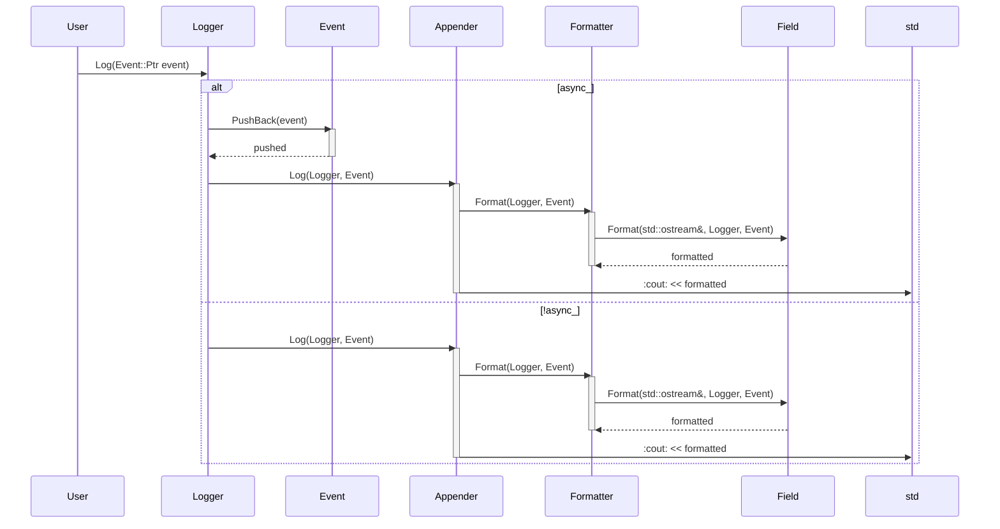
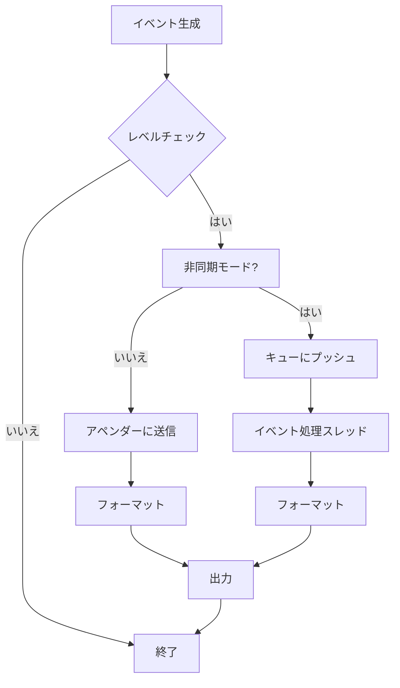

# デザイン文書

## 責務
- `include/log.h`：ログシステムの定義とインターフェースを提供する。
- `src/log/log.cpp`：ログイベントの生成、フォーマット、およびロガーの管理を行う。
- `src/log/appender.cpp`：異なる出力先へのログイベントの書き込み処理を行う。
- `src/log/field.h`：ログイベントの各フィールドをフォーマットするためのサブフォーマッタの定義とインターフェースを提供する。
- `src/log/field.cpp`：サブフォーマッタの具体的な実装を行う。
- `src/log/config_init.h`：ログシステムの設定初期化に関する構造体とユーティリティ関数の定義とインターフェースを提供する。
- `src/log/config_init.cpp`：設定ファイルからのロガー設定読み込みとマネージャーへの反映処理を行う。

## 公開インターフェース
- `include/log.h`
  - クラス: `Logger`, `Event`, `Formatter`, `Appender`, `StdOutAppender`, `FileAppender`, `Manager`, `EventWriter`
  - 関数: `LevelToString`, `to_string`, `StringToLevel`, `AppenderTypeToString`, `StringToAppenderType`, `Log`, `RootManager`, `RootLogger`, `FindLogger`

- `src/log/appender.cpp`
  - クラス: `StdOutAppender`, `FileAppender`
  - 関数: `AppenderTypeToString`, `to_string`, `StringToAppenderType`

- `src/log/field.h`
  - クラス: `Formatter::Field`, `Message`, `Level`, `ThreadId`, `DateTime`, `FileName`, `LineNum`, `NewLine`, `Tab`, `RawString`, `LoggerName`
  - 構造体: `RawField`
  - 関数: `operator==`, `operator!=`, `ParsePattern`, `RawFieldsToFormatFields`

- `src/log/config_init.h`
  - 構造体: `AppenderConfig`, `LoggerConfig`
  - クラス: `cfg::VarConverter<std::string, log::AppenderConfig>`, `cfg::VarConverter<log::AppenderConfig, std::string>`, `cfg::VarConverter<std::string, log::LoggerConfig>`, `cfg::VarConverter<log::LoggerConfig, std::string>`
  - 関数: `operator==`, `operator!=`, `SetListener`

- `src/log/config_init.cpp`
  - 関数: `operator==`, `operator!=`, `SetListener`

## 入力
- ログレベル (`Level`)
- イベントメッセージ (`std::string_view`)
- フォーマットパターン (`std::string_view`)
- アペンダータイプ (`AppenderType`)
- ファイル名 (`std::string_view`)
- YAML形式の設定データ

## 出力
- ログイベント (`Event`)
- フォーマットされたログメッセージ (`std::string`)
- YAML形式のロガー設定 (`std::string`)

## 状態
- `Logger`: ログレベル、キャパシティ、アペンダーのリスト、デフォルトフォーマッタ
- `Event`: レベル、ファイル名、行番号、スレッドID、タイムスタンプ、メッセージストリーム
- `Formatter`: パターン文字列、フィールドオブジェクトのリスト
- `Appender`: フォーマッターオブジェクト
- `StdOutAppender`: 標準出力への書き込み用アペンダー
- `FileAppender`: ファイルへの書き込み用アペンダー
- `Manager`: ロガーのマップ

## 処理手順
1. **ログイベントの生成**:
   - `Event::Create` を通じて新しいログイベントを作成する。
2. **フォーマットパターンの解析とフィールドオブジェクトの生成**:
   - `Formatter::Pattern` から `RawField` のリストを生成し、それを `Formatter::Field` オブジェクトのリストに変換する。
3. **ログメッセージのフォーマット**:
   - 各 `Formatter::Field` オブジェクトがイベント情報をフォーマットして出力ストリームに書き込む。
4. **ロガーへのイベント追加**:
   - ログレベルをチェックし、適切なアペンダーにイベントを送信する。
5. **イベントの同期/非同期処理**:
   - キューを使用してイベントを非同期に処理するか、直接同期的に処理する。
6. **設定ファイルからのロガー初期化**:
   - YAML形式の設定データから `LoggerConfig` を読み取り、マネージャーがロガーを作成しアペンダーを追加する。

## 例外・失敗条件
- `StringToLevel`, `StringToAppenderType`: 不正な文字列が渡された場合に `std::invalid_argument` 例外を投げる。
- `FileAppender`: ファイルのオープンに失敗した場合に `std::system_error` 例外を投げる。

## 依存関係
- `include/log.h`:
  - `<chrono>`, `<experimental/source_location>`, `<fstream>`, `<iostream>`, `<list>`, `<memory>`, `<mutex>`, `<optional>`, `<sstream>`, `<string>`, `<string_view>`, `<thread>`, `<unordered_map>`
  - `config.h`, `containers/block_deque.h`, `util.h`

- `src/log/appender.cpp`:
  - `<stdexcept>`, `<syncstream>`

- `src/log/field.cpp`:
  - `<ctime>`, `<functional>`, `<stdexcept>`, `<unordered_map>`

- `src/log/config_init.cpp`:
  - `<cassert>`

## 重要な不変条件
- ログレベルは設定された値の範囲内である。
- フォーマットパターンは有効な形式である。
- アペンダータイプは定義された列挙型の値である。

# 追加詳細設計情報

## クラス図

```mermaid
classDiagram
    class Logger {
        +std::string_view Name() const noexcept
        +std::size_t Capacity() const noexcept
        +void Log(Event::Ptr event) noexcept
        +void AddAppender(Appender::Ptr appender) noexcept
        +void RemoveAppender(Appender::Ptr appender) noexcept
        +void ClearAppenders() noexcept
        +log::Level GetLevel() const noexcept
        +void SetLevel(log::Level level) noexcept
        +Formatter::Ptr GetDefaultFormatter() const noexcept
        +void SetDefaultFormatter(Formatter::Ptr formatter) noexcept
        +std::string ToYamlString() const noexcept
    }
    
    class Event {
        +static Ptr Create(log::Level level, std::experimental::source_location location, std::uint32_t thread_id, Clock::time_point time) noexcept
        +log::Level Level() const noexcept
        +std::string_view FileName() const noexcept
        +std::size_t LineNum() const noexcept
        +std::uint32_t ThreadId() const noexcept
        +Clock::time_point Time() const noexcept
        +std::string Message() const noexcept
        +std::ostringstream& MessageStream() noexcept
    }
    
    class Formatter {
        +static Ptr Default() noexcept
        +Formatter(std::string_view pattern)
        +std::string Format(const Logger& logger, const Event& event) const noexcept
        +std::string_view Pattern() const noexcept
    }
    
    class Appender {
        +Appender(std::string_view pattern)
        +virtual void Log(const Logger& logger, const Event& event) noexcept = 0
        +virtual std::string ToYamlString() const noexcept = 0
        +Formatter::Ptr GetFormatter() const noexcept
        +void SetFormatter(Formatter::Ptr formatter) noexcept
    }
    
    class StdOutAppender {
        +StdOutAppender(std::string_view pattern)
        +void Log(const Logger& logger, const Event& event) noexcept override
        +std::string ToYamlString() const noexcept override
    }
    
    class FileAppender {
        +FileAppender(std::string_view file_name, Formatter::Ptr formatter = Formatter::Default())
        +void Log(const Logger& logger, const Event& event) noexcept override
        +std::string ToYamlString() const noexcept override
    }
    
    class Manager {
        +Manager(std::string_view name) noexcept
        +Logger::Ptr FindLogger(std::string_view name, log::Level level, std::optional<std::size_t> capacity) noexcept
        +void RemoveLogger(std::string_view name) noexcept
        +std::string ToYamlString() const noexcept
    }
    
    class EventWriter {
        +EventWriter(Logger& logger, Event::Ptr event) noexcept
        +~EventWriter() noexcept
        +std::ostringstream& MessageStream() noexcept
    }

    Logger "1" -- "0..*" Appender : contains
    Formatter "1" -- "0..*" Formatter.Field : contains
    Manager "1" -- "0..*" Logger : manages
```

## クラス・メソッド・インターフェース詳細

| クラス | メソッド | 完全な名前 | 属性 | 引数名と型 | 戻り値型 | 可視性 | const | 参照/ポインタ | static | noexcept |
|--------|----------|------------|------|------------|-----------|--------|-------|---------------|--------|----------|
| Logger | Create   | ws::log::Logger::Create | 静的 | std::string_view name, log::Level level, std::optional<std::size_t> capacity | Logger::Ptr | パブリック | いいえ | いいえ | はい | いいえ |
| Logger | Log      | ws::log::Logger::Log     |        | Event::Ptr event       | void        | パブリック | いいえ | いいえ | いいえ | いいえ |
| Logger | AddAppender | ws::log::Logger::AddAppender |   | Appender::Ptr appender | void        | パブリック | いいえ | いいえ | いいえ | いいえ |
| Logger | RemoveAppender | ws::log::Logger::RemoveAppender | | Appender::Ptr appender | void        | パブリック | いいえ | いいえ | いいえ | いいえ |
| Logger | ClearAppenders | ws::log::Logger::ClearAppenders |   |            | void        | パブリック | いいえ | いいえ | いいえ | いいえ |
| Logger | GetLevel     | ws::log::Logger::GetLevel    |   |            | log::Level | パブリック | いいえ | いいえ | いいえ | いいえ |
| Logger | SetLevel     | ws::log::Logger::SetLevel    |   | log::Level level       | void        | パブリック | いいえ | いいえ | いいえ | いいえ |
| Logger | GetDefaultFormatter | ws::log::Logger::GetDefaultFormatter |   |            | Formatter::Ptr | パブリック | いいえ | いいえ | いいえ | いいえ |
| Logger | SetDefaultFormatter | ws::log::Logger::SetDefaultFormatter |   | Formatter::Ptr formatter | void        | パブリック | いいえ | いいえ | いいえ | いいえ |
| Logger | Name       | ws::log::Logger::Name      |   |            | std::string_view | パブリック | いいえ | いいえ | いいえ | いいえ |
| Logger | Capacity   | ws::log::Logger::Capacity  |   |            | std::size_t    | パブリック | いいえ | いいえ | いいえ | いいえ |
| Logger | ToYamlString | ws::log::Logger::ToYamlString |   |            | std::string    | パブリック | いいえ | いいえ | いいえ | いいえ |

## シーケンス図

## メソッド仕様書

### `Logger::Log(Event::Ptr event)`
- **目的**: ログイベントを処理する。
- **引数**:
  - `event`: 処理対象のログイベント (`Event::Ptr`)
- **戻り値**: 無し
- **動作**:
  - イベントレベルがロガーの最低レベル以上である場合、イベントを処理する。
  - 非同期モードの場合、イベントキューにイベントをプッシュする。
  - 同期モードの場合、直接イベントをアペンダーに送信する。
- **副作用**: イベントキューへの追加やアペンダーオブジェクトの呼び出し
- **エラー処理**: 無し

### `Formatter::Format(const Logger& logger, const Event& event)`
- **目的**: ログイベントをフォーマットする。
- **引数**:
  - `logger`: イベントが発生したロガー (`const Logger&`)
  - `event`: 処理対象のログイベント (`const Event&`)
- **戻り値**: フォーマットされたメッセージ (`std::string`)
- **動作**:
  - 各フィールドオブジェクトに対してフォーマット要求を行い、結果を出力ストリームに書き込む。
- **副作用**: 出力ストリームへの書き込み
- **エラー処理**: 無し

## 処理フロー図

## 状態遷移・副作用

| 状態 | 遷移条件 | 変更対象 | 更新後状態 | 更新順序 | 副作用 |
|------|----------|----------|------------|----------|--------|
| 同期モード | イベント追加 | `appenders_` | アペンダーにイベント送信 | 1. ロック取得, 2. 送信 | アペンダーオブジェクトの呼び出し |
| 非同期モード | イベント追加 | `event_deque_` | キューにイベントプッシュ | 1. ロック取得, 2. プッシュ | イベントキューへの追加 |

## データ変換・制約

| 入力データ | 変換規則 | 出力データ |
|------------|----------|------------|
| フォーマットパターン | `ParsePattern` -> `RawFieldsToFormatFields` | `Formatter::Field` オブジェクトのリスト |
| YAML設定データ | `SetListener` -> `LoggerConfig` 解釈 | ロガーとアペンダーの初期化 |

これらの設計情報は再実装に必要な詳細を提供します。各ファイルの役割、公開インターフェース、処理フロー、例外処理などを明確に記述しています。