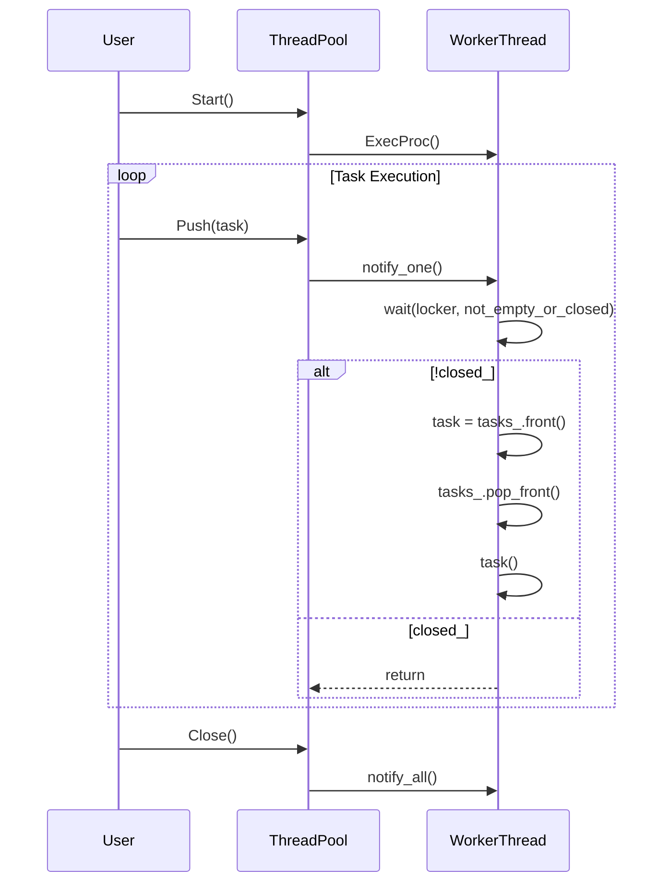

# スレッドプールの設計文書

## 責務
- `ThreadPool`クラスは、指定された数のワーカースレッドを使用してタスクを並列に実行します。
- タスクの追加とスレッドプールの開始・終了を管理します。

## 公開インターフェース
- `ThreadPool(std::optional<std::size_t> thread_count = std::nullopt, log::Logger::Ptr logger = log::RootLogger()) noexcept`: スレッドプールを作成します。
- `~ThreadPool() noexcept`: スレッドプールを破棄し、すべてのワーカースレッドを終了させます。
- `void Start() noexcept`: スレッドプールを開始します。
- `void Push(Task task) noexcept`: タスクをスレッドプールに追加します。
- `void Close() noexcept`: スレッドプールを閉じ、未処理のタスクを実行せずに終了させます。

## 入力
- `thread_count`: スレッドプールで使用するワーカースレッドの数。`std::nullopt`または0の場合、ハードウェアがサポートする並列スレッドの数を使用します。
- `logger`: ロガーインスタンス。指定しない場合、グローバルルートロガーを使用します。
- `task`: 実行すべきタスク（`std::function<void()>`型）。

## 出力
- なし

## 状態
- `closed_`: スレッドプールが閉じているかどうかを示すフラグ。
- `thread_count_`: 使用するワーカースレッドの数。
- `tasks_`: 実行待ちのタスクリスト。
- `threads_`: ワーカースレッドのリスト。

## 処理手順
1. **コンストラクタ**: スレッドプールを作成し、ロガーとスレッド数を初期化します。スレッド数が指定されていない場合、ハードウェアの並列スレッド数を使用します。
2. **デストラクタ**: スレッドプールを閉じてすべてのワーカースレッドを終了させます。
3. **Start()**: ワーカースレッドを作成し開始します。各ワーカースレッドは`ExecProc()`メソッドを実行します。
4. **Push(Task task)**: タスクキューにタスクを追加し、待機中のワーカースレッドに通知します。
5. **Close()**: スレッドプールを閉じて未処理のタスクを破棄し、すべてのワーカースレッドが終了するまで待ちます。
6. **ExecProc()**: タスクキューからタスクを取り出して実行します。例外が発生した場合はロガーに記録します。

## 例外・失敗条件
- `Push(Task task)`はスレッドプールが閉じている場合、アサーションエラーを発生させます。
- `Start()`はスレッドプールが既に開始されている場合、アサーションエラーを発生させます。

## 依存関係
- `log::Logger`: ログ出力に使用します。
- `std::function<void()>`: タスクとして実行する関数オブジェクトの型です。
- `std::thread`, `std::mutex`, `std::condition_variable`: スレッド管理と同期に使用します。

## 重要な不変条件
- `closed_`が`true`の場合、タスクキューは空であるべきです。
- `Start()`が呼び出された後、`closed_`は`false`であるべきです。
- `Close()`が呼び出された後、`closed_`は`true`であるべきです。

## 追加詳細設計情報

### クラス図
```mermaid
classDiagram
    class ThreadPool {
        +ThreadPool(std::optional<std::size_t> thread_count, log::Logger::Ptr logger) noexcept
        +~ThreadPool(const ThreadPool&) = delete
        +~ThreadPool(ThreadPool&&) = delete
        +~ThreadPool& operator=(const ThreadPool&) = delete
        +~ThreadPool& operator=(ThreadPool&&) = delete
        +void Start() noexcept
        +void Push(Task task) noexcept
        +void Close() noexcept
        -void ExecProc() noexcept
        -log::Logger::Ptr logger_
        -mutable std::mutex mtx_
        -std::atomic_bool closed_ {true}
        -std::size_t thread_count_
        -std::condition_variable cond_
        -std::list<Task> tasks_
        -std::list<std::thread> threads_
    }
```

### クラス・メソッド・インターフェース詳細
| 完全な名前 | 属性 | 引数名と型 | 戻り値型 | 可視性 | const | 参照/ポインタ | static | virtual | noexcept | 型別名 | 列挙型 | 定数 | 直接依存 |
|------------|------|------------|----------|--------|-------|---------------|--------|---------|----------|--------|--------|------|----------|
| ThreadPool::ThreadPool | コンストラクタ | thread_count: std::optional<std::size_t>, logger: log::Logger::Ptr | なし | public | いいえ | いいえ | いいえ | いいえ | はい | Task / typedef / std::function<void()> | なし | なし | log::Logger, std::mutex, std::atomic_bool, std::condition_variable, std::list |
| ThreadPool::~ThreadPool | デストラクタ | なし | なし | public | いいえ | いいえ | いいえ | いいえ | はい | なし | なし | なし | なし |
| ThreadPool::Start | メソッド | なし | void | public | いいえ | いいえ | いいえ | いいえ | はい | なし | なし | なし | std::mutex, std::atomic_bool, std::thread |
| ThreadPool::Push | メソッド | task: Task | void | public | いいえ | いいえ | いいえ | いいえ | はい | Task / typedef / std::function<void()> | なし | なし | std::mutex, std::condition_variable |
| ThreadPool::Close | メソッド | なし | void | public | いいえ | いいえ | いいえ | いいえ | はい | なし | なし | なし | std::mutex, std::atomic_bool, std::condition_variable |
| ThreadPool::ExecProc | メソッド | なし | void | private | いいえ | いいえ | いいえ | いいえ | はい | Task / typedef / std::function<void()> | なし | なし | log::Logger, std::mutex, std::condition_variable, std::list |

### シーケンス図


### メソッド仕様書
#### Start()
- **目的**: スレッドプールを開始し、ワーカースレッドを作成します。
- **引数**: なし
- **戻り値型**: void
- **動作**: `closed_`が`true`であることを確認し、ワーカースレッドの数だけ`ExecProc()`メソッドを実行するスレッドを作成します。
- **副作用**: `closed_`フラグを`false`に設定し、ワーカースレッドを開始します。
- **エラー処理**: `closed_`が`false`の場合、アサーションエラーを発生させます。

#### Push(Task task)
- **目的**: タスクキューにタスクを追加します。
- **引数**: task: 実行すべきタスク（`std::function<void()>`型）
- **戻り値型**: void
- **動作**: `closed_`が`false`であることを確認し、タスクキューにタスクを追加して待機中のワーカースレッドに通知します。
- **副作用**: タスクキューにタスクを追加し、条件変数を使用して待機中のワーカースレッドに通知します。
- **エラー処理**: `closed_`が`true`の場合、アサーションエラーを発生させます。

#### Close()
- **目的**: スレッドプールを閉じ、未処理のタスクを破棄し、すべてのワーカースレッドが終了するまで待ちます。
- **引数**: なし
- **戻り値型**: void
- **動作**: `closed_`フラグを`true`に設定して条件変数を使用して待機中のワーカースレッドに通知し、すべてのワーカースレッドが終了するまで待ちます。
- **副作用**: `closed_`フラグを`true`に設定し、タスクキューをクリアします。

### 処理フロー図
```mermaid
graph TD
    A[Start()] --> B{closed_?}
    B -- true --> C[assert(false)]
    B -- false --> D[for i in range(thread_count_)]
    D --> E[threads_.emplace_back(ExecProc, this)]
    E --> F[return]

    G[Push(Task task)] --> H{closed_?}
    H -- true --> I[assert(false)]
    H -- false --> J[lock mtx_]
    J --> K[tasks_.push_back(task)]
    K --> L[cond_.notify_one()]
    L --> M[unlock mtx_]

    N[ExecProc()] --> O[while(true)]
    O --> P{not_empty_or_closed?}
    P -- true --> Q{closed_?}
    Q -- true --> R[return]
    Q -- false --> S[tasks_.front() -> task]
    S --> T[tasks_.pop_front()]
    T --> U[task()]
    U --> V{exception?}
    V -- true --> W[logger_->Log(error)]
    V -- false --> O
    P -- false --> X[sleep or wait]

    Y[Close()] --> Z[lock mtx_]
    Z --> AA[closed_ = true]
    AA --> AB[cond_.notify_all()]
    AB --> AC[unlock mtx_]
```

### 状態遷移・副作用
| 更新前状態 | 遷移条件 | 変更対象 | 更新後状態 | 更新順序 | 外部資源への副作用 |
|------------|----------|----------|------------|----------|----------------------|
| closed_=true | Start()呼び出し | closed_ | false | 1 | ワーカースレッドの開始 |
| closed_=false | Push(Task task)呼び出し | tasks_ | タスク追加 | 1 | 条件変数通知 |
| closed_=false | Close()呼び出し | closed_ | true | 1 | 条件変数通知 |
| closed_=true | ExecProc()実行中 | なし | なし | なし | なし |

### データ変換・制約
- `thread_count`: 入力値が`std::nullopt`または0の場合、ハードウェアの並列スレッド数に変換されます。
- `task`: タスクキューに追加される前に`std::move()`を使用して所有権を移動します。