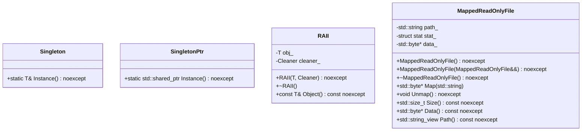
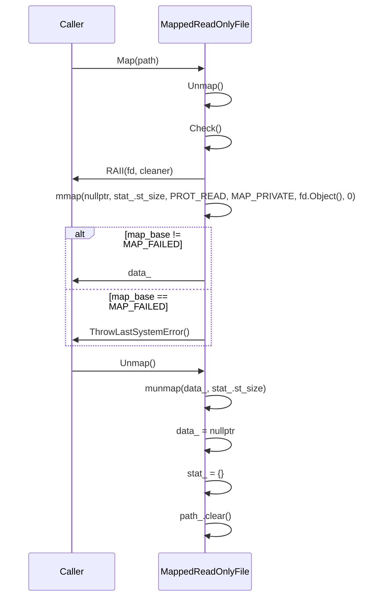

# デザイン文書

## 責務
`util`モジュールは、文字列操作、ファイルディスクリプタの管理、YAMLの読み込み、バックトレースの取得、シングルトンパターンの実装、RAIIの利用、およびメモリマップされたファイルの読み取りを提供します。

## 公開インターフェース
- `StringToLower`, `StringToUpper`: 文字列の大文字小文字変換。
- `ReplaceAllSubstring`: 文字列内の部分文字列の置き換え。
- `SplitString`, `SplitStringToLines`: 文字列の分割。
- `LoadYamlString`, `ThrowIfYamlFieldIsNotScalar`: YAMLデータの読み込みと検証。
- `IsValidFileDescriptor`: ファイルディスクリプタの有効性チェック。
- `SetFileDescriptorAsNonblocking`: ファイルディスクリプタをノンブロッキングモードに設定。
- `ThrowLastSystemError`: 最後のシステムエラーを例外として投げる。
- `CurrentThreadId`: 現在のスレッドIDを取得。
- `Backtrace`: 呼び出し元のバックトレース情報を取得。
- `Singleton`, `SingletonPtr`: シングルトンパターンの実装。
- `RAII`: リソース管理用クラス。
- `MappedReadOnlyFile`: 読み取り専用ファイルをメモリにマッピングするクラス。

## 入力
- 文字列操作関数: 変換や分割対象の文字列、置き換え元・先の部分文字列、正規表現パターン。
- YAML読み込み関数: YAML形式の文字列と必須フィールドリスト。
- ファイルディスクリプタ管理関数: ファイルディスクリプタの値。
- バックトレース取得関数: スタックサイズ、スキップするフレーム数、プレフィックス文字列。

## 出力
- 文字列操作関数: 変換後の文字列や分割された文字列リスト。
- YAML読み込み関数: 解析されたYAMLノード。
- ファイルディスクリプタ管理関数: なし（副作用あり）。
- バックトレース取得関数: スタックフレームのリストやバックトレース情報の文字列。

## 状態
- `MappedReadOnlyFile`: マッピングされたファイルデータへのポインタ、ファイルサイズ、ファイルパス。

## 処理手順
1. **文字列操作**: 文字列を指定した方法で変換または分割する。
2. **YAML読み込み**: YAML形式の文字列を解析し、必須フィールドが存在することを確認する。
3. **ファイルディスクリプタ管理**: ファイルディスクリプタの有効性チェックとノンブロッキングモードへの設定。
4. **バックトレース取得**: 呼び出し元のスタックフレーム情報を収集し、必要に応じて文字列形式で出力する。
5. **シングルトンパターン**: インスタンスが存在しない場合は新規作成し、既存のインスタンスを返す。
6. **RAII**: リソース管理用オブジェクトを作成し、デストラクタでリソースを解放する。
7. **メモリマップファイル読み取り**: 指定されたファイルをメモリにマッピングし、データへのアクセスを提供する。

## 例外・失敗条件
- 文字列操作関数: 無効な入力が与えられた場合の未定義動作。
- YAML読み込み関数: 必須フィールドが存在しない場合や解析に失敗した場合の`std::invalid_argument`例外。
- ファイルディスクリプタ管理関数: 無効なファイルディスクリプタが与えられた場合やノンブロッキングモードへの設定に失敗した場合の`std::system_error`例外。
- バックトレース取得関数: スタック情報の収集に失敗した場合の未定義動作。

## 依存関係
- `fmt`: 文字列フォーマット化。
- `yaml-cpp`: YAMLデータの解析。
- `<sys/stat.h>`, `<fcntl.h>`, `<sys/mman.h>`, `<unistd.h>`: ファイル操作とメモリマッピング。
- `<execinfo.h>`: バックトレース情報の取得。

## 重要な不変条件
- `MappedReadOnlyFile`: マッピングされたファイルデータへのポインタは、`Map`呼び出し後かつ`Unmap`呼び出しが行われるまで有効である。
- シングルトンパターン: 各型に対して唯一のインスタンスが存在する。

## 追加詳細設計情報

### クラス図


### クラス・メソッド・インターフェース詳細

| クラス/関数名 | 完全な名前 | 属性 | 引数名と型 | 戻り値型 | 可視性 | `const` | 参照 | ポインタ | `static` | `virtual` | `noexcept` | 型別名 | 列挙型 | 定数 | 直接依存 |
|---------------|------------|------|------------|----------|--------|---------|--------|----------|----------|-----------|----------|--------|----------|--------|----------|
| Singleton     | ws::Singleton<T, Args...> | クラス | -        | -        | public | -       | -      | -        | -        | -         | -        | -      | -        | -      | -        |
| Instance      | ws::Singleton<T, Args...>::Instance<Args...>() | メソッド | args     | T&       | public | あり    | -      | -        | あり     | -         | あり     | -      | -        | -      | -        |
| SingletonPtr  | ws::SingletonPtr<T, Args...> | クラス | -        | -        | public | -       | -      | -        | -        | -         | -        | -      | -        | -      | -        |
| Instance      | ws::SingletonPtr<T, Args...>::Instance<Args...>() | メソッド | args     | std::shared_ptr<T> | public | あり    | -      | -        | あり     | -         | あり     | -      | -        | -      | -        |
| RAII          | ws::RAII<T, Cleaner> | クラス | obj, cleaner | -        | public | -       | -      | -        | -        | -         | あり     | -      | -        | -      | -        |
| RAII          | ws::RAII<T, Cleaner>::RAII(T, Cleaner) | コンストラクタ | obj, cleaner | -        | public | -       | -      | -        | -        | -         | あり     | -      | -        | -      | -        |
| ~RAII         | ws::RAII<T, Cleaner>::~RAII() | デストラクタ | -        | -        | public | -       | -      | -        | -        | -         | あり     | -      | -        | -      | -        |
| Object        | ws::RAII<T, Cleaner>::Object() const | メソッド | -        | const T& | public | あり    | -      | -        | -        | -         | あり     | -      | -        | -      | -        |
| MappedReadOnlyFile | ws::MappedReadOnlyFile | クラス | -        | -        | public | -       | -      | -        | -        | -         | -        | -      | -        | -      | -        |
| MappedReadOnlyFile | ws::MappedReadOnlyFile::MappedReadOnlyFile() | コンストラクタ | -        | -        | public | -       | -      | -        | -        | -         | あり     | -      | -        | -      | -        |
| MappedReadOnlyFile | ws::MappedReadOnlyFile::MappedReadOnlyFile(MappedReadOnlyFile&&) | ムーブコンストラクタ | o        | -        | public | -       | -      | -        | -        | -         | あり     | -      | -        | -      | -        |
| ~MappedReadOnlyFile | ws::MappedReadOnlyFile::~MappedReadOnlyFile() | デストラクタ | -        | -        | public | -       | -      | -        | -        | -         | あり     | -      | -        | -      | -        |
| Map           | ws::MappedReadOnlyFile::Map(std::string) | メソッド | path     | std::byte* | public | -       | -      | -        | -        | -         | -        | -      | -        | -      | -        |
| Unmap         | ws::MappedReadOnlyFile::Unmap() | メソッド | -        | void     | public | -       | -      | -        | -        | -         | あり     | -      | -        | -      | -        |
| Size          | ws::MappedReadOnlyFile::Size() const | メソッド | -        | std::size_t | public | あり    | -      | -        | -        | -         | あり     | -      | -        | -      | -        |
| Data          | ws::MappedReadOnlyFile::Data() const | メソッド | -        | std::byte* | public | あり    | -      | -        | -        | -         | あり     | -      | -        | -      | -        |
| Path          | ws::MappedReadOnlyFile::Path() const | メソッド | -        | std::string_view | public | あり    | -      | -        | -        | -         | あり     | -      | -        | -      | -        |

### シーケンス図


### メソッド仕様書

#### StringToLower
- **目的**: 文字列を小文字に変換する。
- **引数**: `str` (std::string) - 変換対象の文字列。
- **戻り値**: std::string - 小文字に変換された文字列。
- **動作**: 入力文字列の各文字を小文字に変換し、新しい文字列として返す。
- **副作用**: 無し
- **エラー処理**: 無し

#### LoadYamlString
- **目的**: YAML形式の文字列からノードを作成し、必須フィールドが存在することを確認する。
- **引数**: `str` (std::string_view) - YAML形式の文字列, `required_fields` (std::initializer_list<std::string_view>) - 必須フィールドリスト。
- **戻り値**: YAML::Node - 解析されたYAMLノード。
- **動作**: 入力文字列を解析し、必須フィールドが存在することを確認する。存在しない場合は例外を投げる。
- **副作用**: 無し
- **エラー処理**: 必須フィールドが存在しない場合や解析に失敗した場合の`std::invalid_argument`例外。

#### Map (MappedReadOnlyFile)
- **目的**: 指定されたファイルをメモリにマッピングする。
- **引数**: `path` (std::string) - ファイルパス。
- **戻り値**: std::byte* - マッピングされたデータへのポインタ。
- **動作**: 指定されたファイルをメモリにマッピングし、そのデータへのポインタを返す。既にマッピングされている場合は先にアンマップする。
- **副作用**: ファイルが開かれ、マッピングされる。
- **エラー処理**: ファイルがディレクトリである場合やアクセス権限がない場合の`std::invalid_argument`例外、その他のシステムエラーの場合の`std::system_error`例外。

### 処理フロー図
```mermaid
graph TD
    A[Map(path)] --> B{path_ empty?}
    B -- Yes --> C[throw std::invalid_argument]
    B -- No --> D[stat(path_.data(), &stat_)]
    D --> E{stat() success?}
    E -- No --> F[ThrowLastSystemError()]
    E -- Yes --> G{S_ISDIR(stat_.st_mode)?}
    G -- Yes --> H[throw std::invalid_argument]
    G -- No --> I{stat_.st_mode & S_IREAD?}
    I -- No --> J[throw std::runtime_error]
    I -- Yes --> K[RAII(fd, cleaner)]
    L[open(path_.c_str(), O_RDONLY)] --> M{fd valid?}
    M -- No --> N[ThrowLastSystemError()]
    M -- Yes --> O[mmap(nullptr, stat_.st_size, PROT_READ, MAP_PRIVATE, fd.Object(), 0)]
    P{mmap success?} --> Q[data_ = map_base]
    P -- No --> R[ThrowLastSystemError()]
```

### 状態遷移・副作用
| 更新前状態 | 遷移条件 | 変更対象 | 更新後状態 | 更新順序 | 副作用 |
|------------|----------|----------|------------|----------|--------|
| マッピングされていない | Map(path)が呼び出される | data_, stat_, path_ | マッピングされたデータへのポインタ, ファイル情報, ファイルパス | 1. Unmap() 2. Check() 3. RAII(fd, cleaner) 4. mmap() | ファイルが開かれ、マッピングされる |
| マッピングされている | Unmap()が呼び出される | data_, stat_, path_ | nullptr, {}, "" | munmap(data_, stat_.st_size), data_ = nullptr, stat_ = {}, path_.clear() | ファイルがアンマップされ、リソースが解放される |

### データ変換・制約
| 入力データ | 変換規則 | 出力データ |
|------------|----------|------------|
| std::string_view (YAML) | YAML形式の文字列を解析する | YAML::Node |
| std::string_view (部分文字列) | 文字列内の指定された部分文字列を別の文字列に置き換える | std::string |
| std::string_view (正規表現パターン) | 正規表現パターンに基づいて文字列を分割する | std::vector<std::string> |

この設計文書は、`util`モジュールの再実装に必要な詳細な情報を提供します。各関数やクラスの動作と依存関係を理解し、元コードの意図を尊重しながら再実装を行ってください。