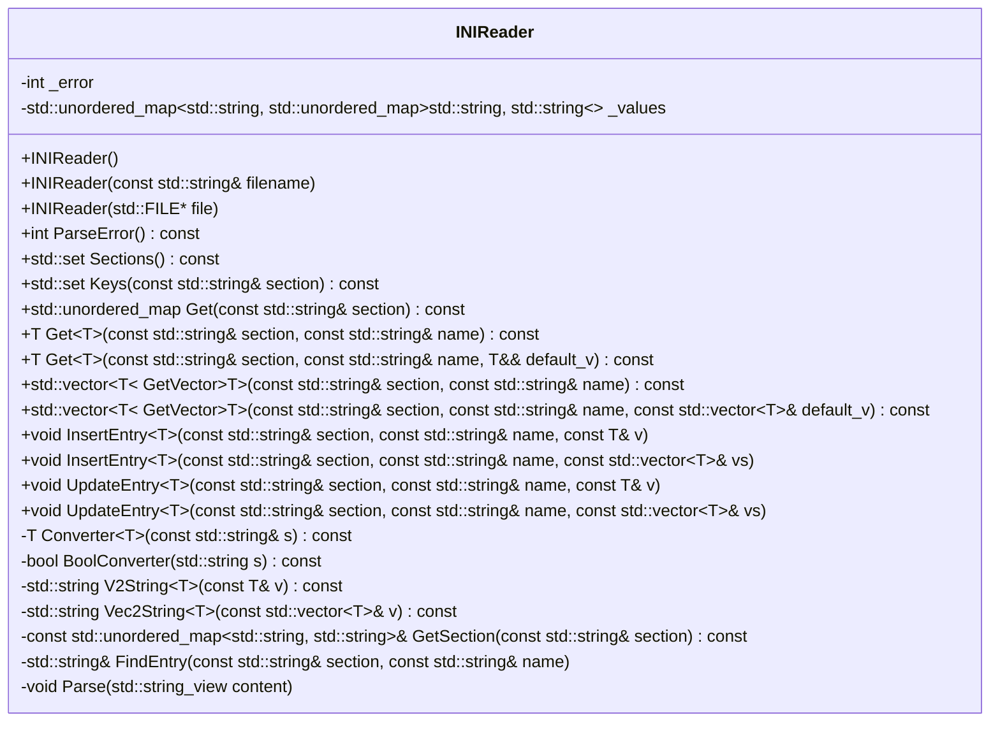
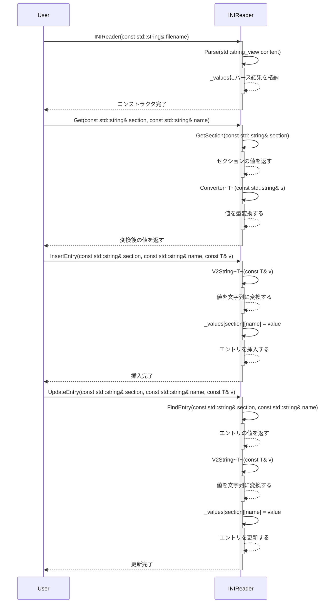

# INIReader 設計文書

## 責務
INIファイルを読み込み、セクションとキーの値にアクセスする機能を提供します。また、新しいエントリを挿入し、既存のエントリを更新する機能も提供します。

## 公開インターフェース

| 名称 | 型 | 説明 |
|------|----|------|
| INIReader() | コンストラクタ | 空のINIReaderオブジェクトを作成します。 |
| INIReader(const std::string& filename) | コンストラクタ | 指定されたファイル名からINIファイルを読み込みます。 |
| INIReader(std::FILE* file) | コンストラクタ | 指定されたファイルポインタからINIファイルを読み込みます。 |
| ParseError() const | メソッド | 解析結果を返します。エラーが発生した場合は例外をスローします。 |
| Sections() const | メソッド | INIファイルに含まれるセクションのリストを返します。 |
| Keys(const std::string& section) const | メソッド | 指定されたセクション内のキーのリストを返します。 |
| Get(const std::string& section) const | メソッド | 指定されたセクションの値を表すマップを返します。 |
| Get(const std::string& section, const std::string& name) const | テンプレートメソッド | 指定されたセクションとキーの値を返します。 |
| Get(const std::string& section, const std::string& name, T&& default_v) const | テンプレートメソッド | 指定されたセクションとキーの値を返し、見つからない場合はデフォルト値を返します。 |
| GetVector(const std::string& section, const std::string& name) const | テンプレートメソッド | 指定されたセクションとキーの値をベクトルとして返します。 |
| GetVector(const std::string& section, const std::string& name, const std::vector<T>& default_v) const | テンプレートメソッド | 指定されたセクションとキーの値をベクトルとして返し、見つからない場合はデフォルト値を返します。 |
| InsertEntry(const std::string& section, const std::string& name, const T& v) | テンプレートメソッド | 指定されたセクションとキーに新しいエントリを挿入します。 |
| InsertEntry(const std::string& section, const std::string& name, const std::vector<T>& vs) | テンプレートメソッド | 指定されたセクションとキーに新しいベクトルのエントリを挿入します。 |
| UpdateEntry(const std::string& section, const std::string& name, const T& v) | テンプレートメソッド | 指定されたセクションとキーの値を更新します。 |
| UpdateEntry(const std::string& section, const std::string& name, const std::vector<T>& vs) | テンプレートメソッド | 指定されたセクションとキーのベクトルの値を更新します。 |

## 入力
- INIファイル名 (std::string)
- FILEポインタ (std::FILE*)
- セクション名 (std::string)
- キー名 (std::string)
- 値 (テンプレート型 T)

## 出力
- 解析結果 (int)
- セクションのリスト (std::set<std::string>)
- キーのリスト (std::set<std::string>)
- セクション内の値のマップ (std::unordered_map<std::string, std::string>)
- 値 (テンプレート型 T)
- ベクトルの値 (std::vector<T>)

## 状態
- _error: 解析結果を表す整数値 (-1: ファイルオープンエラー, 0: 成功, その他の値: エラーライン番号)
- _values: INIファイルの内容を保持するマップ (std::unordered_map<std::string, std::unordered_map<std::string, std::string>>)

## 処理手順
1. コンストラクタでINIファイルを読み込み、Parseメソッドを呼び出して解析します。
2. Parseメソッドでは、BOMのチェックを行い、セクションとキーの値をパースして_valuesに格納します。
3. Get系メソッドは_valuesから指定されたセクションとキーの値を取得し、必要に応じて型変換を行います。
4. InsertEntryメソッドは_valuesに新しいエントリを挿入します。既存のキーが存在する場合は例外をスローします。
5. UpdateEntryメソッドは_values内の指定されたセクションとキーの値を更新します。存在しないキーの場合、例外をスローします。

## 例外・失敗条件
- ファイルオープンエラー: std::runtime_error
- メモリ確保エラー: std::runtime_error (ただしコード内では明示的にチェックされていない)
- 解析エラー: std::runtime_error (行番号が含まれる)
- セクションまたはキーが見つからない場合: std::runtime_error
- 値の型変換に失敗した場合: std::runtime_error
- 重複するキーを挿入しようとした場合: std::runtime_error

## 依存関係
- <cstddef>
- <cstdio>
- <fstream>
- <set>
- <sstream>
- <stdexcept>
- <string>
- <string_view>
- <type_traits>
- <unordered_map>
- <utility>
- <vector>

## 重要な不変条件
- _valuesはセクションとキーの値を保持するマップであり、重複するキーは存在しない。
- _errorは解析結果を表す整数値で、0以外の場合エラーが発生している。

# 追加詳細設計情報

## クラス図


## クラス・メソッド・インターフェース詳細

| 名称 | 型 | 完全な名前 | 属性 | 引数名と型 | 戻り値型 | 可視性 | const | `static` | `virtual` | `noexcept` | 副作用 |
|------|----|------------|------|------------|----------|--------|-------|----------|-----------|------------|--------|
| INIReader() | コンストラクタ | inih::INIReader::INIReader() | - | - | void | public | - | - | - | - | _valuesの初期化 |
| INIReader(const std::string& filename) | コンストラクタ | inih::INIReader::INIReader(const std::string& filename) | - | filename: const std::string& | void | public | - | - | - | - | ファイル読み込みと_parseの呼び出し |
| INIReader(std::FILE* file) | コンストラクタ | inih::INIReader::INIReader(std::FILE* file) | - | file: std::FILE* | void | public | - | - | - | - | ファイル読み込みと_parseの呼び出し |
| ParseError() const | メソッド | inih::INIReader::ParseError() const | - | - | int | public | const | - | - | - | エラー状態をチェックし、例外をスローする |
| Sections() const | メソッド | inih::INIReader::Sections() const | - | - | std::set<std::string> | public | const | - | - | - | _valuesからセクション名のリストを作成 |
| Keys(const std::string& section) const | メソッド | inih::INIReader::Keys(const std::string& section) const | - | section: const std::string& | std::set<std::string> | public | const | - | - | - | 指定されたセクション内のキー名のリストを作成 |
| Get(const std::string& section) const | メソッド | inih::INIReader::Get(const std::string& section) const | - | section: const std::string& | std::unordered_map<std::string, std::string> | public | const | - | - | - | 指定されたセクションの値を返す |
| Get~T~(const std::string& section, const std::string& name) const | テンプレートメソッド | inih::INIReader::Get~T~(const std::string& section, const std::string& name) const | - | section: const std::string&, name: const std::string& | T | public | const | - | - | 値を取得し、型変換を行う |
| Get~T~(const std::string& section, const std::string& name, T&& default_v) const | テンプレートメソッド | inih::INIReader::Get~T~(const std::string& section, const std::string& name, T&& default_v) const | - | section: const std::string&, name: const std::string&, default_v: T&& | T | public | const | - | - | 値を取得し、見つからない場合はデフォルト値を返す |
| GetVector~T~(const std::string& section, const std::string& name) const | テンプレートメソッド | inih::INIReader::GetVector~T~(const std::string& section, const std::string& name) const | - | section: const std::string&, name: const std::string& | std::vector<T> | public | const | - | - | 値をベクトルとして取得し、型変換を行う |
| GetVector~T~(const std::string& section, const std::string& name, const std::vector<T>& default_v) const | テンプレートメソッド | inih::INIReader::GetVector~T~(const std::string& section, const std::string& name, const std::vector<T>& default_v) const | - | section: const std::string&, name: const std::string&, default_v: const std::vector<T>& | std::vector<T> | public | const | - | - | 値をベクトルとして取得し、見つからない場合はデフォルト値を返す |
| InsertEntry~T~(const std::string& section, const std::string& name, const T& v) | テンプレートメソッド | inih::INIReader::InsertEntry~T~(const std::string& section, const std::string& name, const T& v) | - | section: const std::string&, name: const std::string&, v: const T& | void | public | - | - | - | 値を挿入し、重複キーのチェックを行う |
| InsertEntry~T~(const std::string& section, const std::string& name, const std::vector<T>& vs) | テンプレートメソッド | inih::INIReader::InsertEntry~T~(const std::string& section, const std::string& name, const std::vector<T>& vs) | - | section: const std::string&, name: const std::string&, vs: const std::vector<T>& | void | public | - | - | - | ベクトルの値を挿入し、重複キーのチェックを行う |
| UpdateEntry~T~(const std::string& section, const std::string& name, const T& v) | テンプレートメソッド | inih::INIReader::UpdateEntry~T~(const std::string& section, const std::string& name, const T& v) | - | section: const std::string&, name: const std::string&, v: const T& | void | public | - | - | - | 値を更新し、キーの存在チェックを行う |
| UpdateEntry~T~(const std::string& section, const std::string& name, const std::vector<T>& vs) | テンプレートメソッド | inih::INIReader::UpdateEntry~T~(const std::string& section, const std::string& name, const std::vector<T>& vs) | - | section: const std::string&, name: const std::string&, vs: const std::vector<T>& | void | public | - | - | - | ベクトルの値を更新し、キーの存在チェックを行う |
| Converter~T~(const std::string& s) const | テンプレートメソッド | inih::INIReader::Converter~T~(const std::string& s) const | - | s: const std::string& | T | protected | const | - | - | 値を型変換する |
| BoolConverter(std::string s) const | メソッド | inih::INIReader::BoolConverter(std::string s) const | - | s: std::string | bool | protected | const | - | - | 文字列をブール値に変換する |
| V2String~T~(const T& v) const | テンプレートメソッド | inih::INIReader::V2String~T~(const T& v) const | - | v: const T& | std::string | protected | const | - | - | 値を文字列に変換する |
| Vec2String~T~(const std::vector<T>& v) const | テンプレートメソッド | inih::INIReader::Vec2String~T~(const std::vector<T>& v) const | - | v: const std::vector<T>& | std::string | protected | const | - | - | ベクトルの値をスペース区切りの文字列に変換する |
| GetSection(const std::string& section) const | メソッド | inih::INIReader::GetSection(const std::string& section) const | - | section: const std::string& | const std::unordered_map<std::string, std::string>& | private | const | - | - | 指定されたセクションの値を返す |
| FindEntry(const std::string& section, const std::string& name) | メソッド | inih::INIReader::FindEntry(const std::string& section, const std::string& name) | - | section: const std::string&, name: const std::string& | std::string& | private | - | - | 指定されたセクションとキーの値を返す |
| Parse(std::string_view content) | メソッド | inih::INIReader::Parse(std::string_view content) | - | content: std::string_view | void | private | - | - | INIファイルの内容をパースする |

## シーケンス図


## メソッド仕様書

### ParseError() const
- 目的: 解析結果を返す。エラーが発生した場合は例外をスローする。
- 引数: なし
- 戻り値: int (0: 成功, -1: ファイルオープンエラー, その他の値: エラーライン番号)
- 動作: _errorの値に応じて例外をスローする。
- 副作用: なし
- エラー処理: _errorが0以外の場合、std::runtime_errorをスローする。

### Sections() const
- 目的: INIファイルに含まれるセクションのリストを返す。
- 引数: なし
- 戻り値: std::set<std::string>
- 動作: _valuesからセクション名のリストを作成して返す。
- 副作用: なし

### Keys(const std::string& section) const
- 目的: 指定されたセクション内のキーのリストを返す。
- 引数: section (const std::string&)
- 戻り値: std::set<std::string>
- 動作: 指定されたセクション内のキー名のリストを作成して返す。
- 副作用: なし

### Get(const std::string& section) const
- 目的: 指定されたセクションの値を表すマップを返す。
- 引数: section (const std::string&)
- 戻り値: std::unordered_map<std::string, std::string>
- 動作: 指定されたセクションの値を返す。
- 副作用: なし

### Get~T~(const std::string& section, const std::string& name) const
- 目的: 指定されたセクションとキーの値を返す。型変換を行う。
- 引数: section (const std::string&), name (const std::string&)
- 戻り値: T
- 動作: 値を取得し、型変換を行う。
- 副作用: なし

### Get~T~(const std::string& section, const std::string& name, T&& default_v) const
- 目的: 指定されたセクションとキーの値を返す。見つからない場合はデフォルト値を返す。
- 引数: section (const std::string&), name (const std::string&), default_v (T&&)
- 戻り値: T
- 動作: 値を取得し、見つからない場合はデフォルト値を返す。
- 副作用: なし

### GetVector~T~(const std::string& section, const std::string& name) const
- 目的: 指定されたセクションとキーの値をベクトルとして返す。型変換を行う。
- 引数: section (const std::string&), name (const std::string&)
- 戻り値: std::vector<T>
- 動作: 値をベクトルとして取得し、型変換を行う。
- 副作用: なし

### GetVector~T~(const std::string& section, const std::string& name, const std::vector<T>& default_v) const
- 目的: 指定されたセクションとキーの値をベクトルとして返す。見つからない場合はデフォルト値を返す。
- 引数: section (const std::string&), name (const std::string&), default_v (const std::vector<T>&)
- 戻り値: std::vector<T>
- 動作: 値をベクトルとして取得し、見つからない場合はデフォルト値を返す。
- 副作用: なし

### InsertEntry~T~(const std::string& section, const std::string& name, const T& v)
- 目的: 指定されたセクションとキーに新しいエントリを挿入する。重複キーのチェックを行う。
- 引数: section (const std::string&), name (const std::string&), v (const T&)
- 戻り値: void
- 動作: 値を挿入し、重複キーのチェックを行う。
- 副作用: _valuesに新しいエントリが追加される。

### InsertEntry~T~(const std::string& section, const std::string& name, const std::vector<T>& vs)
- 目的: 指定されたセクションとキーに新しいベクトルのエントリを挿入する。重複キーのチェックを行う。
- 引数: section (const std::string&), name (const std::string&), vs (const std::vector<T>&)
- 戻り値: void
- 動作: ベクトルの値を挿入し、重複キーのチェックを行う。
- 副作用: _valuesに新しいエントリが追加される。

### UpdateEntry~T~(const std::string& section, const std::string& name, const T& v)
- 目的: 指定されたセクションとキーの値を更新する。キーの存在チェックを行う。
- 引数: section (const std::string&), name (const std::string&), v (const T&)
- 戻り値: void
- 動作: 値を更新し、キーの存在チェックを行う。
- 副作用: _values内のエントリが更新される。

### UpdateEntry~T~(const std::string& section, const std::string& name, const std::vector<T>& vs)
- 目的: 指定されたセクションとキーのベクトルの値を更新する。キーの存在チェックを行う。
- 引数: section (const std::string&), name (const std::string&), vs (const std::vector<T>&)
- 戻り値: void
- 動作: ベクトルの値を更新し、キーの存在チェックを行う。
- 副作用: _values内のエントリが更新される。

## 処理フロー図
```mermaid
graph TD
    A[INIReader(const std::string& filename)] --> B{ファイルを開く}
    B -- 成功 --> C[内容を読み込む]
    B -- 失敗 --> D[例外スロー: ファイルオープンエラー]
    C --> E[Parse(content)呼び出し]
    E --> F[_valuesにパース結果を格納]
    F --> G[ParseError()呼び出し]
    G --> H{エラーチェック}
    H -- エラーなし --> I[コンストラクタ完了]
    H -- エラーあり --> J[例外スロー: パースエラー]

    K[Get(const std::string& section, const std::string& name)] --> L[GetSection(section)呼び出し]
    L --> M{セクション存在チェック}
    M -- 存在する --> N[valueを取得]
    M -- 存在しない --> O[例外スロー: セクション未見つかり]
    N --> P[Tに変換]
    P --> Q[値を返す]

    R[InsertEntry(const std::string& section, const std::string& name, const T& v)] --> S[V2String(v)呼び出し]
    S --> T[value文字列化]
    T --> U{_values[section][name] = value}
    U --> V{重複キーチェック}
    V -- 重複なし --> W[挿入完了]
    V -- 重複あり --> X[例外スロー: 重複キー]

    Y[UpdateEntry(const std::string& section, const std::string& name, const T& v)] --> Z[FindEntry(section, name)呼び出し]
    Z --> AA{エントリ存在チェック}
    AA -- 存在する --> AB[valueを取得]
    AA -- 存在しない --> AC[例外スロー: エントリ未見つかり]
    AB --> AD[V2String(v)呼び出し]
    AD --> AE[value文字列化]
    AE --> AF{_values[section][name] = value}
    AF --> AG[更新完了]
```

## 状態遷移・副作用

| 更新前状態 | 遷移条件 | 変更対象 | 更新後状態 | 更新順序 | 副作用 |
|------------|----------|----------|------------|----------|--------|
| _error = 0 | ファイルオープンエラー | _error | -1 | コンストラクタ呼び出し後 | 例外スロー: ファイルオープンエラー |
| _error = 0 | パースエラー | _error | エラーライン番号 | Parse呼び出し後 | 例外スロー: パースエラー |
| _values[section]未定義 | InsertEntry呼び出し | _values[section][name] | value | InsertEntry呼び出し後 | 新しいエントリ追加 |
| _values[section][name]未定義 | UpdateEntry呼び出し | - | - | UpdateEntry呼び出し後 | 例外スロー: エントリ未見つかり |
| _values[section][name]定義済み | InsertEntry呼び出し | - | - | InsertEntry呼び出し後 | 例外スロー: 重複キー |
| _values[section][name]定義済み | UpdateEntry呼び出し | _values[section][name] | value | UpdateEntry呼び出し後 | エントリ更新 |

## データ変換・制約

| 入力 | 出力 | 変換規則 | 値域 | 境界値 | 単位 | 精度 | encoding |
|------|------|----------|------|--------|------|------|----------|
| std::string (ファイル名) | void | ファイル読み込み | - | - | - | - | UTF-8 |
| std::FILE* (ファイルポインタ) | void | ファイル読み込み | - | - | - | - | UTF-8 |
| std::string (セクション名) | std::set<std::string> | セクション名のリスト作成 | - | - | - | - | UTF-8 |
| std::string (キー名) | std::set<std::string> | キー名のリスト作成 | - | - | - | - | UTF-8 |
| std::string (セクション名), std::string (キー名) | T | 値を型変換する | - | - | - | - | UTF-8 |
| std::string (セクション名), std::string (キー名) | std::vector<T> | ベクトルの値を取得し、型変換する | - | - | - | - | UTF-8 |
| T (値) | std::string | 値を文字列に変換する | - | - | - | - | UTF-8 |
| std::vector<T> (ベクトルの値) | std::string | ベクトルの値をスペース区切りの文字列に変換する | - | - | - | - | UTF-8 |

## その他の詳細

### INIファイルのパース
- BOMのチェックを行い、存在する場合はスキップします。
- セクションとキーの値をパースして_valuesに格納します。
- コメント行や空白行は無視します。
- エラーが発生した場合、_errorにエラーライン番号を設定し、例外をスローします。

### 値の型変換
- Converterメソッドを使用して値を指定された型に変換します。
- BoolConverterメソッドを使用してブール値の文字列をbool型に変換します。
- V2Stringメソッドを使用して値を文字列に変換します。
- Vec2Stringメソッドを使用してベクトルの値をスペース区切りの文字列に変換します。

### エントリの挿入と更新
- InsertEntryメソッドを使用して新しいエントリを挿入します。既存のキーが存在する場合は例外をスローします。
- UpdateEntryメソッドを使用して既存のエントリの値を更新します。存在しないキーの場合、例外をスローします。

### エラー処理
- ファイルオープンエラー: std::runtime_error
- メモリ確保エラー: std::runtime_error (ただしコード内では明示的にチェックされていない)
- 解析エラー: std::runtime_error (行番号が含まれる)
- セクションまたはキーが見つからない場合: std::runtime_error
- 値の型変換に失敗した場合: std::runtime_error
- 重複するキーを挿入しようとした場合: std::runtime_error

### 不変条件
- _valuesはセクションとキーの値を保持するマップであり、重複するキーは存在しない。
- _errorは解析結果を表す整数値で、0以外の場合エラーが発生している。